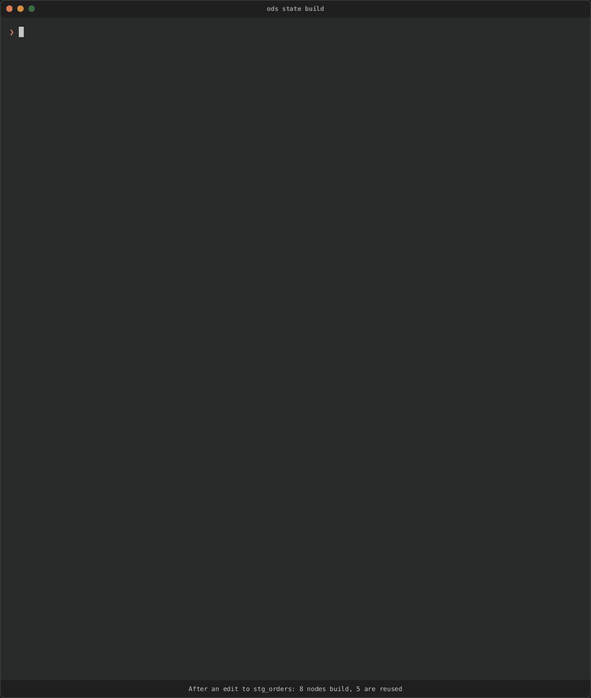
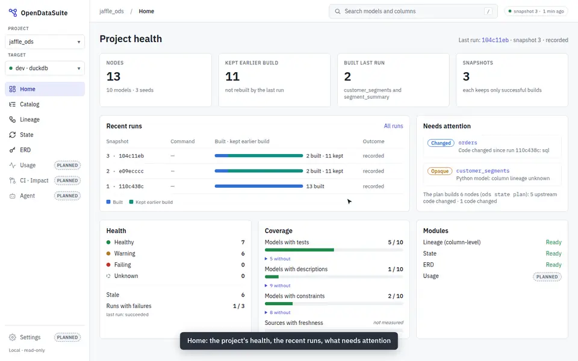

# OpenDataSuite (ODS)

A Rust-first, provider-neutral control plane for analytics engineering. It starts with dbt
and Databricks, and every decision it makes can be explained.

> **Status:** very experimental, pre-alpha. The first release,
> [v0.0.1](https://github.com/buchochelliq-labs/open-data-suite/releases/tag/v0.0.1), is
> the State MVP with the first dashboard screens. `ods state`, the `ods serve`
> dashboard, column-level lineage, ERDs and an MCP server work as previews; everything
> may change.
>
> **Documentation:** https://buchochelliq-labs.github.io/open-data-suite/ (built from
> `docs/` with MkDocs: `pip install -r requirements-docs.txt && mkdocs serve`).
>
> **Install:** `pip install opendatasuite` puts `ods` on your PATH next to dbt.
> `cargo binstall`, direct downloads, building from source and Homebrew (coming soon):
> [`docs/install.md`](docs/install.md).

`ods state build` runs `dbt build` on only what changed (code, or upstream data), shows
each node's result as it finishes, and explains why each one ran:



`ods serve` is a read-only dashboard of the project and its state: the plan, the runs
with each node's stats, lineage coloured by what the next run does, and the catalog.



```sh
cd my-dbt-project
ods doctor                       # can ODS work here?
ods state plan                   # what would build, what would be reused, and why
ods state build                  # dbt build, on only what needs it; records the run
ods state explain customers      # why a node builds, traced to the root cause
ods state history --run <run_id> # one run's per-node stats, from its journal
ods state retry --failed         # build only what failed, or was skipped because of it
ods serve                        # the dashboard, on http://127.0.0.1:8765/
```

These recordings are the real `ods` on the demo project in `fixtures/`, with a fake dbt;
[`docs/recordings.md`](docs/recordings.md) says how they're made and checked.

| Module | What it does | Target |
|---|---|---|
| `ods state` | Incremental, explainable "what needs to run", handed back to dbt with exact selection; per-node run stats and a run journal | v0.0.1 |
| `ods serve` dashboard | Read-only web view of State, runs, lineage and the catalog; every screen of the design by v0.1.0 | v0.0.1 (first screens), v0.1.0 (complete) |
| `ods lineage` | Column-level lineage, change impact, an offline explorer and OpenLineage export | preview |
| `ods erd` / `ods usage` | Entity-relationship model and real consumer usage | v0.3.0 (`ods erd generate` is a preview today) |
| `ods ci` | Change impact, selective CI, and PR reports | v0.4.0 |
| `ods lsp` + VS Code | Clean-room language server and editor extension | v0.5.0 |
| `ods agent` | Policy-controlled analytics-engineering agent and skills; `ods mcp` serves the engines to agents today | v0.6.0 |

Releases stay v0.0.x until the whole dashboard design is built; v0.1.0 marks the complete
dashboard.

- Roadmap, milestones, and releases: [`docs/ROADMAP.md`](docs/ROADMAP.md)
- Command reference: [`docs/cli.md`](docs/cli.md)
- Contributor and AI-agent guide: [`AGENTS.md`](AGENTS.md)
- Architecture decisions: [`docs/adr/`](docs/adr/)

## Licence

Licensed under the [Apache License, Version 2.0](LICENSE).
