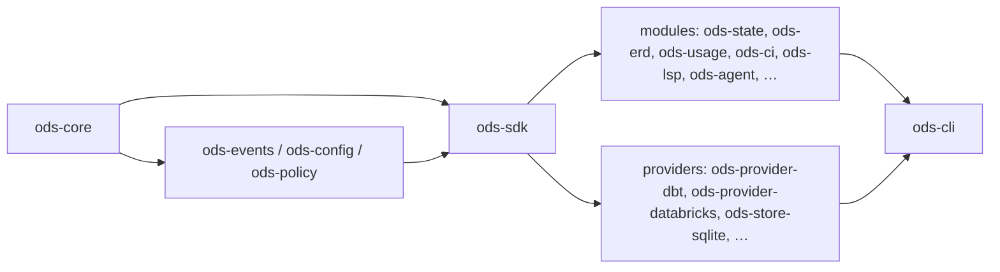

# ADR-0001: Monorepo architecture and module boundaries

- **Status:** Proposed
- **Date:** 2026-09-24
- **Issues:** #1 (also informs #2, #4, #5, #6, #101)
- **Deciders:** @n1ckyb

## Context
OpenDataSuite is a suite of modules — State, ERD, Usage, CI, LSP, Agent, Mesh, Synthetic —
that must each be useful on its own, yet share one semantic model so that, for example, CI
impact analysis, the LSP and the Agent agree on what a model, column or relationship is.
The backlog also requires, from day one:

- no dbt- or Databricks-specific logic in core (AGENTS.md rule 1, #1, #3);
- providers plugged in behind versioned contracts (#2);
- each module versioned and tested independently (#1, #101);
- ERD and lineage kept as separate domains (#5).

We need a repository shape and dependency rules that make these properties the default and
make violations easy to detect mechanically.

## Options considered

### Option A — Single Cargo workspace monorepo with layered crates
One repository and one Cargo workspace. Crates are grouped into layers with a strict,
one-way dependency direction enforced in CI.

- ✅ Atomic cross-crate refactors while contracts are still settling (0.x).
- ✅ One CI, one lockfile, one set of lints; shared fixtures (#100).
- ✅ Layering can be checked from `cargo metadata`.
- ❌ Independent versioning requires discipline (per-crate versions, release tooling).
- ❌ CI time grows with the workspace (mitigated by caching and path filters later).

### Option B — Polyrepo (one repository per module / provider)
- ✅ Hard isolation; independent release cadence is natural.
- ❌ Every contract change becomes a multi-repo, multi-release dance while the SDK is unstable.
- ❌ Duplicated CI/tooling; fixtures and conformance tests drift.
- ❌ Far more overhead for a small team.

### Option C — Single crate with feature flags per module
- ✅ Simplest build.
- ❌ No enforced boundaries; vendor code inevitably leaks into core.
- ❌ Cannot version or depend on modules independently.

## Decision
Use **one Cargo workspace (Option A)** with the following layers. A crate may depend only on
crates in a **strictly lower** layer, except that providers (layer 4) may depend only on
layers 0–2, never on modules; module-to-module edges need an ADR and are listed in
`scripts/check-layering.py`. Dev-dependencies are exempt so tests can use fakes and fixtures.
CI enforces this.

| Layer | Crates | Contains |
|---|---|---|
| 0 Core | `ods-core` | Semantic graph, domain types, capability vocabulary, `SchemaVersion`. No I/O, no vendors, no internal deps. |
| 1 Foundation | `ods-events`, `ods-config`, `ods-policy` | Cross-cutting services: events/tracing (#8), layered config (#7), policy evaluation (#9). |
| 2 SDK | `ods-sdk` | Versioned provider contracts (traits), capability negotiation (#2, #3), conformance harness (#99). |
| 3 Modules | `ods-state`, `ods-erd`, `ods-usage`, `ods-ci`, `ods-lsp`, `ods-agent`, `ods-mesh`, `ods-synthetic` | Product logic written only against SDK contracts. |
| 4 Providers | `ods-provider-*`, `ods-store-*` | Vendor implementations (dbt, Databricks, SQLite, PostgreSQL, fake). |
| 5 Binaries | `ods-cli` (later `ods-server`) | Composition root: selects providers from config and wires them into modules; presentation. |

(Arrows point from dependency to dependant.)

Additional rules:

1. **Vendor neutrality by construction.** Layers 0–3 must not name vendors in code paths;
   behaviour varies only through capabilities advertised by providers (#3).
2. **dbt is a provider, not the core.** dbt artifact parsing, execution and ERD extraction
   live in `ods-provider-dbt`. Core types model *projects, nodes, relations, columns, tests*
   generically.
3. **ERD and lineage are separate modules/types** (#5). They may share a low-level generic
   graph utility in `ods-core`, but not domain types.
4. **Presentation stays at the edge.** Modules return view models / structured results;
   `ods-cli` renders human (rs-rich-cli), `--plain` and `--json` output (#108, ADR-0003).
5. **Fixtures are shared.** `fixtures/` holds dbt projects and recorded provider responses
   used by every crate's tests (#100).
6. **Directory layout:** layers 0–3 and 5 in `crates/`, layer 4 in `providers/`,
   non-Rust clients (VS Code extension, language bindings) in `clients/` when they arrive.

## Consequences
- Positive: boundaries are checked mechanically (`scripts/check-layering.py` in CI); modules
  can be tested against `ods-provider-fake` without any warehouse; contract changes are
  atomic PRs during 0.x.
- Negative / trade-offs: new crates must be registered in the layering script; module
  reuse across modules needs an explicit ADR, which may feel heavy for CI→State style edges
  (expected to be the first such ADR).
- Follow-up issues: #2/#3 define the SDK contracts; #4 fills `ods-core`; #6 builds the CLI
  framework; #101 defines per-crate versioning and release tooling; add
  `ods-provider-fake` together with the first contract.

## References
- AGENTS.md — non-negotiable architecture rules
- docs/ROADMAP.md §7 — target crate layout
