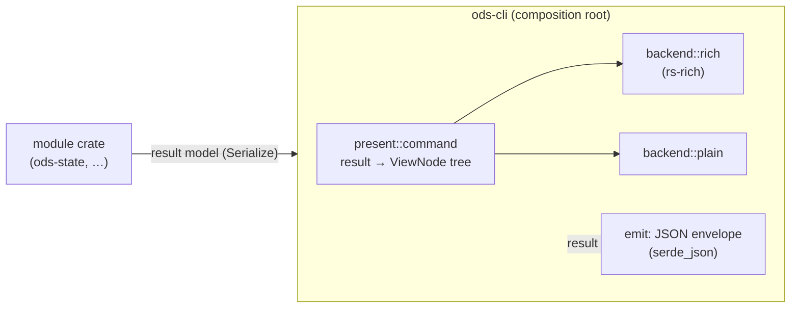

# ADR-0003: CLI presentation boundary and rs-rich-cli

- **Status:** Accepted (2026-10-04). Not built yet, now a follow-up: a generated JSON Schema per command (§3), and JSON and plain contract snapshots for every command (`ods erd`, most of `ods lineage` and `ods mcp` have none). The output envelope is at 1.0 (#342).
- **Date:** 2026-09-24 (amended 2026-09-29: `rs-rich` 0.0.9; 2026-10-05: hyperlinks, §7, proposed)
- **Issues:** #108 (also #6, #21, #22, #85, #107)
- **Deciders:** @n1ckyb

## Context
Every ODS module has to show structured results to three kinds of consumer:

1. **People at a terminal.** They want State plans, explanations, ERD summaries and review
   findings as readable tables, trees, panels and diffs, with progress on long runs.
2. **Scripts, CI and logs.** They want stable, uncoloured, line-oriented text that is easy to
   grep and diff (#85, #88).
3. **Machines** (the VS Code extension #107, CI PR reports, the REST API #96). They want a
   versioned JSON contract.

AGENTS.md rule 7 says presentation stays separate from logic. Rule 4 says every decision
must be explainable in both human and JSON form. Issue #108 asks us to standardise on
[`buchochelliq-labs/rs-rich-cli`](https://github.com/buchochelliq-labs/rs-rich-cli)
rather than build our own terminal renderer. It also asks us to use ODS as a real consumer
of rs-rich-cli ("dogfood" it) and to report the primitives it is missing.

### What rs-rich-cli offers (surveyed 2026-09-24, updated for the 0.0.13 release)
- A Rust port of Python `rich`. The library is the `rs-rich` package, imported as `rich`;
  its extensions are `rs-rich-ext`. It is MIT-licensed.
- It is published on crates.io. The survey started on `rs-rich` 0.0.6. The proof of
  concept moved to 0.0.7, the core library of the 0.0.11 release cohort, once it was
  published. ODS now uses **0.0.9**, the library of the 0.0.13 release. Pre-1.0 `0.0.x` versions may break the API in every release, and Cargo's
  `^0.0.x` requirement pins the exact patch version.
- It has `Console` with a builder that sets `width`, `force_terminal`, `color_system`
  and `no_color`. It honours `NO_COLOR` and detects whether output goes to a terminal.
  From 0.0.7 its colour detection also honours `TERM=dumb`/`unknown` (in 0.0.6 that only
  affected the pager). It can capture output (`capture`) and export it (`export_text`,
  `export_svg`), which lets tests pin their output exactly.
- Renderables: `Table`, `Tree`, `Panel`, `Rule`, `Columns`, `Text`, markup, `Syntax`,
  `Markdown`, JSON/pretty printing, `Progress`, `Status` and `Live`. `rs-rich-ext` adds
  diff, badges, diagnostics, a hyperlink helper and a clap help adapter.
- It requires **Rust 1.90**; ODS currently requires 1.85. Its CI covers Linux, with Windows
  exercised manually. macOS is untested, and the legacy Windows `cmd.exe` console is not
  supported.
- It has 6 direct dependencies (`syntect`, `fancy-regex`, `pulldown-cmark`, `serde_json`,
  `terminal_size`, `anstyle-query`). 0.0.6 pulled in 60 unique crates in total; 0.0.7
  loads only syntect's bundled dumps, which removes 11 of them (49 remain), including
  `yaml-rust` and `plist`. From 0.0.9, `syntect` (`Syntax`) and `pulldown-cmark`
  (`Markdown`) sit behind the default-on `syntax` and `markdown` features. ODS uses
  neither, so it depends on `rs-rich` with `default-features = false` and no features;
  that drops `syntect`, `pulldown-cmark`, `bincode` 1.x, `fancy-regex` 0.16 and six
  smaller crates (10 in all) from `Cargo.lock`.

### Spike (scratch crate, not committed)
A release binary that renders one `Table` through `export_text` with `no_color`
produced output that is correct and can be pinned exactly (fixed width).

| | Release | Stripped |
|---|---|---|
| Empty Rust binary | 0.44 MB | 0.35 MB |
| Plus `rs-rich` 0.0.6, one table | 4.25 MB | 3.41 MB |
| Plus `rs-rich` 0.0.7, one table | 4.30 MB | 3.45 MB |

Most of the growth comes from `syntect` and its bundled syntax and theme definitions.

Measured on the real `ods` binary (`cargo build --release -p ods-cli`, Linux x86_64,
stripped with `strip`) when moving to 0.0.9:

| `ods` | Release | Stripped |
|---|---|---|
| `rs-rich` 0.0.7 (default features) | 39.15 MB | 29.18 MB |
| `rs-rich` 0.0.9, `default-features = false` | 38.98 MB | 29.04 MB |

The saving is only about 0.14 MB, not the 3 MB the spike suggested. ODS never renders
`Syntax` or `Markdown`, so the linker had already discarded syntect's code and data from
`ods`. The feature change mainly shortens the build and the dependency tree.
`cargo deny check licenses` with ODS's `deny.toml` accepted every crate in the
dependency tree.

## Options considered

### Option A: modules call rs-rich directly
Each module crate builds rich renderables and prints them itself.
- ✅ Least code.
- ❌ Breaks AGENTS.md rules 2 and 7. Terminal code would sit in domain crates.
- ❌ JSON and plain output would be separate code paths per module, and would drift.
- ❌ Every rs-rich 0.0.x API break would touch every module.

### Option B: typed result models, with a presentation layer at the CLI edge (chosen)
Modules return typed, serialisable **result models**. `ods-cli` owns presentation. It maps
each result to a small ODS-owned **view tree**, and interchangeable backends render that
tree (rich, plain). JSON output serialises the result model directly.
- ✅ Domain crates never see terminal APIs. The server and the LSP reuse the same result
  models.
- ✅ rs-rich is confined to a single backend module, so an API break touches one place.
- ✅ JSON stays a real, versioned data contract and is not a by-product of rendering.
- ❌ One extra mapping step per command (result model to view tree).
- ❌ The view tree duplicates a small subset of rich's vocabulary.

### Option C: a full ODS rendering framework (no rs-rich)
- ✅ No external API churn.
- ❌ Rebuilds layout, width handling, Unicode cell widths and colour detection that
  rs-rich already has. #108 rules this out explicitly.

### Option D: render JSON first, then turn the JSON into a view generically
- ✅ One code path.
- ❌ A generic JSON-to-table view gives poor human output (no grouping, emphasis or reason
  chains). It also couples the JSON shape to how things look.

## Decision
Adopt **Option B**. The rules below define the boundary.

### 1. Three layers

```mermaid
graph LR
  mod["module crate<br/>(ods-state, …)"] -- "result model (Serialize)" --> cli
  subgraph cli["ods-cli (composition root)"]
    present["present::command<br/>result → ViewNode tree"]
    rich["backend::rich<br/>(rs-rich)"]
    plain["backend::plain"]
    json["emit: JSON envelope<br/>(serde_json)"]
  end
  present --> rich
  present --> plain
  cli -- "result model" --> json
```

- **Result model.** This is a `serde::Serialize` type owned by the module (for example
  `ods_state::ExecutionPlan`, or a plan-explanation type). It follows AGENTS.md
  conventions: `#[non_exhaustive]`, snake_case, deterministic ordering. It carries reasons
  and evidence as data, never as formatted strings.
- **View tree.** `ods-cli` defines a small `ViewNode` enum in `ods-cli::present`:
  `Heading`, `Paragraph`, `KeyValue`, `Table`, `Tree`, `Notice { level }` and `Group`.
  Further nodes, such as `List` and `Diff`, are added when a command first needs them.
  A `Table` may split its rows into sections and carry a footer row of totals; both are
  decoration that repeats nothing new, so the plain backend leaves them out and its
  tables stay data rows only.
  A `Panel { title, level, body }` frames any view under a title (one failure and why);
  the plain backend prints the title as a line and the body as it would anyway.
  Views carry **semantic styles** (`Emphasis`, `Muted`, `Added`,
  `Removed`, `Warning`, `Error`, `Success`, `Code`) and never raw colours or markup.
  The mapping from result to view is a pure function and is unit-tested.
- **Backends** render a whole view to a `String`, which `present::emit` writes to stdout.
  Command results are small, and rs-rich can only be pointed at an ODS-chosen stream by
  capturing its output. There is no `Renderer` trait yet; one is introduced if a streaming
  backend (for example live progress) needs it.
  - `rich`: maps `ViewNode` to `rs-rich` renderables. Styled text is built from spans with
    `Text::append`, so **user data is never parsed as rich markup**. Semantic styles
    resolve through a `rich::theme::Theme` of named styles (`ods.added`, `ods.warning`,
    …), so colours live in one place and can be overridden later.
    **This is the only module that imports `rich`/`rich_ext`.**
  - `plain`: ODS's own implementation, with no ANSI escapes, no box drawing and ASCII
    only. It prints `key: value` lines, tab-separated tables with a header row, and
    indented trees. Its output is stable across terminals and platforms.
  - JSON (in `present::emit`): serialises the result model inside the envelope, not the
    view.
  - Both text backends replace terminal control characters (ESC and other C0/C1 controls)
    in displayed text, because node names, SQL and warehouse errors are untrusted data.

The view tree stays inside `ods-cli` until a second consumer needs it, such as
`ods-server` rendering HTML. At that point it is extracted to a foundation-layer
`ods-view` crate, which requires an amendment to ADR-0001.

### 2. Output modes and flags (global, implemented in #6)
| Flag | Values | Default |
|---|---|---|
| `--output` / `-o` | `human`, `plain`, `json` | `human` when stdout is a terminal, otherwise `plain` |
| `--json` | shorthand for `--output json` | |
| `--color` | `auto`, `always`, `never` | `auto` (honours `NO_COLOR`, `TERM=dumb` and redirection); `always` overrides `NO_COLOR` |
| `--width` | integer | detected; `100` when not a terminal |

- **Streams.** Results go to **stdout**. Logs, progress, spinners and warnings go to
  **stderr**. Progress and spinners appear only in `human` mode when stderr is a
  terminal. JSON mode never writes anything else to stdout.
- **Exit codes** are unaffected by the output mode. ADR-0004 defines them (#6).

### 3. JSON contract
Every `--json` response is a single envelope object:
```json
{
  "schema_version": {"major": 1, "minor": 0},
  "command": "state.plan",
  "ods_version": "0.1.0",
  "result": { "...": "command-specific result model" },
  "diagnostics": [{"level": "warning", "code": "ODS-W0001", "message": "..."}]
}
```
- `schema_version` versions the envelope and the result models together, with the same
  compatibility rules as `ods_core::SchemaVersion`.
- On failure, `result` is `null` and the error is a diagnostic, which may include an
  optional `hint`. The envelope is still the only thing on stdout (ADR-0004 §4).
- A command's `result` shape is a public contract. Breaking changes need a major version
  bump and a CHANGELOG entry (#101).
- A JSON Schema is generated for each command. We will evaluate `schemars` against a
  hand-written schema in #6.

### 4. How rs-rich is consumed
- The dependency is `rs-rich` from **crates.io**, at a published version only. Git
  dependencies and other registries are rejected by `deny.toml` `[sources]`; a path
  dependency would be caught in review, because cargo-deny allows workspace paths. It is
  declared once in `[workspace.dependencies]` and used only by `ods-cli`. `rs-rich-ext` is added only when
  we need a specific feature (for example `diff`).
- **ODS's MSRV rises from 1.85 to 1.90.** This lands in the PR that adds the dependency;
  `Cargo.toml` and the CI `msrv` job must change together.
- Upgrades are deliberate. Because `^0.0.x` pins the patch version, each upgrade is its own
  PR, and it must update the `rich` backend snapshots.
- `scripts/check-layering.py` gains a check that no crate other than `ods-cli` depends on
  `rs-rich*`.
- **Data never reaches rs-rich as a string.** From 0.0.7, a plain string passed as a table
  header, cell or tree label is parsed as markup, as is `Table::title`. The rich backend
  therefore passes `Text` values everywhere, including the table title
  (`Table::title_text`, from 0.0.8). Regression tests pin this behaviour, including
  names such as `[bold]x` and `a\`.
- **Features.** `rs-rich` is built with `default-features = false`. A feature is enabled
  only when the backend first renders something that needs it (for example `syntax` for
  `Syntax`).

### 5. Testing
- `insta` snapshots for every command in **`json` and `plain`** modes, which are the
  contracts. They live in `crates/ods-cli/src/snapshots/`. The build's own `ods_version`
  is replaced with `[ods-version]`, so releases don't churn contract snapshots.
- `rich` mode snapshots use a pinned `Console` (`width(100)`, `force_terminal(true)`,
  `ColorSystem::Standard`) captured via `capture`. There are fewer of them, and they live
  in `crates/ods-cli/src/snapshots/rich/`, apart from the contract snapshots, because
  rs-rich upgrades may legitimately change them.
- The result-to-view mapping gets unit tests. The backends get tests with fixture view trees.
- The CI matrix already covers macOS and Windows, which also covers rs-rich on the
  platforms its own CI does not test.

### 6. Missing features and issues to report to rs-rich-cli
To be filed as issues in `buchochelliq-labs/rs-rich-cli`. Status is as of `rs-rich` 0.0.9.
Items keep their numbers when they are resolved.

**Open**
- (2) **A lower MSRV, or a documented MSRV policy** for the library crate, separate from the
  CLI's image and network features. The 1.90 floor is driven by the CLI tree.
- (3) **macOS in CI**, so downstream consumers get a support guarantee on that platform.
- (4) **A 0.1 / API-stability roadmap**, so ODS can move off exact patch pins.

Still open in 0.0.9: the crate's `rust-version` is 1.90 and its README states no MSRV
policy, macOS CI or 0.1 roadmap.

**Partly addressed**
- (5) **The strings-as-markup change in 0.0.7 compiles silently.** Plain strings passed as
  table headers, cells or tree labels changed from literal text to markup, but code
  written for 0.0.6 still compiles. Any caller passing data is now open to markup
  injection, and only a behavioural test catches it (ODS's did). Suggest making the
  change visible at compile time, for example by removing the implicit
  `From<&str>/From<String> for Cell` conversions or adding explicit
  `Cell::markup`/`Cell::plain` constructors, or at least flagging it as a security note
  in the migration guide. (Found while reviewing the 0.0.11 release.)
  *In 0.0.9:* the conversions still exist and still parse markup, but they are now
  documented as markup, and the docs recommend passing `Text` for data. A compile-time
  check exists only through the separate `rs-rich-macros` crate (markup checked at
  compile time), which does not stop a runtime string from reaching a cell. ODS keeps
  passing `Text` and relies on its regression tests.
- (6) **`markup::escape` is not round-trip safe for a trailing backslash.** Escaping `a\`
  and then parsing it renders `a\\`. (Found while reviewing the 0.0.11 release.)
  *In 0.0.9:* `escape` was rewritten to handle runs of backslashes, and a backslash
  before a tag (`a\[b]`) round-trips. A trailing backslash still does not:
  escaping `a\` gives `a\\`, which still renders `a\\` (checked against 0.0.9 with
  `markup::render`). This is documented, deliberate parity with Python `rich`, which
  doubles a lone trailing backslash so it cannot escape appended markup; it also means
  `escape` cannot be undone for such input. ODS does not use `escape`: data reaches
  rs-rich as `Text`.

**Resolved in 0.0.9** (ODS moved from 0.0.7)
- (1) *Optional heavy dependencies:* `syntect` (`Syntax`) and `pulldown-cmark`
  (`Markdown`) are behind the default-on `syntax` and `markdown` features. With
  `default-features = false`, `bincode` 1.x (RUSTSEC-2025-0141) and the duplicate
  `fancy-regex` 0.16 are gone, and the advisory ignore was removed from `deny.toml`.
- (7) *No literal-text table title* (resolved in 0.0.8): `Table::title_text(Text)` takes
  the title literally. The rich backend now uses it instead of printing the title as a
  line of its own, so a title is centred over its table. Plain and JSON output are
  unchanged.

**Resolved in 0.0.7**
- *Styled table cells and tree labels* (reported during the proof of concept):
  `add_row_text`, `add_column_text` and `Tree::new`/`add` taking `impl Into<Cell>` now
  carry `Text`, so the rich backend keeps tones in cells and tree labels.
- *`TERM=dumb` in colour detection* (reported during the proof of concept): now
  honoured, as is `TERM=unknown`. ODS keeps its own check so the §2 contract holds
  independently of upstream and stays unit-testable.
- *`yaml-rust` (RUSTSEC-2024-0320)* is no longer in the tree, and its ignore was removed.

Named semantic styles are *not* a gap: `rich::theme::Theme` already maps style names to
styles.

### 7. Hyperlinks (amendment, proposed 2026-10-05)
A terminal that follows OSC 8 hyperlinks lets people open a file ODS names (a run's
journal, later a failing model's file) without copying its path. Links are data that
reaches the terminal inside an escape sequence, so they are held to the same rules as
the rest of the output:

- **A `Span` may carry a `Link`, and a link is only ever a URL ODS built itself:** a
  local file (`Link::file`, a `file:` URL of the path made absolute) or a page of ODS's
  own documentation (`Link::docs`, a fixed page under `site_url`). There is no
  constructor from text, so nothing a project, an engine or a warehouse says becomes a
  link, and links can't point anywhere ODS didn't choose.
- **Encoded, never raw.** The URL is built with the `url` crate, which percent-encodes
  control characters. rs-rich writes a link's URL into the escape as is, so a raw
  string could end it early (`ESC \`, `BEL`) and inject terminal sequences. A test
  pins that a path holding them still opens and closes exactly one link.
- **Only where it can be followed.** The rich backend writes links when
  `supports-hyperlinks` says stdout is a terminal that follows them (it honours
  `FORCE_HYPERLINK`); otherwise it drops them before rendering. rs-rich writes them only
  with colour on. The plain backend and JSON never write them; JSON already carries the
  paths as data.
- **A link never says more than its text.** The text shows the same path or page, so
  output reads the same without links, and recordings and snapshots don't change.

First use: the journal path of `ods state run` (and `build`, `seed`, `snapshot`, `test`,
`retry`) and `ods state history --run`. Linking a failing model's file needs the project
directory in the failure view, and a docs link per error code needs errors rendered as
views; both are left for later.

New dependencies: `url` (MIT OR Apache-2.0, already in the tree) and
`supports-hyperlinks` (Apache-2.0).

## Consequences
- **Positive:**
  - Domain crates stay free of terminal code.
  - JSON is a real, versioned API that the VS Code extension, CI reports and the server
    can build on.
  - rs-rich churn is isolated to one module, and the exit strategy is to swap that one
    backend.
  - Plain output is stable, which suits CI logs.
- **Negative / trade-offs:**
  - The MSRV rises to 1.90.
  - The `ods` binary grows by the rendering code (the spike measured about 3 MB with
    `syntect`; point 6.1, resolved in 0.0.9, removed `syntect` from the tree, though in
    `ods` the linker had already dropped most of it).
  - Each command needs a presentation mapping.
  - Two sets of snapshots have to be maintained.
- **Follow-up work:**
  - **#6:** global output flags, the envelope, exit codes and stream discipline.
  - **Proof-of-concept PR for #108:** `ods-cli::present` plus the `rich`/`plain`/`json`
    backends, rendering `ods version` and a fixture `ExecutionPlan`, with the MSRV bump.
    It will re-render the real `ods state plan`/`explain` once #20 and #21 land.
  - Extend `scripts/check-layering.py` to confine `rs-rich*` to `ods-cli`.
  - File the issues listed in section 6 in rs-rich-cli.

## References
- #108; AGENTS.md rules 2, 4 and 7; ADR-0001 (module boundaries); ADR-0002 (stack)
- rs-rich-cli: `README.md`, `docs/getting-started.md`, `crates/rich/src/console.rs`
- Python `rich` documentation (upstream API that rs-rich ports)
