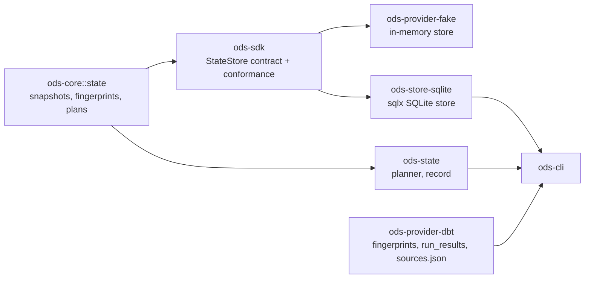

# ADR-0013: State snapshots, fingerprints and the state store

- **Status:** Proposed
- **Date:** 2026-09-25
- **Issues:** #11 (state model), #13 (fingerprints; formatting-insensitive SQL #209; hooks #218), #16 (change evidence), #18 (invalidation), #20 (planner), #22 (`ods state plan`), #25 (SQLite store)
- **Deciders:** @n1ckyb

## Context
v0.1.0 (M1) is the State MVP: ODS decides *what* runs, dbt decides *how*. The first slice
is `ods state plan`. It must say, for every node, whether it can be reused or must be
built, and why. That needs:
- a record of what was last built successfully (#11);
- fingerprints of each node's code (#13) and evidence of its upstream data (#16);
- a planner that propagates changes through the DAG (#18, #20);
- somewhere to keep state between runs (#25).

These rules from AGENTS.md apply:
- **Rule 3, conservative:** missing or uncertain evidence means BUILD.
- **Rule 4, explainable:** every decision carries reasons and evidence.
- **Rule 5:** failed runs never replace the last successful state.
- **Rule 1:** no vendor logic in core.

The design follows the State strategy research (`docs/research/ods-state-strategy.md`,
§4.1–4.6).

## Options considered
### Where state lives
- **Immutable JSON snapshot documents, with a head pointer per scope (chosen).**
  - One versioned document is the unit of commit. It is easy to export, diff and migrate.
  - Reads are one row.
  - Querying across nodes needs JSON functions, which is fine at M1 scale.
- *Normalised tables (a row per node).* Queryable, but every schema change becomes a
  table migration. It also spreads the contract across SQL and Rust.

### SQLite access
- **`sqlx` (chosen, as ADR-0002 planned).**
  - Async, which matches the SDK's async contracts (ADR-0006).
  - The same crate serves the PostgreSQL store (#27).
  - Licence: MIT/Apache-2.0. It is actively maintained.
  - It bundles SQLite, so there is no system library to install.
  - Exit: the store sits behind `StateStore`, so moving to `rusqlite` only touches
    `ods-store-sqlite`.
- *`rusqlite`.* Synchronous and lighter, but a second database library once
  PostgreSQL arrives.

### Fingerprints
- **Separate components, each hashed, plus a digest over the sorted components (chosen).**
  A diff can then name what changed ("compiled SQL and config changed"), as #13 requires.
- *One opaque hash.* It can only say that something changed.

## Decision
### Crates

- **`ods-core::state`** holds the persisted, provider-neutral types:
  - `Fingerprint`, `Evidence` with `Exactness`, `DataVersion`;
  - `NodeState` and `StateSnapshot`;
  - `ExecutionPlan`, `PlanEntry`, `PlanAction` and `Reason`.
- **`ods-state`** (module) is pure and synchronous:
  - `plan()` turns the current project, change evidence, policies and the last
    snapshot into an `ExecutionPlan`;
  - `record()` turns a finished run into the next snapshot.
- **`ods-sdk`** defines the `StateStore` contract (`state_store` 0.1): `latest`,
  `commit` and `history`, with a conformance suite. `ods-provider-fake` and
  `ods-store-sqlite` both pass it.
- **`ods-provider-dbt`** turns dbt nodes into fingerprint components, and reads
  `run_results.json` and `sources.json`. Only the CLI wires dbt to the planner
  (ADR-0001).

### Snapshots (rule 5)
- A snapshot records, for each node that ODS has seen built successfully:
  - its fingerprint;
  - when it was built, and by which run;
  - the version of each upstream source it saw.
- Snapshots are immutable. `commit(scope, expected_parent, snapshot)` is a
  compare-and-swap on the scope's head:
  - it fails with `Conflict` if another commit got there first;
  - the SQLite store makes insert and head move one transaction.
- `record()` only advances nodes whose status is `success`. A failed, skipped or
  errored node keeps its previous entry, so a partial run never replaces the last
  successful state of what failed.
- A **scope** is `<project>/<environment>`. The default store is `.ods/state.db`, and
  the default environment is `default`.
- **Versioning:**
  - Documents carry `schema_version` 1.0; readers accept the same major with an equal or
    older minor (`SchemaVersion::can_read`).
  - The SQLite schema has numbered migrations, applied in a transaction, and the store
    records which have run.
  - A newer database is refused, not guessed at.
  - WAL mode lets readers run during a commit.

### Tested builds (#220)
- `NodeState.tested` (optional, absent in older snapshots) records the run whose checks
  last passed on the node's current build. A build with its tests passing sets it. A
  build without tests leaves it unset. A test-only run sets it on success and clears it
  on failure. It never changes a node's build, and the planner doesn't use it: failing
  tests don't force a rebuild, they make `ods state test` pick the node up again.
- It also records `checks`, a digest of the node's checks (for dbt: every data test
  and unit test that reads it, with their definitions: arguments, SQL, config and
  the project and package macros they call; dbt's and the adapter's own macros are
  covered by the dbt version and adapter, since dbt lists different ones depending on
  the command that wrote the manifest). A build counts as tested only against the checks it has now: adding,
  removing or editing one makes it untested. Records without a digest (written before
  it existed) don't count. A node with no checks is never tested: nothing vouches for
  it, and `ods state test` has nothing to run for it.
- A build of the node that ran and failed (or whose tests failed) clears it on the
  kept state: the warehouse may hold that newer build, which nothing has validated.
- A test-only run checks what is in the warehouse now, with the tests as they are now.
  ODS can't tell whether the relation still holds the recorded build (someone else may
  have rebuilt it), so "tested" means "the relation passed these checks after this
  build was recorded", not a proof about the recorded build's exact rows.

### Fingerprints (#13)
- A fingerprint is a map from component name to SHA-256 digest, plus a digest of
  `name\0digest\n` over the sorted components. It is canonical and reproducible, and a
  diff lists changed, added and removed components.
- dbt components (scheme `dbt/2`, #209):

  | Component | From |
  |---|---|
  | `scheme` | the fingerprint scheme; when it changes, every node is built once, with a reason saying so |
  | `sql` | SQL models and snapshots: the compiled SQL (vars, macros and upstream names as rendered), normalised so that comments and whitespace don't count |
  | `file` | dbt's checksum of the file (a path-only checksum, e.g. for seeds over 1 MiB, is not a fingerprint): seeds, Python models, and SQL models whose Jinja isn't pure (see below) or whose raw code isn't recorded |
  | `compiled_code` | Python models: the compiled code, as is |
  | `config` | resolved config, canonical JSON, without `tags`, `meta`, `docs`, `state`, `freshness` (policy and metadata don't change what gets built) |
  | `macros` | the source of every macro the node depends on, transitively, plus its materialization and the `generate_*_name` macros |
  | `contract` | declared column types and constraints |
  | `relation` | the relation it builds, so a plan against another target's state doesn't reuse |
  | `engine` | dbt version and adapter |
- Normalising SQL (#209): the compiled SQL is split into tokens and rejoined with
  single spaces. Comments are dropped, except optimizer hints (`/*+ … */`). Nothing
  else changes: identifiers, keywords and literals keep their case and spelling,
  because some dialects let keyword-like names be case-sensitive.
  - It is an allow-list. Outside quotes and comments it accepts only ASCII letters,
    digits, `_`, ASCII whitespace, `( ) , ;` and `= < > + - * / % | : ! .`.
  - It gives up on everything whose meaning depends on the dialect, and the raw text
    is hashed instead. Formatting then counts, which only ever builds more. That
    covers:
    - `[`, `$`, `#`, `@`, `{` and non-ASCII characters;
    - a backslash in quotes, a triple quote, or a quote touching a word or another
      quote (`x'41'`, `N'a'`);
    - `--` without a following space, `//`, a block comment starting with anything
      but whitespace, `*`, `-`, `=` or a `+` hint (so `/*!` and `/*M!`), nested block
      comments, and a `\r` not followed by `\n`;
    - two literals separated only by whitespace;
    - `.` next to whitespace;
    - an unterminated quote or comment.
  - Accepted: whitespace that only decides between success and a syntax error, e.g.
    `count (*)` in MySQL without `IGNORE_SPACE`. Such an edit is reused; the error
    shows on the next real change. No different data is built.
  - SQL models usually have no `file` component. The compiled SQL, config and macros
    are what gets built, so an edit that changes none of them (a comment, a reformat,
    Jinja that renders the same SQL) reuses.
  - The exception is Jinja that could run SQL the compiled code doesn't show. The
    check is an allow-list: a model's `{{ }}` and `` may only use `if`, `elif`,
    `else`, `for`, `set` (and their `end` tags), call `ref`, `source`, `config`,
    `var`, `env_var` or `is_incremental`, and read names. Any other call, including a
    user or package macro, a method call (`adapter.drop_relation(...)`), an indirect
    call (`(run_query)(…)`, `dbt['x'](…)`), rebinding a pure name
    (``), `` or ``, could run SQL whose
    arguments live only in the file. `(` is only allowed right after a pure name or
    as grouping.
    Such a model, or one whose raw code isn't recorded, keeps `file`, so for it
    formatting counts again.
  - The raw text's digest is kept outside the fingerprint (`cosmetic`), so a reused
    node's reason can say "only formatting changed".
- Hooks (#218): dbt stores pre- and post-hooks unrendered. The hook SQL is in `config`,
  and the macros hooks call are in `depends_on.macros`, so both are fingerprinted. What
  neither shows is what a hook reads when it runs.
  - A node with hooks is **always built** if a hook, or a project or package macro the
    node uses, mentions `var`, `env_var`, `target`, `flags`, `builtins`, `context`,
    `run_query` or `statement` in any form: called, aliased, indexed or qualified.
    The reason names the hook or macro. dbt's own macros and the adapter's are part of
    `engine` and aren't scanned.
  - No value is read or stored. A digest of an environment value can be guessed back
    from a short list of candidates, so even that is not persisted (rule 9).
  - Cost: such a node rebuilds every run, and so do the nodes that read it (they see
    new data). A follow-up can make them reusable safely, e.g. with a keyed digest kept
    outside the state store, or by resolving `var` and `target` values.
  - `invocation_id` and `run_started_at` change every run by design. A hook that only
    uses them for auditing doesn't block reuse.
  - Project-level `on-run-start`/`on-run-end` hooks run whenever dbt is invoked. When
    everything is reused, `ods state run` doesn't invoke dbt, so they don't run.
- A node that can't be fingerprinted completely is always BUILT. That covers:
  - a model without compiled SQL (after `dbt parse` only), with the reason "run
    `dbt compile`";
  - no content checksum;
  - no recorded config;
  - a macro missing from the artifacts.
- Ephemeral models are not planned: their SQL is inlined into their readers' compiled
  SQL, and their readers depend on their parents instead.

### Change evidence (#16, research §4.2)
- Evidence is `{kind, subject, value, exactness}`, where `exactness` is one of `exact`,
  `semantic`, `proxy`, `inferred` or `none`.
- The M1 source of data evidence is dbt's `sources.json` (`dbt source freshness`):
  - `max_loaded_at` is a **semantic** data version for each source;
  - a source without it has **none**, and every node that reads it is BUILT.
- `record()` only uses `sources.json` if it was taken strictly before the run started.
  Otherwise a node could be recorded as having seen data that arrived after it was
  built.
- When planning, a source version only counts if it was observed **after** the node's
  last build; an older `sources.json` says nothing about data since then (BUILD, and a
  warning).
- For upstream nodes, each snapshot entry records which run's build of each parent it
  read. A parent rebuilt by another run is new data. Runs are compared, not clocks,
  which can disagree across machines.
- Delta table versions (#17, exact) come later, behind a capability.

### Planning rules (#18, #20), first match wins, in DAG order
1. Not selected (`--select`): left out of the plan.
2. No snapshot entry: BUILD, "never built by ODS".
3. Code evidence incomplete (for example, no compiled SQL): BUILD.
4. Fingerprint differs: BUILD, naming the changed components.
5. A parent will be built **because its code changed**: BUILD. Its output schema may have
   changed, so lag tolerance does not apply.
6. A parent ODS doesn't know (neither a node nor a source): BUILD. This propagates like
   a code change.
7. No declared inputs at all, unless the node is self-contained (a seed): BUILD. ODS
   can't tell when data it reads by other means changes.
8. The node's policy can't be honoured (`FreshnessPolicy::allows_reuse` is false):
   BUILD.
9. Missing data evidence for any source it reads, now or when it was last built
   (anything below `semantic`, or observed before the last build), or no record of
   which build of a parent it read: BUILD.
10. New upstream data: a source whose version moved, a parent being built for data,
   or a parent rebuilt by a run this node didn't read (e.g. it failed in that run).
   - `require_fresh_data_from: all` with some parents unchanged: REUSE, stating the
     quorum;
   - within `lag_tolerance` of the node's last build: REUSE, stating when it becomes due;
   - otherwise: BUILD.
11. Otherwise: REUSE, "code and inputs unchanged since run R".

- Entries are ordered by DAG depth, then by id.
- A cycle is an error, not a plan.
- Every REUSE says that the relation's continued existence was not checked: this slice
  has no warehouse connection, so that evidence has exactness `none`.
- The plan also gives the dbt command for the BUILD set:
  `dbt build --select <names>`.

### Commands
- `ods state plan` never changes state. If the database exists but has an older schema,
  opening it migrates it.
- `ods state record` commits a dbt run as the next snapshot. It reads
  `run_results.json`, and `sources.json` if present. This lets projects adopt ODS state
  from the dbt runs they already do, until `ods state run` (#24) records its own runs.
  It refuses anything that isn't a real build of the manifest's code, and writes
  nothing:
  - results from a command that builds nothing (anything but `build`, `run`, `seed` or
    `snapshot`, e.g. `docs generate` or `compile`, which also report every node as a
    success);
  - `--empty` runs;
  - a manifest from a different dbt invocation than the run results;
  - a run already recorded;
  - a run that started before the recorded state.
  A manifest without a project name is refused too, since unrelated projects would
  share state.

## Consequences
- Positive:
  - `ods state plan` works on any dbt project, locally, and explains every decision;
  - the state format is versioned and exportable;
  - partial runs are safe by construction.
- Negative / trade-offs:
  - Without warehouse metadata, reuse trusts that the last built relation still exists.
    This is labelled in every REUSE and fixed by #15/#17.
  - Upstream code changes always propagate. Column-level pruning (the `ods lineage`
    impact engine) is a follow-up.
  - `sqlx` adds build time.
- Follow-ups:
  - `ods state run` (#23, #24) and the plan history table;
  - `explain`, `diff`, `history` and `why` (#21);
  - Delta versions as exact evidence (#17);
  - a formal `FingerprintProvider` contract (#13) once a second project format needs it;
  - column-aware invalidation (#31).

## References
- `docs/research/ods-state-strategy.md` §4.1–4.6.
- ADR-0001 (layers), ADR-0002 (stack), ADR-0006 (contracts), ADR-0011 (dbt State config).
- dbt artifact schemas: `run-results` v6, `sources` v3, `manifest` v12 (Apache-2.0).
