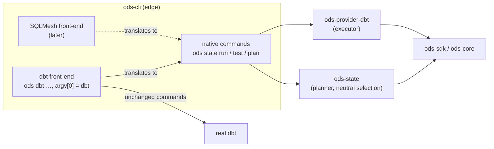

# ADR-0015: A dbt-shaped CLI, and compatibility front-ends for other tools' CLIs

- **Status:** Proposed
- **Date:** 2026-09-26
- **Issues:** #220 (where this came up), #224, #225, #226
- **Deciders:** @n1ckyb

## Context
ODS spreads faster if people can adopt it without rewriting how they work. Two groups
come with habits and scripts:

- **dbt users** run `dbt build -s +orders --target prod` in CI, Airflow tasks, Makefiles
  and muscle memory.
- **SQLMesh users** run `sqlmesh plan` and `sqlmesh run`.

The maintainer asked whether the CLI could be *dynamic*: a user picks a dbt-style or
SQLMesh-style CLI in configuration, and ODS then accepts that tool's commands and
arguments, so little of their existing code changes.

What exists today (ADR-0004, ADR-0014, #220):

- `ods state run` already uses dbt's vocabulary where the meaning is the same:
  `--select`, `--exclude`, `--resource-type`, `--full-refresh`, `--target`,
  `--project-dir`, `--profiles-dir`, `--test` (like `dbt build`) and dbt options after
  `--` (an allowlist).
- Selection is `name`, `+name`, `name+` and `+name+`
  (`ods-state::selection`). dbt's selector methods (`tag:`, `path:`, `config.`,
  `source:`, …), graph depth (`2+name`), `@name`, set operations (`a,b` intersection,
  spaces for union) and `--selector` YAML aren't supported. `-s` isn't a short form yet.
- There is no SQLMesh project provider, and none on the roadmap before M8.

Constraints:

- **Rule 3 (conservative defaults).** Accepting a familiar flag but giving it a slightly
  different meaning is the worst outcome: `--select tag:nightly+` that selects *other*
  nodes than dbt would builds the wrong thing silently. What ODS can't honour exactly
  must be refused, naming what to use instead.
- **Rule 1 (no vendor logic in core).** Tool-specific parsing belongs at the CLI edge;
  the planner and selection stay neutral.
- **Rule 7 (presentation separate from logic).** A front-end only translates arguments
  into the requests the native commands already build; it adds no planning of its own.
- **Rule 8 (clean-room).** A CLI's public surface and documentation may be followed;
  no dbt or SQLMesh code is copied or linked.
- **ADR-0005.** Flags are the top configuration layer, parsed before configuration is
  loaded. Letting configuration change how arguments are parsed inverts that order.

## Options considered

### Option A: configuration reshapes the `ods` CLI
`[cli] style = "dbt" | "sqlmesh" | "ods"` changes which commands and flags `ods`
accepts.

- Pros: one entry point; each user sees what they know.
- Cons:
  - The same `ods run …` means different things on different machines. Scripts, docs,
    support answers, `--help` and bug reports stop being portable.
  - Parsing would depend on configuration, which is loaded after parsing (ADR-0005),
    and on which profile or working directory is active.
  - Every command is specified, documented and tested once per style.
  - It still doesn't make `dbt build` in existing scripts work: those scripts call
    `dbt`, not `ods`.

### Option B: one ODS CLI, plus a migration guide
Keep `ods` as it is and document how dbt and SQLMesh commands map onto it.

- Pros: least to build; one CLI to support.
- Cons: every script and habit has to change before ODS is useful. That is the friction
  this ADR is meant to remove.

### Option C: wrapper scripts per tool
Ship a small `dbt` shell or Python script that rewrites arguments and calls `ods`.

- Pros: quick to write.
- Cons: a second language to maintain (ADR-0002: Python is a thin consumer only);
  argument rewriting in shell drifts from the Rust parser; poor on Windows; errors lose
  ODS's exit codes and JSON envelope.

### Option D: a dbt-shaped `ods`, plus explicit compatibility front-ends (chosen)
- The native CLI adopts dbt's names and syntax wherever the meaning is exactly the same.
- Each tool gets an explicit **front-end**, a separate entry point that accepts that
  tool's CLI: `ods dbt …`, also reachable by running the binary under the name `dbt`.
  It translates into the same requests as the native commands, and refuses what it
  can't honour exactly.
- Configuration only sets defaults. It never changes how arguments are parsed.

- Pros:
  - `dbt build -s +orders` works unchanged in existing scripts (via the `dbt` name), and
    `ods dbt build …` makes the switch explicit where people prefer that.
  - What a command means never depends on configuration; `ods` stays one documented CLI.
  - Front-ends live at the CLI edge and reuse the native commands, so core and planner
    stay neutral and there is one implementation of each behaviour.
  - Each front-end can be added, tested and documented on its own, when its tool's
    provider exists.
- Cons:
  - Two surfaces to document and test: the native CLI and each front-end.
  - Keeping pace with dbt's CLI across versions takes work; parity has to be tested
    against real dbt.
  - Running the binary as `dbt` must not find itself when it looks for the real dbt.

## Decision
We will make the native `ods` CLI dbt-shaped wherever the meaning is identical, and
reach other tools' users through explicit compatibility front-ends (`ods dbt …` first,
also invoked as `dbt`; `ods sqlmesh …` once a SQLMesh provider exists), which translate
into native requests and refuse, with a named alternative, anything they can't honour
exactly. Configuration sets front-end defaults only; it never changes parsing.

In detail:

1. **Native CLI.** Adopt dbt's spelling for options with the same meaning: `-s` for
   `--select`, `--selector`, and dbt's selector grammar. Selection gains dbt's methods
   (`tag:`, `path:`, `fqn:`, `resource_type:`, `config.`, `source:`, `package:`), graph
   depth (`n+`, `+n`), `@`, union and intersection. Selection stays neutral: providers
   supply the node attributes the methods read (tags, file path, config), and the
   grammar lives in `ods-state::selection`. A method or operator ODS doesn't support is
   an error naming it, never a partial match.
   *Amended (#227):* dbt's `DBT_*` variables are the defaults of the options ODS has
   for them (`DBT_TARGET` for `--target`, and so on), as in dbt. dbt's `--profile` is
   spelled `--dbt-profile` on native commands, since `--profile` is ODS's configuration
   profile (ADR-0005); the `ods dbt` front-end takes dbt's `--profile`, as dbt does.
2. **`ods dbt` front-end.** It accepts dbt's commands and flags:
   - `build`, `run`, `seed`, `snapshot`: ODS plans and builds only what changed
     (`run` = models, `seed`, `snapshot` = that resource type, `build` = all of them
     with tests), then records the result. This is the one deliberate difference from
     dbt, and the front-end says so on stderr
     (`ods ▸ dbt build via ODS: 8 of 13 selected nodes build, 5 are reused`).
   - `test`: runs all selected tests, as dbt does (`ods state test --all`), and records
     the results.
   - Commands ODS doesn't change (`deps`, `debug`, `parse`, `compile`, `docs`, `ls`,
     `run-operation`, `show`, …): run the real dbt with the same arguments, unchanged.
   - Flags ODS can't honour in a recorded run (`--defer`, `--state`, `--empty`,
     `--sample`, `--event-time-*`; see ADR-0014) are refused with the reason.
     `--vars` is accepted and passed to every dbt command ODS runs, so plan, build and
     record see the same values; their effect is in the compiled SQL, which is
     fingerprinted (amended in #229: vars don't need to be part of the state scope). `--ods-bypass` runs the real dbt unchanged
     and records nothing, as an escape hatch during adoption.
   - Exit codes follow dbt's in this mode (0 success, 1 a node or test failed, 2 dbt or
     ODS couldn't run), so CI steps keep their meaning. This amends ADR-0004 for the
     front-end only.
3. **Invoked as `dbt`.** When the binary's name is `dbt` (a symlink or copy), it
   behaves as `ods dbt`. It finds the real dbt from configuration (`dbt.program`),
   `ODS_DBT`, or `PATH` *excluding itself*, and refuses to start if it would call
   itself.
4. **`ods sqlmesh` front-end: later.** It needs a SQLMesh project provider first. It
   will accept `run` (build what's due) where the meaning matches. `plan`/`apply`
   (virtual environments, backfills, categorised changes) is only mapped once ODS has
   equivalents, and refused until then. No promise of flag parity is made before that.
5. **Configuration** (`[cli]`, ADR-0005) sets front-end defaults, e.g. the real dbt
   program or whether `ods` alone prints a hint for users coming from dbt. It never
   selects which commands or flags parse.

## Consequences
- Positive:
  - A dbt user can put ODS in front of existing scripts by installing it as `dbt`, and
    get skipped builds and recorded state without editing their jobs.
  - The native CLI and dbt share names and selector syntax, so switching between them,
    and reading dbt docs, carries over.
  - The meaning of an `ods` command never depends on configuration.
  - Core stays vendor-neutral: front-ends are argument translators at the edge.
- Negative / trade-offs:
  - dbt's CLI changes across versions; parity is maintained and tested against real
    dbt (`ODS_TEST_DBT`) for the supported versions, and unknown flags are refused
    rather than guessed.
  - `ods dbt build` builds fewer nodes than `dbt build` by design. The stderr line and
    the report say which were reused and why, and `--ods-bypass` restores dbt's
    behaviour.
  - Front-end exit codes differ from native `ods` exit codes (ADR-0004); the docs list
    both.
  - A SQLMesh front-end is not available until a SQLMesh provider exists.
- Follow-up issues:
  - #224: dbt selector parity in the native CLI: `-s`, `--selector` YAML, methods,
    graph depth, `@`, set operations; neutral node attributes from providers (M2).
  - #225: the `ods dbt` front-end: command mapping, refusals, `--ods-bypass`, dbt
    exit codes, pass-through of unchanged commands, running as `dbt` (argv[0], with
    self-exclusion), parity tests against real dbt, a "Coming from dbt" guide (M2,
    alongside #212 distribution).
  - #226: a SQLMesh project provider, then the `ods sqlmesh` front-end (M8).

## References
- ADR-0003 (presentation boundary), ADR-0004 (CLI framework, exit codes), ADR-0005
  (configuration and precedence), ADR-0011 (reading dbt State config as-is: the same
  "work unchanged" goal for configuration), ADR-0014 (executor, pass-through
  allowlist).
- dbt's public CLI reference and node selection syntax documentation.
- SQLMesh's public CLI documentation (`plan`, `run`, virtual environments).
- Prior art for name-based dispatch: BusyBox and `git`'s `git-<cmd>` convention.
