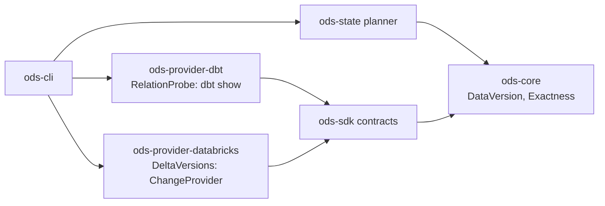

# ADR-0022: Delta table versions as source change evidence, read through dbt

- **Status:** Accepted (2026-10-04); amended 2026-10-07 (#388: saved readings, §7)
- **Date:** 2026-09-29
- **Issues:** #17 (M1 slice), #16 (the `ChangeProvider` contract); related #15, #126, #230
- **Deciders:** @n1ckyb

## Context

ODS reuses a model only when its code and its inputs' data are unchanged. Today a
source's data version comes from one place: dbt's `sources.json`, the
`max_loaded_at` that `dbt source freshness` measures. That has two limits:

- it needs a `loaded_at_field` on every source, and most projects don't set one;
- it is `semantic` evidence: a correction that rewrites rows without moving
  `max(loaded_at)` looks like no new data.

A source with no version counts as changed (AGENTS.md rule 3), so every model that
reads it builds every time. That is correct, and it's why State saves little on
projects without freshness configured.

On Databricks, every Delta table carries a version that moves on each commit. The same
version means the same data, which is `exact` evidence (`Exactness::Exact` in
`ods-core`). The M1 slice of #17 (agreed in its first comment) is:

- the latest table version and commit timestamp of each source;
- exposed as a `ChangeProvider`, behind the `relation_versions` capability;
- a source whose history can't be read counts as changed.

The roadmap assumed this needs a thin Databricks SQL connection (part of #15) and an
`env:` secret resolver (part of #126). This ADR decides whether it does.

Constraints:

- **Rule 1:** no vendor logic in core. The planner may know about "a version from the
  warehouse", but never about Delta.
- **Rule 3:** anything unreadable is unknown, and unknown means build.
- **Rule 9:** secrets are referenced, never stored. ODS today handles no warehouse
  credential at all.
- **ADR-0001:** providers never depend on each other; only the CLI wires them.
- **ADR-0016:** a precedent. ODS already checks relations through dbt's own connection
  (`dbt show --inline` with a jinja query), so it never touches a credential.
- **No network calls in tests.** The real warehouse is exercised only by the labelled
  and nightly `databricks` job (#294).

## Options considered

### Option A — A native Databricks SQL connection in `ods-provider-databricks`

Call the SQL Statement Execution API directly, authenticated as ADR-0021 decides.

- **Pros:**
  - Independent of dbt, and reusable for #15 (UC metadata) and #170 (live lineage).
  - One statement per table, so a single failure affects only that table.
  - Statements can run in parallel.
- **Cons:**
  - A second set of connection settings (host, warehouse id, auth) next to the dbt
    profile the user already has, which can drift from it: ODS could read versions
    from a different workspace than dbt builds in.
  - Pulls ADR-0021's credential chain, an HTTP client and async I/O into M1. None of
    that is built yet.
  - ODS would handle a warehouse token for the first time.

### Option B — Through dbt's connection, with the Delta query supplied by the Databricks provider (chosen)

Run one `dbt show --inline` whose jinja asks each source's table for its identity and
latest history entry, as the relation check does (ADR-0016). dbt renders it with the
user's profile.

- **Pros:**
  - No credential, no new connection settings, no HTTP client. It reads the same
    workspace, with the same identity, that dbt builds with.
  - Reuses the tested `dbt show` path (artifacts written aside, output parsed from
    the `ShowNode` event).
  - Works today on the `databricks` CI job.
- **Cons:**
  - **Jinja can't catch an error.** One source that refuses `DESCRIBE HISTORY` fails
    the whole call, and then every source is unknown. That is conservative, but coarse.
    A filter (below) skips the relations that would fail predictably.
  - **The statements run one after another**, inside one dbt call, two per source.
    The cost grows with the number of sources in the project.
  - Only works while dbt is the project format. That is true for M1, and the contract
    (below) doesn't assume it.

### Option C — One `information_schema` query for `last_altered`

A single `SELECT` over `information_schema.tables`.

- **Pros:** one fast query, no per-table failure.
- **Cons:** a timestamp is `proxy` evidence at best. It isn't documented to move on
  every data commit, and it moves on metadata changes. Proxy evidence doesn't allow
  reuse (`allows_reuse` needs `semantic` or better), so it wouldn't let anything be
  reused. Rejected.

### Option D — Keep `sources.json` only

- **Pros:** no work.
- **Cons:** projects without `loaded_at_field` get no data-aware reuse, which is the
  M1 promise. Rejected.

## Decision

**ODS reads each source's latest Delta table version through dbt's own connection, in
one `dbt show --inline` call. The Delta-specific query and its parsing live in
`ods-provider-databricks`, which reaches the planner only as an `exact` `DataVersion`
behind the `relation_versions` capability. A version that can't be read is unknown,
and the source counts as changed.**

### 1. Contracts and capabilities

- **`ods-sdk` gains `ChangeProvider` 0.1** (the contract #16 planned):
  `versions(&[RequestedSource]) -> Result<VersionReport, ProviderError>`.
  - The report lists every requested source once, in order, as
    `version(DataVersion)` or `unknown(why)`.
  - `Err` means nothing was read.
  - It is read-only, and answers in one batch.
  - A conformance suite runs against the fake and the real implementation.
- **`ods-sdk` gains `RelationProbe` 0.1**, a narrow contract for running a few
  read-only statements against each of a set of relations, through a connection the
  provider already has. **The request is typed and says nothing about how it runs:**
  - `statements`: SQL templates with one placeholder, `{relation}`. The implementation
    fills it with the relation's name, quoted by its own rules.
  - `filter`: which relations to run them on, as data. It holds the relation kinds
    (`table`, `view`, …) and optionally a table format the implementation must be
    able to confirm (`format: Some("<name>")`). A relation the implementation can't
    show matches is `skipped`, never run.
  - The answer is, per relation: the first row of each statement as named strings,
    `skipped(why)`, or `unknown(why)`.
  - **How the filter and statements are executed is the implementation's business.**
    The dbt executor renders them into jinja inside `ods-provider-dbt`: the filter
    becomes an `adapter.get_relation` check, and each statement a `run_query`. It
    advertises the capability `relation_probe`. A native connection would implement
    the same request with its own catalog lookups. Nothing in the SDK knows about
    jinja or dbt.
- **`ods-provider-databricks` implements `ChangeProvider`** as `DeltaVersions`. It is
  built from any `RelationProbe`, and advertises `relation_versions`. Its request:
  - `filter`: tables whose format is Delta. Views and non-Delta tables are skipped,
    and a skipped source is `unknown("not a Delta table")`.
  - `statements`:
    1. `DESCRIBE DETAIL {relation}`, for `id` (the table's UUID, new when a table is
       dropped and created again) and `format`;
    2. `DESCRIBE HISTORY {relation} LIMIT 1`, for `version` and `timestamp`.
  - Before shipping, the `databricks` CI job must confirm that the dbt executor can
    confirm the Delta format with dbt-databricks 1.10, from the relation
    `adapter.get_relation` returns. If it can't, that relation is `skipped`, as the
    contract requires. `DeltaVersions` then asks with a filter of tables only. Its
    `DESCRIBE DETAIL` result is checked, and a non-Delta `format` makes that source
    `unknown`. The remaining risk is the all-or-nothing failure above, when
    `DESCRIBE HISTORY` refuses a non-Delta table.
- **Neither provider depends on the other.** The CLI composes them:

### 2. Choosing a version source

- **The planner chooses, not the CLI.** `ods-state` gains a function that takes, for
  each source, the evidence the composition root collected: a `ChangeProvider`
  answer, the `sources.json` `max_loaded_at`, or neither. It picks one with
  `ods_core::choose` over the capabilities those inputs came with, in this order:
  1. `relation_versions`: the table version;
  2. `source_freshness`: `max_loaded_at`, as today;
  3. the conservative fallback: no version, so the source counts as changed.

  It records which strategy won, and why the ones before it didn't (e.g. "not a
  Delta table"), as evidence on the source. Every composition root, the CLI or a
  future server, gets the same order and the same explanation.
- **The CLI only wires.** It maps the adapter type in the dbt manifest
  (`metadata.adapter_type`) to a `ChangeProvider`, builds it over the dbt
  executor's `RelationProbe`, calls it, and hands the answers to the planner. Only
  the CLI sees the name. No core crate or module does.
- **When a table version and `max_loaded_at` both exist, the table version wins.** It
  is `exact` and doesn't depend on a column the user has to maintain.
- **Every source in the project is asked about, on every command that can build**
  (`run`, `build`, `seed`, `snapshot`, `compile`, including `--dry-run`).
  - **Why all, not only the ones that could change a decision:** a source with no
    version today makes all its readers build, so a filter on "could be reused"
    would never ask about it. It would never get a baseline, and reuse would never
    start. Asking every time records a baseline on the first successful build.
  - **The query is fixed-size.** Like ADR-0016's check, the jinja iterates
    `graph.sources` itself. No list travels on the command line or in `--vars`, so
    the call doesn't grow with the project, and partial parsing isn't invalidated.
    The dbt executor answers only for the sources it was asked about, and ignores the
    rest.
- `ods state plan` stays offline and artifact-only, as ADR-0016 decided.

### 3. The version value

- `DataVersion { value: "<table id>/<version>", exactness: exact,
  source: "delta_history" }`.
  - **The table id makes the pair unique.** A table dropped and created again gets a
    new id and restarts at version 0, so the value can't repeat. The commit
    timestamp isn't part of the value: timestamps lose precision when normalised,
    and aren't needed for uniqueness. It is kept as evidence, as reported.
  - **A missing or empty `id` or `version` makes the source `unknown`**, never a
    partial value.
- **Versions compare equal only when value, exactness and source are all equal**
  (`DataVersion`'s derived `PartialEq`, as today). The first run after switching from
  `max_loaded_at` to table versions therefore sees a change and builds once. That is
  conservative and self-correcting.
- **`observed_at` is the time the probe ran.** It runs before any build in the same
  command, so the planner's existing rule holds: a version measured before a node's
  last build can't show data that arrived after it. Data committed while a build
  runs moves the version, so the next run builds again. It is never missed.
- **Any commit counts.** OPTIMIZE, VACUUM and property changes also move the version,
  so they cause a rebuild. That's conservative. Telling data commits from maintenance
  ones by the history's `operation` is follow-up work (the M2 remainder of #17).

### 4. Failures

| What happens | Result |
|---|---|
| The `dbt show` call fails (a permission error, the warehouse is unreachable, an unexpected answer) | Every requested source is `unknown`. A warning names dbt's error, and those sources count as changed. |
| The filter skips a relation, or `DESCRIBE DETAIL` reports another format | That source is `unknown("not a Delta table")`, and falls back to `max_loaded_at` if it has one. |
| A source the query didn't report | `unknown`. It is never treated as unchanged. |
| The answer names a source nobody asked about | Ignored, as ADR-0016 does. |

### 5. Evidence and output

- Each source's evidence is `source_data_version`, with the version value, exactness
  `exact`, and origin `delta_history`. `ods state plan/explain` show where each
  version came from.
- Step lines announce the probe (`dbt show: reading table versions for N sources`),
  as they announce the relation check.
- `ods state plan` uses `sources.json` if present, and says table versions weren't
  read.

### 6. Persisted format

- There is no schema change. `SourceState.version` and node inputs already store a
  `DataVersion`. `delta_history` is a new `source` label, not a new field.
- **Snapshots written before this change still read.** Their `sources.json`
  versions compare unequal to table versions, which means one conservative build.

## Consequences

- **Positive:**
  - Data-aware reuse on Databricks without `loaded_at_field`, and with `exact`
    evidence: the M1 promise.
  - ODS still handles no warehouse credential. #126 and #15 aren't needed for M1.
  - `RelationProbe` gives other warehouses a cheap path, e.g. Snowflake's
    `LAST_ALTERED` or Iceberg snapshots, each as its own `ChangeProvider` with its own
    exactness.
- **Negative / trade-offs:**
  - **One unreadable table can blind the whole probe.** The filter limits this; if it
    proves common, Option A becomes the reason to build the native connection.
  - **Serial statements add latency:** two per source in the project, on every
    command that can build. The `databricks` job records the time per source. A
    large project may need a setting to turn the probe off, or a native connection
    that runs them in parallel.
  - **Maintenance commits cause rebuilds** until the M2 follow-up.
  - **Two new contracts** to version and test.
- **Follow-up issues:**
  - #17 M2 remainder: ignore non-data operations, Change Data Feed, watermark and
    partition strategies.
  - A native connection for #15 / #170 if the probe's limits bite. It would be a new
    `ChangeProvider` implementation, chosen by capability, with no planner change.
  - Record the probe's duration per source in run events (#8).

## Amendment (2026-10-07): saved readings (#388)

### Context

`ods serve`, `ods state plan` and `ods state explain` never connect to the warehouse
(ADR-0009, §5), so they only see the versions in `sources.json`. On a project that
relies on table versions, they show every source as *unknown*, even just after a dry
run read every version.

### 7. Saved readings

- **What is saved:** the reading a command takes (§2): when it started, which
  capabilities its reader has, and each source's answer, a `DataVersion` or why it is
  unknown. Also which command took it, for people.
- **Where:** in `<state-db>.versions.json`, beside the store, like the last run
  (`<state-db>.last-run.json`). It holds the latest reading for each state scope
  (`<project>/<environment>`), and has a `schema_version` (1.0). A file of a newer
  major version, or one that can't be read, is ignored with a warning.
- **Who writes:** every command that reads versions (`ods state build`, `run`, and
  their `--dry-run`), right after reading and before dbt runs, whatever happens next.
  The file is written atomically and replaces only its own scope's entry. It is not
  the store: nothing in it is canonical state, so a failed or partial command that
  writes it can't change what was built (AGENTS.md rule 5).
- **Who reads:** only the commands that don't connect: `ods state plan`, `ods state
  explain` and `ods serve`. They add the saved reading for their scope to the readings
  they have. Commands that read versions themselves never load it, so a fresh reading
  is never shadowed by a saved one.
- **Aging:** none is added. The planner already treats a version observed before a
  node's last build as saying nothing about data since (§3), and says so. An old
  reading therefore makes readers build, with that reason; it is never shown as
  current. Surfaces show when the reading was taken and by which command.
- **A failed reading is saved too:** its sources are *unknown*, with the reason. The
  latest reading is what is known now; an older good one isn't kept in its place
  (AGENTS.md rule 3).
- **Neutral:** the file holds what any change provider answers. Nothing in it names a
  warehouse but the versions' own `source` label (e.g. `delta_history`).

## References

- #17 and its M1 scope comment; #16 (`ChangeProvider`); #230 and
  [ADR-0016](0016-relation-existence-before-reuse.md) (reading through `dbt show`).
- [ADR-0013](0013-state-snapshots-fingerprints-and-store.md): `DataVersion`,
  `Exactness`.
- [ADR-0021](0021-databricks-authentication.md): the native connection this avoids
  for now.
- Databricks: `DESCRIBE HISTORY` returns one row per commit, newest first, with
  `version`, `timestamp` and `operation`.
