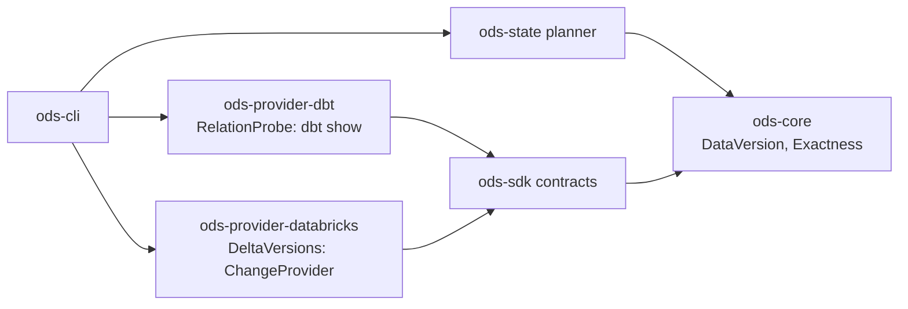

# ADR-0022: Delta table versions as source change evidence, read through dbt

- **Status:** Proposed
- **Date:** 2026-09-29
- **Issues:** #17 (M1 slice), #16 (the `ChangeProvider` contract); related #15, #126, #230
- **Deciders:** @n1ckyb

## Context

ODS reuses a model only when its code and its inputs' data are unchanged. Today a
source's data version comes from one place: dbt's `sources.json`, the
`max_loaded_at` that `dbt source freshness` measures. That has two limits:

- it needs a `loaded_at_field` on every source, and most projects don't set one;
- it is `semantic` evidence: a correction that rewrites rows without moving
  `max(loaded_at)` looks like no new data.

A source with no version counts as changed (AGENTS.md rule 3), so every model that
reads it builds every time. That is correct, and it's why State saves little on
projects without freshness configured.

On Databricks, every Delta table carries a version that moves on each commit. The same
version means the same data, which is `exact` evidence (`Exactness::Exact` in
`ods-core`). The M1 slice of #17 (agreed in its first comment) is:

- the latest table version and commit timestamp of each source;
- exposed as a `ChangeProvider`, behind the `relation_versions` capability;
- a source whose history can't be read counts as changed.

The roadmap assumed this needs a thin Databricks SQL connection (part of #15) and an
`env:` secret resolver (part of #126). This ADR decides whether it does.

Constraints:

- **Rule 1:** no vendor logic in core. The planner may know about "a version from the
  warehouse", but never about Delta.
- **Rule 3:** anything unreadable is unknown, and unknown means build.
- **Rule 9:** secrets are referenced, never stored. ODS today handles no warehouse
  credential at all.
- **ADR-0001:** providers never depend on each other; only the CLI wires them.
- **ADR-0016:** a precedent. ODS already checks relations through dbt's own connection
  (`dbt show --inline` with a jinja query), so it never touches a credential.
- **No network calls in tests.** The real warehouse is exercised only by the labelled
  and nightly `databricks` job (#294).

## Options considered

### Option A — A native Databricks SQL connection in `ods-provider-databricks`

Call the SQL Statement Execution API directly, authenticated as ADR-0021 decides.

- **Pros:**
  - Independent of dbt, and reusable for #15 (UC metadata) and #170 (live lineage).
  - One statement per table, so a single failure affects only that table.
  - Statements can run in parallel.
- **Cons:**
  - A second set of connection settings (host, warehouse id, auth) next to the dbt
    profile the user already has, which can drift from it: ODS could read versions
    from a different workspace than dbt builds in.
  - Pulls ADR-0021's credential chain, an HTTP client and async I/O into M1. None of
    that is built yet.
  - ODS would handle a warehouse token for the first time.

### Option B — Through dbt's connection, with the Delta query supplied by the Databricks provider (chosen)

Run one `dbt show --inline` whose jinja asks each source's table for its latest history
entry, as the relation check does (ADR-0016). dbt renders it with the user's profile.

- **Pros:**
  - No credential, no new connection settings, no HTTP client. It reads the same
    workspace, with the same identity, that dbt builds with.
  - Reuses the tested `dbt show` path (artifacts written aside, output parsed from
    the `ShowNode` event).
  - Works today on the `databricks` CI job.
- **Cons:**
  - **Jinja can't catch an error.** One source that refuses `DESCRIBE HISTORY` fails
    the whole call, and then every source is unknown. That is conservative, but coarse.
    A guard (below) skips the tables that would fail predictably.
  - **The statements run one after another**, inside one dbt call. The cost grows with
    the number of sources asked about. They are limited to the sources that could
    change a decision (below).
  - Only works while dbt is the project format. That is true for M1, and the contract
    (below) doesn't assume it.

### Option C — One `information_schema` query for `last_altered`

A single `SELECT` over `information_schema.tables`.

- **Pros:** one fast query, no per-table failure.
- **Cons:** a timestamp is `proxy` evidence at best. It isn't documented to move on
  every data commit, and it moves on metadata changes. Proxy evidence doesn't allow
  reuse (`allows_reuse` needs `semantic` or better), so it wouldn't let anything be
  reused. Rejected.

### Option D — Keep `sources.json` only

- **Pros:** no work.
- **Cons:** projects without `loaded_at_field` get no data-aware reuse, which is the
  M1 promise. Rejected.

## Decision

**ODS reads each source's latest Delta table version through dbt's own connection, in
one `dbt show --inline` call. The Delta-specific query and its parsing live in
`ods-provider-databricks`, which reaches the planner only as an `exact` `DataVersion`
behind the `relation_versions` capability. A version that can't be read is unknown,
and the source counts as changed.**

### 1. Contracts and capabilities

- **`ods-sdk` gains `ChangeProvider` 0.1** (the contract #16 planned):
  `versions(&[RequestedSource]) -> Result<VersionReport, ProviderError>`.
  - The report lists every requested source once, in order, as
    `version(DataVersion)` or `unknown(why)`.
  - `Err` means nothing was read.
  - It is read-only, and answers in one batch.
  - A conformance suite runs against the fake and the real implementation.
- **`ods-sdk` gains `RelationProbe` 0.1**, a narrow contract for asking something
  about each of a set of relations through a connection the provider already has.
  - The request carries a *probe*: a per-relation statement template, an optional
    jinja guard, and the column names to return.
  - The answer is, per relation, the first row as strings, `skipped` (the guard said
    no), or `unknown(why)`.
  - The dbt executor implements it with `dbt show --inline` and advertises the
    capability `relation_probe`.
- **`ods-provider-databricks` implements `ChangeProvider`** as `DeltaVersions`. It is
  built from any `RelationProbe`, and advertises `relation_versions`:
  - the probe's statement is `DESCRIBE HISTORY <relation> LIMIT 1`, returning
    `version` and `timestamp`;
  - the guard skips relations the adapter doesn't report as Delta tables (views,
    external non-Delta tables). A skipped source is `unknown("not a Delta table")`.
    Before shipping, the `databricks` CI job must confirm that dbt-databricks 1.10
    exposes this on the relation `adapter.get_relation` returns. If it doesn't, the
    guard only checks that the relation is a table, and the rest is left to the
    all-or-nothing failure above.
- **Neither provider depends on the other.** The CLI composes them:

### 2. Choosing a version source

- **The CLI picks the strategy with `ods_core::choose`:**
  1. `relation_versions` (a `ChangeProvider` is available for the project's
     warehouse);
  2. `sources.json` `max_loaded_at`, as today;
  3. the conservative fallback: no version, so the source counts as changed.
- **Which `ChangeProvider` applies** is decided at the CLI edge, from the adapter type
  in the dbt manifest (`metadata.adapter_type`). Only the CLI maps an adapter type to
  a provider. No core crate or module sees the name.
- **When a table version and `max_loaded_at` both exist, the table version wins.** It
  is `exact` and doesn't depend on a column the user has to maintain.
- **Only the sources that could change a decision are asked about:** those read,
  directly or through views, by a node the plan would otherwise reuse (the same
  reasoning as ADR-0016's `reuse_candidates`). The list is passed to the query as a
  dbt var (`ods_sources`), merged with the user's `--vars`, so the command line
  doesn't grow with the project.
- There is no call when nothing could be reused, e.g. on a first run, or when every
  candidate is already building for another reason.

### 3. The version value

- `DataVersion { value: "<version>@<commit timestamp>", exactness: exact,
  source: "delta_history" }`.
  - The timestamp is normalised with `Timestamp::parse`, as `max_loaded_at` is.
  - It is part of the value because a table dropped and created again restarts at
    version 0. The pair can't repeat.
- **Versions compare equal only when value, exactness and source are all equal**
  (`DataVersion`'s derived `PartialEq`, as today). The first run after switching from
  `max_loaded_at` to table versions therefore sees a change and builds once. That is
  conservative and self-correcting.
- **`observed_at` is the time the probe ran.** It runs before any build in the same
  command, so the planner's existing rule holds: a version measured before a node's
  last build can't show data that arrived after it. Data committed while a build
  runs moves the version, so the next run builds again. It is never missed.
- **Any commit counts.** OPTIMIZE, VACUUM and property changes also move the version,
  so they cause a rebuild. That's conservative. Telling data commits from maintenance
  ones by the history's `operation` is follow-up work (the M2 remainder of #17).

### 4. Failures

| What happens | Result |
|---|---|
| The `dbt show` call fails (a permission error, the warehouse is unreachable, an unexpected answer) | Every requested source is `unknown`. A warning names dbt's error, and those sources count as changed. |
| The guard skips a relation | That source is `unknown("not a Delta table")`, and falls back to `max_loaded_at` if it has one. |
| A source the query didn't report | `unknown`. It is never treated as unchanged. |
| The answer names a source nobody asked about | Ignored, as ADR-0016 does. |

### 5. Evidence and output

- Each source's evidence is `source_data_version`, with the version value, exactness
  `exact`, and origin `delta_history`. `ods state plan/explain` show where each
  version came from.
- Step lines announce the probe (`dbt show: reading table versions for N sources`),
  as they announce the relation check.
- `ods state plan` stays offline and artifact-only, as ADR-0016 decided. It uses
  `sources.json` if present, and says table versions weren't read.

### 6. Persisted format

- There is no schema change. `SourceState.version` and node inputs already store a
  `DataVersion`. `delta_history` is a new `source` label, not a new field.
- **Snapshots written before this change still read.** Their `sources.json`
  versions compare unequal to table versions, which means one conservative build.

## Consequences

- **Positive:**
  - Data-aware reuse on Databricks without `loaded_at_field`, and with `exact`
    evidence: the M1 promise.
  - ODS still handles no warehouse credential. #126 and #15 aren't needed for M1.
  - `RelationProbe` gives other warehouses a cheap path, e.g. Snowflake's
    `LAST_ALTERED` or Iceberg snapshots, each as its own `ChangeProvider` with its own
    exactness.
- **Negative / trade-offs:**
  - **One unreadable table can blind the whole probe.** The guard limits this; if it
    proves common, Option A becomes the reason to build the native connection.
  - **Serial statements add latency** proportional to the sources asked about. The
    `databricks` job records the time per source, and a large project may need a
    limit or a cache.
  - **Passing `ods_sources` as a var makes dbt re-parse** the project for that call,
    because vars invalidate partial parsing. It runs in its own target directory
    (as ADR-0016's check does), so the build's partial-parse cache is untouched.
    If the re-parse proves slow, the alternative is to iterate `graph.sources` and
    filter in jinja by a short hash list.
  - **Maintenance commits cause rebuilds** until the M2 follow-up.
  - **Two new contracts** to version and test.
- **Follow-up issues:**
  - #17 M2 remainder: ignore non-data operations, Change Data Feed, watermark and
    partition strategies.
  - A native connection for #15 / #170 if the probe's limits bite. It would be a new
    `ChangeProvider` implementation, chosen by capability, with no planner change.
  - Record the probe's duration per source in run events (#8).

## References

- #17 and its M1 scope comment; #16 (`ChangeProvider`); #230 and
  [ADR-0016](0016-relation-existence-before-reuse.md) (reading through `dbt show`).
- [ADR-0013](0013-state-snapshots-fingerprints-and-store.md): `DataVersion`,
  `Exactness`.
- [ADR-0021](0021-databricks-authentication.md): the native connection this avoids
  for now.
- Databricks: `DESCRIBE HISTORY` returns one row per commit, newest first, with
  `version`, `timestamp` and `operation`.
