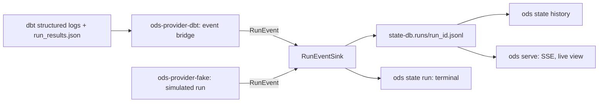

# ADR-0024: Run events, per-node run stats and the run journal

- **Status:** Proposed
- **Date:** 2026-09-29 (amended 2026-09-30: the live stream)
- **Issues:** #322 (live run view), #318 (Run pages), #320 (values removed from diagnostics), #321 (`.last-run.json`)
- **Deciders:** @n1ckyb

## Context
ODS only learns what a run did when the executor returns its
[report](0014-executor-contract-and-state-run.md) at the end: one status per node, and
a completion time to the second. It records no start times, durations, rows or thread,
so the Run pages (#318) show placeholders, and nothing can show a run while it is still
going. #322 asks for a live view of a run on the DAG, with each node's stats, in the
terminal, in `ods state history` and in `ods serve`.

The constraints:
- **No vendor logic in core** (AGENTS.md rule 1): the events and stats are ODS's own
  vocabulary. How an engine reports its progress (dbt's structured logs, a remote
  runner's API) stays in its provider. Whether an executor can report progress at all is
  a capability ([ADR-0006](0006-plugin-sdk-and-capabilities.md)).
- **Conservative defaults** (rule 3): a stat the engine didn't report is missing, never
  zero. Rows affected varies most: many engines report nothing for views or merges, and
  some report `-1`. A node the engine didn't report on never reads as a success.
- **Canonical state is replaced only on success** (rule 5): whatever records a run's
  progress must not become a second source of state.
- **Explainability** (rule 4): a failed node needs a short reason people can read.
- **Secrets** (rule 9): engines' messages quote the SQL and values they failed on,
  which can hold anything a query resolved, credentials included. `--vars` values are
  already kept out of `.last-run.json` (#321); events must not bring them back.
- **Clean room** (rule 8): only public dbt schemas.

## Options considered
### Option A: read the engine's own artifacts after the run
Parse `run_results.json` (and dbt's log file) when the run ends, in the CLI.
Pros: no contract change. Cons: nothing is live; the CLI learns dbt's formats (rule 1);
another engine can't take part.

### Option B: a streaming callback on the `Executor` contract, with a neutral event vocabulary (chosen)
The executor reports neutral events to a sink the host passes in, as they happen.
Pros: live; one vocabulary for every engine, tested by conformance; hosts (terminal,
journal, server) share it. Cons: one more contract surface, and each provider has to
bridge its engine's progress reporting.

### Option C: a separate event-bus contract (`EventSink`, #8) that executors publish to
Pros: general. Cons: #8 isn't designed yet; a run's events need the run's own id and
scope, and the host wants them per execution, which a per-call sink gives directly.
A later event bus can subscribe to the journal (below) instead.

## Decision
### The event contract (`ods_sdk::contracts::run_events`, executor contract 0.4)
`Executor::execute_with_events(request, sink)` does what `execute` does, and reports the
run's events to the `RunEventSink` as they happen. It has a default implementation, so
the executor contract goes from 0.3 to 0.4 without every executor changing.

Each event is a `RunEvent`: `schema_version` (1.0), the `run_id` (the report's), the
`scope` (the request's new `ExecutionRequest::scope`, e.g. `shop/dev`, passed through
untouched), `at` (to the millisecond: `ods_core::state::TimestampMs`, since
`Timestamp` is to the second) and one `kind`:

| Kind | Fields | When |
|---|---|---|
| `run_started` | `nodes` (requested, in order), `mode`, `live` | first, once |
| `node_queued` | `node` | the node waits to run |
| `node_started` | `node`, `thread` | it starts |
| `node_finished` | `node`, `stats` | it ends, however it ends; once per requested node |
| `check_finished` | `check`, `covers` (sorted), `status` | a check (e.g. a data test) ends |
| `run_finished` | `outcome` (`succeeded`, `failed`, `unknown`) | last, once, also when the execution errors after it started |

`check_finished` is a sixth kind beyond #322's five: the executor contract keeps checks
apart from nodes (ADR-0014), and a node's test counts can only come from the checks
that cover it.

Rules every executor follows, checked by the conformance suite (three new cases, 14 in
all):
- events are emitted in order, their times never go backwards, and all carry the same
  run id and the request's scope;
- every requested node finishes, and its last finish has the status the report gives
  it (unknown if the report doesn't list it): a node finishes a second time only when
  the report corrects the status reported live (readers keep every stat the first
  finish reported that the correction doesn't); node events come queued, started,
  finished; nothing but such a correction follows a node's finish; node
  events name only requested or reported-unrequested nodes;
- a success has no error, a node starts before it finishes, and error summaries quote
  nothing;
- a node the engine didn't know never finishes as a success; the run's outcome is
  `succeeded` exactly when the report says it succeeded.

### Per-node stats (`NodeRunStats`)
| Stat | Type | Missing means |
|---|---|---|
| `status` | `queued`, `running`, `success`, `error`, `skipped`, `unknown` | — (`unknown` is never read as success) |
| `started_at`, `finished_at` | `TimestampMs` | not recorded |
| `duration_ms`, `compile_ms`, `execute_ms` | `u64` | not timed; `took_ms()` falls back to end − start only when both were recorded |
| `rows_affected` | `u64` | not reported; a negative count from the engine is not reported |
| `adapter` | sorted map, string → string | nothing else reported |
| `thread` | string | not said |
| `error` | `ErrorSummary` | — |
| `tests` | passed / failed / warned / skipped counts | no checks ran |
| `blocked_by` | sorted node ids | not known which upstream failure stopped it |

"Kept earlier build (not selected)" is not an executor status: the executor never sees
nodes the plan reused. Hosts add it from the plan.

Adapter extras come through by the engine's own key, so core names none (rule 1). Keys,
values and thread names pass `ods_core::redact::value_line`: their first line, cut
where SQL starts, with quoted spans removed (numbers are kept, as ids and counts are
made of them), cut to 120 characters (keys and threads to 64); a node keeps at most 16
extras. Providers pass only scalars, and drop keys that are free-text status messages
or that the stats already carry (rows affected). `RunEvent::sanitized` applies all of
this again, and hosts call it before keeping an event, so a provider that filled a
field directly can't bypass it.

**Totals.** `RunTotals::rows_affected` sums the rows reported. Every node that ran or
may have (succeeded, failed, unknown, still running) and reported none counts in
`rows_unreported`, and then `rows_at_least` is true (serialized, so JSON readers need
not derive it): a run killed early totals "at least 0", never an exact 0. A requested
node the report doesn't list finishes `unknown`.

### Error summaries
`ErrorSummary::from_message` is the only way to make one (its fields are private, with
getters): the first non-blank line of the engine's message, with terminal escape
sequences and control characters made spaces first (so colour codes can't hide a
keyword), cut where SQL starts: any DML, DDL, DCL or utility statement start that can
carry values (`select`, `insert`, `update … set`, `delete from`, `merge into`,
`truncate`, `grant`, `revoke`, `copy into`, `call x(`, `create … table`, `drop …`,
…) or clause (`where`, `having`, `group by`, `values (`, `left join`, `cast(`, …),
matched as whole words in any case with any whitespace between them; English words
(`update`, `create`, `from`, `set`) count only in a statement's shape. Unquoted values
after `=`, `:=` or `=>` (`token = sk_live_…`) are removed too, and with quoted spans (`'…'`, `"…"`, `` `…` ``, `$$…$$`,
`$tag$…$tag$`) and standalone numbers replaced by `[value removed]`, control
characters dropped, and at most 200 characters. Quoting is read failing closed: an
apostrophe after a letter or digit (`can't`, `column's`) opens nothing, there are no
escapes, and if a span doesn't close on its line, closes right after a backslash, or
runs straight into a letter or digit, everything from the line's first quote on is
removed; plus the error's kind when the
line starts with one (`KeyError`, `Binder Error`), and optionally where the full message
is (a log file). The redaction lives in `ods_core::redact`, which configuration errors
(ADR-0005) now share. #320 made analyzer diagnostics name the construct instead of
quoting SQL; engine messages can't be rewritten that way, so they are redacted.

### The `run_events` capability, and the fallback
An executor that reports events as they happen advertises `run_events`. Without it, the
default `execute_with_events` runs `execute` and then reports the events rebuilt from
the report (`events_from_report`): the run, each node's status, completion time and
error summary, and each check. Nothing the report doesn't say is filled in: no start
times, durations, rows, extras or thread. `run_started.live` says which it was, so a UI
can say "no live stats" instead of showing gaps as zeros. An executor with the
capability may still fall back for one run (e.g. the dbt executor, when the user tells
dbt to log in another format), and says `live: false` then; without the capability,
`live` is never true. The run is still recorded either way. If the execution fails to
start, there are no events.

### The dbt bridge
The dbt executor has `run_events`. For the build or test it passes `--log-format json
--log-level debug`, reads dbt's standard output line by line, and turns two of dbt's
public structured events into run events: `NodeStart` (the node and `info.thread`) and
`NodeFinished` (`data.run_result`: `status`, `message`, `timing_info`, `thread`,
`execution_time`, `adapter_response`). Both are debug-level, hence the log level. Of
every other line it reads only `info.level`, `info.ts`, `info.msg` and
`info.invocation_id` (the run id).

What people see is decided failing closed, because dbt's debug lines carry the SQL it
runs and the options it was given: a JSON line shows its `msg` only when its `level`
is known and at least the level dbt would have shown (`info`, or what
`DBT_LOG_LEVEL`, the caller's `--log-level` or `--quiet` ask for, but never below
`info`: debug lines are never shown, and `--debug` shows `info` and above). The
caller's `--log-level`, `--quiet` and `-q` are taken out of dbt's arguments and
`--log-level debug` is always passed, which also beats `DBT_LOG_LEVEL`, so dbt keeps
sending node events whatever is shown. The run starts as `live` only when the log
reports a node; a log with no node event leaves the run to `run_results.json`, not
live. A line
without a level shows nothing; a line that starts with `{` but can't be read (cut
short, merged with other output, a number out of range) or has no `info` shows as a
placeholder; any other line (e.g. a Python model's `print`) is shown as it is unless it
holds a `{`. The provider doesn't write to the terminal: it hands these lines to a
hook the host sets (`DbtExecutor::on_output`), and `ods-cli` renders them (rule 7).
If reading dbt's output fails, dbt is stopped, so the run can't hang on a full pipe.

A log event's missing or unknown status is `unknown`. After dbt exits,
`run_results.json` fills in any requested node the log didn't finish (every node, in a
test run) and checks it didn't show; and the report's status wins: a node the log
finished with another status finishes again, with the log's stats and the report's
status. If the caller passes its own `--log-format` to dbt, the log isn't read: the
events come from `run_results.json` afterwards, with `live: false`. dbt reports rows in
`adapter_response.rows_affected` (a float in log events); `_message` is free text and
never kept. dbt starts an error message with a header, `<Runtime|Database|Compilation|
Dependency|Parsing|Python> Error in <type> <name> (<path>)`; only a line of exactly that
form counts as one, the summary takes the kind from it and the message from the next
line, and SQL echo lines (`LINE 35: …`) are never used. The shapes were checked against
dbt 1.10 with DuckDB, and a captured log is a test fixture.

### The run journal
`ods state run`, `seed`, `snapshot`, `build` and `test` append every event of a run
that executes to a journal beside the state database:
`<state-db>.runs/<run_id>.jsonl`, the same `run_id` as `.last-run.json` and the
snapshot the run commits.
- **Format:** JSON Lines, one `RunEvent` per line, each carrying its `schema_version`,
  so a reader needs no header. The file is created when `run_started` arrives (never
  overwriting an existing one), and each line is written and flushed as its event
  arrives, so `ods serve` can tail it while the run goes. A reader skips a last line
  that doesn't parse (a run killed mid-write), and refuses lines with a version it can't
  read (`SchemaVersion::can_read`).
- **Evidence, not state** (rule 5): nothing reads a journal to decide what to build or
  reuse. A failed or partial run keeps its journal, and canonical state is still
  committed only from the report, on success. Losing the journals loses history, never
  correctness.
- **Names:** a run id is used as a file name only if it is 1 to 128 characters of
  ASCII letters, digits, `-`, `_` and `.`, not starting with `.`. Otherwise the run has
  no journal, with a warning.
- **Failures:** a journal that can't be written warns once and the run goes on; a run
  doesn't fail because its evidence couldn't be kept.
- **Reading:** hosts read journals through one reader, `ods_sdk::run_journal` (the
  names, the listing, and the parsing above), so `ods state history` and `ods serve`
  can't differ; it applies `RunEvent::sanitized` to every line it reads, whatever wrote
  the file. ods-sdk owns the journal's file layout (where it is, how a run id names it)
  and this reader, beside the event types; they move to `ods-events` (#8) when that
  crate exists. Writing and pruning stay with the host that runs the executor.
- **Retention:** the 50 most recent journals per state database are kept (by
  modification time); older ones are deleted when a new run starts. The journal of the
  run starting is never deleted. The number becomes a configuration setting when
  someone needs another (`state.runs.keep`), and `ods state history` says when a run's
  journal is gone.

### A check's failing rows and message (amended 2026-10-02, #323)
`check_finished` gains two optional fields, so `RunEvent`'s `schema_version` is **1.1**
and the executor contract **0.6** (SDK 0.4):
- `failures`: how many rows the check found that don't pass, when the engine said (dbt's
  `failures` in `run_results.json`, `num_failures` in a `NodeFinished` log event). It is
  a count, not data, so it may be shown; `None` when not reported, and readers treat a
  `0` on a failed check as "not said", never as zero rows.
- `error`: the engine's message for a check that failed, warned or errored, as an
  `ErrorSummary` made by `ErrorSummary::from_message` (values, numbers and SQL
  removed), like a node's error; `RunEvent::sanitized` redacts it again.

Both are set only for a check that didn't pass (failed or warned): a check that
passed, was skipped or whose outcome is unknown carries no `error` and no `failures`,
whatever the engine said. The conformance suite checks that a passed check carries
neither and that a check's message quotes nothing. Both are `#[serde(default)]` and
left out when `None`: a 1.0 journal reads as before, with neither, and a 1.0 reader of a
1.1 line (same major) ignores them. `RunSummary` keeps each check's latest outcome
(`checks`), so hosts can explain failed tests (ADR-0025), but never serializes it.
A check is still identified by the engine's id in the journal: dbt builds a generic
test's id from its arguments (an `accepted_values` test's id names the values it
accepts), so the id can hold a value. Explanations, `ods state history --run` and the
dashboard's run views show a check's handle instead (`check-<12 hex digits>`, ADR-0025);
the journal itself (and the live stream of it) is unchanged, a follow-up.

### The live stream (`ods serve`, amended 2026-09-30)
`ods serve` shows a run while it goes by tailing its journal; the executor, the CLI and
the journal format are unchanged. ods-web reads the journal through the shared reader
(`ods_sdk::run_journal::parse`, one line at a time), so the stream can't carry more
than the Run pages show.

- **Routes:** `GET /api/runs/<run_id>/events` streams Server-Sent Events;
  `GET /api/runs/<run_id>/events?since=<n>` answers the same messages once as JSON
  lines (`{"id", "event", "data"}` per line), the fallback for clients without
  `EventSource`, at most 2,000 per answer; `GET /api/runs/live` lists the runs that are
  probably running. All are `GET` and read-only: no route starts, stops or changes a
  run.
- **Messages:** `run_event` (data: the sanitized `RunEvent`), `unreadable` (data:
  `{"line"}`, for any line that doesn't parse as an event of this run: a newer version,
  a line cut short, one longer than 256 KiB, or another run's event) and `end` (data:
  `reason` `finished` | `stopped` | `replaced`, the `outcome` when known, `inferred`,
  `note`). The **id** of a line's message is its line number in the journal, from 1
  (blank lines count and send nothing); `end` has none. A stream replays the journal
  from the start, then follows it; with `Last-Event-ID: n` (or `?since=n`) it sends only
  lines after `n`. Lines up to `n` aren't parsed: only one that may hold
  `run_finished` is, so a reconnect after the end still ends at once. It ends after
  `run_finished`, or as `stopped` (marked inferred) once the journal hasn't grown for
  `RECENT` (10 minutes), measured both by the file's time and by the server's own
  monotonic clock since the stream last saw it grow (a file dated in the future can't
  keep a stream open), or as `replaced` if the path names another file now or the file
  got shorter. When it ends as `finished` or `stopped`, a last line cut short (a run
  that stopped mid-write) is sent as `unreadable` first, so the stream counts it as the
  Run page's reader does. The first message sets `retry` to 2 s; a comment is sent as a
  heartbeat every 15 s when nothing else is.
- **Tailing:** the journal is opened once per stream and that handle is read: on Unix
  with `O_NOFOLLOW | O_NONBLOCK` (a symbolic link fails to open, and a FIFO can't block
  a thread), then checked with `fstat` to be a regular file; elsewhere after checking
  with `lstat` that the path is a regular file. Each tick (every 300 ms, on the
  blocking pool) checks the path still names the same file (device and inode on Unix)
  and how long it is; no file watcher: it needs no new dependency (`libc` is already in
  the tree), behaves the same on every platform and on network file systems, and costs
  two `stat`s per open stream per tick. Only complete lines are read; a line still
  being written waits for its newline, so the torn last line of a running journal is
  never shown as unreadable while it runs.
- **Limits:** a stream reads at most 256 KiB at a time and holds no more than that and
  one queued chunk of messages, so memory is bounded whatever the journal's size; at
  most 16 streams are open at once, across clients (one more gets `503` with
  `Retry-After`), and at most as many `?since=` answers are read at once (the same
  `503` beyond). A `?since=` answer stops at 2,000 messages, exactly (the next asks from
  the last id), or after reading 32 MiB of journal. A stream holds its place until the
  client disconnects, which the server notices when it next writes: within one
  heartbeat, up to 15 s. The limits are `ods_web::StreamLimits`, set by the binary.
- **Live runs:** `/api/runs/live` reads the newest 8 journals changed within `RECENT`,
  through the dashboard's journal cache (read again only when a file's size or time
  changes), and lists those without `run_finished` whose scope is the dashboard's (or
  unknown) as `probably_running`, `inferred: true`: a journal changing is the only sign
  a run is alive. One answer is made at a time and reused for 1.5 s (until the next
  reload), so many pages polling it share one read. The journals are read beside the
  state database even before the store exists, as a first run writes its journal
  before its first snapshot.
- **Privacy:** as for the pages: every line is sanitized again on read, an event of
  another run isn't passed on, and beyond loopback an error's `details_at` (a local
  path) is removed. Run ids must pass `usable_run_id`; a journal that is a symbolic
  link, or isn't a regular file, is never opened, and a path replaced while a stream
  reads it ends the stream; so no request can reach another file.

### Privacy
Events have no field for SQL, the command line, variables or the environment. Error
summaries and adapter extras are redacted and cut as above, and hosts re-redact every
event (`RunEvent::sanitized`) before keeping or showing it. The journal never holds
options at all. The dbt executor shows `--vars` values as `[value removed]` in every
command line it logs or reports (`-v` logs, the report's `ran` line and
`execution.command`), and `ods state` does the same in its `dbt` settings and warnings;
dbt still gets them. Since format 1.3, `.last-run.json` doesn't keep them either: only
that they were given, and `ods state retry` asks for them again (#321, ADR-0009).

**The console is deliberately different:** it shows what dbt itself would show, at the
level dbt would show it. dbt's own error lines (e.g. `RunResultError`) can quote values
from the failing query, as they do in dbt's text output; they reach only the terminal.
The journal, the report and `--json`, and anything served from them only ever hold
the redacted summaries. Tests run builds with a sentinel in `--vars` and values in dbt's
error message, and check neither reaches the journal, the stats, the `--json` output or
ODS's own logs.

## Consequences
- Positive:
  - Every run gets per-node evidence that outlives the terminal, whatever the engine.
  - The terminal, history, JSON output and dashboard share one vocabulary and one fold
    (`RunSummary::from_events`), so totals such as "at least N rows" are computed once.
  - Missing stats are typed as missing all the way to the page.
- Negative / trade-offs:
  - The executor contract is 0.4: out-of-process executor plugins must be rebuilt.
  - Journals grow with the number of nodes; retention by count bounds the files, not
    their size.
  - Error summaries lose context (identifiers in quotes, numbers); the full message
    stays in the engine's log, which the summary points to when the provider knows it.
  - Timing is only as good as the engine's: the fallback has none.
- Follow-up issues:
  - #322 part 2: the dbt event bridge, the journal writer, terminal output and
    `ods state history`.
  - #322 parts 3–4: the Run page's stats, and `ods serve`'s SSE stream and live view
    (the stream's contract is above).
  - A `state.runs.keep` setting, when needed.

## References
- #322, #318, #320, #321; [ADR-0006](0006-plugin-sdk-and-capabilities.md) (capabilities,
  conformance); [ADR-0013](0013-state-snapshots-fingerprints-and-store.md) (state);
  [ADR-0014](0014-executor-contract-and-state-run.md) (executor contract).
- The design: `docs/design/dashboard/README.md`, "Live run on the DAG, with follow mode
  (#322)", and `docs/design/dashboard/boards/live-run/`.
- dbt's public `run_results.json` schema, and dbt's structured logging (`--log-format
  json`) event documentation.
