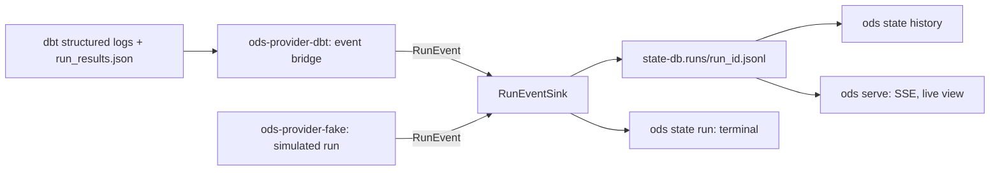

# ADR-0024: Run events, per-node run stats and the run journal

- **Status:** Proposed
- **Date:** 2026-09-29
- **Issues:** #322 (live run view), #318 (Run pages), #320 (values removed from diagnostics), #321 (`.last-run.json`)
- **Deciders:** @n1ckyb

## Context
ODS only learns what a run did when the executor returns its
[report](0014-executor-contract-and-state-run.md) at the end: one status per node, and
a completion time to the second. It records no start times, durations, rows or thread,
so the Run pages (#318) show placeholders, and nothing can show a run while it is still
going. #322 asks for a live view of a run on the DAG, with each node's stats, in the
terminal, in `ods state history` and in `ods serve`.

The constraints:
- **No vendor logic in core** (AGENTS.md rule 1): the events and stats are ODS's own
  vocabulary. How an engine reports its progress (dbt's structured logs, a remote
  runner's API) stays in its provider. Whether an executor can report progress at all is
  a capability ([ADR-0006](0006-plugin-sdk-and-capabilities.md)).
- **Conservative defaults** (rule 3): a stat the engine didn't report is missing, never
  zero. Rows affected varies most: many engines report nothing for views or merges, and
  some report `-1`. A node the engine didn't report on never reads as a success.
- **Canonical state is replaced only on success** (rule 5): whatever records a run's
  progress must not become a second source of state.
- **Explainability** (rule 4): a failed node needs a short reason people can read.
- **Secrets** (rule 9): engines' messages quote the SQL and values they failed on,
  which can hold anything a query resolved, credentials included. `--vars` values are
  already kept out of `.last-run.json` (#321); events must not bring them back.
- **Clean room** (rule 8): only public dbt schemas.

## Options considered
### Option A: read the engine's own artifacts after the run
Parse `run_results.json` (and dbt's log file) when the run ends, in the CLI.
Pros: no contract change. Cons: nothing is live; the CLI learns dbt's formats (rule 1);
another engine can't take part.

### Option B: a streaming callback on the `Executor` contract, with a neutral event vocabulary (chosen)
The executor reports neutral events to a sink the host passes in, as they happen.
Pros: live; one vocabulary for every engine, tested by conformance; hosts (terminal,
journal, server) share it. Cons: one more contract surface, and each provider has to
bridge its engine's progress reporting.

### Option C: a separate event-bus contract (`EventSink`, #8) that executors publish to
Pros: general. Cons: #8 isn't designed yet; a run's events need the run's own id and
scope, and the host wants them per execution, which a per-call sink gives directly.
A later event bus can subscribe to the journal (below) instead.

## Decision
### The event contract (`ods_sdk::contracts::run_events`, executor contract 0.4)
`Executor::execute_with_events(request, sink)` does what `execute` does, and reports the
run's events to the `RunEventSink` as they happen. It has a default implementation, so
the executor contract goes from 0.3 to 0.4 without every executor changing.

Each event is a `RunEvent`: `schema_version` (1.0), the `run_id` (the report's), the
`scope` (the request's new `ExecutionRequest::scope`, e.g. `shop/dev`, passed through
untouched), `at` (to the millisecond: `ods_core::state::TimestampMs`, since
`Timestamp` is to the second) and one `kind`:

| Kind | Fields | When |
|---|---|---|
| `run_started` | `nodes` (requested, in order), `mode`, `live` | first, once |
| `node_queued` | `node` | the node waits to run |
| `node_started` | `node`, `thread` | it starts |
| `node_finished` | `node`, `stats` | it ends, however it ends; once per requested node |
| `check_finished` | `check`, `covers` (sorted), `status` | a check (e.g. a data test) ends |
| `run_finished` | `outcome` (`succeeded`, `failed`, `unknown`) | last, once, also when the execution errors after it started |

`check_finished` is a sixth kind beyond #322's five: the executor contract keeps checks
apart from nodes (ADR-0014), and a node's test counts can only come from the checks
that cover it.

Rules every executor follows, checked by the conformance suite (three new cases, 14 in
all):
- events are emitted in order, their times never go backwards, and all carry the same
  run id and the request's scope;
- every requested node finishes exactly once, with the status the report gives it; node
  events come queued, started, finished; nothing about a node follows its finish; node
  events name only requested or reported-unrequested nodes;
- a success has no error, a node starts before it finishes, and error summaries quote
  nothing;
- a node the engine didn't know never finishes as a success; the run's outcome is
  `succeeded` exactly when the report says it succeeded.

### Per-node stats (`NodeRunStats`)
| Stat | Type | Missing means |
|---|---|---|
| `status` | `queued`, `running`, `success`, `error`, `skipped`, `unknown` | — (`unknown` is never read as success) |
| `started_at`, `finished_at` | `TimestampMs` | not recorded |
| `duration_ms`, `compile_ms`, `execute_ms` | `u64` | not timed; `took_ms()` falls back to end − start only when both were recorded |
| `rows_affected` | `u64` | not reported; a negative count from the engine is not reported |
| `adapter` | sorted map, string → string | nothing else reported |
| `thread` | string | not said |
| `error` | `ErrorSummary` | — |
| `tests` | passed / failed / warned / skipped counts | no checks ran |
| `blocked_by` | sorted node ids | not known which upstream failure stopped it |

"Kept earlier build (not selected)" is not an executor status: the executor never sees
nodes the plan reused. Hosts add it from the plan.

Adapter extras come through by the engine's own key, so core names none (rule 1). A
value is kept only as a single line, cut to 120 characters, and a node keeps at most
16; providers pass only scalars, and drop keys that are free-text status messages or
that the stats already carry (rows affected).

### Error summaries
`ErrorSummary::from_message` is the only way to make one: the first non-blank line of
the engine's message, cut where a SQL statement starts, with quoted spans (`'…'`,
`"…"`, `` `…` ``, `$$…$$`) and standalone numbers replaced by `[value removed]`,
control characters dropped, and at most 200 characters; plus the error's kind when the
line starts with one (`KeyError`, `Binder Error`), and optionally where the full message
is (a log file). The redaction lives in `ods_core::redact`, which configuration errors
(ADR-0005) now share. #320 made analyzer diagnostics name the construct instead of
quoting SQL; engine messages can't be rewritten that way, so they are redacted.

### The `run_events` capability, and the fallback
An executor that reports events as they happen advertises `run_events`. Without it, the
default `execute_with_events` runs `execute` and then reports the events rebuilt from
the report (`events_from_report`): the run, each node's status, completion time and
error summary, and each check. Nothing the report doesn't say is filled in: no start
times, durations, rows, extras or thread. `run_started.live` says which it was, so a UI
can say "no live stats" instead of showing gaps as zeros. An executor with the
capability may still fall back for one run (e.g. the dbt executor, when the user tells
dbt to log in another format), and says `live: false` then; without the capability,
`live` is never true. The run is still recorded either way. If the execution fails to
start, there are no events.

### The run journal
`ods state run`, `seed`, `snapshot`, `build` and `test` append every event of a run
that executes to a journal beside the state database:
`<state-db>.runs/<run_id>.jsonl`, the same `run_id` as `.last-run.json` and the
snapshot the run commits.
- **Format:** JSON Lines, one `RunEvent` per line, each carrying its `schema_version`,
  so a reader needs no header. The file is created when `run_started` arrives (never
  overwriting an existing one), and each line is written and flushed as its event
  arrives, so `ods serve` can tail it while the run goes. A reader skips a last line
  that doesn't parse (a run killed mid-write), and refuses lines with a version it can't
  read (`SchemaVersion::can_read`).
- **Evidence, not state** (rule 5): nothing reads a journal to decide what to build or
  reuse. A failed or partial run keeps its journal, and canonical state is still
  committed only from the report, on success. Losing the journals loses history, never
  correctness.
- **Names:** a run id is used as a file name only if it is 1 to 128 characters of
  ASCII letters, digits, `-`, `_` and `.`, not starting with `.`. Otherwise the run has
  no journal, with a warning.
- **Failures:** a journal that can't be written warns once and the run goes on; a run
  doesn't fail because its evidence couldn't be kept.
- **Retention:** the 50 most recent journals per state database are kept (by
  modification time); older ones are deleted when a new run starts. The journal of the
  run starting is never deleted. The number becomes a configuration setting when
  someone needs another (`state.runs.keep`), and `ods state history` says when a run's
  journal is gone.

### Privacy
Events have no field for SQL, the command line, variables or the environment. Error
summaries and adapter extras are redacted and cut as above. `.last-run.json` keeps
redacting `--vars` values (#321); the journal never holds options at all. The dbt bridge
(#322 part 2) reads dbt's structured log events and `run_results.json` only for the
fields listed here, and never copies a log line's text except through
`ErrorSummary`. A test runs a build with a sentinel in `--vars` and checks it reaches
neither the journal nor the output.

## Consequences
- Positive:
  - Every run gets per-node evidence that outlives the terminal, whatever the engine.
  - The terminal, history, JSON output and dashboard share one vocabulary and one fold
    (`RunSummary::from_events`), so totals such as "at least N rows" are computed once.
  - Missing stats are typed as missing all the way to the page.
- Negative / trade-offs:
  - The executor contract is 0.4: out-of-process executor plugins must be rebuilt.
  - Journals grow with the number of nodes; retention by count bounds the files, not
    their size.
  - Error summaries lose context (identifiers in quotes, numbers); the full message
    stays in the engine's log, which the summary points to when the provider knows it.
  - Timing is only as good as the engine's: the fallback has none.
- Follow-up issues:
  - #322 part 2: the dbt event bridge, the journal writer, terminal output and
    `ods state history`.
  - #322 parts 3–4: the Run page's stats, and `ods serve`'s SSE stream and live view.
  - A `state.runs.keep` setting, when needed.

## References
- #322, #318, #320, #321; [ADR-0006](0006-plugin-sdk-and-capabilities.md) (capabilities,
  conformance); [ADR-0013](0013-state-snapshots-fingerprints-and-store.md) (state);
  [ADR-0014](0014-executor-contract-and-state-run.md) (executor contract).
- The design: `docs/design/dashboard/README.md`, "Live run on the DAG, with follow mode
  (#322)", and `docs/design/dashboard/boards/live-run/`.
- dbt's public `run_results.json` schema, and dbt's structured logging (`--log-format
  json`) event documentation.
