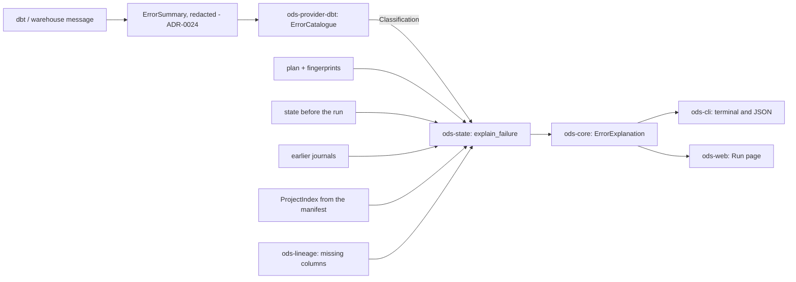

# ADR-0025: Explaining failed nodes: a neutral taxonomy, provider pattern catalogues and evidence joins

- **Status:** Proposed
- **Date:** 2026-09-30
- **Issues:** #323 (explain dbt errors), #322 (run events and journal), #320 (values removed from messages), #181 (`ods doctor`)
- **Deciders:** @n1ckyb

## Context
When a node fails, people get dbt's (or the warehouse's) text: a kind, an adapter
message, a compiled path, and no hint of what changed. ODS knows things the engine
doesn't: what changed since the last successful build (the plan and fingerprints),
which columns each model reads and produces (column lineage, [ADR-0008](0008-column-level-lineage.md)),
the project's macros and files (the manifest), the versions of upstream data
([ADR-0022](0022-delta-table-versions-as-source-evidence.md)), and how each node did in
earlier runs (the run journal, [ADR-0024](0024-run-events-node-stats-and-run-journal.md)).
#323 asks for a plain-language explanation of each failed node, built on that evidence,
in the terminal, the JSON output and the dashboard (board 9 of the live-run canvas).

The constraints:
- **No vendor logic in core** (AGENTS.md rule 1): core can't match dbt's, DuckDB's or
  Databricks' text. Whether a provider can explain its engine's errors is a capability
  ([ADR-0006](0006-plugin-sdk-and-capabilities.md)).
- **Conservative** (rule 3): an error ODS doesn't recognise must not get a guessed
  cause, and inference must not read as fact.
- **Explainability** (rule 4): each explanation carries its reasons and their sources,
  as text and JSON.
- **Presentation apart from logic** (rule 7): view models in the CLI and the web layer.
- **Clean room** (rule 8): patterns come from public text: dbt-core's messages, the
  adapters' documented errors, Apache Spark's and Delta Lake's error classes.
- **Secrets** (rule 9): engine messages quote SQL and values. ADR-0024 keeps only a
  redacted summary; explanations must not bring anything back.

## Options considered
### Option A: classify in core with regular expressions over the raw message
Pros: one place. Cons: vendor text in core (rule 1); reads the raw message, which
holds values (rule 9); every adapter change is a core change.

### Option B: an LLM reads the message and explains it
Pros: covers everything. Cons: guesses (rule 3), needs the raw text (rule 9) and a
key, and isn't deterministic or testable. Kept for later (M6, "Ask the ODS agent"),
clearly labelled, grounded in the same evidence.

### Option C: a neutral model in core, pattern catalogues in providers, evidence joins in a module (chosen)
Providers classify the redacted summary into a neutral taxonomy; a pure function in
`ods-state` joins that classification with ODS's own evidence and derives how sure it
is. Pros: rule 1 and rule 9 hold by construction; deterministic; each pattern is tested
on a recorded message. Cons: coverage grows one pattern at a time; unrecognised errors
stay unexplained (by design).

## Decision
### The model (`ods_core::failure`)
An `ErrorExplanation` (schema version 1.0) has: the node; a **category**; a
**symptom** when a pattern recognised the error; the **confidence**; the pattern that
matched (catalogue, version, id); a **headline** and a sentence under it; the
**evidence** (each item with its source and whether it *confirms* the pattern); the
**location**; **suggestions** (text and commands to copy); the **impact** (blocked
nodes, and which keep an earlier build); and the engine's own (redacted) message.

**Categories** (the chip on a failed node): `compilation`, `dependency` (dependency or
ref), `database` (database or SQL), `permission`, `timeout` (timeout or lock),
`python_model`, `test_failure`, `configuration` (configuration or profile),
`internal`, `unknown`.

**Symptoms** (what a recognised error means, whatever engine said it):
`missing_column`, `missing_relation`, `unknown_macro`, `missing_ref`,
`template_syntax`, `packages_missing`, `permission_denied`, `type_mismatch`,
`constraint_violation`, `dependent_objects`, `query_timeout`, `lock_conflict`,
`warehouse_unavailable`, `profile_not_found`, `credentials_missing`,
`python_exception`, `test_failed`. Each has a category by default and a neutral
headline.

**Confidence**, exactly as designed:
- `known_pattern_with_evidence`: a pattern recognised it and ODS's own evidence
  confirms it;
- `known_pattern`: a pattern recognised it, nothing of ODS's confirms it;
- `not_recognised`: no pattern did.

The confidence is **derived, never set**: only `ExplanationBuilder::build` makes an
explanation, and it computes the confidence from whether a pattern matched and whether
an evidence item *confirms*. An unrecognised error gets no symptom, no confirming
evidence and its category's neutral headline ("The warehouse rejected the query"),
whatever the caller passes: what ODS knows is shown as context ("What ODS knows"), never
as a cause. Its detail and suggestions are the caller's (the joins below only add the
fixed "ODS doesn't recognise this error…" sentence and generic steps for it). An
explanation read back from JSON has its confidence derived again, so edited JSON
can't claim more.

**Text is narrow.** Explanation text is fixed wording, numbers and *code spans*
(backticks in JSON) that only hold ASCII letters, digits and `_ . - /`, at most 200
characters; anything else (so `:`, `@`, `=`, `+`, `$`: URLs with passwords,
`key=value`) reads `[name hidden]`. A command is a fixed template of the caller's own
(which may hold `--flag`, `=` and `&&`, never `$`) whose placeholders take arguments
of the same narrow characters; any other command is dropped. The node id and the
engine's name are checked the same way. The names come from ODS's own evidence (the
project's node, column and macro names, run ids, paths), never from the engine's
message, whose only trace is its redacted summary. This narrows what can get in; it
isn't a proof: a long token made only of those characters could still pass as a name,
which is why names never come from an engine's text. Evidence items may also carry
their facts as data (`data`: the missing columns, or the undefined macros) for machines
(rule 4).

### The provider contract (`ods_sdk::contracts::error_catalogue`, 0.1)
A provider with the new **`error_explain` capability** implements `ErrorCatalogue`:
- `catalogue()`: its name, version and the engine's name (who "said" a message);
- `classify(&ErrorSummary) -> Classification`: `Recognised(PatternMatch)` (a stable
  pattern id, the symptom, the category, the engine's own steps, and optionally an
  identifier-shaped subject such as a Python exception's type), or
  `NotRecognised { category }` with only the category the engine's kind implies.

`classify` reads only the `ErrorSummary` of ADR-0024 (kind and redacted first line),
never the raw message or SQL, so a pattern can neither match on nor leak a value. It is
pure and deterministic. The catalogue's **version** changes with any pattern, and every
explanation names the catalogue and version that made it.

A provider also describes the project for explanations as a `ProjectIndex`: each node's
source and compiled files, its language, the macros its code calls that the project and
its packages don't define (with their lines), and every macro the project defines. The
dbt provider counts a call only when it is a plain name that isn't a macro or part of
dbt's documented Jinja context (`ref`, `set`, `zip_strict`, `load_relation`, …), or a
dotted name whose namespace is a package that defines macros; a method on a value
(`cols.append(…)`) says nothing about macros. A Python exception is named only when it
is one of Python's built-in exceptions.

`ErrorSummary` gains one optional field, `line`: the line the engine reported in the
code it ran (e.g. DuckDB's `LINE 25:`). A line number isn't a value; the SQL echo line
itself is still never kept. Older journals read as before.

The **fake** (`ods-provider-fake::FakeErrorCatalogue`) and the **conformance suite**
(`ods_sdk::conformance::error_catalogue`, five cases) come with the contract: the
catalogue advertises the capability; the provider's recorded samples classify as
declared; classification is deterministic; unknown text is never recognised, and
without a kind the category is `unknown`; and no classification quotes anything, with
a sentinel from the raw message never coming back.

### The dbt catalogue (`ods-provider-dbt::error_catalogue`, version 1)
Patterns over the summary's kind and lowercased message, each grounded in public text
and, for dbt and DuckDB, recorded from a real dbt 1.10 + DuckDB run
(`fixtures/dbt/jaffle-ods/capture-errors.sh`, `artifacts/dbt-1.10-errors/`):
- dbt-core: an undefined macro (`'x' is undefined. This can happen when calling a macro
  that does not exist`), a ref to a missing node, packages not installed, a missing
  profile or target, Jinja syntax errors, a Python model's failure (the exception type
  and its line are kept from the traceback's last lines), a failed test;
- DuckDB: missing columns (`Binder Error`), missing tables and views (`Catalog Error`),
  conversion, constraint, dependent entries, write-write conflicts, file locks,
  permission and interrupt errors;
- PostgreSQL's documented messages (missing column or relation, permission denied,
  statement timeout, invalid input, unique and not-null violations, dependent objects,
  password authentication, connection);
- Apache Spark's public error conditions (`UNRESOLVED_COLUMN`,
  `TABLE_OR_VIEW_NOT_FOUND`, `CAST_INVALID_INPUT`, `DATATYPE_MISMATCH`) and Delta Lake's
  `DELTA_CONCURRENT_*` classes, which Databricks reports.

Anything else is not recognised. A missing scalar function (DuckDB's `Scalar Function
with name … does not exist`) is deliberately left unrecognised: it isn't a macro, and
ODS has no evidence to say more.

### Evidence joins (`ods_state::explain_failure`)
A pure, synchronous function of `FailureFacts`: the classification, the node's
summary and stats, the run, the plan, the state committed before the run, earlier runs
(newest first), the project index, and column lineage facts. Evidence **confirms** a
pattern only when it shows the same thing independently:
- **missing column** ← column lineage: the node reads a column its upstream no longer
  produces, and the upstream's column copied from an input of that name (the rename:
  "`stg_customers` now outputs `given_name`, not `first_name`"). `ods-lineage` answers
  this (`ColumnGraph::missing_columns`); the SQL analyzer now names the columns it
  couldn't resolve against a known table (`QueryLineage::unresolved`, never a column
  alias of the select list) instead of only giving up. It never guesses: an upstream
  whose columns aren't known says nothing. It confirms only with **exactly one**
  candidate whose upstream was rebuilt successfully in this run, or whose committed
  build is the code there is now; several candidates, or one from a stale upstream,
  are listed as context;
- **undefined macro** ← the project index: **exactly one** call in the node's code
  isn't among the project's macros; with several, they are listed as context and
  none is named in the headline. Did-you-mean from macros within two edits, and then
  first, before installing packages;
- **missing relation** ← state and run: an upstream that has never been built and
  didn't build in this run.

Context for any failure, recognised or not: how long it ran and in which phase; whether
its code changed since its last successful build (plan and fingerprints); whether an
upstream changed in this run and was rebuilt; new upstream data since its last build,
with the versions; and its history ("it failed the same way in 2 of its last 5 runs",
"it built fine in its last N runs"). **Impact:** the nodes that the engine said it
blocked, or skipped nodes it said nothing about that the plan puts downstream; and which
of them keep their last good build (rule 5).

**Suggestions** are real commands only: the ones in ODS's CLI reference
(`ods lineage impact --column <upstream unique id>.<column>=removed`, which resolves
whatever the names; `ods state retry --failed`, with `--state-db` when the run used a
state database from a flag or the environment, and only for the last run, which is
what it retries; `ods doctor`) and the engine's own from the provider (`dbt deps`,
`dbt debug`). `ods lineage impact --column …=removed` now accepts a column that is
already gone when some node still reads it, so the suggestion works after the failure.

### Computed on read, never stored
Explanations are computed when shown, from what ODS keeps anyway (the journal, the
state, the manifest, lineage), never written into the journal or the state. Older runs
are explained with the current catalogue, and a better catalogue explains them better.
Right after a run, the plan it used is known; for `ods state history --run`, a plan is
rebuilt from the states before and after the run (what the run changed), and the
project as it is now provides the manifest and lineage. That evidence confirms only
when the manifest was written by that run (dbt's invocation id is the run id); for any
other run it is context, worded "as the project is now", since the code may have
changed since. A command that fails before
any node runs (e.g. `dbt compile` in the prepare step) is explained from the error dbt
printed, found by its header, with the manifest that command wrote. Only errors from
that step are: once dbt started building, an error isn't shown as "nothing was built",
and its hint names the run's journal instead.

### Surfaces
- **Terminal:** `ods state run`, `build` and `test` show "Why it failed" for each failed
  node (headline, category, confidence, evidence with its source, where, impact, what to
  try with commands, and dbt's redacted message); `ods state history --run` too. A
  command that failed before running shows the explanation with outcome
  `failed_before_running`.
- **JSON:** a `failures` array of `ErrorExplanation`s in the same results.
- **Dashboard:** the Run page's Nodes tab and the Runs side panel render the same model
  as board 9 (#323 part 2).

### Failed tests (amended 2026-10-02, #323)
A failed check (data test) is explained too, from its `check_finished` event (failing
rows and redacted message, ADR-0024 1.1) and the project:
- **What it tests:** `IndexedNode::check` (`CheckTarget`: the kind of test, the column
  and the node it is declared on; error-catalogue contract **0.2**). The dbt provider
  reads them from the manifest's `test_metadata.name` (with its `namespace`),
  `column_name` and `attached_node` (a singular test: the one node it reads), never
  `test_metadata.kwargs`, which hold values such as the ones `accepted_values` accepts.
  A column given as an expression isn't identifier-shaped and is left out. dbt names a
  generic test after its arguments (`accepted_values_orders_status__completed__…`), so
  an explanation names a check by kind, column and node, and uses a test's own name only
  for a test the provider marks `singular` (dbt: no `test_metadata`, a test named by its
  file); any other test without a kind ODS can show is "a test". A generic test gets no
  compiled file, which dbt names after the test.
- **Its handle, not its id:** for the same reason, an explanation's `node` for a check
  is its handle, `ods_core::failure::check_handle`: `check-` and the first 12 hex digits
  of the SHA-256 of the check's id. It is derived in ODS's neutral core from the id
  alone, so it is the same for the same check in every run, on every surface (the
  terminal, `--output json`, the dashboard and its API) and for every engine, and keys
  and de-duplicates failed tests there; it says nothing about the test. `RunSummary`
  keeps each check's id for explaining (`checks`), but never serializes it, so
  `ods state history --run` doesn't show it.
- **Every surface uses the handle** (amended 2026-10-04, #323): besides explanations,
  `--output json`'s `execution` lists checks by their handles (`checks_failed`, and each
  node's and source's `checks_failed`, `checks_skipped` and `checks_passed`: the same
  arrays of strings, a handle where the id was, so a failed test's entry matches its
  explanation's `node`, whose `check` says what it tests); the terminal names each
  failed or skipped check by what it tests (`ods_state::describe_check`, the same
  description explanations phrase: "`not_null` on `orders.customer_id`", a singular
  test by its own name, otherwise "a test on `orders`" and its handle); and the live
  stream sends a `check_finished`'s `check` as its handle. Without the project index a
  check is named by its handle, never its id. The journal on disk keeps the id
  (ADR-0024): it is the key to the engine's own records of the test, which sit beside
  it and hold the same arguments, and changing what a persisted field means would be a
  format break for no gain in what is kept.
- **Failing rows:** the check found rows when the catalogue recognises its message as a
  failed test (`dbt-test-failed`), or, with no message ODS recognises, when the engine
  counted failing rows (ODS's own pattern `ods`/`check-failing-rows`, from the event's
  structured count, not from text). The headline: "The `not_null` test on `customer_id`
  of `orders` failed: 5 rows don't pass", or "…; dbt didn't say how many rows don't
  pass", never 0. Category `test failure`; the reported count **confirms** it
  (`known pattern + evidence`), otherwise `known pattern`.
- **Errored checks:** a check whose message is another recognised error (e.g. a missing
  column in the test's query) is explained like a node's error, with "the test …
  couldn't run, so it says nothing about the data yet", never as rows that failed. With
  no message and no count, it is `not recognised`, category `test failure`, headlined
  "A test failed" (not "this node": the node is the test).
- **Warned checks** aren't explained: they failed nothing.
- **Context:** what the project declares it tests; whether the tested node changed in
  this run, or, when the run didn't build it, the last build ODS recorded for it ("The
  last build ODS recorded for `orders` is from run `b6802661`": what ODS knows, not
  which build the test read); how the same check did in earlier runs ("This test failed
  in 2 of its last 3 runs too"); the nodes downstream of the tested node that were
  skipped. **What to try:** first what the provider's pattern offers for running it
  again (`PatternMatch::rerun`: an engine argument passed after `--`, with what it
  does; ODS builds the command, with `--state-db` when needed). dbt's `dbt-test-failed`
  offers `--store-failures`, which keeps the failing rows in the warehouse:
  `ods state test --select <node> -- --store-failures`. Then, for any engine,
  `ods state test --select <node>`. ods-state names no engine option itself (rule 1).
- A node that failed only because its checks did (as in `ods state test`, where nothing
  is built) is explained by its checks, not as a failed node (`ods_state::failed_nodes`,
  `failed_checks`).
- `ErrorExplanation` 1.1 adds `check` (`covers`, `test`, `column`) and the evidence data
  `failing_rows` and `test_target`; `node` is the check's handle. The terminal labels it
  "failed test: not_null on orders.customer_id", and the dashboard shows it under each
  node it checks (`failed_tests`), or, for a check the engine didn't say the nodes of
  (or of nodes the run didn't run), in the Run page's "Failed tests" section
  (`failed_tests` on the run).

### Did-you-mean for refs and `ods doctor` as evidence (amended 2026-10-04, #323, #181)
- **A ref to a missing node** gets did-you-mean, as an undefined macro does: the
  project's nodes that others refer to by name (`IndexedNode::referable`, error-catalogue
  contract **0.3**; the dbt provider marks models, seeds and snapshots) within two edits
  of the name the ref used, at most three, closest first, then by name, each name once.
  The redacted summary removes that name, so the dbt provider reads it from dbt's whole
  message when a command failed before running (`ProjectFailure::missing_node`, from
  `depends on a node named '<name>' … which was not found`, identifier-shaped only) and
  `DbtErrorCatalogue::classify_project` sets it as the pattern's subject (catalogue
  version **3**). It is only compared, never shown: an explanation still names only
  the project's own nodes. The suggestion ("Did you mean `customers`? … a guess from the
  names, not evidence of a typo") confirms nothing. dbt writes no manifest when a ref
  can't be resolved, so the names come from the manifest it wrote last. Only the `node`
  form of the message is read: a missing `source()` (`depends on a source named …`) is
  not in the recorded messages, so it isn't matched.
- **`ods doctor`'s local checks are evidence** for a missing profile or target
  (`profile_not_found`) and missing credentials (`credentials_missing`), from a new
  source, `EvidenceSource::Doctor` (`doctor`, shown `[ods doctor]`), with the check's id
  and status as data (`EvidenceData::DoctorCheck`); `ErrorExplanation` **1.2**. The CLI
  runs only checks that don't run dbt, connect or write: `config.load` and, for
  credentials, `config.values` (when the command has the configuration at hand: after a
  failure before running), and `config.resolution`, with the `profiles_dir`, `profile`
  and `target` ODS gives dbt and where each came from. Their wording is ODS's, with names
  in code spans, and doctor output holds no secret (ADR-0023). ods-state receives them as
  neutral `DoctorFinding`s (`FailureFacts::doctor`: id, status, text, and the symptom the
  host says a finding shows on its own); a finding **confirms** only when it shows the
  symptom the catalogue recognised. `config.resolution` now warns (`ODS-W0510`) when the
  profiles directory ODS gives dbt has no `profiles.yml`, which shows that no profile can
  be found and so confirms `profile_not_found`; ODS checks the file's presence only and
  still never reads it (rule 9), so a profile missing *from* the file stays
  `known_pattern`. `ods state history --run` runs no checks (the configuration may have
  changed since), and nor does the dashboard's explainer.

## Consequences
- Positive:
  - A failed node says what went wrong, why ODS thinks so and what to try, in the same
    words in every surface, and never more than the evidence supports.
  - Vendor text stays in providers; a new adapter adds patterns and a fixture, not core
    code.
  - Old runs benefit from new patterns, since nothing is stored.
- Negative / trade-offs:
  - `ods-state` now depends on `ods-sdk` (for the run events and catalogue types it
    reads), as modules may (ADR-0001).
  - Coverage is only as good as the catalogue; many errors stay `not_recognised` until
    someone records them.
  - Explaining a past run uses the project as it is now: evidence from the manifest or
    lineage may describe a later version of the code. The text says "now" where it
    matters, and a rebuilt plan says only what the states show.
  - The reported line is a line of the code the engine ran (which adapters wrap), not
    of the source file; ODS shows it as such and maps back to the source only where it
    knows the line itself (an undefined macro's call).
- Follow-up issues:
  - Patterns for more adapters (Snowflake, BigQuery, Databricks SQL warehouses) with
    recorded fixtures. (dbt 1.11 and 1.12 are now recorded as well as 1.10, and every
    recorded message is checked on each: 1.12 rewords the missing-packages error, which
    the catalogue's version 2 recognises.)
  - ~~Hiding check ids that hold a generic test's arguments where ODS still shows
    them~~ (closed 2026-10-04): see "Every surface uses the handle" above. The journal
    on disk keeps the id, deliberately (ADR-0024).
  - ~~`ods doctor` checks as evidence for configuration errors~~ (done, amended
    2026-10-04). Still open: telling a profile or target missing from `profiles.yml`
    without reading it (e.g. from `dbt debug`'s structured output), dbt's default
    profiles locations (the working directory, then `~/.dbt`) when no directory is
    named, and doctor evidence on the dashboard and for `ods state history --run`.
  - Did-you-mean for a missing `source()`, once its message is recorded from real dbt.
  - "Ask the ODS agent to investigate" (M6) and an MCP tool `explain_failure`.

## References
- #323, #322, #320; [ADR-0006](0006-plugin-sdk-and-capabilities.md),
  [ADR-0008](0008-column-level-lineage.md), [ADR-0013](0013-state-snapshots-fingerprints-and-store.md),
  [ADR-0024](0024-run-events-node-stats-and-run-journal.md).
- The design: `docs/design/dashboard/README.md`, "Failed node: the error explained
  (#323)", and `docs/design/dashboard/boards/live-run/ErrorExplained.dc.html`.
- dbt-core's public error messages; DuckDB's error types; PostgreSQL's error messages;
  Apache Spark's `error-conditions.json` and Delta Lake's `delta-error-classes.json`.
