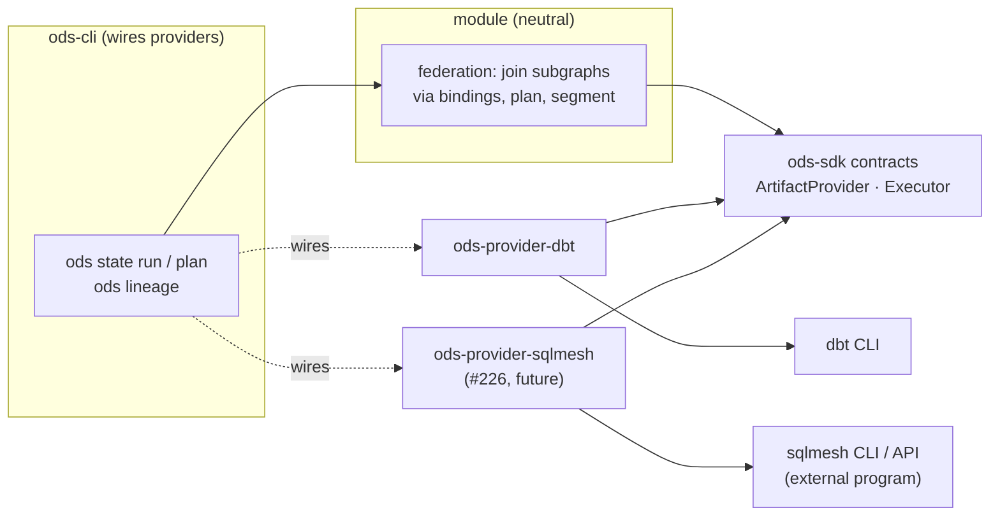

# ADR-0027: A federated build graph across project formats (dbt, SQLMesh, …)

- **Status:** Proposed. Exploratory and unscheduled: this records a direction so that
  earlier contracts (#12, #226, #86) don't close it off. Nothing here is built. It isn't
  planned before v0.1.0 or before a SQLMesh project provider (#226) exists.
- **Date:** 2026-10-05
- **Issues:** none yet. Related: #12 (`ArtifactProvider`), #226 (SQLMesh provider and
  front-end), #86 (Mesh resolver), #91 (cross-platform mapping), #124 (multi-repo
  discovery)
- **Deciders:** @n1ckyb

## Context
The idea from the maintainer: a developer uses dbt for most models because of feature
*y*, but wants SQLMesh for a few others, such as interval-based incrementals or virtual
environments. Today that means two projects, two CLIs, two DAGs and a gap between them.
Nothing builds the SQLMesh models before the dbt models that read them. Nothing notices
when a SQLMesh change should rebuild dbt models downstream, and no lineage view shows
both. Could ODS treat the projects as **one graph**, so that `ods state run` builds
across them and lineage crosses the boundary?

Most of what's needed is already in the architecture:

- **The planner is neutral** (rule 1, ADR-0006). It plans over nodes, fingerprints and
  evidence from providers, and nothing in it says "dbt".
- **Execution goes through a contract** (ADR-0014). An `Executor` builds a requested
  set of nodes and reports what succeeded. Nothing prevents a second executor.
- **Lineage reads compiled SQL** (ADR-0008). Any tool that can render the SQL it would
  run, as SQLMesh can, can feed the same column-lineage engine.
- **Cross-project resolution is already on the roadmap**, for dbt projects only (Mesh,
  #86, #91, #124). This ADR is the same problem when the projects use different
  formats.
- **ADR-0015** already plans a SQLMesh provider and front-end (#226).

### Prior art and why it falls short
- **One tool loads the other's format.** SQLMesh can load dbt projects. You get one
  graph, but the dbt models run with SQLMesh's semantics and you lose dbt-only
  features. Losing those features is the reason to keep both tools.
- **Orchestrators** (Dagster asset graphs, Airflow with Cosmos) wire tools together at
  the task or asset level. They order the work, but they don't plan reuse across the
  boundary, explain why something rebuilds, or trace lineage column by column. They
  also need a server to be useful.
- **dbt Mesh** connects projects across repositories, but only dbt projects.

ODS can offer one explainable plan, reuse and column lineage across tools from the CLI,
with no orchestrator server.

### Market risk
Fivetran owns SQLMesh (Tobiko Data) and has announced a merger with dbt Labs. The two
tools may converge, or one may become legacy. A dbt↔SQLMesh bridge alone could
therefore lose its point. The general idea holds either way: large organisations run
several build tools against one warehouse (dbt, Databricks declarative pipelines and
notebooks, plain SQL scripts, Dataform). This ADR is written for N project formats, with
dbt + SQLMesh as the first pair.

### Constraints
- **Rule 1.** Stitching and planning must not branch on tool names. Each tool's
  differences are capabilities of its provider.
- **Rule 3.** A cross-tool edge is only as good as its evidence. Name matching alone is
  an inferred edge and is shown as one. An ambiguous match is refused, never guessed.
- **Rule 4.** Each cross-tool decision explains which project, binding and evidence
  caused it ("`orders` (dbt) builds because `events.sessions` (SQLMesh) changed:
  table version 41 → 42").
- **Rule 5.** A federated run that fails partway must not replace any project's last
  good state. Successful nodes commit as they do today (ADR-0014).
- **Rule 6.** A cross-tool binding is a lineage/DAG edge, not an ERD relationship.
- **Rule 8.** SQLMesh is Apache-2.0. ODS uses its public CLI, its documented Python API
  as an external program, and the SQL it renders. ODS doesn't vendor or link SQLMesh
  code.
- **The tools' own planners stay authoritative inside their projects.** SQLMesh has
  its own state, change categories (breaking or non-breaking) and interval backfills.
  ODS must not second-guess them inside a SQLMesh project, only coordinate across the
  boundary.

## Options considered

### Option A: don't. Pick one tool, or use SQLMesh's dbt loader
- Pros: no work. Avoids a hard problem in a market that may consolidate.
- Cons: leaves the gap. Users who need both keep stitching them together with
  orchestrators and lose explainable reuse and lineage across the boundary.

### Option B: ordered invocation (orchestrator-lite)
The user lists projects in order. `ods` runs each tool's whole build in that order.
- Pros: cheap, and nothing to infer.
- Cons: no graph. It can't interleave (dbt → SQLMesh → dbt), can't skip the downstream
  project when nothing upstream changed, and gives no lineage across. It is a worse
  Makefile.

### Option C: translate one format into the other
Compile SQLMesh models into dbt models, or the reverse, and run one tool.
- Pros: one engine at run time.
- Cons: same loss of features as SQLMesh's dbt loader, plus the burden of keeping up
  with two languages. It moves ODS toward reimplementing the tools, against rule 8 in
  spirit.

### Option D: a federated graph of project subgraphs (proposed direction)
Each project's provider contributes its own subgraph, with the warehouse relation each
node reads and writes. ODS joins the subgraphs with **bindings** (cross-project edges
with evidence), plans over the union, and runs the plan as **segments**. A segment is
a connected run of nodes owned by one project, handed to that project's executor.
- Pros:
  - Reuses what exists: providers, the `Executor` contract, the neutral planner,
    lineage. Most new work is stitching and scheduling segments.
  - Each tool keeps its own semantics inside its segment. ODS doesn't reimplement
    either tool.
  - Lineage, impact analysis and "why does this rebuild?" cross tools with no extra
    work once the graph is joined.
  - It generalises to dbt Mesh (#86): several dbt projects are the same problem with
    one format.
- Cons:
  - Environments are hard (see below).
  - Interleaved graphs mean several tool invocations per run, each with start-up
    cost.
  - A tool that can't build an exact node set (capability absent) reduces what ODS can
    promise for its nodes.

## Decision
**Proposed direction: Option D.** Treat each project (of any supported format) as a
subgraph from its provider. Join subgraphs only through bindings with recorded
evidence. Plan once over the joined graph, and run it as per-project segments through
each project's `Executor`, with the tool's own planner still authoritative inside its
project. No contract is fixed by this ADR. The concepts below say what M2 contracts
should leave room for.

### Concepts
- **Project.** A named project with a format and a provider (`core`: dbt at `dbt/`;
  `events`: SQLMesh at `sqlmesh/`). A node's ID becomes `project:node`. With one
  project, the prefix is implied and nothing changes for current users.
- **Relation identity.** For each node and target, every provider reports the
  warehouse relations it **writes** and **reads** (`catalog.schema.table`). This is the
  neutral join key and the one new requirement on `ArtifactProvider` (#12): report
  relations resolved for the target, not only names.
- **Binding.** An edge from a node that writes relation R in project P to a node that
  reads R in project Q. Evidence, strongest first:
  1. *declared*: configured, or in tool metadata (a dbt source's `meta.ods.produced_by`);
  2. *matched*: exactly one node in all projects writes the resolved relation the
     reader reads, in the same target. Shown as inferred until confirmed;
  3. *ambiguous*: zero or several writers. No edge is created, the reader's input
     counts as an external source, and `ods doctor` (ADR-0023) reports it.
- **Segment.** A maximal connected run of planned nodes in one project with no
  other project's nodes between them. Segments run in topological order, and
  independent segments run in parallel.
- **Environment mapping.** Per ODS target, the environment each project uses
  (`dev` → dbt target `dev`, SQLMesh environment `dev`). Relations resolve through it.
  If a dbt dev model would read a SQLMesh *prod* table because no mapping exists, ODS
  refuses the run (rule 3).

### Planning across the boundary
- Inside a project, the tool's own semantics decide. For SQLMesh, ODS passes on
  SQLMesh's own plan (what's due, change category, backfill intervals). It doesn't
  replace it.
- Across a binding, ODS's evidence decides. A downstream node is invalidated when its
  upstream segment builds or its bound relation changes. Changes are detected from
  fingerprints and table versions (ADR-0022), as for sources today.
- Capabilities decide how much ODS promises:
  - `exact_selection`: the executor builds exactly the requested nodes. Without it,
    ODS treats the project as a whole (all of it or none of it) and says so.
  - `owns_state`: the tool keeps authoritative state of its own. ODS records the run
    as evidence but doesn't claim to decide what that project reuses.
  - `renders_sql`: needed for column lineage across the binding.

### Running
- Segments are executed with ADR-0014's semantics: commit what succeeded, and never
  replace a project's last good state on failure. A failed segment skips everything
  downstream of it in every project. The report names the failed segment.
- Run events (ADR-0024) carry the project, so the run journal and playback show one
  run across tools.

### CLI and configuration (illustrative only)
```toml
[[projects]]
name = "core"
format = "dbt"
path = "dbt"

[[projects]]
name = "events"
format = "sqlmesh"
path = "sqlmesh"

[[bindings]]                      # optional: declared beats matched
writer = "events:analytics.sessions"
reader = "core:source:events.sessions"

[targets.dev.environments]
core = "dev"                      # dbt target
events = "dev"                    # SQLMesh virtual environment
```
- The native CLI is federation-aware: `ods state run -s events:sessions+` crosses into
  `core`. Graph operators follow bindings.
- Front-ends (ADR-0015) stay single-tool. `dbt build` through the front-end touches only
  the dbt project, so a script that means "run dbt" never starts running SQLMesh.



Where federation lives is open: in `ods-state` (planning) or a new module crate. Either
way it depends only on `ods-sdk` (ADR-0001), and only the CLI knows which providers
exist.

### Phasing (each phase is useful alone, lowest risk first)
1. **Read-only lineage across projects.** Joined DAG and column lineage in
   `ods lineage` and the dashboard. Needs relation identity and a read-only SQLMesh
   provider. Builds nothing, so it's the safest proof that the idea works.
2. **Plan across projects.** `ods state plan` explains what would rebuild in every
   project and why. Users still run each tool themselves.
3. **Segmented execution.** `ods state run` builds across tools.
4. **Environment mapping** beyond one shared target, including SQLMesh virtual
   environments.

### Signs it has legs, and signs to stop
- Go: users actually run more than one build tool against one warehouse (ask before
  phase 2). A read-only SQLMesh provider can report resolved relations and rendered SQL
  through public interfaces. Phase 1 lineage is used.
- Stop or rethink: dbt and SQLMesh merge into one tool with one project format. Then
  aim the same design at other formats (Databricks declarative pipelines, plain SQL),
  or fold it into Mesh (#86) for dbt-only use.

## Consequences
- Positive:
  - One plan, one run, one lineage graph across build tools, explained node by node.
    No orchestrator or tool loses its native features.
  - It pushes useful neutrality into earlier contracts: resolved relation identity in
    #12 helps Mesh (#86), Unity Catalog lineage (#170) and impact analysis even if
    federation never ships.
  - Mesh (#86) becomes a special case of the same mechanism.
- Negative / trade-offs:
  - Environments across tools are the hardest part and may need per-pair rules.
    SQLMesh's virtual environments have no direct dbt equivalent.
  - Several invocations per run add latency. Interleaved graphs are slower than either
    tool alone.
  - Two tools' state systems coexist. ODS must stay clear that SQLMesh's state is
    authoritative for SQLMesh models.
  - Support load grows with every format pair and version combination.
- Follow-up issues (not to open until the go signals above):
  - #12: providers report resolved read/write relations per target (worth doing
    regardless).
  - #226: split into read-only SQLMesh provider (graph, rendered SQL, relations) and
    executor.
  - Federated graph and bindings: config, evidence, `ods doctor` checks for ambiguous
    or unbound relations.
  - Federated lineage view (phase 1).
  - Segment scheduler and cross-tool run report (phase 3).
  - ADR on environment mapping (phase 4).

## Open questions
- Is a node ID `project:node` enough, or do two dbt projects with the same package name
  need more (Mesh has the same question)?
- Should the SQLMesh provider call `sqlmesh` as a CLI, or through a small Python shim
  run as an external program (ADR-0002: Python as a thin consumer)? Its CLI output
  isn't a versioned artifact like dbt's `manifest.json`.
- How should SQLMesh's interval semantics (backfill 3 days) appear in an ODS plan that
  thinks in nodes?
- Is a single ODS state scope per federated target right (ADR-0017), or one scope per
  project plus a federated run record?

## References
- ADR-0001, ADR-0006, ADR-0008, ADR-0014, ADR-0015, ADR-0017, ADR-0022, ADR-0023,
  ADR-0024
- Roadmap M7 (Mesh) and M8 (#226)
- SQLMesh (Apache-2.0): <https://github.com/TobikoData/sqlmesh>
