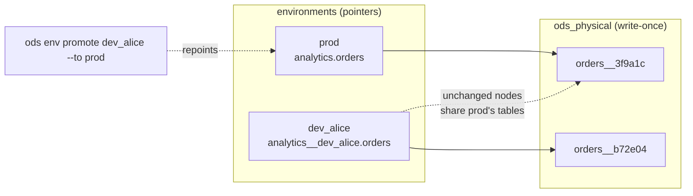

# ADR-0028: Open data environments: versioned physical tables, environments as pointers

- **Status:** Proposed. Exploratory and unscheduled: this records a direction, and
  nothing here is built. Pieces of it are already on the roadmap as separate issues
  (#29, #30, #114, #120, #195); this ADR gives them one design. It isn't planned before
  v0.1.0.
- **Date:** 2026-10-05
- **Issues:** none yet. Related: #29 (REUSE/DEFER/CLONE abstraction), #30 (Databricks
  shallow clone), #114 (dev environment cloning), #120 (deployment/promotion), #195
  (environment parity, `ods env diff`)
- **Deciders:** @n1ckyb

## Context
SQLMesh's best-known feature is its virtual environments:

1. Each version of a model is written once to a **physical table named after its
   fingerprint**, and never overwritten.
2. An **environment** (`prod`, `dev_alice`, `pr_123`) is a schema of **views**
   pointing at the physical tables for the versions it uses.
3. A model that hasn't changed is **shared** between environments, so a dev
   environment only builds what changed.
4. **Promoting** to prod repoints prod's views at the tables dev already built. Prod
   rebuilds nothing, and promotion is quick and reversible.

dbt has environments in a weaker sense. A *target* is a separate schema that you build
into. `--defer` lets a dev build read prod's tables for models it didn't build. There
are no versioned physical tables, so nothing is shared by content and nothing is
promoted. Prod rebuilds what dev already built, and rolling back means rebuilding the
old code. Other tools (plain SQL, notebooks, Databricks declarative pipelines) have
less than that.

The maintainer's question: could ODS provide environments like these as an **open
layer that any build tool can use**, rather than a feature of one tool?

ODS already has much of the machinery:

- **Fingerprints** (ADR-0013): a reproducible content identity for every node, which is
  what you need to name physical tables.
- **Reuse** is the State module's job: the planner already decides what can be reused
  and why.
- **Pointing dbt at chosen relations** (ADR-0020): ODS already writes a dbt state
  directory whose nodes point at relations it chooses, which dbt reads with
  `--defer-state`.
- **Relation existence before reuse** (ADR-0016) and **Delta table versions**
  (ADR-0022) supply evidence about physical tables.
- **An environment name is already part of the state scope** (ADR-0017: `--environment`,
  defaulting to the dbt target). This ADR makes that name refer to a real, separate
  environment, not only a label on state.
- The federated graph (ADR-0027) needs every tool to share the same environments. This
  is the layer that would provide them.

### Constraints
- **Rule 1.** How an environment points at a table (views, clones, catalog branches,
  …) is a capability of the warehouse provider. How a node is told where to write is a
  capability of the build tool's provider. Core never names either.
- **Rule 3.** Anything ODS can't version safely is opted out and built the usual way.
  Dropping a physical table is destructive: it needs proof that nothing references it,
  a retention period, and a dry run by default.
- **Rule 4.** `ods env diff` and `ods env promote` explain every pointer change: node,
  version, fingerprint, and why it changed.
- **Rule 5.** Promotion is all or nothing from ODS's point of view. A failed promotion
  leaves the target environment's last good pointers recorded and restorable.
- **Rule 9.** Grants and credentials are referenced, never copied into environment
  records.
- **Adoption.** Teams already have prod tables with real names and real readers. ODS
  must adopt them as they are, and must let a team leave without being stuck with
  hashed table names.

## Options considered

### Option A: keep targets, make them cheaper (clone-only)
Dev environments are zero-copy clones of prod (Databricks shallow clone #30, Snowflake
and BigQuery clones) plus building what changed. Promotion is still "rebuild in prod".
- Pros: small, and no change to how prod is laid out. Already half planned (#30, #114).
- Cons: no versioned tables, so no promotion without rebuilding, no rollback by
  pointer, and nothing is shared between dev environments by content.

### Option B: delegate to tools that have environments
Use SQLMesh's environments for SQLMesh projects, and nothing for dbt.
- Pros: no new mechanism.
- Cons: dbt users, most of ODS's users, get nothing. Federation (ADR-0027) still has
  no shared environment.

### Option C: an ODS environment layer for any tool (proposed direction)
ODS owns the mapping *node version → physical table* and *environment → pointers*. Build
tools write each changed node to a physical location ODS chooses, and environments
point at those locations with the best mechanism the warehouse supports.
- Pros:
  - Same environments, promotion, rollback and diff for every tool, including dbt.
  - Builds on fingerprints, reuse and relation evidence ODS already has.
  - Gives ADR-0027 its shared environments.
  - Promotion without rebuilding is a direct saving in time and compute, which is
    State's core pitch.
- Cons: it is invasive (it changes where prod tables live), incremental models are
  hard, and several dbt features assume they own a fixed table (see below).

## Decision
**Proposed direction: Option C, in phases, with Option A's clones as one pointer
strategy among several and the fallback of building in place always available.** No
contract is fixed by this ADR.

### Concepts
- **Node version.** A node plus its fingerprint (ADR-0013). Same fingerprint, same
  version, same physical table.
- **Physical table.** Where a node version's data lives, in a schema ODS manages, named
  from the node and a short fingerprint digest (`ods_physical.orders__3f9a1c`). Written
  once, never overwritten.
- **Environment.** A named set of pointers, one per node, from the name readers use
  (`analytics.orders` in prod, `analytics__dev_alice.orders` in dev) to a physical
  table. It is also the state scope of ADR-0017: the same name, now naming something
  real.
- **Pointer strategy.** How the warehouse provider makes a name point at a physical
  table. Offered as capabilities and picked with `ods_core::choose`, roughly in this
  order of preference:
  1. a catalog branch or tag (Iceberg/Nessie, lakeFS);
  2. a zero-copy clone (Databricks shallow clone, Snowflake, BigQuery);
  3. an atomic swap or rename;
  4. a view;
  5. **fallback:** build in place, as today. Always available.

  The choice may differ per node: a node read by a streaming consumer can't sit behind
  a view.
- **Write redirection.** A build tool's provider declares whether it can build a node
  into a location ODS chooses. dbt can: ODS supplies the schema and alias per node
  (through a small macro package or generated config) and points `ref()` at the
  environment's tables with a state directory, as in ADR-0020. A tool without this
  capability isn't versioned. Its nodes build in place, and its environments are
  targets as today.
- **Delegation.** A tool with its own environments (SQLMesh) declares it, and ODS maps
  ODS environments onto the tool's environments instead of managing that tool's tables.

### Commands (illustrative only)
```sh
ods env create dev_alice --from prod   # pointers only: nothing copied or built
ods state run --environment dev_alice  # builds changed nodes into new physical tables
ods env diff dev_alice prod            # per node: same / changed version / only in one
ods env promote dev_alice --to prod    # repoint prod; builds nothing
ods env rollback prod                  # restore the previous pointer set
ods env gc --dry-run                   # physical tables no environment references
ods env eject prod                     # make prod's tables real again, then stop managing it
```

### What is opted out, and built in place as today
Default rule: if a node depends on owning a fixed table, it builds in place in each
environment and the plan says why.
- **Snapshots** (SCD2): their history lives in one table and can't be versioned per
  fingerprint.
- **Incremental models** in phase 1 (see below).
- **Materialized views and streaming tables**, and any node whose readers need table
  features a view lacks (change data feed, streaming reads, time travel), unless the
  warehouse offers a non-view pointer.
- **Hooks that use `{{ this }}` in ways ODS can't redirect**, until shown safe.

### Incremental models (the hard part)
A new version of an incremental model means rebuilding all of its history into a new
physical table, which can be huge. SQLMesh answers this with *forward-only* changes,
applied in place to the current table instead of creating a new version. ODS would
need the same:
- phase 1: incrementals are opted out;
- later: a change marked forward-only (by the user, or provably additive, such as a
  new nullable column) applies to the existing physical table and keeps its version
  history; any other change builds a new version, and the plan states the backfill
  cost before running.

### Cleanup
- A physical table is referenced by any environment's current or retained previous
  pointers.
- `ods env gc` only drops unreferenced tables past a retention period. It is a dry run
  unless `--apply` is given, and it re-checks references just before each drop.
- Grants are applied to pointers and physical tables from the project's config, never
  copied by hand.

### Adopting existing prod, and leaving
- **Adopt:** `ods env adopt prod` records today's prod tables as version 1 of each
  node, in place. Nothing is moved, and readers notice nothing. The next changed node
  is written to a physical table, and its prod name starts pointing at it.
- **Eject:** `ods env eject prod` turns every pointer back into a real table with the
  reader-facing name (by clone or copy). ODS then stops managing it. Teams worried
  about lock-in can try this before adopting.



Layering: environment planning (versions, diff, promotion, gc) is neutral and lives in
`ods-state` or a new module crate. Pointer strategies live in warehouse providers, and
write redirection in build-tool providers, all through `ods-sdk` contracts (ADR-0001).

### Phasing
1. **dbt on Databricks, table models only.** Physical tables named by fingerprint,
   pointers by shallow clone or view, `create`, `diff`, `promote`, `rollback`,
   `adopt`, `eject`. Incrementals, snapshots and streaming are opted out. Also
   replaces #114's cloning.
2. **Cleanup** with retention and reference checks (`gc`).
3. **Forward-only changes and versioned incrementals.**
4. **More pointer strategies** (catalog branches, swaps) and **more tools**, including
   delegation to SQLMesh's own environments, which ADR-0027 builds on.

### Risks and signs to stop
- Phase 1 has to show that dbt can reliably build a node into a chosen schema and
  alias with no change to the user's models, including custom `generate_schema_name`
  macros. If it can't, write redirection for dbt fails, and this falls back to
  Option A.
- If the views or clones change query performance or BI behaviour enough that users
  opt most nodes out, the feature isn't worth its complexity.
- Every opt-out shrinks the benefit. If a typical project's important nodes are mostly
  incrementals and snapshots, phase 1 helps little until phase 3, so measure that on
  real projects before starting.
- It competes directly with SQLMesh's headline feature. The pitch is "the same
  environments for every tool", not "SQLMesh's environments, again".

## Consequences
- Positive:
  - Promotion without rebuilding, rollback by pointer, cheap dev and PR environments,
    and per-node environment diffs, for dbt and later for any tool.
  - One design for #29, #30, #114, #120 and #195, instead of five separate features.
  - Gives ADR-0027 (federation) the shared environments it lacks.
- Negative / trade-offs:
  - ODS takes over where prod tables physically live. A bug in pointer management can
    point prod at the wrong data, so `diff`, dry runs and rollback come first.
  - More warehouse objects, more storage until cleanup runs, and more permissions
    (create schemas and views, clone, drop).
  - Several dbt features need explicit rules or opt-outs, and these must be kept up to
    date as dbt changes.
  - Forward-only changes and incrementals are a large problem of their own.
- Follow-up issues (not to open until phase 1 is scheduled):
  - Spike: build dbt nodes into ODS-chosen schemas and aliases, and point `ref()`
    there, on the demo project and on a project with a custom `generate_schema_name`.
  - Physical table naming, and the environment record as a persisted format with a
    `schema_version` (an ADR of its own).
  - Pointer strategy capabilities in the Databricks provider (#30).
  - `ods env` commands; `adopt` and `eject` first.
  - Reframe #29, #114, #120 and #195 against this ADR.

## Open questions
- Is the environment record part of the state store (ADR-0013, ADR-0018), or a separate
  store? It's tied to state but is changed by promotion, which isn't a run.
- How are grants and row filters or column masks carried over when a name points at a
  new physical table?
- Should PR environments be created by `ods ci` (M4) automatically, and cleaned up when
  the PR closes?
- Does ADR-0017's state scope become exactly the environment, or can several state
  scopes share one environment?

## References
- ADR-0006, ADR-0013, ADR-0016, ADR-0017, ADR-0020, ADR-0022, ADR-0027
- Roadmap M2 (#29, #30), M8 (#114, #120), M10 (#195)
- SQLMesh virtual environments (Apache-2.0, design only; no code used):
  <https://github.com/TobikoData/sqlmesh>
