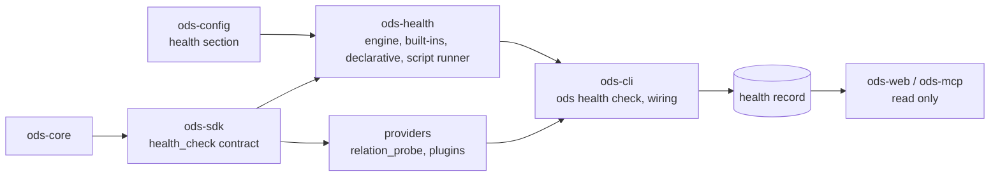

# ADR-0030: Configurable and pluggable health checks

- **Status:** Accepted (2026-10-06). Phases 1 and 2 are built (#392): the `ods-health` crate and `[health]` for the built-in checks; the `health_check` contract 0.1 with its fake and conformance suite, `ods health check` and the health record (`<state db>.health/<time>-<n>.json`, the newest 20 kept). As built, a finding's evidence is a map of key to value, sorted by key, rather than the list sketched in §1. The dashboard reads the newest record for its scope: it works the built-ins out live and takes every other check's findings from the record, with its time (`health_recorded_at`). Declarative checks (`[[health.checks]]` with `require`, phase 3) are built: they run in-process like the built-ins, so the dashboard works them out live too, and the `health_check` contract is 0.2 (`NodeFacts` says whether a node is described, its tests' types and its constraints). Coverage targets (`[health.coverage.<measure>]`, phase 3) are built too: the engine judges the measures a host gives it, and the dashboard and `ods health check` give it Home's coverage, so a missed target shows on Home and, at `error`, fails the gate; it never changes a node's badge. The record format is 1.1 (a `declarative` source, and the report's `coverage` verdicts). Phase 4, first half: the trust store and `ods health trust` (§4b, §4d), and probe checks configured, checked as read-only SQL (§4a) and trusted. Phase 4, second half, in part: `relation_probe` 0.2 (§5: neutral `ProbeTarget`s, a timeout, and statements run only against the requested targets' relations, which the dbt provider passes to `dbt show` by id, several calls for a long list), the `relation_privileges` contract 0.1 and capability with its fake and conformance suite, and the engine running probes through a `ProbeConnection` the host wires in, built from one object that both probes and reports its login's privileges, so the login checked is the login the query runs under: the login check just before each probe (§4c), `pass` judged on the row, and the `--allow-elevated-login` override's `login_check: overridden` evidence and the report's `elevated_login`, which the record keeps. `ods health check` runs probes through dbt on `[health.probes]`'s `target` (and `profile`), never the build's, with `--allow-elevated-login`; dbt probes sources, models, seeds and snapshots (a node's `alias`), matching columns whatever their case. dbt can't report privileges, so until a provider does, every probe needs the override. As built: the trust digest also covers `[health.probes]`'s `target` and `profile` and the dbt `program`, `project_dir`, `profiles_dir` and `profile` that configuration sets; a node with no relation in the manifest is never probed; sources aren't in health's scope, so a probe naming them is a configuration error and one that selects nothing is reported (`unmatched_probes`) and fails `--strict` at `error`; and a project file that sets them makes even the user's own probes need trust; a probe target equal to the build's is a configuration error; a probe reads only the relation the build made (`ProbeTarget::expecting`, the manifest's `relation_name`), and a node dbt resolves elsewhere under the probe target is *unknown* before anything runs; the override warns on stderr before anything runs, with the report, and in `--json` as `ODS-W0704`, naming the connection (`dbt target …`). Not built yet: Unity Catalog's `relation_privileges` (4); scripts (5), plugins (6).
- **Date:** 2026-10-06 (amended 2026-10-06: least privilege for probes, §4c; the trust store and probe configuration as built, §4d)
- **Issues:** #392 (this design), #354 (the first badges), #117 (scoring and trends), #387 (external providers), #9 (policy)
- **Deciders:** @n1ckyb

## Context
#354 gave the dashboard health badges and coverage from real signals. Its rules are fixed in
code:
- which checks run;
- which kinds of node need tests;
- what counts as a warning.

Teams differ. One wants every mart described, another wants a `unique` test on every primary
key, and a third wants to know that a table received rows in the last six hours. Users should
be able to:
1. **tune** the built-in checks: turn them on or off, change their severity, scope them,
   and set their parameters;
2. **declare** their own checks in configuration over what ODS already knows;
3. **probe** the warehouse with read-only checks;
4. **script** any check they can write, for experts;
5. **plug in** checks others ship, as with every other ODS contract (ADR-0006).

#117 asks for a "scoring policy configurable" health model with "every score decomposed into
visible evidence"; this ADR is its foundation.

Constraints:
- **Rule 1:** no vendor logic in core. Warehouse probes go through a contract (ADR-0022's
  relation probe), never through a vendor's SQL in the engine.
- **Rule 3:** a check that can't run (disabled data, a timeout, a crash, a missing
  capability) gives **unknown**, never **pass**. Unknown is never shown as healthy.
- **Rule 4:** every finding names its check, where the check came from, and its evidence, as
  text and JSON.
- **Rule 9:** a script or probe never receives a resolved secret through ODS. A probe runs
  on the connection the provider already has.
- **The dashboard stays read-only and offline** (ADR-0009): it never runs a script or a
  query. It reads results recorded by the CLI.
- **Configuration** follows ADR-0005: layered `ods.toml`, unknown keys are errors, and
  credentials are only ever references.
- **Executing commands named in a repository's config** is a supply-chain risk: cloning a
  repository and running `ods` shouldn't run its scripts unasked.

## Options considered
### Option A: Keep fixed rules, with a few config flags
Expose a handful of booleans (e.g. `require_tests_for = ["model"]`) and leave the rest in code.
- **Pros:** small, with no new contract, crate or format.
- **Cons:** every new need is an ODS release. It doesn't meet the probe, script or plugin
  needs, and #117 would have to replace it anyway.

### Option B: A general policy language (Rego/CEL) for health
Express every check as a policy in an embedded language, evaluated by #9's policy framework.
- **Pros:** one language for health and for approvals (#9), and very expressive.
- **Cons:**
  - Probes and scripts still need a separate mechanism.
  - It adds a large dependency and a language most dbt users don't know.
  - #9 is M6 and not built.
  - Policies about *actions* (allow, deny, approve) and checks about *data* (pass, warn,
    fail) are different shapes.

### Option C: One check engine with tiered sources, a contract, and recorded results (chosen)
Every check, whatever its source, implements one `HealthCheck` contract and yields per-node
findings. The CLI runs the engine and records the results; the dashboard and MCP read them.
Sources are tiered from simple to expert: built-in, declarative, probe, script and plugin.
- **Pros:**
  - Each tier is useful alone, and they all share severity, scoping, evidence and storage.
  - It is pluggable by construction, the dashboard stays read-only, and #117 can score over
    the recorded findings.
- **Cons:**
  - A new crate, contract and persisted format.
  - Scripts need a trust model.

## Decision
Health checks are one engine with five check sources, all behind one contract, configured in
`[health]`, run by the CLI, and recorded for the dashboard.

### 1. Findings
A check yields, for each node (or source) in its scope, a **finding**:

```json
{ "check": "tests.required", "source": "builtin", "node": "model.shop.orders",
  "status": "fail", "severity": "warn",
  "reasons": ["no tests: nothing checks its data"],
  "evidence": [{"kind": "tests", "value": "0"}], "observed_at": "…" }
```

- **`status`** is one of `pass`, `fail`, `unknown` or `skipped`:
  - `unknown` means the check couldn't decide;
  - `skipped` means the node is out of the check's scope.
- **`severity`** is the configured weight of a `fail`: `error`, `warn` or `info`.
- **A node's badge** is computed from its findings by the **badge rule**:
  - by default, any `fail` at `error` makes it *failing*;
  - else any `fail` at `warn`, or any `unknown` from an enabled check, makes it *warning*;
  - else, if every enabled check passed, it is *healthy*;
  - with no findings it is *unknown*.

  The rule is configurable (e.g. `unknown_counts_as = "warning" | "unknown"`), but `unknown`
  can never count as healthy (rule 3).

### 2. Sources
| Tier | Source | Who writes it | Runs where |
|---|---|---|---|
| 1 | **Built-in** checks (#354's, and more): last run failed, tests required, tests passed on this build, description, constraints, stale, source freshness | ODS | in-process |
| 2 | **Declarative**: rules over the project's metadata (`require = ["description", "test:unique"]` for a selector) | config | in-process |
| 3 | **Probe**: one read-only query with a pass condition (`select count(*) as n from {relation}`, `n > 0`), validated as read-only (§4a) | config, trusted (§4b) | through the `relation_probe` contract (ADR-0022), widened to any relation (§5), on the provider's connection |
| 4 | **Script**: any executable speaking the check protocol (§4) | experts, trusted (§4b) | a child process |
| 5 | **Plugin**: a `HealthCheck` from another crate or an external provider (#387) | anyone | registered like any provider |

### 3. Configuration
`[health]` lives in `ods.toml`, layered as ADR-0005 describes:

```toml
[health]
badge.unknown_counts_as = "warning"     # or "unknown"; never "healthy"
coverage.tests = { target = 0.8, severity = "warn" }

[health.builtin.tests_required]
severity = "error"                      # error | warn | info | off
select = { resource_type = ["model", "snapshot"], path = ["models/marts/**"] }
exclude = { tags = ["experimental"] }

[health.builtin.stale]
severity = "warn"
older_than = "24h"

[[health.checks]]                        # declarative
id = "marts.documented"
select = { path = ["models/marts/**"] }
require = ["description", "test:unique"]
severity = "warn"

[[health.checks]]                        # probe
id = "orders.has_rows"
kind = "probe"
select = { name = ["orders"] }
sql = "select count(*) as n from {relation}"
pass = "n > 0"
severity = "error"

[[health.checks]]                        # script
id = "pii.columns_tagged"
kind = "script"
command = ["python", "checks/pii.py"]
timeout = "30s"
severity = "warn"
```

- **Selectors** use the same vocabulary as the Catalog's facets, plus dbt-style paths and
  tags.
- **Check ids** are unique. A configured check can't reuse a built-in's id; it overrides one
  through `[health.builtin.<id>]`.
- **The `pass` expression** is a small, typed comparison language: column, operator, literal,
  combined with `and`/`or`. It is parsed and validated at load time. A full expression
  language waits for #117 and #9.

### 4. The script protocol
- **Request:** ODS starts `command` (never through a shell), with the project's root as
  the working directory. It writes one JSON request to stdin, with:
  - `protocol: {major: 1, minor: 0}`;
  - the check's id and its config parameters;
  - the nodes in scope, with the manifest facts ODS already exposes (ids, names, kinds,
    paths, tags, columns, tests, last builds);
  - the artifact paths.
- **Response:** the script answers with one JSON document on stdout, `{protocol, findings:
  [...]}`, using the finding shape of §1. Stderr is captured as the check's log.
- **Failure:** a non-zero exit, a timeout, malformed output, a finding about a node outside
  the scope, or an unknown protocol major gives `unknown` findings for the whole scope, with
  the reason. It is never `pass`.
- **Environment:** ODS passes no credentials and no resolved secrets. The child inherits the
  user's environment, as `dbt` would, and the docs say so.

### 4a. Probes are read-only, checked before they run
`RelationProbe` trusts its caller to send only read-only statements (ADR-0022), so the
engine is that caller and checks every probe's `sql` when the configuration loads:
- **Parser:** the CLI wires in the project dialect's SQL analyzer (`ods-provider-sqlparser`,
  the same as lineage, ADR-0008) through a small `ReadOnlyQuery` check. The engine never
  names a parser.
- **Shape:** the query must parse as **exactly one** query statement: a `SELECT`,
  `WITH … SELECT`, or a set operation of them.
- **Rejected:** anything else is a configuration error naming the check, before anything
  connects. That covers DML, DDL, `MERGE`, `CALL`, `COPY`, `SET`, `USE`, transaction control,
  several statements, `SELECT … INTO`, and anything that doesn't parse.
- **Relation:** the `{relation}` placeholder is replaced by the provider, quoted by its own
  rules (ADR-0022), never by string concatenation in the engine.
- **Limits:** results are capped at the probe's row limit, with a timeout.

Read-only isn't the same as harmless (a heavy query still costs warehouse time), so probes
are also behind trust (§4b).

### 4b. Trust: a project's scripts and probes run only once that project is trusted
A repository's `ods.toml` can name commands and queries, and cloning a repository mustn't be
enough to run them. One global switch isn't enough either: allowing scripts once would allow
every repository cloned afterwards. So trust is per project and per definition:
- **The trust store:** `ods health trust` records, in the user's own config directory
  (never in a repository), a trust entry. It holds:
  - the project's root path;
  - a digest of every script `command`, probe `sql` and their check ids, as the merged
    configuration defines them.

  Each entry says when it was made.
- **Running:** a script or probe check runs only when its project's entry exists and its
  definition's digest still matches. A changed command or query is untrusted again until
  `ods health trust` runs again, which shows what changed.
- **Untrusted:** an untrusted check records `unknown: not trusted for this project`, with
  the command to trust it. It never runs and never passes.
- **Definitions from the user's own layer:** script and probe checks defined only in the
  user's own configuration layer (ADR-0005), not in the project's files, are trusted without
  an entry, since the user wrote them.
- **`--allow-scripts`:** trusts the current definitions for one invocation, for CI, where the
  repository is the thing being checked. It is never persisted.
- **Later:** #9 can replace the trust store with a policy.

### 4c. Least privilege: a probe runs only under a read-only login (amendment, 2026-10-06)
Parsing a probe's SQL (§4a) is one guard; the login it runs under is a second,
independent one: a login that can't write can't be made to write, whatever the parser
missed. So a probe runs only when its connection can do no more than read what it probes.
- **Its own connection.** Probes run through `relation_probe`, which the dbt provider
  answers with `dbt show` on a dbt target. A project's build target can write (dbt builds
  tables), so probes name their own target: `[health.probes] target = "health_readonly"`,
  or `profile` and `target`, for a read-only principal. Without one, probe checks are
  *unknown*: they never run on the build target.
- **Checked before every probe run.** The engine asks the provider what the connection's
  principal can do on each probed relation, its schema and its catalog (or the warehouse's
  equivalents). It refuses the probe, *unknown* with the reason, when the principal:
  - holds any privilege beyond reading, e.g. `MODIFY`, `CREATE …`, `ALL PRIVILEGES`,
    `MANAGE` or `APPLY TAG` (reading means `SELECT` and the `USE`/`BROWSE` privileges
    needed to reach a relation);
  - owns the relation, its schema or its catalog;
  - is an administrator of the metastore or the account, where the warehouse says so.
- **What can't be told is refused.** A provider that can't report privileges, or a report
  that can't be read, is *unknown*, never a run (rule 3). Reporting privileges is a
  capability (`relation_privileges`) a provider advertises, so the engine never names a
  warehouse (rule 1). Unity Catalog reports them through `information_schema`
  (`table_privileges`, `schema_privileges`, `catalog_privileges`, with inherited grants,
  and the `*_owner` columns), queried through the same connection.
- **Limits, stated.** The check covers what the probe reads and its containers, not
  everything the principal can reach elsewhere: a dedicated read-only principal is the
  real control, and this check proves it is read-only where it matters. Grants can change
  between the check and the query; the check runs immediately before each probe.
- **An explicit override, for one run.** `ods health check --allow-elevated-login` runs
  probes even when the check finds more than read access, or can't tell. It is the user's
  decision, at their own risk:
  - It is a command-line flag only, never a configuration key, so a repository can't
    turn it on for whoever runs it.
  - It skips this check only: the SQL must still be one read-only query (§4a) and the
    definition still trusted (§4b).
  - Every run that uses it warns, naming the login and the privileges found, that ODS
    can't prevent a query from writing under that login, and that running it is at the
    user's own risk, with no warranty (the project's licence).
  - Every probe that ran so carries `login_check: overridden` in its evidence, in
    `--json`, the health record and the dashboard: it is never hidden afterwards.

### 4d. The trust store and probe configuration, as built (amendment, 2026-10-06)
- **Where:** `<user config dir>/ods/trust.json`, beside the user's `config.toml`
  (ADR-0005), never in a repository. It is JSON with a `schema_version` (1.0), written
  whole and renamed into place, and only by `ods health trust`.
- **What:** one entry per project, keyed by the canonical path of the directory holding
  the project's `ods.toml` (or `ods.local.toml`), with `trusted_at` and, per check id, a
  `sha256:` digest of what decides what runs: its `kind`, `sql` (or, for scripts,
  `command`), `select` and `exclude`, and, for probes, `[health.probes]`'s `target` and
  `profile`. Severity and `pass` aren't in it: changing them
  changes the verdict, not what runs or where.
- **Which definitions need it:** checks whose `[[health.checks]]` comes from a project or
  local file. The array is one setting (ADR-0005 layers replace it whole), so its source
  says which file defined every check in it; checks from the user's own `config.toml` need
  no entry.
- **`ods health trust`** lists the definitions that aren't trusted yet, with their SQL or
  command and what changed, and records the current ones; `--revoke` removes the project's
  entry. `ods health check --allow-scripts` trusts the current definitions for that run
  only.
- **A probe check** is `kind = "probe"` with `sql` (one read-only query with `{relation}`
  once), `pass` and a `select` (required: a probe never runs on every node by default); it
  can't have `require`. `pass` is a comparison of a column the query returns with a literal
  (`=`, `!=`, `<`, `<=`, `>`, `>=`; numbers, `'strings'`, `true`/`false`), combined with
  `and`/`or` and parentheses. The columns it names are the ones the probe reads. A value
  that isn't a number where the comparison needs one is *unknown*, never a pass.

### 5. The contract and crate
- **The probe contract, widened:** `relation_probe` becomes 0.2. `probe` takes neutral
  `ProbeTarget`s (an id, and the relation as the project names it), not only sources, so a
  probe check can target a model, a seed or a snapshot. Sources keep working as targets.
  ADR-0022's source-version reading moves to the new signature with no behaviour change. A
  provider that can't probe a target answers `Unknown` for it, as today.
- **Contract:** `ods-sdk` gains the `health_check` contract (0.1):
  `HealthCheck::describe() -> CheckInfo` and
  `async check(&self, scope: &CheckScope) -> Result<Vec<Finding>, ProviderError>`.
  Capabilities say what a check needs (`metadata`, `run_record`, `relation_probe`,
  `process`). It has a fake in `ods-provider-fake`, and conformance tests: every in-scope node
  answered exactly once, unknown on error, and no finding outside the scope.
- **Crate:** a new module crate **`ods-health`** holds:
  - the engine (scoping, running checks with timeouts, the badge rule, coverage);
  - the built-in and declarative checks;
  - the script runner, which is the only part that starts a process.

  Probe checks call a `RelationProbe` the CLI wires in. Like every module, `ods-health`
  depends on `ods-core`, `ods-config` (for its types) and `ods-sdk`, never on providers or
  other modules (ADR-0001).
- **Placement:** #354's logic moves from `ods-web` into `ods-health`. `ods-web` only renders.



### 6. Running and recording
- **`ods health check`** runs every enabled check and prints the findings (human, plain or
  JSON, per ADR-0003). Its exit codes follow ADR-0004, so it can gate CI:
  - **5** (check failed): the checks ran and a finding at severity `error` failed, or an
    `error`-severity check was `unknown` when `--strict` is set;
  - **1:** the command itself couldn't complete;
  - **4:** the configuration is invalid, e.g. a probe that isn't read-only.
  `--select`, `--check` and `--allow-scripts` narrow or allow.
- **Optionally**, `ods state build`/`run` run the checks after a successful run
  (`health.after_run = true`).
- **The health record:** results are written as a versioned **health record** beside the
  store, like the run journals (ADR-0024). It is `health/<timestamp>.json` with a
  `schema_version` and keeps the last N records. A failed check run never deletes the last
  record (rule 5).
- **The dashboard** reads the latest record and recomputes only the in-process built-ins
  live. It shows each node's findings by check and source, when they were recorded, and any
  check that is configured but has no record yet as *not run*.

## Consequences
- **Positive:**
  - Teams tune or extend health without an ODS release.
  - Experts can check anything with a script, and vendors or communities can ship checks as
    plugins.
  - `ods health check` gives CI a health gate.
  - #117 can score and trend over the recorded findings.
- **Negative / trade-offs:**
  - **New surface:** a new crate, contract, persisted format and command.
  - **Trust:** scripts and probes need a trust store, and users must re-trust a project
    when its checks change.
  - **Probes:** they only work where a `relation_probe` exists (Databricks today).
    Elsewhere a probe check is `unknown`, which is correct but may surprise users.
  - **Stale results:** the dashboard shows recorded results, which age. The record's time is
    always shown.
- **Follow-up issues (phases of #392):**
  1. `ods-health` crate, with #354's logic moved into it, plus `[health]` config for the
     built-ins.
  2. The `health_check` contract, fake and conformance tests, and `ods health check` with the
     health record.
  3. Declarative checks and coverage targets.
  4. The trust store (§4b), then probe checks with read-only validation (§4a) and
     `relation_probe` 0.2.
  5. Script checks.
  6. External plugins, through #387's loader.
  7. Scoring and trends (#117).

## References
- #354, PR #391: the first health badges.
- ADR-0005 (configuration), ADR-0006 (plugins and capabilities), ADR-0009 (read-only
  dashboard), ADR-0022 (relation probe), ADR-0024 (journals beside the store).
- Prior art: dbt's `dbt-project-evaluator` and `dbt-checkpoint`, which are rule sets over the
  manifest; Great Expectations and Soda, which are data checks with configurable severities.
