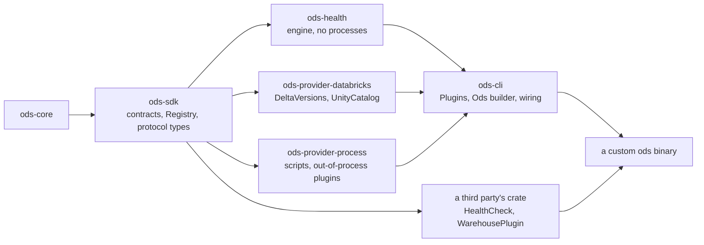

# ADR-0031: Plugins: an in-process registry and out-of-process plugins

- **Status:** Proposed
- **Date:** 2026-10-06
- **Issues:** #392 (phase 6: plugins), #387 (pluggable source-version providers)
- **Deciders:** @n1ckyb

## Context
ODS has contracts that third parties can implement. Each has a fake and a conformance
suite (ADR-0006, #99). What it doesn't have is a way to **plug the result in**:
- **Health checks:** the engine accepts any `HealthCheck` (`HealthReport::with_check`,
  ADR-0030 §5), but only code in this repository can call it. ADR-0030 lists plugins as
  tier 5, "registered like any provider", through #387's loader.
- **Source versions (#387):** `ods state build` reads Delta table versions on
  Databricks. `crates/ods-cli/src/commands/state_versions.rs` hard-codes that the dbt
  adapter `databricks` uses `DeltaVersions`. A provider for Snowflake or Iceberg can
  implement `ChangeProvider` and pass its suite, but has no way into `ods`.
- **Login checks:** `ods health check` likewise hard-codes `UnityCatalog` as the
  `relation_privileges` for `databricks` (ADR-0030 §4e).
- **ADR-0006 §2** decided `Registry` and `ProviderFactory`, which create providers
  from `[providers.<name>]` by `kind`. They exist in `ods-sdk` but are unused: the CLI
  builds every provider directly.

Constraints:
- **No vendor logic in core** (rule 1): the CLI is the composition root, and only it
  maps a project's warehouse to a provider.
- **Conservative** (rule 3): a plugin that fails, times out or answers badly gives
  *unknown*, never a pass or a reuse.
- **Secrets** (rule 9): ODS never hands a plugin a resolved secret.
- **Trust** (ADR-0030 §4b): cloning a repository must never be enough to run its code.
- **Versioning** (ADR-0006 §6, ADR-0019): a plugin built against another contract
  version is refused, not half-run.

## Options considered
### Option A: In-process only (a custom `ods` binary)
A third party writes a small binary crate that depends on `ods-cli` as a library,
registers its `HealthCheck`s and providers, and runs the CLI.
- **Pros:** type-safe. The conformance suites run as ordinary Rust tests. No wire
  protocol, no process, no trust question: whoever builds the binary chose its code.
- **Cons:** needs Rust and a custom build. Every ODS release needs a rebuild, since SDK
  0.x versions must match exactly. Not usable with the released `ods`.

### Option B: Out-of-process only (executables speaking JSON)
Plugins are executables, declared in configuration, that speak a versioned JSON
protocol over stdin and stdout.
- **Pros:** any language, and they work with the released binary.
- **Cons:** a protocol to version, trust to manage (like scripts), and the conformance
  suites must run against a subprocess. In-process Rust users pay serialization and
  lose types for nothing.

### Option C: Dynamic libraries (`cdylib`, `libloading`)
- **Cons:** Rust has no stable ABI, so a plugin must be built with the same compiler and
  the same SDK as the host. It is unsafe code, and a crash takes `ods` down. That is the
  cost of Option A without its type safety. Rejected.

### Option D: WebAssembly components
- **Pros:** sandboxed, portable, any language that targets WASI.
- **Cons:** a large runtime dependency (`wasmtime`), and WASI networking is still young.
  Most plugins here need the warehouse, which a sandbox would block. Revisit when a
  plugin needs isolation more than access.

### Option E: Both A and B (chosen)
In-process first, then out-of-process, built on the script protocol (ADR-0030 §4), so
it is designed once.

## Decision
### 1. One plugin set, two ways in
The CLI (the composition root, ADR-0001) holds a **plugin set**, `ods_cli::Plugins`,
that every command reads. It has one registry per pluggable contract:

| Contract | Registry | Selected by |
|---|---|---|
| `health_check` (ADR-0030) | health checks, by check id | always run, tuned by `[health.plugins.<id>]` (§4) |
| `changes` (ADR-0022, #387) | source-version providers, by warehouse | the project's warehouse (§3) |
| `relation_privileges` (ADR-0030 §4c) | login checks, by warehouse | the probe target's warehouse (§3) |

More contracts join the table as they become pluggable. The built-ins (Databricks'
`DeltaVersions` and `UnityCatalog`) register in it like any plugin, so the hard-coded
mappings go away.

### 2. In-process plugins: a custom `ods`
- **Library:** `ods-cli` already runs the whole CLI in-process (`app::run`). It gains a
  builder:

  ```rust
  fn main() -> std::process::ExitCode {
      ods_cli::Ods::new()                       // the built-in plugins
          .health_check(Arc::new(PiiTagged))?   // a HealthCheck
          .warehouse(SnowflakeVersions::factory())? // providers for one warehouse
          .run()                                // real args, streams and environment
  }
  ```

  The released `ods` binary is `Ods::new().run()`.
- **Registration** follows ADR-0006 §2's rules:
  - **Versions:** an in-process plugin is compiled against the same `ods-sdk` as the
    host. One built against another SDK doesn't link, since its traits are other types,
    so the compiler makes the version check. `Contract::accepts` is for out-of-process
    plugins (§5).
  - **Duplicates:** a plugin is refused when its id or warehouse is already taken. A
    custom build replaces a built-in only by saying so (`replacing`), never by
    registration order.
- **One set per process:** `Ods::run` installs the set once, as logging is set up once,
  and every command reads it. Without a custom build, the set is the built-ins.
- **Visibility** (rule 4): `ods version --json` and `ods doctor` list every plugin,
  built in or added: its contract, version, id or warehouse, and the crate that
  registered it. A custom binary never passes for the released one.
- **Conformance:** the suites already run from a provider's own tests (`docs/plugins.md`).
  An example crate outside the workspace (`examples/custom-ods`) builds a custom `ods`
  with a health check and a source-version provider, runs both suites, and is built in
  CI. That is #387's "a provider written outside this repository".

### 3. Choosing by warehouse, never by vendor in core
A warehouse plugin is a factory: given the project's **warehouse kind** (for dbt, the
manifest's `adapter_type`) and the dbt executor's `RelationProbe` (the connection dbt
already has, ADR-0022 §1), it returns the providers it offers for that warehouse.

```rust
pub trait WarehousePlugin: Send + Sync {
    fn info(&self) -> PluginInfo;                // id, contract versions, crate
    fn warehouse(&self) -> &str;                 // e.g. "databricks"
    fn changes(&self, probe: Arc<dyn RelationProbe>) -> Option<Arc<dyn ChangeProvider>>;
    fn privileges(&self, probe: Arc<dyn RelationProbe>)
        -> Option<Arc<dyn PrivilegedProbe>>;     // ods_sdk: probe + relation_privileges
}
```

- Each method has a default of `None`, so a plugin offers only what it has.
- **Selection** is an exact string match on the warehouse kind, in the CLI only. There's
  one plugin per warehouse: two plugins that both offer source versions for the same
  warehouse would make the choice depend on what was registered.
- **None** keeps today's behaviour: no source versions means `sources.json` only;
  no login check means probes need `--allow-elevated-login` (ADR-0030 §4c).
- Whatever the plugin answers still goes through the existing rules. Inexact versions
  never allow reuse (ADR-0022), and every probe must pass the login check.

### 4. Health-check plugins and their configuration
- A registered check runs, as ADR-0030 §5 describes, at its own default severity.
- **`[health.plugins.<id>]`** takes the same `severity`, `select` and `exclude` as a
  built-in (`HealthCheckConfig`). `severity = "off"` turns a check off.
- A `[health.plugins.<id>]` naming no registered check is a configuration error, with
  the ids that exist. A misspelt id must never silently drop a gate.

### 5. Out-of-process plugins: executables on the script protocol
After script checks (ADR-0030 phase 5):
- **Declaration:** `[plugins.<name>]` with `command = [...]` (never run through a shell),
  plus an optional `timeout`.
- **Handshake:** ODS sends `{"protocol": {"major": 1, "minor": 0}, "request":
  "describe"}`. The plugin answers with what it provides: each contract and the version
  it was built against, its checks' `CheckInfo`, or the warehouse it serves. A contract
  version the host can't accept refuses the plugin, with both versions named.
- **Calls:** each call is one request and one response, the script protocol's envelope
  (ADR-0030 §4). The `request` names the contract method: `check` (a `CheckScope`, giving
  `Finding`s) and `versions` (`RequestedSource`s, giving `SourceVersion`s). The JSON
  shapes are the SDK types' own serde forms, versioned by the protocol's major.
- **Failure** (rule 3): a non-zero exit, a timeout, malformed output, an unknown protocol
  major, or an answer about something not asked gives *unknown* for everything in that
  call. It is never a pass, and never a version.
- **Secrets** (rule 9): ODS passes no credentials. A plugin that needs the warehouse
  connects with its own environment, as `dbt` does. An out-of-process warehouse plugin
  therefore can't use dbt's connection. It reports its own login's privileges if it
  offers `relation_privileges`.
- **Trust** (ADR-0030 §4b): a plugin declared in a project's files runs only once
  `ods health trust` has recorded a digest of its `command`. A plugin declared only in
  the user's own configuration layer is trusted, since the user wrote it.
  `--allow-scripts` covers plugins for one run, and it is never persisted.
- **Conformance:** `ods plugin test <name>` runs the SDK's conformance suites for every
  contract the plugin describes, against the plugin as a subprocess, with the fake
  provider's fixtures. A plugin author runs it before publishing.

### 6. Where the code lives
- **`ods-sdk`** gains `PrivilegedProbe`, one object that is both a `RelationProbe` and
  `RelationPrivileges` (ADR-0030 §4c: the login checked is the login probed), and
  `RelationProbe` for `Arc<T>`, so a plugin can wrap whatever connection it's given. It
  later gains the plugin protocol's types (`ods_sdk::protocol`: the envelope,
  `describe` and the per-contract requests and responses). They are pure serde types,
  with no process.
- **`providers/ods-provider-process`** (new) holds the only code that starts plugin and
  script processes. It implements `HealthCheck` and `ChangeProvider` over the protocol.
  This **amends ADR-0030 §5**: the script runner lives here, not in `ods-health`.
  `ods-health` then starts no process, and a script check is a `HealthCheck` the CLI
  builds from configuration.
- **`ods-cli`** owns `Plugins`, `Ods`, the `WarehousePlugin` trait, and the wiring.



### 7. Phases
1. **This ADR.**
2. **In-process:**
   - `Plugins`, `Ods` and `WarehousePlugin`, with Databricks registered as a built-in;
   - `[health.plugins.<id>]`;
   - plugins listed in `ods version` and `ods doctor`;
   - `examples/custom-ods`, built in CI.

   Databricks behaves exactly as today, and its tests pass unchanged (#387's acceptance).
3. **Script checks** (ADR-0030 phase 5), in `ods-provider-process`.
4. **Out-of-process plugins:** `[plugins.<name>]`, the handshake, and
   `ods plugin test`.

## Consequences
- **Positive:**
  - Anyone can add health checks, source-version providers and login checks without
    changing ODS: in Rust, in a custom build, or in any language as an executable.
  - The hard-coded Databricks mappings become ordinary registrations, so supporting a
    second warehouse means a plugin, not an edit to the CLI.
  - One protocol serves scripts and plugins, and `ods-health` stops starting processes.
- **Negative / trade-offs:**
  - **API surface:** `ods-cli`'s library API (`Ods`, `Plugins`, `WarehousePlugin`) becomes
    a public interface. ADR-0019 adds a compatibility row for it: before 1.0, any
    release may break it, as with the SDK.
  - **Rebuilds:** in-process plugins must be rebuilt for every 0.x release.
  - **Out-of-process warehouse plugins** can't reuse dbt's connection, so they bring
    their own credentials, and their own login is what their privilege report covers.
  - **One plugin per warehouse:** two competing providers for the same warehouse can't
    both be registered. A custom build picks one.
- **Follow-up issues:** the phases in §7. #387's guidance for provider authors and its
  per-warehouse research notes stay in #387.

## References
- ADR-0001 (module boundaries), ADR-0004 (exit codes), ADR-0005 (configuration),
  ADR-0006 (plugin SDK, registries and capabilities), ADR-0019 (versioning), ADR-0022
  (Delta table versions), ADR-0030 (health checks: §4 scripts, §4b trust, §4c login
  checks).
- #387, #392, #99 (conformance suites), #9 (policy, which may later replace trust).
