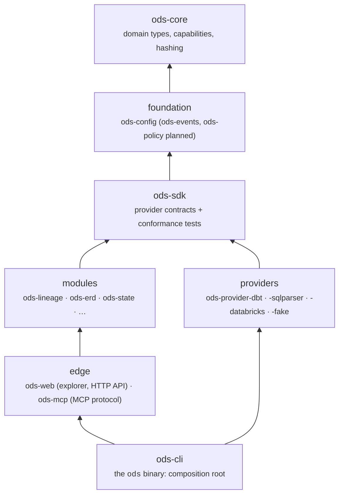
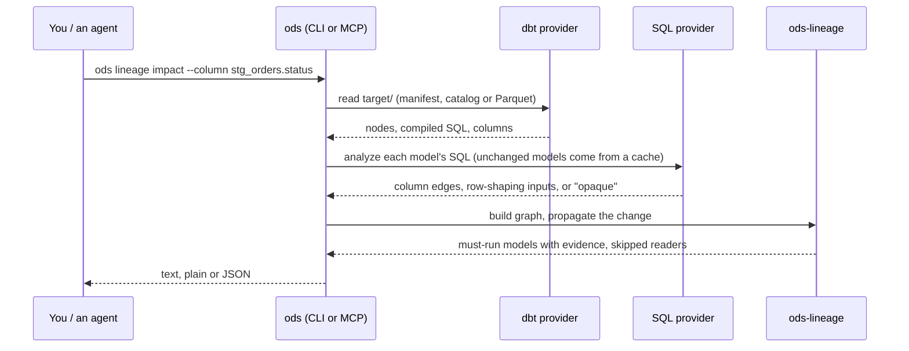

# Architecture

!!! note
    This describes the current design, which is still changing. Each decision is
    recorded in an [ADR](adr/README.md).

ODS is a Rust workspace (edition 2024). It has one binary, `ods`, and a set of
libraries with a **strict dependency direction**. A script checks the direction in
CI ([ADR-0001](adr/0001-monorepo-architecture-and-module-boundaries.md)).

- **`ods-core`**: provider-neutral domain types (nodes, columns, lineage edges), and
  capability negotiation (`ods_core::choose`, which always ends in a conservative
  fallback).
- **`ods-sdk`**: the contracts providers implement, for example reading a project or
  analyzing SQL. Each contract has a fake implementation and conformance tests that
  every real provider runs too.
- **Modules** hold the logic: lineage graph and impact, ERD building, and, later,
  State planning. They never import a provider, and never depend on each other unless
  explicitly allowed.
- **Providers** hold everything vendor-specific. That includes reading dbt artifacts
  (JSON and Parquet), SQL parsing (`sqlparser-rs`), and Databricks lineage exports.
- **Edge crates** turn module output into something a client consumes. `ods-web`
  serves the explorer and a JSON API. `ods-mcp` speaks the Model Context Protocol.
  They may use modules, but not providers.
- **`ods-cli`** is the only place that wires concrete providers into modules. It also
  owns terminal rendering and exit codes.

## How a lineage question is answered

## Technology

| Concern | Choice |
|---|---|
| Language | Rust, stable, MSRV 1.90 |
| CLI | `clap`; styled output only in `ods-cli` |
| Serialization | `serde`; persisted formats carry a `schema_version` |
| SQL parsing | `sqlparser-rs` |
| dbt v2 Parquet | `parquet` |
| HTTP (explorer) | `axum`, only in `ods-web` |
| Errors | `thiserror` in libraries, `anyhow` only in binaries |

Dependencies must have permissive licences; `cargo deny` checks this in CI.

## Determinism

Anything hashed, serialized or shown in a plan uses stable ordering, so the same
artifacts give the same output. That makes outputs easy to diff and snapshot-test.
