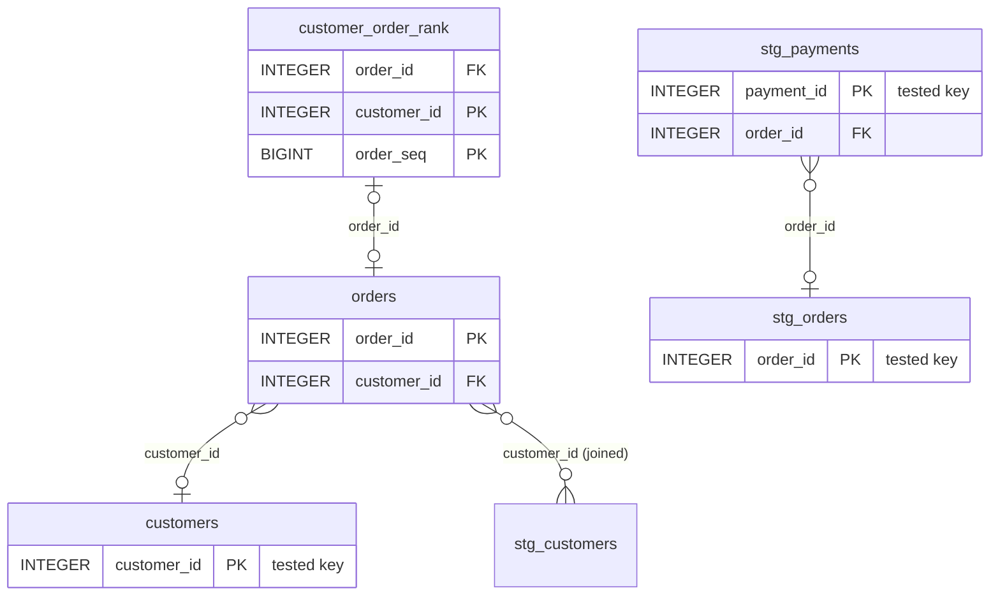

# More capabilities

!!! warning "Experimental"
    Everything on this page is a preview. Output formats will change.

## Entity-relationship diagrams

`ods erd generate` draws the keys and relationships your project already asserts, or
already uses:

- `unique` and `not_null` tests, `dbt_utils.unique_combination_of_columns`, and a
  model's `unique_key` config make keys, including keys over several columns;
- `relationships` tests and contract constraints make references;
- **joins in the project's own SQL** make references too, so projects without
  `relationships` tests still get a diagram.

Every key and relationship is labelled **declared**, **tested**, **joined** or
**inferred**. When neither side of a join is a known key, its cardinality is shown as
unknown rather than guessed. Here is the demo project's diagram, showing key columns only:



Details: [CLI reference](cli.md#entity-relationship-diagrams),
[ADR-0012](adr/0012-erd-from-tests-and-constraints.md).

## MCP server for AI agents

`ods mcp` serves the ODS engines to AI agents over the
[Model Context Protocol](https://modelcontextprotocol.io), on stdio. It is read-only
and local: it needs no login, makes no outbound network connections and collects no
telemetry. No tool writes files, runs dbt or queries a warehouse.

```sh
claude mcp add ods -- ods mcp --target-dir target
```

```json
{ "mcpServers": { "ods": { "command": "ods", "args": ["mcp", "--target-dir", "target"] } } }
```

For **analytics engineers**, the tools answer: where a column comes from, what a change
affects, which tests are missing, and where lineage is unknown.

For **people who use the data but don't know the project**, three tools help answer a
business question with SQL:

1. `ods_find_data` finds tables and columns by meaning, and says what one row is;
2. `ods_describe_entity` explains a table: its grain, columns and what it joins to;
3. `ods_plan_query` returns the most trustworthy join path and a starting SQL query,
   and warns when a join would repeat rows.

The agent writes the final query using only columns and joins those tools returned.
Always review generated SQL before relying on its results.

Details: [CLI reference](cli.md#mcp-server-for-ai-agents), [ADR-0010](adr/0010-mcp-server.md).

## State: what to build, what to reuse

`ods state plan` compares the project with its last successful build and says, per
node, **build** or **reuse**, with the reason and the evidence. That includes which parts
of a model's code changed, which upstream data is new, and whether a lag tolerance
defers it. It prints the `dbt build --select …` command for exactly what must run.
`ods state record` takes the state from the dbt runs you already do: only nodes that
succeeded advance.

```console
$ ods state plan          # after editing stg_orders and running dbt compile
decision: 8 to build, 5 to reuse

node                     action  why
raw_orders               reuse   code and inputs unchanged since run d11a1309…
stg_customers            reuse   code and inputs unchanged since run d11a1309…
stg_orders               build   code changed since run d11a1309…: compiled_sql
orders                   build   upstream code changed: stg_orders will be rebuilt
customers                build   upstream code changed: orders will be rebuilt
customer_segments        build   upstream code changed: customers will be rebuilt
segment_summary          build   upstream code changed: customer_segments will be rebuilt
…
run: dbt build --select stg_orders order_events orders customer_order_rank customers customer_segments customers_snapshot_view segment_summary
```

(Output shortened; from the demo project.)

`ods state run` does all of it: it compiles, plans, runs `dbt build` on exactly the
nodes that must build, and records the result. Nodes that fail keep their last
successful state and are built next time.

```console
$ ods state run           # after editing segment_summary
plan: 1 to build, 12 to reuse
ran: dbt build --select segment_summary …
outcome: succeeded
recorded: snapshot 2: 1 node advanced
```

Details: [CLI reference](cli.md#state-run),
[ADR-0013](adr/0013-state-snapshots-fingerprints-and-store.md),
[ADR-0014](adr/0014-executor-contract-and-state-run.md).

## dbt State configuration

`ods state policies` reads dbt's State configuration (`lag_tolerance`,
`require_fresh_data_from`, `build_after`) as you already write it, and shows each
model's effective freshness policy. It is the first piece of ODS State, the
incremental "what needs to run" planner planned for v0.1.0.

Details: [CLI reference](cli.md#dbt-state-configuration),
[ADR-0011](adr/0011-dbt-state-config-compatibility.md).
