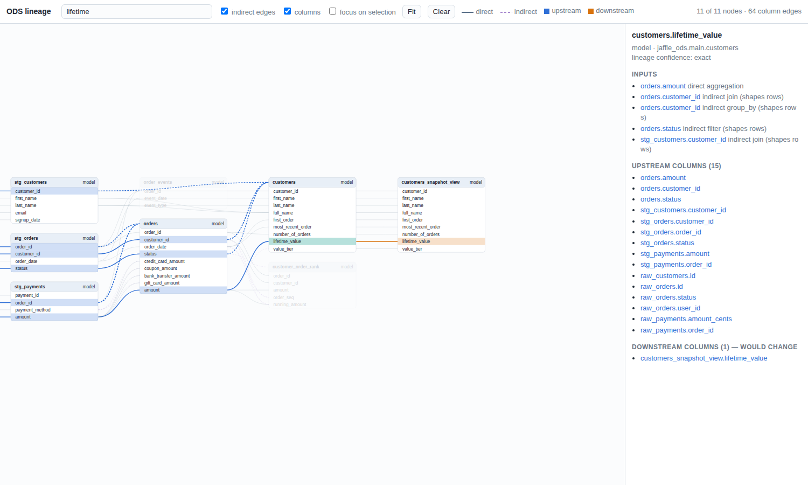

# `ods` command-line reference

`ods` is one binary with a subcommand per module. This page covers what every
command shares. Design rationale is in [ADR-0003](adr/0003-cli-presentation-boundary.md)
(output) and [ADR-0004](adr/0004-cli-framework-and-exit-codes.md) (framework, exit
codes).

## Commands

| Command | Status |
|---|---|
| `ods state policies` | available (preview): freshness policies read from dbt State configs, see [below](#dbt-state-configuration) |
| `ods state run` | available (preview): build only what needs building with dbt, and record what succeeded, see [below](#state-run) |
| `ods state plan\|record\|history` | available (preview): plan what to build or reuse, record dbt runs as state, see [below](#state-plan-record-history) |
| `ods state explain\|diff\|…` | planned: M1 State MVP (v0.1.0) |
| `ods erd generate` | available (preview): entity-relationship diagram from tests and constraints, see [below](#entity-relationship-diagrams) |
| `ods erd inspect\|validate` | planned: M3 ERD & Usage (v0.3.0) |
| `ods usage` | planned: M3 ERD & Usage (v0.3.0) |
| `ods ci` | planned: M4 ODS CI (v0.4.0) |
| `ods lsp` | planned: M5 LSP & VS Code (v0.5.0) |
| `ods agent` | planned: M6 ODS Agent (v0.6.0) |
| `ods lineage columns\|impact\|compare\|export\|graph\|view` | available (preview): column-level lineage, see [below](#column-level-lineage) |
| `ods serve` | available (preview): host the lineage explorer and its JSON API, see [below](#hosting-the-explorer) |
| `ods mcp` | available (preview): the ODS tools for AI agents over MCP, see [below](#mcp-server-for-ai-agents) |
| `ods config explain [KEY]` | available |
| `ods version` | available |
| `ods completions <shell>` | available |

Planned commands already appear in `--help`. They accept any arguments and exit with
status 3 (`ods state explain --select x` reports "not implemented", not a usage error).

## Global flags

These work anywhere on the line: `ods --json version`, `ods version --json` and
`ods state plan --json` all produce JSON. After a `--` separator, everything is taken
literally.

| Flag | Values | Default |
|---|---|---|
| `-o`, `--output` | `human`, `plain`, `json` | `human` when stdout is a terminal, otherwise `plain` |
| `--json` | shorthand for `--output json` | |
| `--color` | `auto`, `always`, `never` | `auto` |
| `--width` | columns (≥ 20) | terminal width, or 100 when not a terminal |
| `-v`, `--verbose` | repeatable: `-v` info, `-vv` debug, `-vvv` trace | warnings only |
| `-q`, `--quiet` | errors only; conflicts with `-v` | |
| `--profile` | configuration profile | `ODS_PROFILE`, then `default_profile` |
| `-h`, `--help` | help for `ods` or any command | |
| `-V`, `--version` | top level only (`ods -V`); `ods version` gives details | |

## Output and streams

- **stdout** carries results only: styled (`human`), line-oriented (`plain`), or one
  JSON document (`json`).
- **stderr** carries logs, progress and, outside JSON mode, error messages.
- In **JSON mode**, stdout always receives exactly one document, even when the command
  fails:

```json
{
  "schema_version": {"major": 0, "minor": 1},
  "command": "state",
  "ods_version": "0.1.0",
  "result": null,
  "diagnostics": [
    {
      "level": "error",
      "code": "ODS-E0003",
      "message": "`ods state` is not implemented yet",
      "hint": "planned for M1 State MVP (v0.1.0); see docs/ROADMAP.md"
    }
  ]
}
```

`result` is the command's result model on success and `null` on failure. `hint` is
omitted when there is none. One exception: a command whose partial result matters
reports both. `ods state run` that recorded some nodes but had failures carries its
report in `result` and the error in `diagnostics`, and exits 1.

Exceptions to the one-document rule:
- **Usage errors** (bad flags or an unknown command) are detected before the output mode
  is known. They are always printed as text on stderr, with exit status 2.
- **Output failures**: if writing to stdout itself fails (for example a full disk), the
  error is printed on stderr with exit status 1, because stdout can't carry it.
- **`ods completions`** always prints its shell script as-is, whatever the output mode.

## Exit status

| Code | Name | Meaning |
|---|---|---|
| 0 | success | The command did what was asked, including when stdout closes early (`ods … \| head`). |
| 1 | failure | The command could not complete: I/O, provider or internal error. |
| 2 | usage | Invalid arguments or flags. |
| 3 | not implemented | The command is planned but not available yet. |
| 4 | config | Configuration is invalid, including an unknown `ODS_LOG` value. |
| 5 | check failed | The command ran and its verdict is negative, e.g. a CI gate found blocking issues. |

The output mode never changes the exit status. These codes are a stable contract: new
meanings get new numbers.

## Error codes

| Code | Meaning |
|---|---|
| `ODS-E0001` | Writing command output failed. |
| `ODS-E0002` | Unexpected internal error. Please report it. |
| `ODS-E0003` | The command is planned but not implemented yet. |
| `ODS-E0004` | `ODS_LOG` holds an unknown log level. |
| `ODS-E0101` | A configuration file can't be read or isn't valid TOML. |
| `ODS-E0102` | Configuration schema violation: unknown key, wrong type or value out of range. |
| `ODS-E0103` | A credential is written as plaintext instead of a secret reference. |
| `ODS-E0104` | The selected profile is not defined. |
| `ODS-E0201` | dbt artifacts are missing, unreadable or an unsupported version, or lineage output can't be written. |
| `ODS-E0202` | The project graph is inconsistent (duplicate ids or relations, or a dependency cycle). |
| `ODS-E0203` | A model, column, change kind or dialect named on the command line doesn't exist. |
| `ODS-E0301` | `ods serve` can't bind its address (e.g. the port is in use) or stopped with an I/O error. |
| `ODS-E0401` | The state database can't be opened, read or written, or was written by a newer ODS. |
| `ODS-E0402` | Another run recorded state first; plan again and retry. |
| `ODS-E0403` | `run_results.json` or `sources.json` can't be read, or a State option (e.g. `--environment`) is invalid. |
| `ODS-E0404` | `ods state run`: dbt couldn't run (e.g. `dbt compile` failed), or nodes or tests failed. Successes are still recorded. |

## Environment variables

| Variable | Effect |
|---|---|
| `ODS_LOG` | Log level: `off`, `error`, `warn`, `info`, `debug` or `trace`. Overrides `-v`/`-q` and `log.level`. |
| `ODS_PROFILE` | Configuration profile to use; `--profile` overrides it. |
| `ODS__SECTION__KEY` | Sets a configuration key, e.g. `ODS__OUTPUT__WIDTH=120`. |
| `NO_COLOR` | Any non-empty value disables colour when `--color auto`. `--color always` overrides it. |
| `TERM` | `dumb` or `unknown` disables colour (results and logs) when `--color auto`. |

## Shell completion

`ods completions <shell>` prints a completion script for `bash`, `zsh`, `fish`,
`powershell` or `elvish`. The script is generated from the commands in the binary, so it
always matches your version.

```bash
# bash
ods completions bash > ~/.local/share/bash-completion/completions/ods
# zsh (a directory on your $fpath)
ods completions zsh > ~/.zfunc/_ods
# fish
ods completions fish > ~/.config/fish/completions/ods.fish
# PowerShell (add to your profile)
ods completions powershell | Out-String | Invoke-Expression
```

## Configuration

`ods` reads TOML configuration from up to three files, plus profiles, environment
variables and flags. The design is in [ADR-0005](adr/0005-configuration-and-profiles.md).

| Layer (lowest → highest precedence) | Where |
|---|---|
| user file | `$XDG_CONFIG_HOME/ods/config.toml` (or `~/.config/ods/config.toml`, or `%APPDATA%\ods\config.toml`) |
| project file | nearest `ods.toml` in the current directory or a parent; commit it |
| local file | `.ods/local.toml` next to `ods.toml`; add `.ods/` to `.gitignore` |
| active profile | `[profiles.<name>]` sections from the files above |
| environment | `ODS__<SECTION>__<KEY>=value`, e.g. `ODS__OUTPUT__WIDTH=120` |
| flags | `--output`, `--json`, `--color`, `--width` |

Example `ods.toml`:

```toml
version = 1
default_profile = "dev"

[project]
name = "jaffle_shop"

[output]
width = 100

[providers.warehouse]
kind = "databricks"
settings = { host = "dbc-prod-example.cloud.databricks.com", token = { secret = "env:DATABRICKS_TOKEN" } }

[profiles.dev.providers.warehouse.settings]
host = "dbc-dev-example.cloud.databricks.com"

[profiles.ci.output]
format = "json"
```

- **Profiles:** select one with `--profile NAME`, `ODS_PROFILE=NAME` or
  `default_profile`, in that order of precedence. Selecting an undefined profile is an
  error. `default_profile` can only be set at a file's top level.
- **Environment variables:**
  - `ODS__A__B=value` sets key `a.b`. Values are read as TOML when possible (`120`,
    `true`), so quote a string that looks like a number: `ODS__PROJECT__NAME='"1.0"'`.
  - Segments match existing keys case-insensitively. Keys whose names contain `__` or
    `.` can't be set this way.
- **Replacing tables:** a higher layer can replace a whole table with a single value,
  or a value with a table. `explain` shows what was replaced.
- **Keys:**
  - `version`
  - `default_profile`
  - `project.name`
  - `output.format` (`human`, `plain` or `json`), `output.color` (`auto`, `always` or
    `never`) and `output.width` (at least 20)
  - `log.level` (`off`, `error`, `warn`, `info`, `debug` or `trace`)
  - `providers.<name>.kind` and `providers.<name>.settings`
  - `policy.rules`

  Unknown keys are errors.
- **Secrets:** credentials must be references such as `{ secret = "env:VAR" }`.
  - A plaintext value at or under a credential-like key (`token`, `password`,
    `api_key`, `access_token`, `dsn`, …) is rejected. This applies anywhere in any file,
    including values that a higher layer overrides.
  - Malformed references are rejected too.
  - Error messages never repeat configured values, and the configuration never holds
    a secret's value.
- **Explain:** `ods config explain [KEY]` shows each effective value, where it came
  from and what it overrode (`--json` for machines):

```text
key                                 value                         source
output.width                        120                           local file ./.ods/local.toml
providers.warehouse.settings.host   "dbc-dev-example.cloud.databricks.com"    profile `dev` in project file ./ods.toml
providers.warehouse.settings.token  secret(env:DATABRICKS_TOKEN)  project file ./ods.toml
```

Configuration errors exit with status 4.

## Column-level lineage

`ods lineage` reads a dbt target directory, parses every model's compiled SQL, and builds
column-level lineage. It reads dbt 1.7–1.12 (`manifest.json` v11/v12, plus `catalog.json`
when `dbt docs generate` has run) and dbt v2, either its `manifest.json` or, with
`--generate-info-schema`, the Parquet "dbt Information Schema"; with `--no-write-json` the
Information Schema is used automatically. All three give the same lineage ([ADR-0008](adr/0008-column-level-lineage.md)). It needs no dbt login, no
warehouse connection and no network.

```sh
dbt compile                      # or run/build: compiled SQL must be in the manifest
dbt docs generate                # optional: warehouse column lists for sources and seeds

ods lineage columns --model customers
ods lineage impact --column stg_orders.status            # which models must run, and why
ods lineage impact --column orders.amount=removed
ods lineage impact --base ../prod-target                 # diff two builds, impact of every change
ods lineage export --namespace unitycatalog://adb-123.azuredatabricks.net \
                   --output-file lineage.ndjson          # OpenLineage JobEvents
ods lineage view --open                                  # offline HTML explorer
ods lineage graph --format dot-columns --output-file g.dot && dot -Tsvg g.dot > g.svg
```



`ods lineage view` writes one self-contained HTML file (no network, no external scripts):
search models and columns (`/`), click a column to highlight everything upstream (blue)
and downstream (orange), toggle indirect edges, focus on the selection, and deep-link with
`lineage.html#node=<id>&column=<name>`. The same page and JSON contract will power the
VS Code view (#107).

`ods lineage graph --format` writes `json` (the documented graph contract,
`schema_version` 1), `dot` / `dot-columns` (Graphviz), `mermaid` (Markdown, model level)
or `graphml` (Gephi, yEd, Neo4j). With `graph` and `view`, `--focus MODEL[.COLUMN]`
(repeatable) plus `--upstream N` / `--downstream N` keeps only the connected part.

| Flag | Meaning |
|---|---|
| `--target-dir DIR` | dbt target directory; default `target` |
| `--artifacts FORMAT` | `auto` (default: `manifest.json` if present, else the Information Schema), `json`, or `info-schema` (dbt v2's Parquet `target/info_schema/v1/`) |
| `--dialect NAME` | `databricks`, `spark`, `duckdb`, `snowflake`, `bigquery`, `postgres`, `redshift` or `generic`; default: the manifest's adapter type |
| `--column MODEL.COLUMN[=KIND]` | (`impact`) a changed column; `KIND` is `modified` (default), `added` or `removed`; repeatable |
| `--base DIR` | (`impact`) another build to compare with; every difference in compiled SQL becomes column changes |
| `--run-events` | (`export`) write `COMPLETE` RunEvents instead of JobEvents, for sinks that only accept runs |
| `--indirect-in-fields` | (`export`) also copy row-shaping inputs into every field, for consumers that ignore the facet's `dataset` array |

Column lists come from the warehouse catalog (`dbt docs generate`). Without one, a
seed's columns come from its CSV header, which is exactly what dbt loads. The header is
only used if the file's checksum matches the one dbt recorded, so a changed or missing
file leaves the columns unknown. Seed changes then reach only the models that read
the changed columns.
`ods lineage columns --model <seed or source>` shows where each column goes, hop by
hop, and `reaches` (in JSON) lists every column it can affect.

How impact is decided, most conservative first:
- a model whose SQL can't be analyzed (a Python model, `select *` over a relation with
  unknown columns, unsupported syntax) is **opaque**: any change to what it reads makes it run;
- a change to which rows exist (filters, joins, grouping) makes every reader run;
- a modified or removed column makes a reader run only if it uses that column; added columns
  only reach readers that `select *`;
- every reader that is *not* affected is listed as skipped, with the changed columns it doesn't use.

### Observed lineage (Unity Catalog)

Databricks Unity Catalog records column lineage for every query it runs:
- from notebooks, jobs, pipelines and SQL warehouses;
- including Python and PySpark;
- in the system table `system.access.column_lineage`, kept for a year.

ODS reads an export of that table, so it needs no workspace connection or credentials.
It uses the export in two ways:

1. **To check the analyzer:** `ods lineage compare` reports, per model:
   - which observed edges it predicted (*agrees*);
   - which predicted edges didn't run (*covers*);
   - which observed edges it missed (*misses*);
   - which models have no observed runs.

   Columns a platform reports as feeding a column but ODS classifies as row-shaping
   (joins, filters, window ordering) count as agreement.
2. **To fill in models the analyzer can't read**, such as Python models: pass
   `--observed FILE` to any lineage command. Their lineage appears with confidence
   `observed`. Observed lineage only covers what ran, so by default impact still treats
   these models as opaque (they run whenever what they read changes). With
   `--trust-observed`, impact relies on it and can skip them.

```sql
-- In a SQL warehouse or notebook; download the result as CSV or JSON.
SELECT source_table_full_name, source_column_name,
       target_table_full_name, target_column_name, event_time
FROM system.access.column_lineage
WHERE target_table_catalog = 'analytics'          -- your dbt catalog
  AND event_date >= current_date() - INTERVAL 30 DAYS
```

```sh
ods lineage compare --observed column_lineage.csv
ods lineage impact --column stg_orders.status --observed column_lineage.csv [--trust-observed]
ods serve --observed column_lineage.csv          # reloads when the export changes too
```

The export may have any columns in any order, as long as it includes the source and
target table names (full names, or catalog/schema/name) and column names. Rows without a
source table (file paths) or target table (plain reads) are skipped. Names are
normalized like the SQL dialect's identifiers. `.csv`, `.json` (an array) and
`.ndjson`/`.jsonl` are read. A test fixture in this format is in
`fixtures/databricks/uc-lineage/`; it is synthetic.

| Flag | Meaning |
|---|---|
| `--observed FILE` | (all `lineage` commands and `serve`; required by `compare`) an export of `system.access.column_lineage` |
| `--trust-observed` | let impact rely on observed lineage for models without static lineage |

### Hosting the explorer

The same page ships three ways ([ADR-0009](adr/0009-hostable-explorer-ods-web.md)):

```sh
ods lineage view                              # one offline file, graph embedded
ods lineage view --site public/lineage        # static site: index.html + graph.json
ods serve                                     # http://127.0.0.1:8765/, live reload
ods serve --host 0.0.0.0 --port 8080 --base-path /lineage   # behind a reverse proxy
```

A static site can go on any static web server (S3, GitHub Pages, nginx). Browsers won't
fetch `graph.json` from a `file://` page, so use `ods lineage view` for local files.

`ods serve` analyzes the project once, then serves:
- the explorer, which adds a *What if this changes?* panel that runs impact on the server;
- a read-only JSON API: `/api/version`, `/api/graph`, `/api/search?q=`, `/api/node?id=`,
  `/api/impact?node=&column=&kind=` and `/healthz`.

It checks `manifest.json`, `catalog.json` and the Information Schema every second. When
they change (e.g. after `dbt compile`) it re-analyzes only the models that changed, and
open pages reload. If a reload fails, the last good graph stays up and the error appears
in `/api/version`.

It listens on loopback by default and then only answers requests for `localhost`,
`127.0.0.1` or `[::1]`, which is designed to mitigate DNS-rebinding attacks from web pages. There is no
authentication yet (#97): with `--host` anything other than loopback, put it behind a
proxy that has some, and name the proxy's host with `--allow-host`. Beyond loopback,
`/api/version` hides local paths and error text (they go to the server log). Responses
carry a strict Content-Security-Policy, and nothing is written. `--base-path` accepts
plain path segments only (letters, digits, `-`, `.`, `_`, `~`).

| Flag | Meaning |
|---|---|
| `--host ADDR` | (`serve`) address to listen on; default `127.0.0.1` |
| `--port PORT` | (`serve`) default `8765`; `0` picks a free port (the URL is printed) |
| `--base-path PATH` | (`serve`) URL prefix, e.g. `/lineage`; the page is served at `/lineage/` |
| `--allow-host NAME` | (`serve`) also accept this `Host` name, e.g. the one your reverse proxy forwards; repeatable |
| `--no-watch` | (`serve`) don't reload when artifacts change |
| `--site DIR` | (`lineage view`) write a static site instead of one file |

## dbt State configuration

ODS reads dbt State configuration exactly as you already write it
([ADR-0011](adr/0011-dbt-state-config-compatibility.md)):
- `+state:` in `dbt_project.yml`;
- `config: state:` in YAML;
- `{{ config(state={...}) }}` in SQL;
- SAO's `freshness: build_after:`;
- source `loaded_at_field` / `loaded_at_query`.

It takes the values dbt resolved into `manifest.json` or the dbt v2 Information Schema,
so it behaves like your dbt version. dbt v2 merges the `state` block key by key; dbt 1.x
lets a more specific block replace a less specific one.

```sh
dbt parse                                  # or compile/build
ods state policies                         # every model, and how sources report new data
ods state policies --model orders --json
```

| Setting | ODS |
|---|---|
| `state.lag_tolerance` (`4h`, `45m`, `{count, period}`) | applied |
| `state.require_fresh_data_from` (`any`/`all`) | applied |
| `freshness.build_after` (`count`, `period`, `updates_on`) | applied where `state` leaves a setting unset |
| source `loaded_at_query` / `loaded_at_field` | applied (query first); otherwise warehouse metadata |
| `state.compare_unrendered_code`, `state.pre_clone` | not applied yet; ignoring them only means more rebuilds |
| `state.evaluate_volatile_sql: true`, `state.execute_hooks_on_any_reuse: true` | not applied yet; the model is never reused |
| any other `state.*` key, or a value ODS can't read | reported; the model is never reused |

Defaults: if any model configures `state:` or `build_after`, the project relies on dbt
State, so models without settings get dbt State's defaults (`45m`, `any`). Otherwise
ODS rebuilds on any new upstream data (tolerance `0`).

## State: run

`ods state run` does the whole State loop
([ADR-0014](adr/0014-executor-contract-and-state-run.md)):
1. `dbt source freshness`, then `dbt compile`, so the plan sees current code and data;
2. plan against the last successful state, as `ods state plan` does;
3. `dbt build --select` exactly the nodes that must build, and nothing else. Each node
   is selected by its full `fqn:` and resource type; its file narrows the selection
   when a folder shares its name. A node that can't be selected exactly stops the run
   before dbt starts;
4. record the run. Nodes that built and passed their tests advance. Failed nodes, the
   ones dbt skipped because of them, and nodes whose tests failed keep their last
   successful state, so they (and their tests) run again next time. If nothing
   succeeded, nothing is recorded.

```sh
ods state run                   # first time: builds everything and records it
ods state run                   # nothing changed: nothing to build, nothing runs
# … edit a model …
ods state run                   # builds that model and what depends on it
ods state run --dry-run         # prepare and plan only; builds and records nothing
ods state run --select +orders --json
```

It exits 0 when everything built and every test passed, or when there was nothing to
build. It exits 1 with `ODS-E0404` when dbt couldn't run or when nodes or tests
failed; the successes are recorded either way. If recording fails after dbt ran (for
example, another run recorded first), the report says what dbt did, with outcome
`not_recorded`. dbt's own output goes to stderr, so
stdout carries only the report (one JSON document with `--json`).

| Flag | Meaning |
|---|---|
| `--select SPEC` | only consider these nodes: `name`, `+name`, `name+`; repeatable |
| `--mode build\|run` | `build` (default) also runs the selected nodes' tests; `run` doesn't (dbt 1.8+) |
| `--dry-run` | prepare and plan, but build and record nothing |
| `--no-compile` | plan from the artifacts already in `--target-dir`. Sources aren't measured either, and only an explicit `--sources` file is read |
| `--no-source-freshness` | don't measure sources; use `--sources` or an existing `sources.json` |
| `--dbt PROGRAM` | the dbt executable; default `dbt` |
| `--project-dir`, `--profiles-dir`, `--target` | passed to dbt |
| `--dbt-output stderr\|capture` | show dbt's output on stderr (default), or capture it and quote the end on failure |

It also takes `--target-dir`, `--state-db`, `--environment` and `--sources`, as below.
Don't run other dbt commands against the same target directory while it runs.
ODS checks that the manifest it records from comes from its own build, and records
nothing if it doesn't.

## State: plan, record, history

`ods state plan` says, for every model, seed and snapshot, whether it must be **built**
or can be **reused**, and why ([ADR-0013](adr/0013-state-snapshots-fingerprints-and-store.md)).
It compares the project now with the last successful state, which `ods state record`
takes from the dbt runs you already do. Nothing runs, and planning never writes.

```sh
dbt source freshness            # optional: data versions for sources (sources.json)
dbt build
ods state record                # the run's successful nodes become the state
# … edit models, dbt compile …
ods state plan                  # what to build, what to reuse, why, and the dbt command
ods state plan --select +orders --json
ods state history
```

A node is **built** when (first match wins):
1. ODS has no successful build of it;
2. its code can't be fingerprinted completely (e.g. no compiled SQL: run `dbt compile`;
   or a hook reads `var()` or a secret, whose values ODS doesn't see);
3. its fingerprint changed; the plan names the components (`sql`, `file`, `config`,
   `macros`, `contract`, `relation`, `engine`, and `hook_env` when a hook reads
   `env_var`). A SQL model's `sql` ignores comments
   and whitespace, so a formatting-only edit reuses it, and the reason says "only
   formatting changed". SQL whose meaning could depend on the dialect (e.g. `[...]`,
   `$`, `#`, backslash escapes) is compared as written;
4. a parent is built because *its* code changed;
5. it depends on something ODS doesn't know, declares no inputs at all (seeds aside), or
   its State config has a setting ODS can't honour yet;
6. a source it reads has no usable data version, now or when it was last built. A
   version only counts if `sources.json` was measured after the node's last build, so
   run `dbt source freshness` before planning;
7. a parent has new data (a source's `max_loaded_at` moved, a parent is rebuilt for
   data, or a parent was rebuilt by a run it didn't read), unless its `lag_tolerance`
   hasn't run out or `require_fresh_data_from: all` isn't met yet.

Otherwise it is **reused**. Every reuse says so: ODS doesn't check yet that the relation
it built still exists in the warehouse.

`ods state record` only accepts a real build of the manifest's code:
- `run_results.json` must come from `dbt build`, `run`, `seed` or `snapshot`, not
  `--empty`;
- `manifest.json` must come from the same invocation;
- the run must not have been recorded already, or have started before the recorded
  state.

Record right after the run, before another dbt command rewrites the target directory.
It advances only nodes whose status in `run_results.json` is `success`.
Failed and skipped nodes keep their last successful state, so they (and what reads them)
are built next time. Source versions are recorded only if `sources.json` was measured
before the run started. Otherwise a node could be credited with data that arrived after
it ran.

| Flag | Meaning |
|---|---|
| `--state-db PATH` | SQLite state database; default `.ods/state.db` (created by `record`) |
| `--environment NAME` | separate state per environment, e.g. `dev`, `prod`; default `default` |
| `--sources PATH` | `dbt source freshness` results; default `<target-dir>/sources.json` if present |
| `--select SPEC` | (`plan`) only these nodes: `name`, `+name`, `name+`, `+name+`; repeatable. Decisions don't change, only what's shown |
| `--run-results PATH` | (`record`) default `<target-dir>/run_results.json` |
| `--limit N` | (`history`) default 20; `history` reads the target directory for the project name |

State is kept per project and environment as immutable snapshots. A record that races
another fails with `ODS-E0402` and writes nothing.

## Entity-relationship diagrams

`ods erd generate` draws the keys and relationships your project already asserts
([ADR-0012](adr/0012-erd-from-tests-and-constraints.md)):
- a model's `unique_key` config (incremental models, snapshots), including a list of
  columns, is a declared primary key;
- `unique` + `not_null` tests make a primary key (`unique` alone is a nullable unique key);
- `dbt_utils.unique_combination_of_columns` makes a composite key. When nothing else
  identifies the rows, the smallest such combination is the primary key, even without
  `not_null` tests (most composite grains are never tested that way);
- `relationships` tests make references;
- contract constraints are declared keys and references: `primary_key` and `unique`
  (column-level, or model-level over several columns), `not_null`, and `foreign_key`
  in either syntax, `to: ref('orders')` + `to_columns`, or
  `expression: "schema.orders (order_id)"` (matched against the warehouse relation;
  an unknown or ambiguous table is a diagnostic);
- **joins in the project's own SQL** make references too, so projects without
  `relationships` tests still get a diagram. `a.x = b.y and a.z = b.w` becomes one
  composite relationship. Its direction and cardinality come from tested or declared
  keys; when neither side is one, the cardinality is *unknown* (`}o--o{`), never guessed.

dbt 2.0's Parquet Information Schema doesn't record column-level constraints (model-level
ones are there). If your keys are column-level constraints, read dbt 2.0's
`manifest.json` instead (`--artifacts json`).

Tests with a `where` filter say nothing about the whole table, so they are skipped with a
diagnostic. Every key and relationship says whether it is **declared**, **tested**,
**joined** or **inferred**.

```sh
dbt parse && dbt docs generate            # docs generate adds column types
ods erd generate                          # Mermaid erDiagram on stdout
ods erd generate --select orders --depth 2 --output-file erd.mmd
ods erd generate --format dot | dot -Tsvg > erd.svg
ods erd generate --infer --format json    # also guess from naming, labelled inferred
```

| Flag | Meaning |
|---|---|
| `--format` | `mermaid` (default), `dot` or `json` |
| `--select MODEL` | only this model and entities within `--depth` relationships (default 1); repeatable |
| `--dialect` | SQL dialect used to read joins (default: the project's adapter) |
| `--infer` | also propose keys (`id`, `<entity>_id`) and references (`<x>_id`) from naming; ambiguous names are reported, not guessed |
| `--all` | include entities without relationships (hidden by default) |
| `--output-file PATH` | write the diagram and print a summary instead |

## MCP server for AI agents

`ods mcp` serves the ODS engines to AI agents over the Model Context Protocol, on stdio
([ADR-0010](adr/0010-mcp-server.md)). The server is read-only and local:
- it needs no login, makes no outbound network connections and collects no telemetry;
- no tool writes files, runs dbt or queries a warehouse;
- every tool is annotated read-only; whether to auto-approve it is up to you and your
  client.

```sh
claude mcp add ods -- ods mcp --target-dir target          # Claude Code
```

```json
{ "mcpServers": { "ods": { "command": "ods", "args": ["mcp", "--target-dir", "target"] } } }
```

The JSON form works for Cursor (`.cursor/mcp.json`), VS Code (`.vscode/mcp.json`, under
`servers`) and other MCP clients.

| Tool | Answers |
|---|---|
| `ods_project_summary` | dbt version, counts, lineage coverage, whether dbt State is used |
| `ods_search` | models and columns by name |
| `ods_get_node` | where each column of a model comes from |
| `ods_lineage` | the column-level graph around models or columns (JSON or Mermaid) |
| `ods_impact` | which models must run for column changes or against another build, and which can be skipped |
| `ods_erd` | keys and relationships (Mermaid, JSON or DOT) |
| `ods_test_gaps` | tests worth adding, with evidence and YAML to paste |
| `ods_list_opaque` | models whose lineage is unknown, and why |
| `ods_state_policies` | freshness policies from dbt State configs |
| `ods_compare_observed` | static lineage against Unity Catalog's recorded lineage |
| `ods_find_data` | for data users: tables and columns by meaning (names and descriptions), with each table's grain |
| `ods_describe_entity` | a table explained: what one row is, columns, what it joins to and how |
| `ods_plan_query` | a join path and starting SQL for a question over several tables, with warnings where a join repeats rows |

The last three are for people who use the data but don't know the dbt project. Ask
"which customers spent the most last month?" and the agent finds the tables, explains
their grain, and writes SQL from a join plan built only from known keys and
relationships (all columns of a composite key, never invented columns). Trusted joins
(tests, constraints) are preferred over joins the project merely makes; guessed joins are
used only with `infer: true`.

It also serves:
- resources `ods://project/summary`, `ods://erd`, `ods://lineage/graph` and
  `ods://node/{id}`;
- prompts `assess_change_impact`, `review_breaking_changes`, `add_missing_tests` and
  `answer_data_question`.

Artifacts are re-read on every call, and a cache means only changed models are
re-analyzed. So run `dbt compile` after editing, and the next answer is current. The
server takes `ods lineage`'s options: `--artifacts`, `--dialect`, `--observed`,
`--trust-observed`. A tool's result is the same JSON as the matching command's `--json`
output.
