# `ods` command-line reference

`ods` is one binary with a subcommand per module. This page covers what every
command shares. Design rationale is in [ADR-0003](adr/0003-cli-presentation-boundary.md)
(output) and [ADR-0004](adr/0004-cli-framework-and-exit-codes.md) (framework, exit
codes).

## Commands

| Command | Status |
|---|---|
| `ods state policies` | available (preview): freshness policies read from dbt State configs, see [below](#dbt-state-configuration) |
| `ods state compile\|run\|seed\|snapshot\|build` | available (preview): each runs the dbt command it's named after, on only what needs building, and records what succeeded, see [below](#state-run) |
| `ods state test` | available (preview): test what was built but not yet tested, see [below](#state-test) |
| `ods state retry` | available (preview): run the last `run`, `seed`, `snapshot`, `build` or `test` again with its options; `--failed` builds only what failed, see [below](#retrying-a-run) |
| `ods state export` | available (preview): write a dbt state directory in which what this target built points here, for `dbt retry --defer-state`, see [below](#state-export-for-dbt-deferral) |
| `ods state plan\|record\|history` | available (preview): plan what to build or reuse, record dbt runs as state, see [below](#state-plan-record-history) |
| `ods state doctor\|backup\|reset` | available (preview): check the state database, copy it, or set it aside, see [below](#recovering-state) |
| `ods state explain\|why-build\|why-skip\|diff\|graph`, `ods state history NODE` | available (preview): why a node builds or is reused, what changed, and why each past build happened, see [below](#state-explain-diff-graph) |
| `ods health check` | available (preview): run the health checks `[health]` configures and gate CI on them, see [below](#ods-health-check) |
| `ods erd generate` | available (preview): entity-relationship diagram from tests and constraints, see [below](#entity-relationship-diagrams) |
| `ods erd inspect\|validate` | planned: M3 ERD & Usage (v0.3.0) |
| `ods usage` | planned: M3 ERD & Usage (v0.3.0) |
| `ods ci` | planned: M4 ODS CI (v0.4.0) |
| `ods lsp` | planned: M5 LSP & VS Code (v0.5.0) |
| `ods agent` | planned: M6 ODS Agent (v0.6.0) |
| `ods lineage columns\|impact\|compare\|export\|graph\|view` | available (preview): column-level lineage, see [below](#column-level-lineage) |
| `ods serve` | available (preview): host the read-only dashboard, the lineage explorer and their JSON API, see [below](#the-dashboard) |
| `ods mcp` | available (preview): the ODS tools for AI agents over MCP, see [below](#mcp-server-for-ai-agents) |
| `ods doctor` | available (preview): check that ODS can work here (configuration, project, dbt, target, state store, capabilities), see [below](#ods-doctor) |
| `ods config explain [KEY]` | available |
| `ods version` | available |
| `ods completions <shell>` | available |

Planned commands already appear in `--help`. They accept any arguments and exit with
status 3 (`ods usage --select x` reports "not implemented", not a usage error).

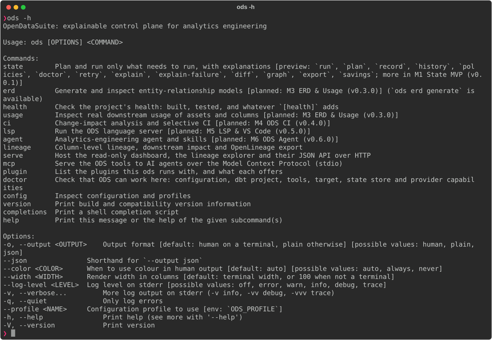

## Global flags

These work anywhere on the line: `ods --json version`, `ods version --json` and
`ods state plan --json` all produce JSON. After a `--` separator, everything is taken
literally.

| Flag | Values | Default |
|---|---|---|
| `-o`, `--output` | `human`, `plain`, `json` | `human` when stdout is a terminal, otherwise `plain` |
| `--json` | shorthand for `--output json` | |
| `--color` | `auto`, `always`, `never` | `auto` |
| `--width` | columns (≥ 20) | terminal width, or 100 when not a terminal |
| `--log-level` | `off`, `error`, `warn`, `info`, `debug`, `trace`; conflicts with `-v`/`-q` and overrides `ODS_LOG` | `warn` |
| `-v`, `--verbose` | repeatable: `-v` info, `-vv` debug, `-vvv` trace | warnings only |
| `-q`, `--quiet` | errors only; conflicts with `-v` | |
| `--profile` | configuration profile | `ODS_PROFILE`, then `default_profile` |
| `-h`, `--help` | help for `ods` or any command | |
| `-V`, `--version` | top level only (`ods -V`); `ods version` gives details | |

## Output and streams

- **stdout** carries results only: styled (`human`), line-oriented (`plain`), or one
  JSON document (`json`).
- **stderr** carries logs, progress and, outside JSON mode, error messages.
- In **JSON mode**, stdout always receives exactly one document, even when the command
  fails:

```json
{
  "schema_version": {"major": 1, "minor": 0},
  "command": "usage",
  "ods_version": "0.0.1",
  "result": null,
  "diagnostics": [
    {
      "level": "error",
      "code": "ODS-E0003",
      "message": "`ods usage` is not implemented yet",
      "hint": "planned for M3 ERD & Usage (v0.3.0); see docs/ROADMAP.md"
    }
  ]
}
```

`result` is the command's result model on success and `null` on failure. `hint` is
omitted when there is none. One exception: a command whose partial result matters
reports both. `ods state run` that recorded some nodes but had failures carries its
report in `result` and the error in `diagnostics`, and exits 1.

Exceptions to the one-document rule:
- **Usage errors** (bad flags or an unknown command) are detected before the output mode
  is known. They are always printed as text on stderr, with exit status 2.
- **Output failures**: if writing to stdout itself fails (for example a full disk), the
  error is printed on stderr with exit status 1, because stdout can't carry it.
- **`ods completions`** always prints its shell script as-is, whatever the output mode.

## Exit status

| Code | Name | Meaning |
|---|---|---|
| 0 | success | The command did what was asked, including when stdout closes early (`ods … \| head`). |
| 1 | failure | The command could not complete: I/O, provider or internal error. |
| 2 | usage | Invalid arguments or flags. |
| 3 | not implemented | The command is planned but not available yet. |
| 4 | config | Configuration is invalid, including an unknown `ODS_LOG` value. |
| 5 | check failed | The command ran and its verdict is negative, e.g. a CI gate found blocking issues. |

The output mode never changes the exit status. These codes are a stable contract: new
meanings get new numbers.

## Error codes

| Code | Meaning |
|---|---|
| `ODS-E0001` | Writing command output failed. |
| `ODS-E0002` | Unexpected internal error. Please report it. |
| `ODS-E0003` | The command is planned but not implemented yet. |
| `ODS-E0004` | `ODS_LOG` holds an unknown log level. |
| `ODS-E0101` | A configuration file can't be read or isn't valid TOML. |
| `ODS-E0102` | Configuration schema violation: unknown key, wrong type or value out of range, or a `[health]` check id or path glob that doesn't exist or isn't valid. |
| `ODS-E0103` | A credential is written as plaintext instead of a secret reference. |
| `ODS-E0104` | The selected profile is not defined. |
| `ODS-E0201` | dbt artifacts are missing, unreadable or an unsupported version, or lineage output can't be written. |
| `ODS-E0202` | The project graph is inconsistent (duplicate ids or relations, or a dependency cycle). |
| `ODS-E0203` | A model, column, change kind or dialect named on the command line doesn't exist. |
| `ODS-E0301` | `ods serve` can't bind its address (e.g. the port is in use) or stopped with an I/O error. |
| `ODS-E0401` | The state database can't be opened, read or written, or was written by a newer ODS. |
| `ODS-E0402` | Another run recorded state first; plan again and retry. |
| `ODS-E0403` | `run_results.json` or `sources.json` can't be read, or a State option (e.g. `--environment`) is invalid. `ods state export`: the upstream manifest can't be read, is another project's or an unsupported version, or `--dbt-state` names the upstream or dbt's target directory. `ods state history --run` and `explain-failure`: the run has no journal (never ran dbt, or its journal was pruned). `explain-failure` (exit 2): the node is in neither the run nor the project, or its name is shared. |
| `ODS-E0405` | The state database is damaged: it can't be read, or holds a record that can't be decoded. Nothing was changed; `ods state doctor` says what is wrong. |
| `ODS-E0404` | `ods state compile`, `run`, `seed`, `snapshot`, `build`, `test`: dbt couldn't run (e.g. `dbt compile` failed), or nodes or tests failed. Successes are still recorded. `ods state export`: dbt couldn't say which target it builds in. |
| `ODS-E0406` | `ods state export` couldn't write its directory: another export to it holds the lock, or a file couldn't be written or replaced. The message names the files already replaced; run the export again to repair it. |
| `ODS-E0501` | `ods doctor` found checks that fail (exit status 5). Each finding has its own code: see [`ods doctor`](#ods-doctor). |
| `ODS-E0701` | `ods health check`: a check at severity `error` failed, or, with `--strict`, couldn't decide (exit status 5). |
| `ODS-E0702` | `ods health check` couldn't write its health record. The records already there are unchanged. |

## Environment variables

| Variable | Effect |
|---|---|
| `ODS_LOG` | Log level: `off`, `error`, `warn`, `info`, `debug` or `trace`. Overrides `-v`/`-q` and `log.level`; `--log-level` overrides it. |
| `ODS_PROFILE` | Configuration profile to use; `--profile` overrides it. |
| `ODS__SECTION__KEY` | Sets a configuration key, e.g. `ODS__OUTPUT__WIDTH=120`. |
| `DATABRICKS_HOST` | The Databricks workspace URL that Catalog Explorer links are built from; read before `providers.<name>.settings.host` ([ADR-0021](adr/0021-databricks-authentication.md)). |
| `NO_COLOR` | Any non-empty value disables colour when `--color auto`. `--color always` overrides it. |
| `TERM` | `dumb` or `unknown` disables colour (results and logs) when `--color auto`. |

## Shell completion

`ods completions <shell>` prints a completion script for `bash`, `zsh`, `fish`,
`powershell` or `elvish`. The script is generated from the commands in the binary, so it
always matches your version.

```bash
# bash
ods completions bash > ~/.local/share/bash-completion/completions/ods
# zsh (a directory on your $fpath)
ods completions zsh > ~/.zfunc/_ods
# fish
ods completions fish > ~/.config/fish/completions/ods.fish
# PowerShell (add to your profile)
ods completions powershell | Out-String | Invoke-Expression
```

## Configuration

`ods` reads TOML configuration from up to three files, plus profiles, environment
variables and flags. The design is in [ADR-0005](adr/0005-configuration-and-profiles.md).

| Layer (lowest → highest precedence) | Where |
|---|---|
| user file | `$XDG_CONFIG_HOME/ods/config.toml` (or `~/.config/ods/config.toml`, or `%APPDATA%\ods\config.toml`) |
| project file | nearest `ods.toml` in the current directory or a parent; commit it |
| local file | `.ods/local.toml` next to `ods.toml`; add `.ods/` to `.gitignore` |
| active profile | `[profiles.<name>]` sections from the files above |
| environment | `ODS__<SECTION>__<KEY>=value`, e.g. `ODS__OUTPUT__WIDTH=120` |
| flags | `--output`, `--json`, `--color`, `--width` |

Example `ods.toml`:

```toml
version = 1
default_profile = "dev"

[project]
name = "jaffle_shop"

[output]
width = 100

[providers.warehouse]
kind = "databricks"
settings = { host = "dbc-prod-example.cloud.databricks.com", token = { secret = "env:DATABRICKS_TOKEN" } }

[profiles.dev.providers.warehouse.settings]
host = "dbc-dev-example.cloud.databricks.com"

[profiles.ci.output]
format = "json"
```

- **Profiles:** select one with `--profile NAME`, `ODS_PROFILE=NAME` or
  `default_profile`, in that order of precedence. Selecting an undefined profile is an
  error. `default_profile` can only be set at a file's top level.
- **Environment variables:**
  - `ODS__A__B=value` sets key `a.b`. Values are read as TOML when possible (`120`,
    `true`), so quote a string that looks like a number: `ODS__PROJECT__NAME='"1.0"'`.
  - Segments match existing keys case-insensitively. Keys whose names contain `__` or
    `.` can't be set this way.
- **Replacing tables:** a higher layer can replace a whole table with a single value,
  or a value with a table. `explain` shows what was replaced.
- **Keys:**
  - `version`
  - `default_profile`
  - `project.name`
  - `output.format` (`human`, `plain` or `json`), `output.color` (`auto`, `always` or
    `never`) and `output.width` (at least 20)
  - `log.level` (`off`, `error`, `warn`, `info`, `debug` or `trace`)
  - `state.db` and `state.environment`: see [State settings](#state-settings-in-odstoml)
  - `health.unknown_counts_as` and `health.builtin.<check>.severity`, `.select` and
    `.exclude`: see [Health settings](#health-settings-in-odstoml)
  - `providers.<name>.kind` and `providers.<name>.settings`. For `kind = "dbt"` the
    settings are `program`, `project_dir`, `profiles_dir`, `profile`, `target` and
    `target_dir`, all strings; any other key is an error
  - `policy.rules`

  Unknown keys are errors.
- **Secrets:** credentials must be references such as `{ secret = "env:VAR" }`.
  - A plaintext value at or under a credential-like key (`token`, `password`,
    `api_key`, `access_token`, `dsn`, …) is rejected. This applies anywhere in any file,
    including values that a higher layer overrides.
  - Malformed references are rejected too.
  - Error messages never repeat configured values, and the configuration never holds
    a secret's value.
- **Explain:** `ods config explain [KEY]` shows each effective value, where it came
  from and what it overrode (`--json` for machines):

```text
key                                 value                         source
output.width                        120                           local file ./.ods/local.toml
providers.warehouse.settings.host   "dbc-dev-example.cloud.databricks.com"    profile `dev` in project file ./ods.toml
providers.warehouse.settings.token  secret(env:DATABRICKS_TOKEN)  project file ./ods.toml
```

Configuration errors exit with status 4.

## `ods doctor`

`ods doctor` checks that ODS can work in the current project and environment, and says
what to do about anything that stops it ([ADR-0023](adr/0023-ods-doctor-diagnostics.md),
#181).

By default ODS runs no warehouse query. It runs `dbt --version`, and has dbt render the
profile with `dbt compile --inline … --no-populate-cache --no-introspect`, which reads
`profiles.yml` but doesn't connect to the warehouse. dbt itself may still use the
network: its version check looks up the latest release, and it may send usage
statistics unless they are turned off (`DBT_SEND_ANONYMOUS_USAGE_STATS=false`). ODS
writes nothing; dbt writes the target check's artifacts under
`<target-dir>/ods-target-check`, as `ods state run` does, and its own log. Only
`--connect` queries the warehouse, through dbt's own connection.

```sh
ods doctor                        # every offline check
ods doctor --project              # only the dbt project and its artifacts
ods doctor --provider databricks  # only the checks about one provider: dbt, databricks or sqlite
ods doctor --connect              # also the live checks, through dbt's own connection
ods doctor --strict --json        # for CI: warnings fail too; one JSON document
```

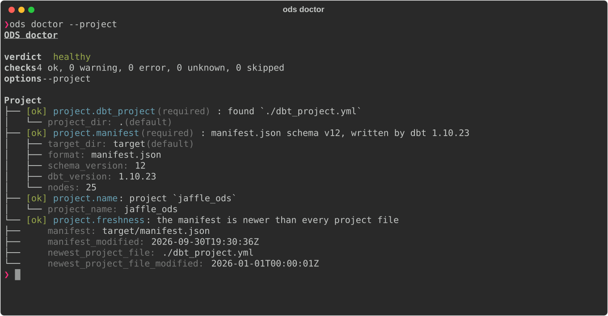

It takes the options `ods state` commands take to find things (`--project-dir`,
`--target-dir`, `--dbt`, `--profiles-dir`, `--dbt-profile`, `--target`, `--state-db`,
`--environment`), with the same [precedence](#state-settings-in-odstoml), and the
[global flags](#global-flags) (`-o human|plain|json`, `--json`, `--profile`).

### Checks

| Check | Question | Required |
|---|---|---|
| `config.load` | Do the configuration files load? Which were found, and which profile is active? | yes |
| `config.values` | What is every effective value, and where did it come from? Credentials appear only as references, e.g. `secret(env:WH_TOKEN)` | |
| `config.resolution` | Where do dbt, the project, the target directory, the state database and the environment come from: a flag, a `DBT_*` variable, a configuration file or profile, or a default? A profiles directory named for dbt must hold a `profiles.yml` (`ODS-W0510`). | yes |
| `project.dbt_project` | Is there a `dbt_project.yml` in the project directory? | yes |
| `project.manifest` | Can `manifest.json` (or dbt's Information Schema) be read, at a supported schema version (v11, v12)? | yes |
| `project.name` | Does the manifest name its project? | |
| `project.freshness` | Is the manifest newer than every project file (`.sql`, `.yml`, `.yaml`, `.csv`, `.py`, outside `target/`, `dbt_packages/`, `logs/` and hidden directories)? | |
| `tools.dbt` | Does dbt run, and is it a supported version (1.7 or later; 2.x is untested)? | yes |
| `tools.adapter` | Is the adapter the manifest was written with (`metadata.adapter_type`) installed in dbt? | |
| `target.identity` | Which target does dbt build in? dbt renders the profile (`dbt compile --inline`), which reads `profiles.yml` but connects to nothing | yes |
| `state_store.database` | Is the state database sound, and at a schema this ODS can read and write? The same check as `ods state doctor` | yes |
| `capabilities.relation_existence` | Can a build's relation be checked before it is reused (#230)? | |
| `capabilities.relation_versions` | Where do sources' data versions come from: the warehouse's table versions (Databricks), `loaded_at_field` through `dbt source freshness`, or nowhere? | |
| `connectivity.relations` | With `--connect`: does the relation check (`dbt show`) run? | |
| `connectivity.table_versions` | With `--connect`, on Databricks: does the table-version probe run? | |

The checks about sources' data versions (`capabilities.relation_versions`,
`connectivity.table_versions`) concern `databricks` when the manifest's adapter is
Databricks, whose table versions ODS reads, and `dbt` otherwise; `--provider` picks
them accordingly.

Each check ends `ok`, `warning`, `error`, `unknown` (it couldn't conclude, e.g. a check
it depends on failed) or `skipped` (not run by choice, e.g. a live check without
`--connect`). An unknown check is never shown as passed. Every finding carries a code,
its evidence (each value with where it came from) and a hint.

### Exit status

| Outcome | Exit |
|---|---|
| every check `ok` or `skipped` | 0 |
| warnings, or `unknown` on checks that aren't required | 0; with `--strict`, 5 |
| an `error`, or `unknown` on a required check | 5, `ODS-E0501` |

The output mode never changes it. Invalid configuration doesn't stop `ods doctor` as it
stops other commands (status 4): it is reported as `config.load`, and the checks that
depend on settings are `unknown`. With `--json`, a failed run still carries the whole
report in `result`, and `ODS-E0501` in `diagnostics`.

### Codes

| Code | Finding | Hint |
|---|---|---|
| `ODS-U0001` | Not checked: a check it depends on failed (evidence `depends_on`). | Fix that check first. |
| `ODS-E0101` | A configuration file can't be read or isn't valid TOML. | Fix the file named in the message. |
| `ODS-E0102` | Configuration schema violation, a variable that isn't UTF-8, or more than one dbt provider. | Fix the key named in the message; keep one `kind = "dbt"` provider. |
| `ODS-E0103` | A credential is written as plaintext. The value is never shown. | Use a reference, e.g. `{ secret = "env:VAR" }`. |
| `ODS-E0104` | The selected profile is not defined. | Define it, or select another with `--profile` or `ODS_PROFILE`. |
| `ODS-E0201` | The manifest is missing, unreadable or an unsupported schema version. | `dbt parse` (or `ods state compile`); for an old schema, upgrade dbt to 1.7 or later. |
| `ODS-E0204` | No `dbt_project.yml` in the project directory. | Run ODS in the project, or name it with `--project-dir`, `DBT_PROJECT_DIR` or `project_dir`. |
| `ODS-W0205` | The manifest names no project. | Write it again with dbt 1.7 or later: `dbt parse`. |
| `ODS-W0206` | The manifest is older than a project file: plans would describe code that isn't what runs. | `dbt parse`, or any `ods state` command that compiles. |
| `ODS-U0207` | How old the artifacts are can't be told: dbt's Information Schema (no `manifest.json`), a file or directory of the project that can't be read, or a file without a modification time. | `dbt parse` writes `manifest.json`; check the project's permissions. |
| `ODS-E0401` | The state database can't be opened, or a newer ODS wrote it. | Check the path and permissions; for a newer schema, upgrade ODS. |
| `ODS-E0405` | The state database is damaged. | `ods state doctor`, then [recover](#recovering-state). |
| `ODS-E0501` | `ods doctor` found checks that fail. | Each failing check says what to do. |
| `ODS-E0502` | dbt can't be run. | Install `dbt-core` with your adapter, or name it with `--dbt` or `program`. |
| `ODS-E0503` | dbt is older than 1.7, whose manifests ODS reads. | Upgrade dbt. |
| `ODS-W0504` | dbt's major version (2.x) is one ODS isn't tested with. | If a command fails, try dbt 1.x, and report it. |
| `ODS-U0505` | `dbt --version` printed no dbt Core `installed:` line with a version ODS can read (other programs that call themselves dbt aren't recognised). | Check that `--dbt` names dbt itself. |
| `ODS-E0506` | The manifest's adapter isn't installed in dbt. | `pip install dbt-<adapter>` next to dbt. |
| `ODS-U0507` | The manifest names no adapter. | `dbt parse` with dbt 1.7 or later. |
| `ODS-U0508` | dbt lists no adapters, so whether the manifest's is installed can't be told. | |
| `ODS-E0509` | dbt can't render the profile, so it can't say which target it builds in. | Check `profiles.yml`, `--profiles-dir`, `--target` and the variables it reads; `dbt debug` says more. |
| `ODS-W0510` | The profiles directory ODS gives dbt (`--profiles-dir`, `DBT_PROFILES_DIR` or `profiles_dir`) has no `profiles.yml`: dbt finds no profile there. Only the file's presence is checked; ODS never reads it. | Name the directory that holds `profiles.yml`, or leave it unset for dbt's default. |
| `ODS-W0601` | No data versions for some sources: the adapter has no table versions, and they have no `loaded_at_field`, so the models reading them build on every run. | Give them a `loaded_at_field` (or `loaded_at_query`); see [where source versions come from](#where-source-versions-come-from). |
| `ODS-W0602` | Relations can't be checked before reuse: a dropped table is rebuilt only when something else changes. | |
| `ODS-E0603` | The live relation check failed. | Check that the warehouse is reachable with the profile's credentials: `dbt debug`. |
| `ODS-E0604` | The live table-version probe failed. | Check that the profile's user may read table history (`DESCRIBE HISTORY`). |
| `ODS-U0605` | The live relation check ran, but couldn't tell whether some relations exist. Those nodes are built rather than reused. | `dbt debug`, and the adapter's permissions on those schemas. |
| `ODS-W0606` | The live table-version probe ran, but some sources have no table version (evidence `without_version`, with why, e.g. a view). They fall back to `max_loaded_at`, or count as changed. | Give them a `loaded_at_field` if they have new data ODS should notice. |
| `ODS-U0607` | The live table-version probe ran, but no source has a table version. | As `ODS-W0606`; check that the sources are Delta tables. |

### Common failures

**Not in a dbt project**, or never parsed:

```text
$ ods doctor --project -o plain
...
Project
  [error ODS-E0204] project.dbt_project (required): no dbt project in `.`: `dbt_project.yml` isn't there
    project_dir: . (default)
    hint: run ODS in your dbt project, or name it with --project-dir, DBT_PROJECT_DIR or the dbt provider's `project_dir` setting
  [error ODS-E0201] project.manifest (required): cannot read `target/info_schema/v1/dbt.models.parquet`: no manifest.json and no dbt Information Schema
    target_dir: target (default)
    hint: dbt writes it when it parses the project: run `dbt parse`, or `ods state compile`
  [unknown ODS-U0001] project.name: not checked: `project.manifest` failed
    depends_on: project.manifest
    hint: fix `project.manifest` first
```

**Stale artifacts** (a model edited since dbt last parsed the project): a warning, so
`ods doctor` exits 0, and 5 with `--strict`:

```text
  [warning ODS-W0206] project.freshness: the manifest is older than `./models/orders.sql`: plans would describe code that isn't what runs
    manifest: target/manifest.json
    manifest_modified: 2026-01-01T01:00:00Z
    newest_project_file: ./models/orders.sql
    newest_project_file_modified: 2026-01-01T02:00:00Z
    hint: parse the project again: `dbt parse`, or any `ods state` command that compiles (not with --no-compile)
```

**Broken `ods.toml`**: reported, not fatal; what depends on settings is unknown:

```text
Configuration
  [error ODS-E0101] config.load (required): /path/to/project/ods.toml is not valid TOML: …
    hint: fix the value named above; see docs/cli.md#configuration
  [unknown ODS-U0001] config.values: not checked: `config.load` failed
```

**dbt not installed**, or not on `PATH`: the target can't be checked, and since it is
required, the run fails even if nothing else did:

```text
Tools
  [error ODS-E0502] tools.dbt (required): dbt can't be run: couldn't start `dbt`: No such file or directory (os error 2)
    program: dbt (default)
    hint: install dbt-core with your adapter (`pip install dbt-core dbt-<adapter>`), or point ODS at it with --dbt or the dbt provider's `program` setting

Target
  [unknown ODS-U0001] target.identity (required): not checked: `tools.dbt` failed
```

**No data versions for sources** (a DuckDB or Postgres project whose sources have no
`loaded_at_field`):

```text
  [warning ODS-W0601] capabilities.relation_versions: no table versions for the `duckdb` adapter, and 2 of 2 sources have no `loaded_at_field`: they count as changed on every run, so the models reading them always build
    adapter: duckdb (manifest)
    missing_capability: relation_versions
    sources_without_loaded_at_field: raw.orders, raw.payments
```

## Column-level lineage

`ods lineage` reads a dbt target directory, parses every model's compiled SQL, and builds
column-level lineage. It reads dbt 1.7–1.12 (`manifest.json` v11/v12, plus `catalog.json`
when `dbt docs generate` has run) and dbt v2, either its `manifest.json` or, with
`--generate-info-schema`, the Parquet "dbt Information Schema"; with `--no-write-json` the
Information Schema is used automatically. All three give the same lineage ([ADR-0008](adr/0008-column-level-lineage.md)). It needs no dbt login, no
warehouse connection and no network.

```sh
dbt compile                      # or run/build: compiled SQL must be in the manifest
dbt docs generate                # optional: warehouse column lists for sources and seeds

ods lineage columns --model customers
ods lineage impact --column stg_orders.status            # which models must run, and why
ods lineage impact --column orders.amount=removed
ods lineage impact --base ../prod-target                 # diff two builds, impact of every change
ods lineage export --namespace unitycatalog://adb-123.azuredatabricks.net \
                   --output-file lineage.ndjson          # OpenLineage JobEvents
ods lineage view --open                                  # offline HTML explorer
ods lineage graph --format dot-columns --output-file g.dot && dot -Tsvg g.dot > g.svg
```

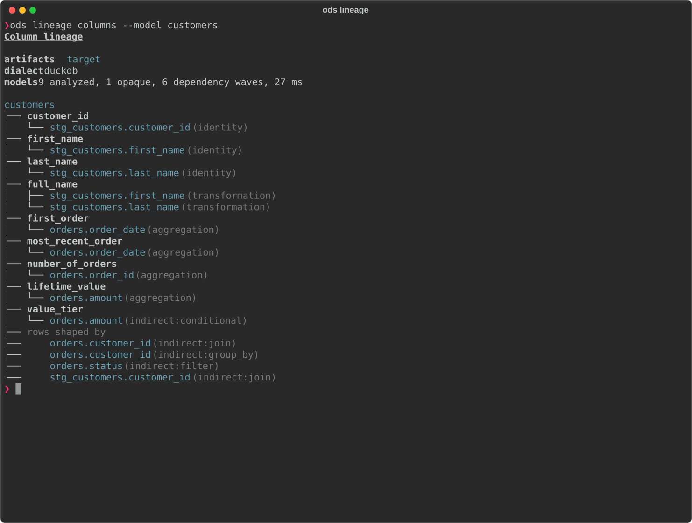

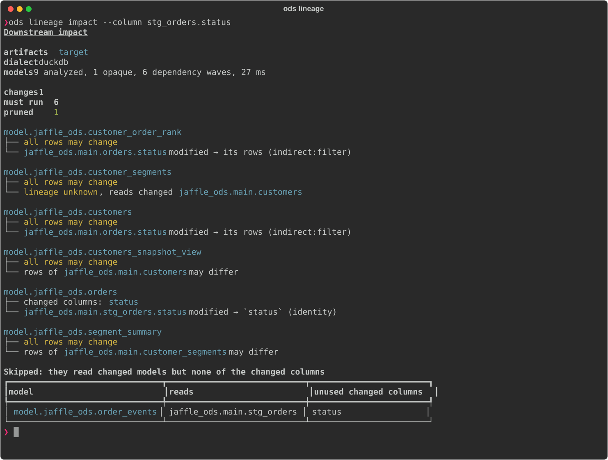

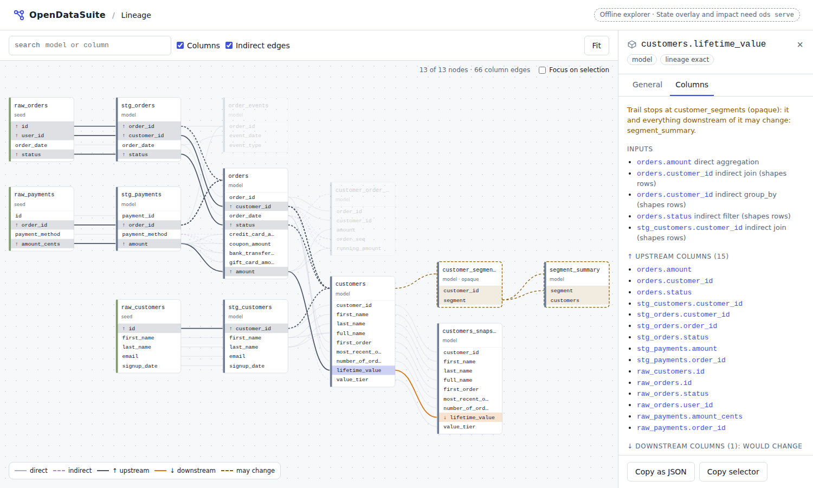

`ods lineage view` writes one self-contained HTML file (no network, no external scripts):
search models and columns (`/`), click a column to highlight everything upstream (blue)
and downstream (orange), toggle columns and indirect edges, focus on the selection, and
deep-link with `lineage.html#node=<id>&column=<name>`. It has the graph only: the
[State overlay](#the-lineage-page) and impact need `ods serve`. The same JSON contract
will power the VS Code view (#107).

`ods lineage graph --format` writes `json` (the documented graph contract,
`schema_version` 1), `dot` / `dot-columns` (Graphviz), `mermaid` (Markdown, model level)
or `graphml` (Gephi, yEd, Neo4j).

**Warehouse links** (#329): the graph JSON's nodes and `ods lineage columns --output
json`'s models and upstreams carry `relation_url`, the relation's expected location in
the warehouse's own UI, and `relation_url_label`, what to call it, when a link can be
built. Otherwise they carry `relation_url_unavailable`, why not (no provider for the
target's warehouse, no host configured, a relation that isn't fully qualified). The
fields are additive: consumers that don't know them ignore them. A link is never proof
the relation exists, and never carries a credential or a query string. Only Databricks
(Unity Catalog's Catalog Explorer) has links so far; see
[Databricks](databricks.md#open-a-model-in-catalog-explorer). With `graph` and `view`, `--focus MODEL[.COLUMN]`
(repeatable) plus `--upstream N` / `--downstream N` keeps only the connected part.

| Flag | Meaning |
|---|---|
| `--target-dir DIR`, `--project-dir DIR` | where the dbt artifacts are, found as `ods state` finds them: `--target-dir`, else `DBT_TARGET_PATH`, else the configured `target_dir`, else the project's `target` (`--project-dir`, else `DBT_PROJECT_DIR`, else the configured `project_dir`, else `.`); see [State settings](#state-settings-in-odstoml). The same for `erd`, `serve` and `mcp` |
| `--artifacts FORMAT` | `auto` (default: `manifest.json` if present, else the Information Schema), `json`, or `info-schema` (dbt v2's Parquet `target/info_schema/v1/`) |
| `--dialect NAME` | `databricks`, `spark`, `duckdb`, `snowflake`, `bigquery`, `postgres`, `redshift` or `generic`; default: the manifest's adapter type |
| `--column MODEL.COLUMN[=KIND]` | (`impact`) a changed column; `KIND` is `modified` (default), `added` or `removed`; repeatable. A modified or removed column must exist, unless it is already removed and some model still reads it (what `ods state run` suggests after such a failure, #323) |
| `--base DIR` | (`impact`) another build to compare with; every difference in compiled SQL becomes column changes |
| `--run-events` | (`export`) write `COMPLETE` RunEvents instead of JobEvents, for sinks that only accept runs |
| `--indirect-in-fields` | (`export`) also copy row-shaping inputs into every field, for consumers that ignore the facet's `dataset` array |
| `--namespace NS` | (`export`, required) the datasets' namespace, e.g. `unitycatalog://<workspace-host>` |
| `--job-namespace NS` | (`export`) the jobs' namespace; default `ods` |
| `--event-time RFC3339` | (`export`) the `eventTime` of every event; default now |

Column lists come from the warehouse catalog (`dbt docs generate`). Without one, a
seed's columns come from its CSV header, which is exactly what dbt loads. The header is
only used if the file's checksum matches the one dbt recorded, so a changed or missing
file leaves the columns unknown. Seed changes then reach only the models that read
the changed columns.
`ods lineage columns --model <seed or source>` shows where each column goes, hop by
hop, and `reaches` (in JSON) lists every column it can affect.

How impact is decided, most conservative first:
- a model whose SQL can't be analyzed (a Python model, `select *` over a relation with
  unknown columns, unsupported syntax) is **opaque**: any change to what it reads makes it run;
- a change to which rows exist (filters, joins, grouping) makes every reader run;
- a modified or removed column makes a reader run only if it uses that column; added columns
  only reach readers that `select *`;
- every reader that is *not* affected is listed as skipped, with the changed columns it doesn't use.

### Observed lineage (Unity Catalog)

Databricks Unity Catalog records column lineage for every query it runs:
- from notebooks, jobs, pipelines and SQL warehouses;
- including Python and PySpark;
- in the system table `system.access.column_lineage`, kept for a year.

ODS reads an export of that table, so it needs no workspace connection or credentials.
It uses the export in two ways:

1. **To check the analyzer:** `ods lineage compare` reports, per model:
   - which observed edges it predicted (*agrees*);
   - which predicted edges didn't run (*covers*);
   - which observed edges it missed (*misses*);
   - which models have no observed runs.

   Columns a platform reports as feeding a column but ODS classifies as row-shaping
   (joins, filters, window ordering) count as agreement.
2. **To fill in models the analyzer can't read**, such as Python models: pass
   `--observed FILE` to any lineage command. Their lineage appears with confidence
   `observed`. Observed lineage only covers what ran, so by default impact still treats
   these models as opaque (they run whenever what they read changes). With
   `--trust-observed`, impact relies on it and can skip them.

```sql
-- In a SQL warehouse or notebook; download the result as CSV or JSON.
SELECT source_table_full_name, source_column_name,
       target_table_full_name, target_column_name, event_time
FROM system.access.column_lineage
WHERE target_table_catalog = 'analytics'          -- your dbt catalog
  AND event_date >= current_date() - INTERVAL 30 DAYS
```

```sh
ods lineage compare --observed column_lineage.csv
ods lineage impact --column stg_orders.status --observed column_lineage.csv [--trust-observed]
ods serve --observed column_lineage.csv          # reloads when the export changes too
```

The export may have any columns in any order, as long as it includes the source and
target table names (full names, or catalog/schema/name) and column names. Rows without a
source table (file paths) or target table (plain reads) are skipped. Names are
normalized like the SQL dialect's identifiers. `.csv`, `.json` (an array) and
`.ndjson`/`.jsonl` are read. A test fixture in this format is in
`fixtures/databricks/uc-lineage/`; it is synthetic.

| Flag | Meaning |
|---|---|
| `--observed FILE` | (all `lineage` commands and `serve`; required by `compare`) an export of `system.access.column_lineage` |
| `--trust-observed` | let impact rely on observed lineage for models without static lineage |

### Hosting the explorer

The same page ships three ways ([ADR-0009](adr/0009-hostable-explorer-ods-web.md)):

```sh
ods lineage view                              # one offline file, graph embedded
ods lineage view --site public/lineage        # static site: index.html + graph.json
ods serve                                     # http://127.0.0.1:8765/lineage, live reload
ods serve --host 0.0.0.0 --port 8080 --base-path /ods   # behind a reverse proxy: /ods/, /ods/lineage
```

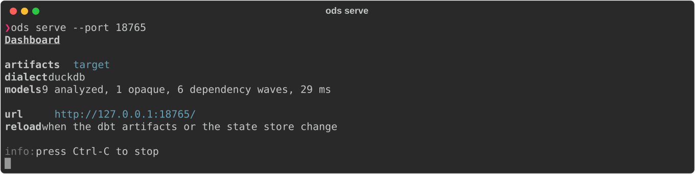

A static site can go on any static web server (S3, GitHub Pages, nginx). Browsers won't
fetch `graph.json` from a `file://` page, so use `ods lineage view` for local files.

`ods serve` analyzes the project once, then serves:
- the [dashboard](#the-dashboard) at `/`;
- the explorer at `/lineage`, inside the dashboard, with the
  [State overlay](#the-lineage-page) and an *Impact* tab that runs impact on the server;
- the [Impact simulator](#the-impact-simulator) at `/lineage/impact`;
- the [ERD page](#the-erd-page) at `/erd`;
- a read-only JSON API: `/api/version`, `/api/graph`, `/api/search?q=`, `/api/node?id=`,
  `/api/impact?node=&column=&kind=`, `/api/shell`, `/api/home`,
  `/api/lineage/overlay`, `/api/lineage/impact`, `/api/erd` and `/healthz`;
- a run's events as it runs ([live runs](#live-runs)): `/api/runs/live` and
  `/api/runs/<run_id>/events`.

It checks `manifest.json`, `catalog.json`, the Information Schema and the state
database and the source freshness results (`--sources`, else
`<target-dir>/sources.json`, even before it exists) every second. When they change
(e.g. after `dbt compile`, `dbt source freshness` or `ods state build`)
it re-analyzes only the models that changed, and open pages reload. If a reload fails,
the last good graph stays up and the error appears in `/api/version`.

It listens on loopback by default and then only answers requests for `localhost`,
`127.0.0.1` or `[::1]`, which is designed to mitigate DNS-rebinding attacks from web pages. There is no
authentication yet (#97): with `--host` anything other than loopback, put it behind a
proxy that has some, and name the proxy's host with `--allow-host`. Beyond loopback,
`/api/version` hides local paths and error text (they go to the server log). Responses
carry a strict Content-Security-Policy, and nothing is written. `--base-path` accepts
plain path segments only (letters, digits, `-`, `.`, `_`, `~`).

| Flag | Meaning |
|---|---|
| `--host ADDR` | (`serve`) address to listen on; default `127.0.0.1` |
| `--port PORT` | (`serve`) default `8765`; `0` picks a free port (the URL is printed) |
| `--base-path PATH` | (`serve`) URL prefix, e.g. `/ods`; the dashboard is served at `/ods/` and the explorer at `/ods/lineage` |
| `--allow-host NAME` | (`serve`) also accept this `Host` name, e.g. the one your reverse proxy forwards; repeatable |
| `--no-watch` | (`serve`) don't reload when artifacts or the state store change |
| `--state-db PATH`, `--environment NAME`, `--target NAME`, `--sources PATH` | (`serve`) which state the dashboard shows, as for `ods state plan`; the database is only read, never created or migrated |
| `--site DIR` | (`lineage view`) write a static site instead of one file |

### The Lineage page

`ods serve` shows the explorer at `/lineage`, inside the dashboard (#312). By default
it draws the model graph; *Columns* switches to the column-level view. Edges are the
DAG's: an arrow means a node reads another, not that their tables are related (keys
and relationships are the ERD's). A dashed arrow is a parent the node only declares
(e.g. a Python model's `dbt.ref`): how it uses it is unknown.

With the **State overlay** (the *Overlay* picker; *None* turns it off), each model,
seed and snapshot shows what the next run does with it, as `ods state plan` decides
against the latest snapshot:

| Pill | Means |
|---|---|
| `BUILD` | it will run: its code, checks, target or inputs changed, or a parent's did |
| `REUSE` | its last successful build is kept: its code and inputs are unchanged, or its new upstream data is within its lag tolerance (the node's summary says which). This page doesn't check the warehouse, so reuse assumes the relation built earlier still exists; `ods state build --dry-run` checks |
| `NEVER BUILT` | no build is recorded, so it will run |
| `UNKNOWN` | the evidence to reuse it is missing (or the plan couldn't be made), so it will run |

Sources are read, never built, so they have no pill. Opaque nodes, whose column
lineage is unknown (e.g. Python models), are drawn dashed. The plan is made again on
every page load, as on Home. Without a state database, every node shows as never
built; that is not an error.

Click a node (or tab to it and press Enter) for its side panel:
- **Why:** the run that last built it (if it is one of the last five), the fingerprint
  components compared (changed and unchanged), what changed (the code text isn't
  recorded: `git diff` shows it), for a reused node that its relation wasn't checked,
  then the decision, its reasons and which of its readers build too; with a link to the
  decision on the State plan page (`/state/plan?node=<id>`) when the plan has one
  (without a state store there is none, so `why_href` is null);
- **General** and **Columns:** what the explorer showed before, ↑ upstream and
  ↓ downstream; a column traces it through the graph. At an opaque node the trail
  can't be followed: the panel names where it stops, and every node past it is shown as
  *may change* (dashed amber), never as unaffected;
- **Impact:** what must run if its rows or a column change (nothing runs); for a
  column, *Open in the Impact simulator* takes it to the
  [Impact simulator](#the-impact-simulator);
- **Open** goes to its Model page (`/catalog/<id>`); *Copy as JSON* and *Copy selector*
  copy the node and `+name+`.

`/lineage?node=<id>` (and `&column=<name>`) opens with a node selected; the address bar
follows the selection. `/api/lineage/overlay` returns the overlay the page shows, as a
view model at `schema_version` 1: the state, the snapshot the plan compares against,
the counts, the warnings (including that reuse was taken on trust), and per node its
`decision`, `summary`, `reasons`, `changed_components`, `components`, `relation`,
`last_built`, `opaque` and the two links. Beyond loopback it omits error text. The
graph's `node_edges` say how each edge is known: `"via": "sql"` or `"declared"`.

### The Impact simulator

`/lineage/impact` (#347) answers "what happens downstream if I change this column?"
before you change it. Pick a column (`model.column`, with suggestions), a change
(*rename*, *type change* or *drop*) and, for a rename, the new name; add more columns
to change them together. *Simulate* shows:

- **Must run:** the model being changed and every model the change reaches, the ones
  that would break first. Each says what the change does to it:
  - **breaks:** its SQL names a column that would no longer exist (a drop, or the old
    name of a rename), so its build fails until it's updated;
  - **loses column:** it passes the column through `select *`, so the column
    disappears from it too, and whatever names it downstream breaks;
  - **unknown:** its lineage is unknown (a Python model, SQL that couldn't be parsed),
    or, after a drop or rename, it reads such a model (even if it also reads the
    changed one directly), or a model whose columns were never known. ODS can't tell
    whether it breaks, so it never says it doesn't;
  - **affected:** its values or rows may change, but it names nothing that goes away.
    A type change removes no column, so nothing is known to break from it, but SQL
    that relies on the old type (a cast, a date function, a sum) can still fail: the
    page says so.

  The header counts them: how many must run, how many are known to break, how many
  are unknown.

  With each: whether its lineage is *parsed*, *opaque* or *inferred* (reached only
  through an opaque model), the columns the change reaches (`[unknown]` when not
  known), how it reads them (direct, aggregation, filter, `select *`, …) and why.
- **Skipped:** readers of a changed model that don't use the changed column, with the
  reason, and how many other nodes aren't downstream at all.
- **Column trail:** how the change travels from column to column.
- **Build command:** `ods state build -s …` with exactly what must run, to copy; the
  readers that can be skipped keep their last build.
- **Tests that run with it:** the tests declared on those models.

The models that must run are exactly those `ods lineage impact` gives for the same
change (a drop is `=removed`, a type change `=modified`, a rename `=removed` plus
`=added` for the new name). Nothing is run or written: the change is simulated on the
column lineage. The URL holds the change (`?column=orders.amount&change=drop`, and
`&to=` for the new name or type), so a simulation is a link to share. Each column on a
Model page's *Columns* tab has a *Simulate* link that opens it with that column.
`/api/lineage/impact` takes the same query and returns the page's view model at
`schema_version` 3.

The simulator doesn't yet read dbt model contracts or exposures, so it can't warn that
an enforced contract must change too, or name the dashboards downstream.

### The ERD page

`/erd` (#64) draws the project's [entity-relationship diagram](#entity-relationship-diagrams):
the entities, their keys and the relationships between them, as `ods erd generate --infer`
finds them. It shows keys and relationships only, never lineage: a model reading another
is not a relationship.

- **Edges:** each relationship is drawn by its strongest evidence. Solid green is a
  `relationships` test, solid blue a declared constraint, dashed a join in the project's
  SQL, dotted only matching column names (*inferred*). Click an edge, or focus it and
  press Enter, for its evidence: the tests, constraints or models behind it.
- **Cardinality:** at each end, only as far as keys prove it. *Exactly one* is a key
  that is never null, *zero or one* a key that may be null, *many* the referencing side,
  and *?* means it isn't proven: the referenced columns aren't a tested or declared key,
  or the edge is only inferred.
- **Entities:** `PK` marks the key, filled when tested or declared and dashed when only
  inferred; `FK` marks referencing columns. Click an entity for its keys and a link to
  its model page.
- **Scope:** `--select` one or more names (space- or comma-separated) with a depth, as
  `ods erd generate --select … --depth …` does. Without a selection, entities without
  any relationship are left out unless *Entities without relationships* is ticked.
  *Inferred edges* and *All columns* hide inferred edges and non-key columns. The URL
  keeps all of it, so a view is a link to share. *Fit* frames the diagram, and you can
  drag and scroll to pan and zoom.
- **Missing relationships:** each joined or inferred relationship, numbered as on the
  diagram, says what is known and gives the `relationships` test to paste, and where,
  in the syntax of the project's dbt version. A join between two columns that aren't
  keys gets no test: which side references which isn't known until a key is tested.
  *Already tested* lists the rest.
- **Export SVG** downloads the diagram as drawn. *JSON* is `/api/erd` with the same
  scope: the view model at `schema_version` 3, with the ERD itself at its own
  `schema_version` 1. *Every relationship* lists them all as a table, which also works
  without script.

### The dashboard

`ods serve` opens on the ODS Dashboard's Home page: a read-only view of the project
and its local state ([design](design/dashboard/README.md), #310). Run it from the
project, where `ods state` keeps `.ods/state.db`:

```sh
ods state build        # record a run first, if you haven't
ods serve              # then open http://127.0.0.1:8765/
```


Home shows:
- **tiles:** the planned nodes by kind; how many nodes the last run built, and how many
  kept an earlier build; and how many snapshots are recorded;
- **recent runs:** each recorded snapshot, its run, and how many nodes it built and how
  many kept an earlier build. *Kept* is not the same as reused: a snapshot keeps the
  last good build of a node the run reused, didn't select, or failed to build, and
  can't tell them apart. Runs don't record their command yet (shown as —), and Home
  doesn't read run journals yet, so the outcome reads *recorded*, without a tick
  (*All runs* opens the Runs page, which has each run's outcome from its journal);
- **needs attention:** from the plan against the latest snapshot (`ods state plan`),
  nodes whose code changed and nodes whose evidence is missing, then opaque nodes whose
  column lineage is unknown. Each links to the node in the explorer. Below them, *The
  plan builds N nodes* counts every build by its main reason (e.g. `target changed`,
  `never built`, `new upstream data`), including reasons the list doesn't show. It says
  *Nothing* only when the plan builds nothing. The plan is made again on every page
  load, because a lag tolerance can run out while no file changes;
- **health** (#354): nodes counted by their health badge (below), each count linking to
  them in the Catalog. Under them, *Stale* counts the nodes the plan rebuilds because
  something changed since their last build, and *Runs with failures* counts the listed
  runs that failed or partly failed, out of those whose outcome is known, with the last
  run's outcome;
- **coverage** (#354): models with tests, with descriptions and with column constraints,
  and sources whose new data ODS can measure. Each bar lists what it doesn't cover,
  linked. A signal ODS can't measure (e.g. failures without the last run's record, or
  coverage of sources when there are none) reads *not measured*, never 0; each row's
  tooltip says how it was worked out;
- **modules:** *Ready* for what this page reads (lineage, and State once a run is
  recorded); *Available* for modules that work from the CLI but aren't checked here
  (ERD); *Planned* for the rest.

Without a state database, Home says how to record a first run instead. If the project's
own files can't be read (the artifacts, or a `--sources` file that is missing or
malformed), it says so and doesn't open the store. Errors appear on the page on
loopback, and in the server log (a warning) everywhere. The left
navigation lists every section of the design; sections not built yet are greyed and
marked *Planned*. The project and target pickers show the current ones; switching
comes later. The search box hands its text to the explorer's search.

The dashboard never writes configuration or state: the database is opened read-only,
and every route is `GET`. `/api/shell` and `/api/home` return exactly what the page
shows, as JSON view models at `schema_version` 3. The page uses IBM Plex, served by
`ods serve` itself (no font CDN), with system fonts as the fallback.

### State pages

The State section (#311) shows the plan and the runs the state store recorded. Like
Home, it only reads, and every action is a command to copy into a terminal.

| Page | Route | Shows |
|---|---|---|
| Plan | `/state/plan` | every planned node with its Build or Reuse pill and reason, the counts to build and reuse, and how many reused relations were checked; `?action=build` or `reuse` filters |
| Why | `/state/plan?node=<id>` | for one node (its percent-encoded unique id, or a name only one node has): its recorded build, which fingerprint parts changed, what it reads (parents' decisions; each source's version, strategy and origin, ADR-0022), the relation check, the decision, and the reason chain; `&view=json` shows its data |
| Runs | `/state/runs` | every recorded run, and every run whose journal is kept, newest first (the newest 50; `ods state history` lists all): its outcome, node counts, rows and duration. Filtered by `?outcome=` (`succeeded`, `partial`, `failed`, `unfinished`, `unknown`, or `recorded` for runs without a journal), `?target=` and `?date=` (`1d`, `7d` or `30d`), with counts; `?run=<id>` picks the run in the side panel, with its failed nodes explained ([why a node failed](#why-a-node-failed)) |
| Run | `/state/runs/<run_id>` | the run's totals, a timeline of when each node started and finished (from its journal) and of the nodes that kept an earlier build, why each was built, and the earlier runs; `?tab=nodes` lists each node's status, start, time taken (compile and execute), rows, thread, tests and why it ran, with a failed node explained: headline, category, how sure ODS is, why it thinks so (or what it knows), where, what to try with Copy buttons, the impact, and dbt's redacted message one click away. An unambiguous prefix of the id (8 characters or more) works too |

What the pages claim is what ODS records, and no more:
- **The plan** is the one `ods state plan` makes, offline, made again at most every 30
  seconds (and after every reload), as lag tolerances expire with time. Builds are
  listed first.
  The Why panel's reason chain is exactly `ods state explain <node>`'s (its JSON is in
  `explanation`). An offline plan doesn't check the warehouse, so reused relations read
  *not checked*; `ods state build --dry-run` checks them. Evidence below *semantic* is
  shown as *proxy*, *inferred* or *unknown*, never as fact.
- **A run** is a committed snapshot, its journal, or both: the nodes whose last build is
  the run's were built by it, and every other node *kept an earlier build*, whether it
  was reused, left out or failed.
- **Its journal** (`<state-db>.runs/<run_id>.jsonl`, #322) says how it ended
  (*succeeded*, *partial* when some nodes failed and others succeeded, *failed*), when
  each node started and finished, the rows the adapter reported, and each failed node's
  error as its one-line summary with values and SQL removed; the page never shows more
  than the journal keeps, and reads every line through the same redaction again. A stat
  it doesn't report reads `—` with the reason, never `0`, and a rows total that misses
  some nodes reads *at least N*. A journal with no end is *running or stopped without
  finishing* while it changed in the last 10 minutes, then *unknown*, *probably stopped*
  (marked *inferred*: a node running longer writes nothing meanwhile); never a success.
  An executor's "succeeded" is shown only when every node succeeded and every line
  read; *partial* means some nodes failed and others succeeded. With a journal, *kept*
  counts only the nodes the run didn't run; its failed and skipped nodes are counted
  apart (they keep their last good build too).
  A failed run that recorded no snapshot is listed from its journal, with the snapshot
  that stayed the last good state (*inferred*: no listed snapshot has its id). Only
  journals of the page's scope are listed. A run without a journal (from before
  journals, one that didn't run dbt, such as `ods state record`, or one pruned beyond
  the newest 50) says so, and its outcome reads *recorded*.
- **Without a journal, failures** are known only for the last run, from `<state-db>.last-run.json`,
  which `ods state retry` keeps (since version 1.2 with the run's scope and id). It is
  shown only when its scope is the page's; a file from an older ODS names none, so it
  is shown apart, as possibly another target's. The run is tied to the snapshot that
  records its run id; if no listed snapshot does, the page says it *probably* recorded
  nothing (marked *inferred*). Nodes it lists as failed read *failed or not recorded*:
  that includes nodes dbt ran but ODS couldn't record. The page shows them, the skipped
  ones, the last good snapshot and `ods state retry --failed`. The command line keeps
  option names, but values other than the selection and target, and everything after
  `--`, read `<redacted>`: `--vars` may carry secrets. The server reloads when this
  file changes.
- **Not recorded yet:** who ran a run (`[user]`), the command of earlier runs, and run
  logs (a failed node's summary says where dbt's full message is). CI runs are a
  *Planned* tab until server mode.

The same view models are served as JSON at `schema_version` 3, `GET` only:
`/api/state/plan` (with the same `?node=` and `?action=`), `/api/state/plan/<node>`
(404 if not planned), `/api/state/runs` (with the same filters) and
`/api/state/runs/<run_id>` (404 if not listed). Beyond loopback they leave out local
paths (including where an error's full message is), error text and the last run's
options. The Why panel links to the node in
the lineage explorer (`/lineage?node=<id>`) and to its model page (`/catalog/<id>`).

### Live runs

While `ods state run`, `build` or `test` runs, `ods serve` can show it as it goes
(#322, [ADR-0024](adr/0024-run-events-node-stats-and-run-journal.md)). It reads the
run's journal, `<state-db>.runs/<run_id>.jsonl`, which the command writes and flushes
an event at a time; nothing else is needed, and the dashboard still only reads.

| Route | Returns |
|---|---|
| `/api/runs/live` | the runs that are *probably* running: their journal doesn't say they finished and changed in the last 10 minutes (`status: probably_running`, `inferred: true`, since a journal changing is the only sign), with the command, when each started, how many nodes finished, run or failed so far, and links to the live view and the Run page. Only runs of the dashboard's scope, at `schema_version` 2 |
| `/api/runs/<run_id>/events` | the run's journal as [Server-Sent Events](https://html.spec.whatwg.org/multipage/server-sent-events.html): every line from the start, then each new line as it is written, then `end` |
| `/api/runs/<run_id>/events?since=<n>` | the same messages after line `n`, once, as JSON lines (`application/x-ndjson`), for clients without `EventSource`; at most 2,000 per answer, then ask again from the last `id` |

The stream's messages:

| `event` | `id` | `data` |
|---|---|---|
| `run_event` | the journal line's number, from 1 | the run event (`run_started`, `node_queued`, `node_started`, `node_finished`, `check_finished`, `run_finished`), as the journal keeps it, except that a `check_finished`'s `check` is the test's handle (`check-<12 hex digits>`), never dbt's id for it, which holds a generic test's arguments |
| `unreadable` | the line's number | `{"line": n}`: a line that isn't an event of this run: a newer version, a line cut short (sent before `end` when the run stopped mid-write), one longer than 256 KiB, or another run's event |
| `end` | none | `{"reason", "outcome", "inferred", "note"}`: `finished` after `run_finished`; `stopped` (inferred) when the journal doesn't say it finished and hasn't grown for 10 minutes; `replaced` when the journal was replaced or got shorter |

Every message's `data` also carries `live_schema_version` (2), the stream's own version:
a run event's `schema_version` is the journal's, which didn't change when the stream
started sending a check's handle.

A client that reconnects with `Last-Event-ID` (browsers do it on their own) gets only
the lines after it; without one, the stream replays from the start, so a page opened
mid-run is complete. A line still being written is sent once it is whole. A comment is
sent every 15 seconds when nothing else is (a heartbeat for proxies), and the response
asks proxies not to buffer it (`X-Accel-Buffering: no`). At most 16 streams are open at
once, and at most 16 `?since=` answers are read at once; one more gets `503` with
`Retry-After`. A stream's place is freed when the server next writes to a client that
left: within a heartbeat, up to 15 seconds. The journal is checked every 300 ms, a
bounded chunk at a time; `/api/runs/live` is reused for 1.5 seconds.

**On the page.** Home shows a *Run probably in progress* banner (marked *inferred*)
for each run that is probably running, linking to it **live on the DAG** (`/lineage?live=<run_id>`); the Run page of
an unfinished run links there too, and the Lineage page's *Overlay* picker has a *Live
run* when one is going on. The Live overlay shows each node as queued, running (with
its time so far and thread), built (time taken and rows, `rows —` when the adapter
reported none), failed, skipped (upstream failed), unknown, or kept (not in this run,
with the run whose build it kept). The side panel shows the run's progress, its counts,
what is running now, the rows written so far (*at least N* while some built nodes
didn't report theirs, or a failed one may have written some; `—` while none reported)
and its events; selecting a node shows its stats card, the Run page's,
with a failed node explained.

**Follow mode** is on for a live run: the camera frames every running node, moves at
most once a second, and never zooms below 60%. When the running nodes are too far apart
for that, it keeps one **focus** node until it finishes, then moves to the running node
that blocks the most queued nodes downstream (the nearest one on a tie); the toolbar
says which (*Focus: int_sessions · blocks 41 queued nodes*), each running node off
screen gets a chip on that edge (a click makes it the focus), and a minimap shows the
whole run (follow frames above its corner). Any pan, zoom, *Fit* or node click turns
follow off, and the page says which; *Follow run* or `F` turns it back on. When the run
ends, follow stops and the view shows what ran (the whole graph if it reads at 60%,
else the nodes that ran, else the failure), and offers to jump to the failure. With `prefers-reduced-motion`, the camera jumps instead of gliding;
starts and finishes are announced to screen readers, at most every two seconds.

**Follow scopes:** the node menu (right-click, the menu key, or Shift+F10 on a focused
node) and the stats card offer *Follow this node and its downstream* (with how many
nodes that is), *…and its upstream*, *Follow just this node* and *Show node stats*.
Follow then watches only the scope's running nodes (or its next queued ones), the rest
of the graph fades, and the toolbar says *Following customers + 3 downstream ×*. The
scope is in the address (`&follow=customers:down`, `up` or `self`); when it finishes,
the page frames it and offers *Follow whole run*.

**Replay** ([ADR-0026](adr/0026-run-playback.md)): any run whose journal ODS still keeps
can be played again on the DAG, at `/lineage?replay=<run_id>`, from the Run page's
*Replay on the DAG*, or from *Replay* once a live run has finished. The page loads the
journal once (through `/api/runs/<run_id>/events?since=`, so it shows nothing the
stream doesn't) and shows the run as it was at the playhead: the same nodes, panel,
stats cards and follow mode as live, with running times measured from the playhead. A
play bar along the bottom has play and pause (Space or `K`), the previous and next
event (`,` and `.`: what happened next, whatever the gap), the time (`0:10 / 0:13`),
the speed (0.25× to 64×; Shift+`<` and Shift+`>`) and a slider over the whole run:
drag it, or use ←/→ (5 s), `J`/`L` (10 s), Home/End and `0`–`9` (0–90 %). Above the
slider, a band shows how many nodes were running at each moment (to the run's peak:
where it narrows, the run was waiting on few nodes) with a marker for each failure
and the run's end; a marker goes there (and selects the failed node). A link opens a
replay paused at a moment: `&t=<seconds>` (and `&speed=<n>`), which the address keeps
up to date whenever playback stops. A run rebuilt from its final report says that its
times are when each node finished, not when it started; a journal still being written
replays up to when it was loaded and offers *Go live*.

The page holds its automatic reload while it shows a run (a reload would lose the
camera), and reloads when you leave the Live overlay if the project changed meanwhile.
`/state/runs/<run_id>/card?node=<id>` serves the stats card as an HTML fragment.

Every line is read through the same reader as the Run pages, which removes values and
SQL from each event again, whatever wrote the file: the stream carries no SQL, no
`--vars` values and no secrets. Beyond loopback, where an error's full message is (a
local path) is left out. A run id must be a plain file name (letters, digits, `-`, `_`
and `.`); anything else is `400`, and a run without a journal `404`.

### The Catalog and model pages

The **Catalog** (`/catalog`, #313) lists every model, seed and snapshot in the
manifest, with facets to filter by and counts over every node:
- **resource type**, **materialization** and **tags** (the resolved `config.tags`);
- **layer** (marked *Layer\**, as it is inferred, not declared): a model's first
  folder under the model paths (from its `fqn`, e.g. `models/marts/…` → `marts`),
  listed upstream first. Seeds and models at the top of a model path have none; the
  layer is never guessed from a name;
- **next-run decision:** *Build*, *Reuse*, *Never built* (no successful build is
  recorded, so it builds) or *Unknown* (the plan couldn't be made, or the store can't be
  read), from the plan against the latest snapshot, made again on every request as on
  Home. The plan is made offline, so a *Reuse* is taken on trust: the reused node's
  relation isn't checked by this plan, only when a run starts (`ods state build`).
  The page and `decisions.caveats` in the API say so;
- **lineage confidence:** *parsed*, *inferred*, *observed*, *unknown*, *opaque*, or
  *n/a* for seeds. Every value is listed, with its count, even when zero.

The table sorts by any column (decisions and confidences in the facets' order), and
shows each node's last successful build as `snapshot · run` (when, in the tooltip) or
*never built*. The builds come from the same snapshot the plan is made against. The
Catalog has its own name search (`/` focuses it) in place of the header's. Each node's
**health** badge (#354), with its reasons in the tooltip, is one of:
- *failing:* it failed in the last run and hasn't been built since;
- *warning:* it is built, but a model or snapshot has no tests, its tests weren't
  recorded passing on this build or changed since, or it was skipped in the last run;
- *healthy:* it is built, and its tests passed on this build as they are now (a seed
  needs none);
- *unknown:* ODS never built it.

Failures come from the last run's record (`ods state build`/`run` keep it beside the
store); without one they aren't counted. Checks that aren't built in count as the last
`ods health check` recorded them, as of when it ran (see [the health
record](#ods-health-check)). The `health` facet filters by it. Facets, the name search and the sort are in the URL
query (`/catalog?layer=marts&decision=build&sort=last_built&desc=1`), so a filtered
view can be bookmarked; the page works without script.

Each node has a **model page** at `/catalog/<unique_id>` (percent-encoded), with tabs
(`?tab=`):
- **Overview:** description, columns, the current decision (with whether the relation
  was checked) and a small lineage view;
- **Code:** the code as written, with its templating unresolved (`{{ env_var('X') }}`
  stays as written). Compiled SQL is never shown or served, as it can contain secrets
  resolved from environment variables, variables or macros; it is in the project's
  `target/compiled/` folder;
- **Columns:** name, type, description, tests, constraints and the columns each is
  computed from. A type comes from `catalog.json`, as of when it was generated (the
  page says when), or a YAML `data_type` (marked *declared*); otherwise it says
  *unknown*. A column only `catalog.json` lists, which neither the project nor the
  lineage of the current code has, is marked *possibly dropped*. Column lineage that
  wasn't parsed from the code is marked *inferred*;
- **Lineage:** the nodes it reads and that read it (the build graph, not
  relationships), linking to `/lineage?node=<unique_id>`;
- **State:** the decision with the planner's reasons, the relation check (*not checked
  by this plan* for a reuse), and the last successful build, linking to *Why this decision* on the Plan page
  (`/state/plan?node=<unique_id>`);
- **Tests:** the data tests that read the node or are attached to it, and its unit
  tests. Outcomes aren't kept per test: the state records that a build's checks passed
  together, with a digest of those checks, so each test among them reads *passed · run
  …* only while the node's checks are the same ones (the digest the planner computes).
  After a test is added, removed or edited and not run again, every test reads *checks
  changed since run …: not recorded*; the rest read *not recorded*. Column lineage is
  matched to columns whatever their case (a warehouse catalog may fold it).

**Open in warehouse** (#329): when the target's warehouse has a provider that can link
to its own UI, the model page's header has a button to the node's relation there, e.g.
**Open in Catalog Explorer ↗** on Databricks. It opens in a new tab
(`rel="noopener noreferrer"`), and is labelled the relation's *expected location*: it is
where the manifest says the relation is, and ODS hasn't checked that it exists. When
there is no link, the header says why instead of guessing one:
- the target's warehouse has no such provider (*no warehouse link for `duckdb`
  targets*);
- the workspace host isn't configured, or isn't an `https://` workspace URL;
- the relation isn't fully qualified (Unity Catalog needs `catalog.schema.table`; a
  two-part name gets no link, as the catalog would be a guess);
- a name in the relation can't be read as the warehouse writes it, or is `.` or `..`
  (a name is never repaired into another one);
- the node builds no relation (an ephemeral model).

The lineage explorer's side panel (the node's head, and the General tab) and each row
of a run's Nodes table (`/state/runs/<run>?tab=nodes`) carry the same link; the
Nodes table says once why there is none. [Databricks](databricks.md#open-a-model-in-catalog-explorer)
says how to configure the host.

Relationships and Usage are greyed as planned. An unknown id, or one that isn't valid
percent-encoding, gets a 404 page; `/catalog/` redirects to `/catalog`. Without a state
store, every node reads *never built* and its last build *never*.

`/api/catalog` (with the same query) and `/api/catalog/<unique_id>` return the view
models the pages render, at `schema_version` 3; every tab's data is in the latter,
including `relation_url`, `relation_url_label` and `relation_url_unavailable` (below).
Beyond loopback they leave out file paths and error text.

**Freshness evidence** (`/catalog/sources`, under Catalog) shows how ODS knows whether
each of the project's inputs changed since the nodes reading it were built:
- **Sources:** the data version now (`max(<loaded_at_field>)` from `sources.json`), when
  it was measured, and the versions its readers were last built from. On Databricks,
  runs read each source's Delta table version first
  ([ADR-0022](adr/0022-delta-table-versions-as-source-evidence.md)); the dashboard never
  connects to the warehouse, so the screen names that version and says it isn't read
  there. The versions runs read show under *Last recorded*.
- **Seeds:** the file's checksum, compared with the one the seed was last built from.
- **Grades:** each piece of evidence is graded *exact*, *semantic*, *proxy*, *inferred*
  or *unknown*. Only *exact* and *semantic* evidence can let a reader be reused; anything
  else, or no evidence at all, means its readers build.
- **Readers:** each input's direct readers, with the plan's decision, a link to its
  **Why**, and its freshness policy, and every node downstream (what a change can
  reach; each one's policy decides whether it rebuilds).

The numbers are the plan's: a source's version is the one `ods state explain` shows for
a model reading it. `/api/catalog/sources` returns the same view model, and leaves out
seeds' file paths beyond loopback.

## dbt State configuration

ODS reads dbt State configuration exactly as you already write it
([ADR-0011](adr/0011-dbt-state-config-compatibility.md)):
- `+state:` in `dbt_project.yml`;
- `config: state:` in YAML;
- `{{ config(state={...}) }}` in SQL;
- SAO's `freshness: build_after:`;
- source `loaded_at_field` / `loaded_at_query`.

It takes the values dbt resolved into `manifest.json` or the dbt v2 Information Schema,
so it behaves like your dbt version. dbt v2 merges the `state` block key by key; dbt 1.x
lets a more specific block replace a less specific one.

```sh
dbt parse                                  # or compile/build
ods state policies                         # every model, and how sources report new data
ods state policies --model orders --json
```

| Setting | ODS |
|---|---|
| `state.lag_tolerance` (`4h`, `45m`, `{count, period}`) | applied |
| `state.require_fresh_data_from` (`any`/`all`) | applied |
| `freshness.build_after` (`count`, `period`, `updates_on`) | applied where `state` leaves a setting unset |
| source `loaded_at_query` / `loaded_at_field` | applied (query first); otherwise warehouse metadata |
| `state.compare_unrendered_code`, `state.pre_clone` | not applied yet; ignoring them only means more rebuilds |
| `state.evaluate_volatile_sql: true`, `state.execute_hooks_on_any_reuse: true` | not applied yet; the model is never reused |
| any other `state.*` key, or a value ODS can't read | reported; the model is never reused |

Defaults: if any model configures `state:` or `build_after`, the project relies on dbt
State, so models without settings get dbt State's defaults (`45m`, `any`). Otherwise
ODS rebuilds on any new upstream data (tolerance `0`).

## State: run

Each of these commands does the whole State loop
([ADR-0014](adr/0014-executor-contract-and-state-run.md)) and is named after the dbt
command it runs (#229, [ADR-0015](adr/0015-cli-compatibility-front-ends.md)):

| Command | dbt commands | Builds |
|---|---|---|
| `ods state compile` | `source freshness`, `compile` | nothing: shows the plan |
| `ods state run` | `run` | models |
| `ods state seed` | `seed` | seeds |
| `ods state snapshot` | `snapshot` | snapshots |
| `ods state build` | `build` | models, seeds and snapshots, **with their tests** |

The loop:
1. `dbt source freshness`, then `dbt compile`, so the plan sees current code and data;
2. plan against the last successful state, as `ods state plan` does;
3. build exactly the nodes that must build, of the command's resource types, and
   nothing else. Each node is selected by its full `fqn:` and resource type; its file
   narrows the selection when a folder shares its name. A node that can't be selected
   exactly stops the run before dbt starts. Nodes of other types that need building
   are left out and stay to build. If a node being built reads one of them (e.g. a
   changed seed under `ods state run`), ODS warns that it reads the current table, as
   dbt would;
4. record the run. Nodes that built advance: after `build`, with their tests, they are
   marked tested; otherwise untested. Failed nodes, the ones dbt skipped because of
   them, and nodes whose tests failed keep their last successful state, so they run
   again next time. If nothing succeeded, nothing is recorded.

```sh
ods state compile                # what would build, and why; builds nothing
ods state seed                   # load the seeds that changed
ods state run                    # build the models that need it (`dbt run`)
ods state build                  # build and test everything that needs it (`dbt build`)
ods state build --exclude-resource-type test   # the same, without tests
# … edit a model …
ods state run                    # builds that model and what depends on it
ods state run --dry-run          # prepare and plan only; builds and records nothing
ods state run -s +orders --json
ods state build --resource-type seed --exclude big_model
ods state run --full-refresh -- --threads 8    # anything after `--` goes to dbt
```

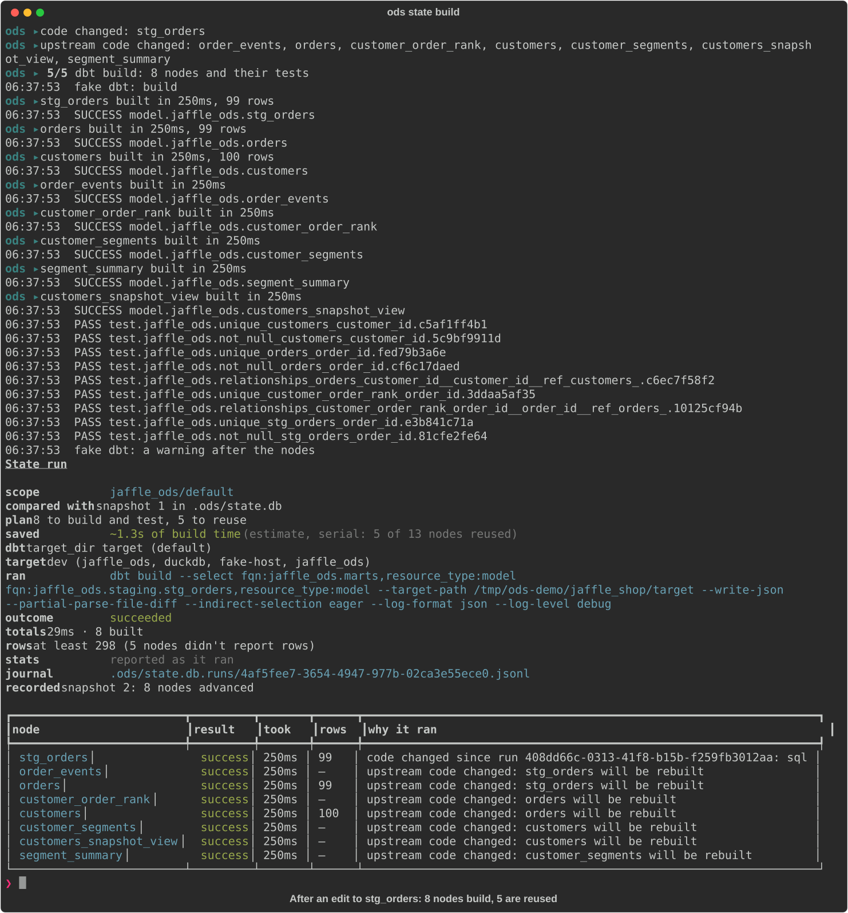

The recordings on this page run the demo project with the repository's fake dbt
(its lines start `fake dbt:`); see [Recording the docs](recordings.md).

### Where source versions come from

A model reading a source is reused only when the source has no new data since the model
was built. ODS picks each source's data version from what it could read, in this order
([ADR-0022](adr/0022-delta-table-versions-as-source-evidence.md)):

1. **The table's own version** (`relation_versions`), on warehouses that have one. On
   Databricks (`metadata.adapter_type` is `databricks` in the manifest), the commands
   that can build (`run`, `build`, `seed`, `snapshot`, `compile`, with or without
   `--dry-run`) ask about every source of the project in one `dbt show` query, through
   dbt's own connection, so ODS handles no credential. For each source that dbt's
   adapter says is a Delta table, it reads `DESCRIBE DETAIL` (the table's id and format)
   and `DESCRIBE HISTORY … LIMIT 1` (its latest version). The version is
   `<table id>/<version>` (exactness `exact`, origin `delta_history`): every commit
   moves it, and a table dropped and created again gets a new id. The step line reads
   `dbt show: reading table versions for N sources`.
2. **`max_loaded_at`** (`source_freshness`), from `dbt source freshness`
   (`sources.json`), for sources with a `loaded_at_field`.
3. **None**: the source counts as changed, and the models reading it build.

A table version wins over `max_loaded_at` when both exist. A source whose table version
can't be read (a view, a table that isn't Delta, one dbt's adapter doesn't confirm is
Delta, e.g. in `hive_metastore`, or an answer without an id or version) falls back to
`max_loaded_at`. If the `dbt show` query fails (a permission error, a table that refuses
`DESCRIBE HISTORY`), every source's table version is unknown and a warning names dbt's
error (the evidence only says the probe failed). Each plan entry says where its
sources' versions came from: evidence `source_version_strategy` (`relation_versions`,
`source_freshness` or `no_version`), `source_version_origin` (the version's own
origin, e.g. `delta_history` or `sources.json max_loaded_at`) and, for each preferred
strategy that could have applied but wasn't used, `source_version_skipped` with the
reason.

Versions from different origins never compare equal, so the first run after table
versions become available (or stop being) builds the readers of those sources once.
Any commit moves a Delta version, including `OPTIMIZE` and `VACUUM`, so maintenance
also rebuilds readers. `ods state plan` and `ods state explain` don't run dbt, so they
read no table versions, and say so; `ods state build --dry-run` does. Other adapters read none yet.

### Source tests

`dbt build` also runs the tests defined on sources (e.g. `not_null` on a raw table).
ODS never builds sources, so no node selection reaches those tests; instead
`ods state build` (unless `--exclude-resource-type test`) and `ods state test` run a
source's tests when (#232):

- they haven't passed since ODS started recording them, or they failed last time;
- they changed (one was added, removed or edited);
- its data version is unknown: `dbt source freshness` didn't measure it (no
  `loaded_at_field`/`freshness`), or measured it before the tests last passed;
- its `max_loaded_at` moved since they last passed: the source has new data.

Otherwise they are skipped: they already passed on this data. Their last pass is
recorded in the target's state against the `max_loaded_at` measured before they ran,
just as a node's tests are recorded against its build. With `--select`, only the
sources a `+name` selector reaches as ancestors are considered (a node selected alone
doesn't bring in its sources' tests, as in dbt). `ods state test --all` runs every
source's tests.

Sources don't need anything built first: `ods state test` on a state database with
nothing recorded yet runs the sources' tests (and no node's) and records them, with
`based_on: null` in JSON. With no sources to test either, it still fails with "ODS has
no recorded builds to test". When a source test fails in `ods state test`, the nodes'
tests that passed in the same run are still recorded as passed: the failing source test
explains the failed run.

The tests run in the same dbt invocation as the nodes, selected exactly
(`fqn:<test fqn>,resource_type:test`). A failing source test fails the command
(`ODS-E0404`), and, as with `dbt build`, the nodes being built that read the source,
and theirs, are skipped: they keep their last state and build next time. The report
lists every source with tests, whether its tests ran and why (e.g. "`raw.orders` has
new data"), and how they ended; in JSON, `source_tests` holds the decisions (`source`,
`name`, `action`: `test` or `skip`, `reasons` with codes `not_tested`,
`checks_changed`, `missing_data_evidence`, `new_upstream_data` or `unchanged`, and
`evidence`), `execution.sources` each source's outcome, and `record.source_tests` the
sources whose tests `passed` or `failed`.

A test is never shown by dbt's id for it, which holds a generic test's arguments (an
`accepted_values` test's id names the values it accepts) (#323). The terminal names it
by what the manifest says it tests: `failed: not_null on orders.customer_id` on the
node's line, `warning: failed checks: …` under the table, a singular test by its own
name, and any other test as `a test on orders (check-1f0c2a9e3b7d)`. In `--output
json`, `execution.checks_failed` and each node's and source's `checks_failed`,
`checks_skipped` and `checks_passed` list tests by their **handle**,
`check-<12 hex digits>` (the first 12 hex digits of the SHA-256 of dbt's id): the same
for the same test in every run and command, and the `node` of a failed test's
explanation in `failures`, whose `check` says what it tests.

It exits 0 when everything built and every test passed, or when there was nothing to
build. It exits 1 with `ODS-E0404` when dbt couldn't run or when nodes or tests
failed; the successes are recorded either way. If recording fails after dbt ran (for
example, another run recorded first), the report says what dbt did, with outcome
`not_recorded`. dbt's own output goes to stderr, so
stdout carries only the report (one JSON document with `--json`).

| Flag | Meaning |
|---|---|
| `-s`, `--select SPEC` | only consider these nodes: `name`, `+name`, `name+`; repeatable |
| `--exclude SPEC` | leave these nodes out (same syntax as `--select`); they keep their last state and stay to build; repeatable |
| `--resource-type model\|seed\|snapshot` | `build` only: only build nodes of these types; the others stay to build; repeatable |
| `--exclude-resource-type model\|seed\|snapshot\|test` | `build` only: leave this type out; `test` builds without tests (and unit tests, dbt 1.8+); repeatable |
| `--full-refresh` | like dbt's: rebuild the selected incremental models and seeds from scratch, **even if unchanged** (reason `full refresh requested`); everything downstream of them that is selected rebuilds too, whatever its lag tolerance, since a full refresh is how data gets corrected (reason `upstream full refresh`; select with `name+` to include it). Models with `full_refresh: false` opt out, as in dbt; tables, views and snapshots follow the plan (dbt never full-refreshes snapshots, and `snapshot` has no such flag) |
| `--vars YAML` | dbt's `--vars`, passed to **every** dbt command ODS runs (freshness, compile, build, test), so the plan and the build see the same values. Values end up in the compiled SQL, so nodes that use them are fingerprinted with them: change a var, and exactly those rebuild. With `--no-compile`, ODS warns if the artifacts were compiled with other vars (dbt records them in `run_results.json`). Don't pass secrets as vars: use `env_var()` |
| `-- DBT_ARGS` | passed to dbt as they are, e.g. `-- --threads 8`. Only options about how dbt runs and logs are accepted: `--threads`, `--log-level`, `--log-format`, `--log-path`, `--printer-width`, `--warn-error`, `--warn-error-options`, `--fail-fast`/`-x`, `--debug`/`-d`, `--quiet`/`-q`, `--(no-)use-colors`, `--(no-)partial-parse`, `--store-failures` and the like. Anything else (selection, target, project, vars, `--empty`, `--sample`, …) is refused: use the ODS option where there is one. dbt's `DBT_*` settings are handled the same way: see [below](#dbt-settings-from-the-environment) |
| `--dry-run` | prepare and plan, but build and record nothing (`compile` always does just that) |
| `--no-compile` | plan from the artifacts already in `--target-dir`. Sources aren't measured either, and only an explicit `--sources` file is read |
| `--no-source-freshness` | don't measure sources; use `--sources` or an existing `sources.json` |
| `--dbt PROGRAM` | the dbt executable; default the configured `program`, then `dbt` |
| `--project-dir DIR` | dbt's; also where ODS finds the artifacts: `DIR/target` unless `--target-dir` says otherwise. Default `DBT_PROJECT_DIR`, then the configured `project_dir`, then `.` |
| `--profiles-dir DIR`, `--target NAME` | dbt's; default `DBT_PROFILES_DIR`, `DBT_TARGET`, then the configured `profiles_dir`, `target` |
| `--dbt-profile NAME` | dbt's `--profile`: the `profiles.yml` profile to use instead of the project's; default `DBT_PROFILE`, then the configured `profile`. (ODS's own `--profile` picks its [configuration profile](#configuration)) |
| `--dbt-output stderr\|capture` | show dbt's output on stderr (default), or capture it and quote the end on failure |

### dbt settings from the environment

dbt reads about 60 `DBT_*` variables as defaults for its flags. ODS handles each one as
it handles the flag (#227):

| Group | Variables | What ODS does |
|---|---|---|
| ODS has an option for it | `DBT_TARGET`, `DBT_PROFILE`, `DBT_PROFILES_DIR`, `DBT_PROJECT_DIR`, `DBT_TARGET_PATH`, `DBT_FULL_REFRESH` | reads it as the default of `--target`, `--dbt-profile`, `--profiles-dir`, `--project-dir`, `--target-dir` (relative to the project, as dbt reads it) and `--full-refresh`; passes the result to dbt as a flag, and removes the variable from dbt's environment. An explicit option wins, as in dbt |
| Beaten by a flag | `DBT_DEFER`, `DBT_FAVOR_STATE`, `DBT_EMPTY`; `DBT_STATE`, `DBT_DEFER_STATE`, `DBT_ARTIFACT_STATE_PATH` (only deferral reads them, and ODS never passes `state:` selectors); `DBT_WRITE_JSON`, `DBT_INDIRECT_SELECTION`, `DBT_PARTIAL_PARSE_FILE_DIFF` | passes `--no-defer`, `--no-favor-state` and `--no-empty` (where dbt has `--empty`), with a warning, so slim-CI settings exported for every job don't stop ODS. `--write-json`, `--partial-parse-file-diff` and `--indirect-selection eager` (for `build` and `test`) are always passed, so `dbt_project.yml`'s `flags:` can't change them either |
| Nothing beats it | `DBT_RESOURCE_TYPES`, `DBT_EXCLUDE_RESOURCE_TYPES`, `DBT_SAMPLE`, `DBT_EVENT_TIME_START`/`END`, the old spellings `DBT_DEFER_TO_STATE` and `DBT_FAVOR_STATE_MODE` (they beat dbt's own flags), `DBT_RECORDER_MODE` and `DBT_PP_FILE_DIFF_TEST` | refuses to start (exit 2) until it is unset, and says why |
| Harmless | logging, colours, printing, parsing, caching, `DBT_FAIL_FAST`, `DBT_WARN_ERROR*`, `DBT_STORE_FAILURES`, … | passed through |
| Not a dbt setting | `DBT_ENV_SECRET_*`, `DBT_ENV_CUSTOM_ENV_*`, your project's own (`env_var('DBT_SCHEMA')`) | passed through; what they change in the code is in the compiled SQL, which is fingerprinted |

The report says which settings were in effect and where each came from, e.g.
`dbt: target prod (DBT_TARGET), target_dir target (default)`; `-v` logs it too.

### Health settings in `ods.toml`

The dashboard's health badges (#354) come from checks that `[health]` tunes
([ADR-0030](adr/0030-configurable-and-pluggable-health-checks.md), #392). Each node gets a
finding from every enabled check that applies to it, and its badge is worked out from
them:
- **Failing:** a check at severity `error` failed.
- **Unknown:** a check couldn't decide, e.g. the node was never built. With
  `unknown_counts_as = "warning"`, this is a warning instead. It is never healthy.
- **Warning:** a check at severity `warn` failed.
- **Healthy:** every enabled check that applies passed. A check at severity `info` is
  shown but changes nothing.

If no enabled check applies to a node, it is unknown.

The built-in checks, and their defaults:

| Check | Default | Fails when |
|---|---|---|
| `built` | on | never fails; a node ODS never built is *unknown*. Turned off, nodes are judged on the other checks alone |
| `last_run_failed` | `error` | it failed in the last run (from the run's record, for this scope) and hasn't been built since. Without a record of this scope's last run (`ods state build`/`run` keep one beside the store), it can't decide: *unknown* |
| `last_run_skipped` | `warn` | it was skipped in the last run because something upstream failed; *unknown* without the record, as above |
| `tests_required` | `warn`, models and snapshots | no test reads it |
| `tests_passed` | `warn` | it has tests, and they weren't recorded passing on its current build, or changed since |

```toml
[health]
unknown_counts_as = "unknown"            # or "warning"

[health.builtin.tests_required]
severity = "error"                       # error | warn | info | off
select = { path = ["models/marts/**"] }  # replaces the check's default scope
exclude = { tags = ["experimental"] }

[health.builtin.last_run_skipped]
severity = "off"
```

- **Selectors:** `select` and `exclude` take `resource_type`, `tags`, `path` (globs
  over the node's file) and `name`. A node matches when it matches every field that is
  set, and any value within a field. A node whose file isn't known never matches a
  `path`.
- **Home's Failing count** counts nodes a check at severity `error` failed on. When the
  last run's failures aren't known but another check is at `error`, it reads *at least*.
- **Errors:** a check that doesn't exist, or a glob that isn't valid, is a configuration
  error when `ods serve` starts (exit 4, `ODS-E0102`). So is a declared check that can't
  run as written (below).
- **Explanations:** each badge's tooltip and its `findings` in `/api/catalog` say which
  check concluded what. The Catalog's legend lists the checks as configured.

#### Declared checks

A project can declare its own checks over what its metadata says, under
`[[health.checks]]`. They need no build or warehouse: the project says what each node
has, so they pass or fail, and are never *unknown*.

```toml
[[health.checks]]
id = "marts.documented"                  # unique; not a built-in's
select = { path = ["models/marts/**"] }  # every node when not set
exclude = { tags = ["experimental"] }
require = ["description", "test:unique"]
severity = "warn"                        # the default; error | warn | info | off
```

`require` lists what every selected node must have:

| Requirement | Met when the node has |
|---|---|
| `description` | a description that isn't blank |
| `tests` | at least one test |
| `test:<type>` | a test of that type, e.g. `test:unique`, `test:not_null`, or a custom generic test's name |
| `constraints` | at least one column constraint |
| `tag:<tag>` | that tag |

A node lacking any of them fails, and the finding names what is missing (e.g.
``marts.documented: no description; no `unique` test``); its `evidence` lists `require`
and `missing`. A node the check doesn't select is skipped. The dashboard and
`ods health check` both run declared checks on the project as it is now; they are listed
as `declared` in the legend and in `ods health check`'s output (`source: declarative` in
JSON). An id that isn't valid, is a built-in's or is used twice, an empty `require`, a
requirement not in the table, or a `kind` other than `declarative` is a configuration
error (exit 4, `ODS-E0102`).

#### Coverage targets

`[health.coverage.<measure>]` sets the share of the project a coverage measure on Home
must cover. Coverage is about the project as a whole, so a missed target never changes a
node's badge: it shows on Home's bar and in `ods health check`.

```toml
[health.coverage.tests]
target = 0.8          # 80% of models have tests
severity = "error"    # missing it fails `ods health check`; default warn

[health.coverage.descriptions]
target = 0.5
```

The measures are Home's: `tests`, `descriptions`, `constraints` (models with each) and
`source_freshness` (sources whose new data ODS can measure). A target is met when the
covered share reaches it, missed when it doesn't, and *unknown* when there is nothing to
measure (e.g. no sources); unknown is never met. Home draws each target on its bar and
says whether it is met, with why in the tooltip, and `/api/home` gives each coverage
row's `target` verdict. `ods health check` measures as the dashboard does, reading source
freshness results from `--sources` or `<target-dir>/sources.json`. Targets and shares
are kept to the thousandth (`0.875` is 87.5%); a share is said to the thousandth below,
so it never reads past a target it misses. A measure that doesn't exist, or a target
outside 0 to 1 or finer than a thousandth, is a configuration error (exit 4,
`ODS-E0102`).

The trust store, warehouse probes, scripts and plugins come in later phases of #392.

### ods health check

`ods health check` runs every enabled check on the project's nodes and prints their
health, the checks that ran and why each node that isn't healthy isn't. It gives CI a
health gate ([ADR-0030](adr/0030-configurable-and-pluggable-health-checks.md) §6):

```sh
ods health check                  # exit 5 when a check at severity error fails
ods health check --strict --json  # also when one couldn't decide; one JSON document
ods health check --no-record      # don't keep the findings
```

It takes the options `ods state` commands take to find the project and the state store
(`--project-dir`, `--target-dir`, `--state-db`, `--environment`, …), and reads them
only: no database is created or migrated, and dbt isn't run.

| Outcome | Exit |
|---|---|
| no check or coverage target at severity `error` failed | 0 |
| one did | 5, `ODS-E0701` |
| with `--strict`, one at severity `error` couldn't decide (*unknown*) | 5, `ODS-E0701` |
| `[health]` is invalid | 4, `ODS-E0102` |
| the project or the store can't be read, or the record can't be written | 1 |

With the defaults, only `last_run_failed` is at severity `error`, so the gate fails on
nodes that failed in the last run and haven't been built since. Raise any other check
to `error` in `[health]` to gate on it too.

- **The health record:** each check run is kept beside the state store, in
  `<state db>.health/` (e.g. `.ods/state.db.health/2026-10-06T09-00-00Z-001.json`), as JSON
  with a `schema_version`, the scope, the time, the checks that ran and every node's
  findings. The newest 20 are kept. A record is written whole, then renamed into place,
  so a reader never sees half of one, and a check run that fails leaves the others as
  they were. Nothing is recorded without a state store, or with `--no-record`.
- **On the dashboard:** `ods serve` works the built-in checks out itself, and takes
  every other check's findings from the newest record for its scope, so those count in
  the badges and the counts on Home and in the Catalog. Their results age: the "how"
  text names them and when they ran, and `/api/home` and `/api/catalog` give that time
  as `health_recorded_at`. A node the record doesn't cover (added since) is *unknown*
  for those checks, never healthy. A new record reloads the page.
- **Registered checks:** checks registered through the `health_check` contract (SDK 0.9)
  run beside the built-ins, each under a 60-second timeout. One that errs, times out,
  leaves a node unanswered or answers it twice is *unknown* for those nodes, never a
  pass; one that answers about a node it wasn't asked about is *unknown* for every
  node. Plugins that register them come with #387's loader.
- **Evidence:** each finding in `--json` and in the record carries `evidence`, what it
  was concluded from as sorted keys and values (e.g. `run_id`, `built_at`,
  `last_run_command`, `tests`), beside its `reason` for people.

### State settings in `ods.toml`

A project can keep its settings in [configuration](#configuration), so every `ods state`
command is one word (#214):

```toml
[state]
db = ".ods/state.db"          # --state-db
environment = "dev"           # --environment

[state.cost]                  # what reuse saved, as a cost: `ods state savings`
rate_per_hour = 4.0           # what an hour of build time costs, at least 0
unit = "USD"                  # what it's counted in, as shown: `USD`, `credits`, …

[providers.dbt]
kind = "dbt"

[providers.dbt.settings]
program = ".venv/bin/dbt"     # --dbt
project_dir = "transform"     # --project-dir
profiles_dir = "transform"    # --profiles-dir
profile = "warehouse"         # --dbt-profile
target = "dev"                # --target
target_dir = "transform/target"   # --target-dir

[profiles.ci.providers.dbt.settings]
target = "ci"
```

- **Precedence**, highest first: the flag; the `DBT_*` variable dbt itself would read
  (`DBT_TARGET`, …); configuration, with its own layers (`ODS__…` variables, the active
  profile, `.ods/local.toml`, `ods.toml`, the user file); the default. So
  `DBT_TARGET=prod ods state run` builds in `prod` whatever `ods.toml` says, and
  `ods state run --target qa` beats both.
- **Paths** in a file are read against that file's directory, so `ods.toml` means the
  same from any directory below it. `program` is a path only if it names a directory;
  `program = "dbt"` is looked up on `PATH`.
- **Environment:** `--environment`, else `state.environment`, else the dbt target,
  else `default`. Setting `state.environment` stops the target from choosing it: ODS
  still checks which target the state was built in, so another target's state is
  never reused (#227).
- **Only one** `kind = "dbt"` provider may be configured; its name is yours to choose.
- **No credentials:** dbt's own `profiles.yml` holds those; nothing here is one.

`ods config explain state.environment` says where a value came from, and the report's
`dbt` line names each setting's source (`project config`, `profile ci`,
`ODS__STATE__ENVIRONMENT`, …).

### Retrying a run

When a run fails, the nodes that built are recorded. Failed nodes, the ones dbt skipped
because of them, and nodes whose tests failed keep their last state, so running the
same command again builds exactly those. It also builds anything else that changed
since. `ods state retry` saves retyping that command (#276):

```sh
ods state build -s +orders --vars '{region: eu}'   # stg_payments fails; orders is skipped
# … fix stg_payments …
ods state retry                  # runs `ods state build -s +orders --vars '{region: eu}'` again
ods state retry --dry-run        # plan the retry; build and record nothing
```

- **Planned afresh:** unlike `dbt retry`, it doesn't replay a list of failed nodes.
  The plan picks up a fix made in between, and reuses what already succeeded. To build
  only what failed, use `--failed` ([below](#retrying-only-what-failed)).
- **What it keeps:** every `run`, `seed`, `snapshot`, `build` and `test` that isn't a
  dry run keeps its command line beside the state database, in
  `.ods/state.db.last-run.json`. Only what was typed is kept. Environment variables
  (`DBT_TARGET`, …) and configuration are read again when retrying, as for any
  command, so none of their values is written down.
- **Values that may be secret aren't kept** (#321): of `--vars` and what follows `--`,
  the file keeps only that they were given, never their values or a digest of them.
  `retry` asks for them again, and refuses without them, or with ones the last run
  didn't have:

  ```sh
  ods state build -s +orders --vars '{api_key: …}' -- --threads 8
  ods state retry --vars '{api_key: …}' -- --threads 8
  ```

  The other options (`--select`, `--target`, `--dbt-profile`, paths, …) are kept as
  typed. A last-run file written by an older ODS (before format 1.3) is read without
  those values, and rewritten without them the first time `retry` reads it, even with
  `--dry-run`: removing a secret is the one change a dry run makes. A file with an
  option this ODS doesn't know is removed instead, as which of its words are values
  can't be told.
- **One last run per state database:** `retry` reruns whichever command ran last,
  whatever its target. It prints what it runs on stderr, e.g. retrying
  `ods state build -s +orders`. `--state-db` picks the database, as elsewhere, and the
  retry runs against the database it was found in, even if configuration now names
  another. `--dry-run` plans without building, except after `ods state test`, which has
  no dry run.
- **Nothing to retry:** with no run kept yet, `retry` fails with `ODS-E0403`.

#### Retrying only what failed

`ods state retry --failed` is closer to `dbt retry` (#292): it reruns the same command,
but builds only the nodes that failed, or were skipped because of a failure, in the
last run, and runs the tests only of the sources whose tests failed. Nothing that
changed since builds.

```sh
ods state build                  # customer_segments fails; segment_summary is skipped
# … fix customer_segments, and meanwhile edit order_events …
ods state retry --failed         # builds customer_segments and segment_summary only
ods state retry --failed --dry-run   # plan it; build and record nothing
```

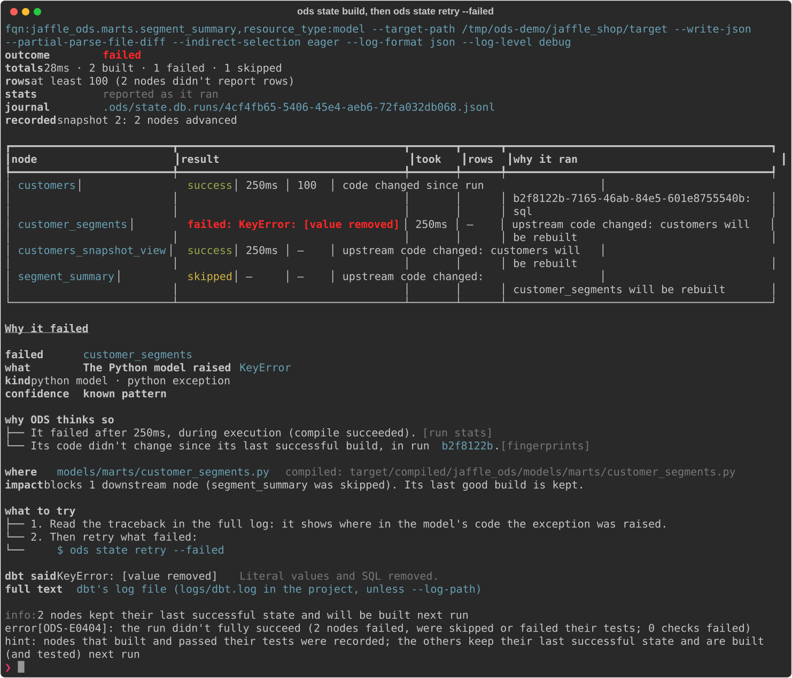

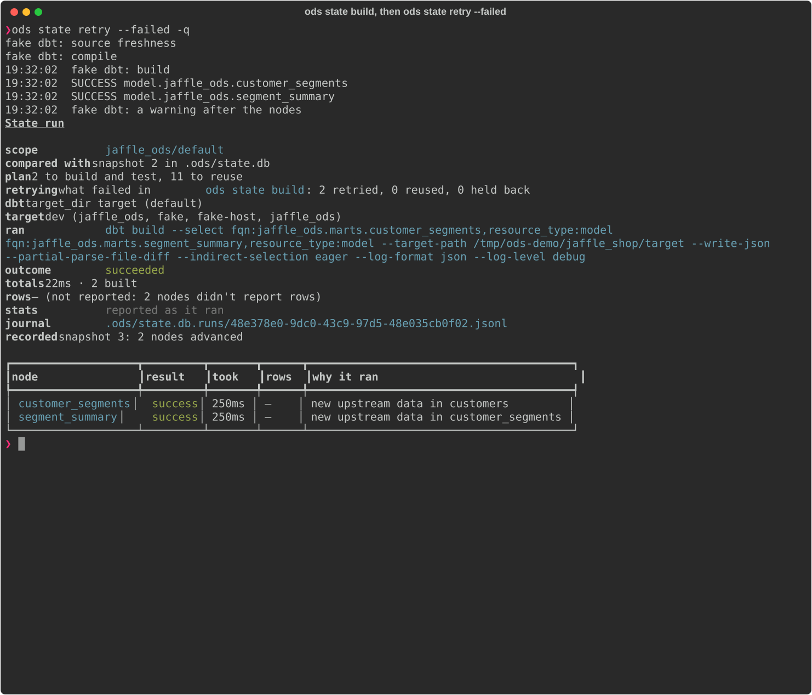

The same session can be [replayed in the browser](assets/recordings/state-retry/state-retry.html).

- **What it keeps:** once dbt has built, the last-run file also keeps the outcome:
  the ids of the nodes that failed (or whose tests failed), those skipped, and the
  sources whose tests failed. A run whose results couldn't be recorded counts every node
  it ran as failed. The file is format 1.1; a 1.0 file from an older ODS still reads.
- **Still planned:** every node goes through the planner, as in any run. A failed node
  the plan now reuses (e.g. its last successful build still matches) is reused, and the
  report says why.
- **Nothing new:** nodes the plan would build that weren't among the failures are not
  built. The report lists them as *changed since, not retried*; `ods state retry`
  without `--failed`, or the command itself, builds them.
- **Never on stale input:** a node to retry that reads a node the plan builds but the
  retry doesn't (one changed since, or held back itself) is *held back*: not built, with
  the parent it waits on. It stays in the outcome, so the next `retry --failed` tries it
  again.
- **Nothing to retry:** if the last run succeeded, or its file doesn't keep an outcome
  (written by an older ODS, or the run stopped before dbt finished), `--failed` says so
  and fails with `ODS-E0403` without running dbt. After `ods state test`, which already
  runs only the tests that haven't passed, `--failed` is a usage error (exit 2); plain
  `retry` reruns it.
- **JSON:** the report of a `--failed` retry has a `retry` object: `of` (the command
  line retried), `retried` (node ids built again), `reused`, `held_back` and
  `changed_since` (each `{node, reason}`), `not_planned` (failed nodes the plan no longer
  has), `source_tests` and `source_tests_changed_since` (source ids). Empty lists are
  left out. Without `--failed` the report has no `retry` object.

### What you see while it runs

ODS runs the dbt CLI as a child process: up to five invocations, one after another,
each starting with dbt's usual `Running with dbt=…` banner:

| # | dbt command | Why | Skipped with |
|---|---|---|---|
| 1 | `dbt source freshness` | measure source data, so nodes reading changed sources build | `--no-source-freshness`, `--no-compile` |
| 2 | `dbt compile` | compiled SQL for every node, which the fingerprints need | `--no-compile` |
| 3 | `dbt compile --inline …` | which target dbt builds in ([state per target](#state-plan-record-history)); renders the profile, connects to nothing | |
| 4 | `dbt show --inline …` | whether the tables of the nodes ODS would reuse still exist, and, on Databricks, the sources' table versions ([below](#where-source-versions-come-from)) | nothing to reuse and no table versions to read |
| 5 | the command's namesake with `--select …`: `dbt run`, `seed`, `snapshot` or `build` (`build --exclude-resource-type test --exclude-resource-type unit_test` without tests) | build exactly the plan's BUILD set | `compile`, `--dry-run`, or nothing to build |

`ods state test` runs 1 to 3 the same way, then `dbt test --select …`. In both, the
dbt command's step line counts the sources whose tests run with it, e.g. `dbt build:
8 nodes and their tests, and the tests of 1 source`, and the plan summary names them
(`source tests to run: raw.orders (new data)`).

- **ODS's step lines** on stderr say which dbt command is about to run and why, since
  dbt starts each one with the same banner; the plan is summed up between them:

  ```text
  ods ▸ 1/5 dbt source freshness: how new each source's data is
  ods ▸ 2/5 dbt compile: the code as it is now, for the plan
  ods ▸ 3/5 dbt compile --inline: which target dbt builds in
  ods ▸ 4/5 dbt show: are the tables of 5 nodes ODS would reuse still there?
  ods ▸ plan: 8 to build, 5 to reuse
  ods ▸   code changed: stg_orders
  ods ▸   upstream code changed: order_events, orders, customer_order_rank, customers, …
  ods ▸ 5/5 dbt build: 8 nodes and their tests
  ods ▸ stg_orders built in 250ms, 99 rows
  ```

  What builds is grouped by its main reason, with long lists cut short; reused nodes
  are only counted (`-vv` or `ods state plan` names each one and why).

  When nothing needs building, the last line is `ods ▸ nothing to build, so dbt
  doesn't run again`. `-q` turns them off.
- **dbt's output** (its log lines: `1 of 13 START …`, `OK created …`, the summary)
  streams to **stderr** as dbt writes it. For the build or test itself, ODS asks dbt
  for its structured log (`--log-format json --log-level debug`) to read each node's
  progress (#322), and prints dbt's lines as `HH:MM:SS  message`, with the time in
  UTC and dbt's colours dropped, from the level dbt would show: `info`, or what
  `DBT_LOG_LEVEL`, `-- --log-level` or `-- --quiet` ask for. Those only filter what is
  shown: dbt is always asked for `--log-level debug`, so the node progress keeps
  coming. dbt's debug lines, which hold the SQL it runs and the options it was given,
  are never shown: `debug`, `-- --debug` and `-- -d` show `info` and above (the full
  debug log is in `logs/dbt.log`). A line that should be one of dbt's JSON lines but can't be read (cut short,
  or merged with other output), or one with no level, shows as `[an unreadable dbt log
  line is hidden]`; other lines, such as a Python model's `print`, show as they are
  unless they hold a `{`. dbt's own error lines are shown as dbt shows them, and can
  quote values; ODS's report, `--json`, and the run journal only ever hold the redacted
  summary. Pass `-- --log-format text` to have dbt print as usual:
  the run's stats then come from `run_results.json` at the end, not live. With
  `--dbt-output capture` dbt's output is hidden, and the last lines are quoted in the
  error if dbt fails.
- **Each node's result**, as it finishes, is a step line too: `ods ▸ orders built in
  4.2s, 99 rows`, `ods ▸ customers failed in 3.6s (KeyError: [value removed])`,
  `ods ▸ segment_summary skipped`. The report explains each failure (see
  [Why a node failed](#why-a-node-failed)).
- **`--vars` values** never appear in what ODS prints, logs or reports: the command
  lines it logs (`-v`), the report's `dbt` and `ran` lines, and `execution.command` in
  `--json` show `--vars '[value removed]'`. dbt still gets them.
- **ODS's report** (the plan, the exact dbt command it ran, the outcome, the run's
  totals, what was recorded, and a table with each node's result, time taken, rows and
  why it ran) is printed to
  **stdout** once dbt has finished, or as one JSON document with `--json`. So
  `ods state run --json > run.json` keeps dbt's progress on the terminal and the
  report in the file.
- **dbt's own files** are written as usual: `logs/dbt.log` in the project (dbt's debug
  log), and `manifest.json`, `run_results.json` and `sources.json` in the target
  directory. ODS reads those artifacts; it keeps its state in `.ods/state.db`.
- ODS writes no log file of its own. Its logs go to stderr, at the level set by
  `--log-level`, `ODS_LOG`, `-v`/`-q` or `log.level` in the configuration (e.g.
  `ODS__LOG__LEVEL=debug`), in that order:

  | Level | Shows |
  |---|---|
  | `warn` (default) | the step lines and warnings |
  | `info` (`-v`) | each dbt command line ODS runs, its exit code and time, and what was recorded |
  | `debug` (`-vv`) | also each node's plan decision and why, dbt's result per node (tests passed, failed, didn't run), and nodes that kept their last state |
  | `trace` (`-vvv`) | also libraries' logs, e.g. every statement the state store runs |
  | `error` (`-q`), `off` | errors only (or nothing): no step lines |

  dbt's own console level can be passed through (`-- --log-level warn`, `-- -q`): it
  filters what is shown, as above. Its debug lines are never shown; dbt writes its
  debug log to `logs/dbt.log`.

### Run stats and the run journal

Every `run`, `seed`, `snapshot`, `build` and `test` that runs dbt reports each node's
stats (#322, [ADR-0024](adr/0024-run-events-node-stats-and-run-journal.md)):

| Stat | From dbt | When dbt doesn't say |
|---|---|---|
| result | the node's status | `unknown`, never success |
| time taken | `execution_time`; compile and execute times from `timing` | `—` |
| rows | `adapter_response.rows_affected` | `—`: many adapters report none for views, tables built with `create table as`, or merges (DuckDB reports rows only for seeds) |
| thread | the thread that ran it | `—` |
| other values | the rest of `adapter_response` (e.g. `code`, a query id), never its `_message` | not shown |
| error | the error's kind and first line, with quoted values, numbers and SQL removed; the full text stays in `logs/dbt.log` | — |
| tests | how many of its tests passed, failed, warned or didn't run | not run |
| a failed test's rows | `failures` (`num_failures` in dbt's log): how many rows the test returned, a count, never the rows | — (never `0`) |

The report's totals give the run's time, how many nodes built, failed or were skipped,
and the rows written: `at least 17 (6 nodes didn't report rows)` when some didn't
report. `--json` has it all under `run_stats`: `nodes` (each with its `stats`) and
`totals`. A stat that isn't reported is `null`, never `0`.

### What reuse saved

Each build's time (the engine's own timing, as above) is recorded with its state, and
kept while the build is reused (#210, [ADR-0029](adr/0029-build-timings-and-the-run-ledger.md)).
`ods state record` takes it from `run_results.json`'s `execution_time`. So a run that
reuses builds says what that saved:

```text
saved: ~2.3s of build time (estimate, serial: 9 of 13 nodes reused)
```

It is an estimate: the sum of each reused node's last measured build, so it overstates
the wall-clock time of a parallel build, and tests aren't counted. A reused node without
a build time (built before ODS recorded them, or its run didn't say) is counted, never
guessed: the line then says how many and that the figure is at least this. When no
reused node has a time yet, it says so instead of a figure. `--json` (and `ods state
plan --json`, for what a run would save) has `savings`: `reused`, `built`, `timed`,
`untimed`, `avoided_ms` and `timed_by`, the runs whose timings it used. Snapshots
record each node's `build_ms` from state schema 1.3; older snapshots read as untimed.

Every run that goes ahead (not `--dry-run` or `compile`) also adds an entry to the state
database's **run ledger**: what it reused, each with the build time it had then, and
what it built, failed or skipped. A run with nothing to build is in it too, under an id
of ODS's own (`ods-<milliseconds>`), though it commits no snapshot and writes no journal.
The ledger is evidence, not state: nothing ODS plans reads it, and if an entry can't be
written the run warns and carries on. `ods state savings` reports from it:

```sh
ods state savings                      # per run (the 20 newest) and in total
ods state savings --since 2026-10-01   # only runs since then (a date, or RFC 3339)
```

```text
What reuse saved in jaffle_ods/default

saved: ~5.5s of build time (estimate, serial: 22 of 39 nodes reused across 3 runs)
timings from: 1 run

Runs
run                                   finished              outcome           reused  built  saved
4f0f6f7c-0b7e-4d2a-9a51-2f7b6c1d9e10  2026-10-05T09:12:03Z  succeeded         9       4      ~2.3s
ods-1791198700123                     2026-10-05T09:11:40Z  nothing to build  13      0      ~3.3s
0c9a1e52-6d3b-4f8e-8f2a-7a4c9d0b1e33  2026-10-05T09:10:58Z  succeeded         0       13     none
```

With `[state.cost]` in `ods.toml` (above), the report also says what the time avoided
cost at that rate: a `cost avoided` line (`~3.25 credits (estimate, at 3600 credits per
hour of build time, [state.cost])`), a column per run, and `cost` in JSON (`total`,
`rate_per_hour` and `unit`, and each run's `cost`). It is an estimate like the time: ODS
knows no warehouse's prices, only the rate you give it. The dashboard's Runs page shows
the same totals (`savings` in `/api/state/runs`).

(Columns are aligned here; `--output plain` separates them with tabs.) Only what the
command would otherwise have built counts as reused: its kinds of node (`ods state seed`
saves nothing by reusing models), or, for `retry`, what failed. A run that reused
nothing shows `none`; one whose reused nodes have no build time shows `at least` its
figure, or `—` when none has one. Reading changes nothing: a database not yet migrated
to the ledger reports no runs. `--json` has `run_count`, `runs` (each with `run_id`, `finished_at`,
`outcome` and the fields of `savings` above) and `totals`, with `estimate: true`. Runs
from before the ledger existed (ODS 0.0.1) aren't in it. The ledger is the `runs` table
of the state database, added by its migration 2 (the database is copied first, as
for every migration, [ADR-0018](adr/0018-state-store-migrations-and-recovery.md)).

`ods state history --run <run_id>` shows the same stats for any run whose journal is
kept (below):

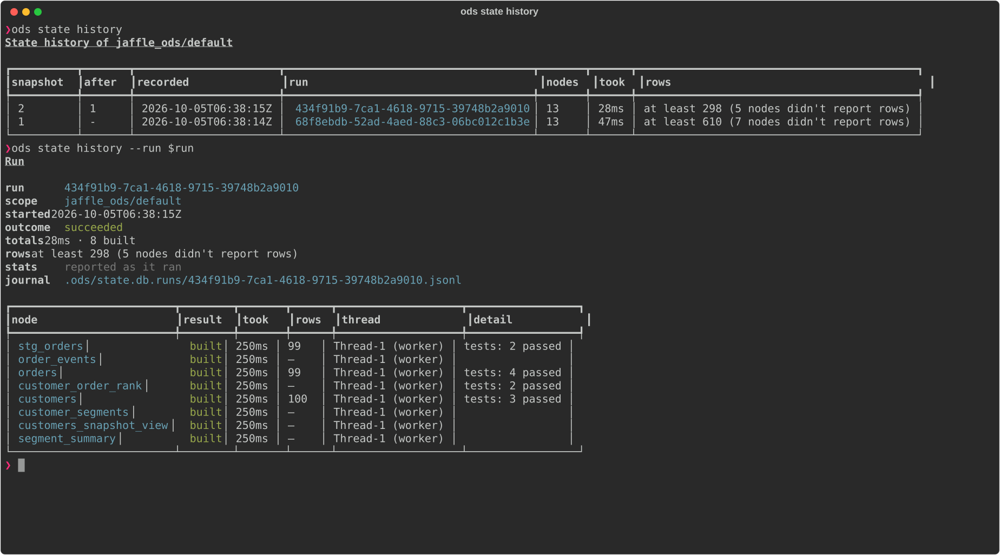

The run's events are also appended, as they happen, to a **journal** beside the state
database, `<state-db>.runs/<run_id>.jsonl` (`journal` in the report), under the same
run id as `.last-run.json` and the snapshot the run records. It is one JSON event per
line (`run_started`, `node_queued`, `node_started`, `node_finished`, `check_finished`,
`run_finished`), each with its `schema_version` (1.1 since a `check_finished` that
didn't pass may carry `failures`, the rows dbt counted, and `error`, its redacted
message; 1.2 since an error may carry `outer_kind`, dbt's header kind, when the
message has a kind of its own; earlier journals read as before), and is flushed line by line, so it can
be followed while the run goes. A `check_finished` names the test by dbt's id, as
dbt's own `run_results.json` and `manifest.json` beside it do; ODS shows that id
nowhere else (it may hold a generic test's arguments), only the test's handle. It is evidence, not state: a failed run keeps its
journal, and nothing ODS decides reads it. It holds no SQL, no `--vars` values and no
secrets: no options at all, and errors only as the redacted summary above. The 50 most
recent journals are kept; older ones are deleted when a run starts. `ods state history
--run <run_id>` shows a run from its journal.

### Why a node failed

When a node fails, the report ends with **Why it failed**: each failed node explained, in a
frame of its own in the terminal,
in plain language (#323, [ADR-0025](adr/0025-error-explanations.md)). `ods state run`,
`seed`, `snapshot`, `build` and `test` show it, and so does `ods state history --run
<run_id>` for any run whose journal is kept.

```text
failed: customers
what: A column this model reads no longer exists upstream
kind: database error · missing column
confidence: known pattern + evidence

customers reads first_name from stg_customers, but that model no longer produces it.

why ODS thinks so
  Column lineage: stg_customers now outputs given_name, not first_name, from the same input column.  [column lineage]
  stg_customers changed in this run (sql) and was rebuilt first.  [fingerprints]
  customers last built fine in run 92204c6b, before that change.  [run history]
  It failed after 62ms, during execution (compile succeeded).  [run stats]

where: models/marts/customers.sql  reported at line 25 of the code it ran · compiled: target/compiled/jaffle_ods/models/marts/customers.sql
impact: blocks 3 downstream nodes (customer_segments, customers_snapshot_view, segment_summary were skipped). Their last good builds are kept.

what to try
  1. Use given_name in customers, or restore first_name in stg_customers.
  2. See what else reads stg_customers.first_name:
    $ ods lineage impact --column model.jaffle_ods.stg_customers.first_name=removed
  3. Then retry what failed:
    $ ods state retry --failed

dbt said: Binder Error: Values list [value removed] does not have a column named [value removed]  Literal values and SQL removed.
full text: dbt's log file (logs/dbt.log in the project, unless --log-path)
```

- **What and kind:** a headline, and the category (`compilation error`, `dependency or
  ref`, `database error`, `permission`, `timeout or lock`, `connection`, `python
  model`, `test failure`, `configuration or profile`, `internal error`), with what ODS
  recognised (e.g. `missing column`, `missing schema`, `missing SQL function`, `unknown
  macro`, `missing ref`, `type mismatch`, `warehouse unavailable`).
- **Confidence:** `known pattern + evidence` when a pattern recognised dbt's error and
  ODS's own evidence confirms it (column lineage for a missing column, the project's
  macros for an undefined macro), about exactly one candidate and from the code the run
  ran; `known pattern` when nothing confirms it (or several candidates are listed, or,
  for an older run, the evidence is the project as it is now); `not recognised` when
  no pattern does. An unrecognised error never gets a guessed cause: the headline only
  says what happened ("The warehouse rejected the query"), and **what ODS knows** lists
  facts: how long it ran and in which phase, whether its code changed since its last
  successful build, new upstream data (with the versions), and how it did in its last
  runs ("It failed the same way in 2 of its last 5 runs").
- **Where:** the model's file (with the line of an undefined macro's call), and the line
  dbt's adapter reported in the code it ran, which adapters wrap: it isn't a line of
  the source file.
- **What to try:** steps and commands to copy, only real ones: `ods lineage impact
  --column <unique id>.COLUMN=removed`, `ods state retry --failed` (with `--state-db`
  when you passed one, and only for the last run), `ods doctor`, and dbt's own (`dbt
  deps`, `dbt debug`); "did you mean" for a macro with a close name, and for a `ref()`
  to a model that doesn't exist: up to three models, seeds or snapshots of the project
  within two edits of the name, closest first ("Did you mean `customers`?"). That is a
  guess from the names, never evidence of a typo, so it doesn't raise the confidence;
  the name the `ref()` used is never shown (only dbt's message holds it), only the
  project's own names. When dbt wrote no manifest (it doesn't when a `ref()` can't be
  resolved), the names come from the one it wrote last.
- **ods doctor:** for a profile or target dbt can't find, or missing credentials, ODS
  runs `ods doctor`'s local configuration checks right after the failure (none runs
  dbt, connects or writes anything): `config.load` and, for credentials,
  `config.values` (after a failure before any node ran), and `config.resolution`,
  which shows the `profiles_dir`, `profile` and `target` ODS gives dbt and where each
  came from. Each is evidence marked `[ods doctor]` (`source: doctor` in JSON, with
  `data.check` and `data.status`). A profiles directory with no `profiles.yml`
  (`ODS-W0510`) confirms a missing profile (`known pattern + evidence`); otherwise the
  checks are context, since ODS never reads `profiles.yml`. `ods state history --run`
  doesn't run them: the configuration may have changed since the run.
- **Impact:** the nodes it blocked, and whether their last good builds are kept.
- **dbt said:** dbt's message, only as the redacted summary kept in the journal.
  Nothing else in an explanation comes from dbt's text: the names in it come from
  ODS's own evidence.

A failed **test** is explained too, under **Why it failed** (or **Why 1 node and 2
tests failed**): which test, on which column of which model, and how many rows don't
pass, named by what the test tests (its kind, column and model, from the manifest),
never by the name dbt gives a generic test, which can hold its arguments:

```text
test not_null on customers.customer_id failed
what: The not_null test on customer_id of customers failed: 5 rows don't pass
kind: test failure · test failed
confidence: known pattern + evidence

why ODS thinks so
  dbt reported 5 rows that fail the test.  [run stats]
  The project declares it as a not_null test of column customer_id on customers.  [project]
  customers changed in this run (sql), so the test checked its new build.  [fingerprints]
  This test failed in 2 of its last 3 runs too.  [run history]

where: models/schema.yml

what to try
  1. See the rows that fail: run the test again, keeping them in a table in the warehouse:
    $ ods state test --select customers -- --store-failures
  2. Fix the data, the model or the test, then test customers again:
    $ ods state test --select customers

dbt said: Got [value removed] results, configured to fail if != [value removed]  Literal values and SQL removed.
```

- It is `known pattern + evidence` when dbt reported how many rows failed, `known
  pattern` when it didn't (the headline then says dbt didn't say how many, never `0`).
  A test's arguments (e.g. the values `accepted_values` accepts) are never shown.
- A test that **errored** (it couldn't run, e.g. its query reads a column that doesn't
  exist) is explained like a failed node's error, from dbt's message, never as rows
  that failed: "The `not_null` test on `customer_id` of `customers` couldn't run".
- A test that only **warned** (`severity: warn`) isn't explained: it failed nothing.
- In `ods state test`, where nothing is built, a model that is untested because its
  test failed is explained by the test, not as a failed model.
- `--store-failures` is one of the dbt options ODS passes through after `--`; the dbt
  provider offers it for a failed test (other engines may offer their own, or none).
- When the run didn't build the tested model (e.g. in `ods state test`), the evidence
  says which build of it ODS last recorded ("The last build ODS recorded for `customers`
  is from run `…`"), not which one the test read.
- With no message from dbt and no count, the headline is just "A test failed".

When dbt fails before any node runs (e.g. `dbt compile` can't compile a model that
calls an undefined macro), the report says `failed before any node ran: nothing was
built or recorded` (`outcome: failed_before_running` in JSON) and explains dbt's error
the same way. An error after dbt started building isn't reported this way: its hint
names the run's journal, which `ods state history --run` explains.

`ods serve` shows the same explanations on the Run page's Nodes tab and in the Runs side
panel (`explanation` on each failed node in `/api/state/runs/<run_id>` and
`/api/state/runs`, and `failed_tests` on each node a failed test checks), with Copy
buttons for the commands; on the Nodes tab the side panel gives each failed node's (and
failed test's) headline with a link to its row. A failed test is shown under each node
it checks; one that checks no node the run shows (dbt didn't say which, or it checks a
node the run didn't run) is listed in the Run page's **Failed tests** section
(`failed_tests` in `/api/state/runs/<run_id>`). `ods state retry --failed` is
offered only for the last run, which is what it retries. Beyond loopback, explanations
leave out file paths and where dbt's full message is, as the Catalog does.

`--output json` includes the explanations as `failures` (in `ods state history --run`, too):
each has `schema_version` (1.3), `node` (for a failed test, its handle,
`check-<12 hex digits>`, the same for the same test in every run: never dbt's id for
it, which holds a generic test's arguments), `check`
(for a failed test: `covers`, the nodes it checks, and its `test` kind and `column`
when the manifest says), `category`, `symptom` (when recognised),
`confidence` (`known_pattern_with_evidence`, `known_pattern`, `not_recognised`),
`pattern` (`catalogue`, `version` and `id` of the pattern that matched), `headline`,
`detail`, `evidence` (each with `source`: `plan`, `fingerprint`, `column_lineage`,
`project`, `source_versions`, `run_history` or `run_stats`; its `text`; whether it
`confirms` the pattern; and, for missing columns, undefined macros, a test's failing
rows (`failing_rows`) or what it tests (`test_target`), its `data`),
`location` (`file`, `line`, `compiled_file`,
`reported_line`), `suggestions` (`text`, `commands`), `impact` (`blocked`, `kept`) and
`engine_message` (`engine`, `kind`, `message`, `details_at`). Text marks names as code
with backticks. Explanations are computed when shown, never stored, so an older run is
explained with the patterns ODS has now. The error summary in `run_stats` and the
journal gains `line`, the line dbt's adapter reported.

It also takes `--target-dir`, `--state-db`, `--environment` and `--sources`, as below.
Don't run other dbt commands against the same target directory while it runs.
ODS checks that the manifest it records from comes from its own build, and records
nothing if it doesn't.

### ods state explain-failure

`ods state explain-failure <node> [--run <run_id>]` explains one node's failure (#348),
in the last run by default, or in any run whose journal is kept. It gives the same
explanation as `ods state history --run`, without the rest of the run.
- `<node>` is a model, seed or snapshot by name or unique id. A failed test is named by
  its handle (`check-…`, as the explanations show it) or its name.
- The last run is the last of the project's scope (its target), as `ods state history`
  lists it.
- A model that built while tests on it failed gets those tests' explanations.
- A node that didn't fail says how it ended (`outcome`: `succeeded`, `skipped`,
  `warned`, `not_finished`, `unknown`, or `not_in_run` for a node of the project the run
  didn't include), and exits 0. When lines of the journal couldn't be read
  (`unreadable_lines`), a node it doesn't show finishing, or at all, is `unknown`. A skipped one names what blocked it (`blocked_by`) and the
  command that explains that.
- An unknown run, or none with a journal yet, is `ODS-E0403` (exit 1). A name that is
  in neither the run nor the project, or that several nodes share, is a usage error
  (exit 2).

```sh
ods state explain-failure customers
ods state explain-failure check-6c26efb6691a --run 3f1c9a2e --output json
```

`--output json` holds `run_id`, `scope`, `node` (a test by its handle), `test`,
`outcome`, `blocked_by`, `unreadable_lines` and `failures`, each explanation as above.
`ods mcp`'s `ods_explain_failure` tool returns the same JSON.

## State: test

`ods state test` runs the tests of what ODS built but hasn't tested since, without
building anything. That covers nodes built by `ods state run`, `seed` or `snapshot`,
or by `build --exclude-resource-type test`, and nodes whose tests failed last time.

```sh
ods state run                   # build the models that changed (`dbt run`: no tests)
ods state test                  # test what that built (`dbt test`, selected exactly)
ods state test --all            # test everything ODS has a build of
ods state test --select +orders -- --threads 8
```

A node is marked tested only when every test that reads it ran and passed: the tests
dbt attaches to it (data tests and unit tests), as they are now. So:

- a node with no tests is never tested, and isn't run (the report counts it under
  `no tests`);
- adding, removing or editing a node's test makes it untested again;
- a test dbt skipped (e.g. after `-- --fail-fast`) or didn't run tested nothing: the
  outcome is `incomplete` and the command exits 1 with `ODS-E0404`.

Nodes whose tests fail stay untested, so the next `ods state test` runs them again,
and the command exits 1 with `ODS-E0404`. Builds are unchanged: failing tests don't
make a node rebuild unless its code or data changes. A rebuild that fails, or whose
tests fail, clears the node's tested mark, since the warehouse may now hold that
build. Tests check what is in the warehouse now, with the tests as they are now.
It also runs the tests of sources whose data is new or unknown since they last
passed, as `ods state build` does ([Source tests](#source-tests)): it measures sources
first, unless `--no-source-freshness` or `--no-compile`.
It takes `-s`/`--select`, `--exclude`, `--no-compile`, `--no-source-freshness`, the dbt
options and `-- DBT_ARGS` as `ods state run` does, plus `--all`.

## State: plan, record, history

`ods state plan` says, for every model, seed and snapshot, whether it must be **built**
or can be **reused**, and why ([ADR-0013](adr/0013-state-snapshots-fingerprints-and-store.md)).
It compares the project now with the last successful state, which `ods state record`
takes from the dbt runs you already do. Nothing runs, and planning never writes.

```sh
dbt source freshness            # optional: data versions for sources (sources.json)
dbt build
ods state record                # the run's successful nodes become the state
# … edit models, dbt compile …
ods state plan                  # what to build, what to reuse, why, and the dbt command
ods state plan --select +orders --json
ods state history
```

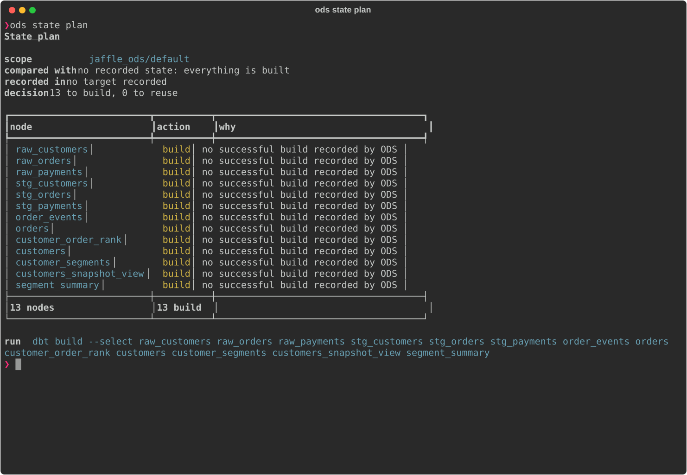

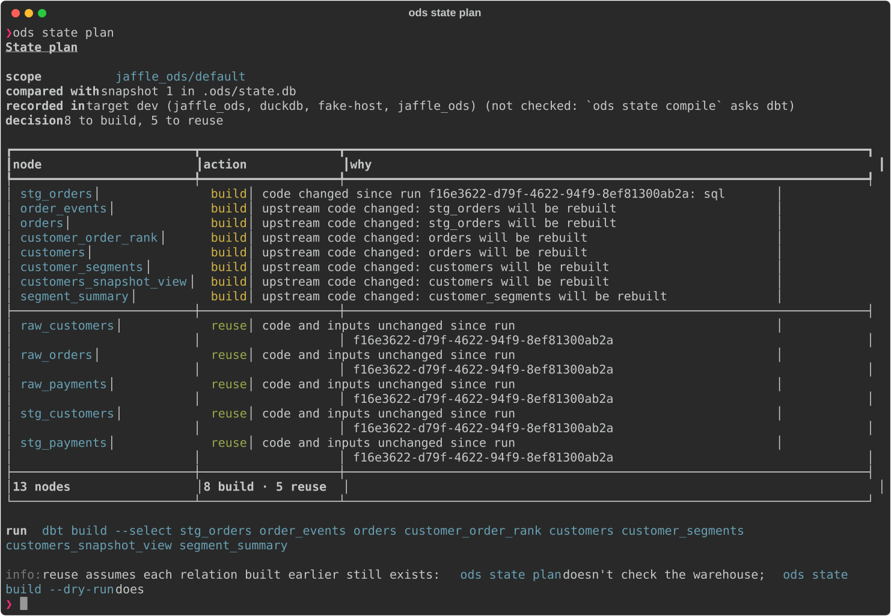

A node is **built** when (first match wins):
1. ODS has no successful build of it;
2. its code can't be fingerprinted completely (e.g. no compiled SQL: run `dbt compile`;
   or a hook reads a value only known at run time, such as `var`, `env_var` or
   `target`);
3. its fingerprint changed; the plan names the components (`sql`, `file`, `config`,
   `macros`, `contract`, `relation`, `engine`). A SQL model's `sql` ignores comments
   and whitespace, so a formatting-only edit reuses it, and the reason says "only
   formatting changed". SQL whose meaning could depend on the dialect (e.g. `[...]`,
   `$`, `#`, backslash escapes) is compared as written;
4. a parent is built because *its* code changed;
5. it depends on something ODS doesn't know, declares no inputs at all (seeds aside), or
   its State config has a setting ODS can't honour yet;
6. a source it reads has no usable data version, now or when it was last built. A
   version only counts if it was read after the node's last build: run `dbt source
   freshness` before planning (or, on Databricks, let the commands that run dbt read
   table versions: see [Where source versions come from](#where-source-versions-come-from));
7. a parent has new data (a source's `max_loaded_at` moved, a parent is rebuilt for
   data, or a parent was rebuilt by a run it didn't read), unless its `lag_tolerance`
   hasn't run out or `require_fresh_data_from: all` isn't met yet.

Otherwise it is **reused**, as long as what it built is still in the warehouse (#230).
Before planning, the commands that run dbt ask, in one `dbt show` query, whether the
table or view of every node they would reuse still exists.
- A node whose relation is gone is **built** (reason `not in the warehouse`), and its
  readers see new data.
- If the query fails (no access, a connection error), every node it would have
  checked is built (reason `couldn't check the warehouse`), with a warning.
- `ods state plan` doesn't run dbt, so it can't check. Its reuses say that the
  relation was not checked (evidence `relation_exists`, exactness `none`).

`ods state record` only accepts a real build of the manifest's code:
- `run_results.json` must come from `dbt build`, `run`, `seed` or `snapshot`, not
  `--empty`;
- `manifest.json` must come from the same invocation;
- the run must not have been recorded already, or have started before the recorded
  state.

Record right after the run, before another dbt command rewrites the target directory.
It advances only nodes whose status in `run_results.json` is `success`.
Failed and skipped nodes keep their last successful state, so they (and what reads them)
are built next time. Source versions are recorded only if they were read (`sources.json`
measured, or table versions read) before the run started. Otherwise a node could be credited with data that arrived after
it ran.

| Flag | Meaning |
|---|---|
| `--state-db PATH` | SQLite state database; default `.ods/state.db` (created by `record`) |
| `--target-dir DIR`, `--project-dir DIR` | where the dbt artifacts are: `--target-dir` (relative to where ODS runs; ODS passes dbt an absolute path), else `DBT_TARGET_PATH` (relative to the project, as dbt reads it), else the configured `target_dir`, else the project's `target` (`--project-dir`, else `DBT_PROJECT_DIR`, else the configured `project_dir`, else `.`). `ods state policies`, `ods lineage`, `erd`, `serve` and `mcp` read the same place |
| `--environment NAME` | separate state per environment, e.g. `dev`, `prod`; default: the dbt target (`--target`, else `DBT_TARGET`), else `default` |
| `--target NAME` | dbt's `--target`; on `plan`, `record` and `history` too, so they find the same state |
| `--sources PATH` | `dbt source freshness` results; default `<target-dir>/sources.json` if present |
| `--select SPEC` | (`plan`) only these nodes: `name`, `+name`, `name+`, `+name+`; repeatable. Decisions don't change, only what's shown |
| `--run-results PATH` | (`record`) default `<target-dir>/run_results.json` |
| `--limit N` | (`history`) default 20; `history` reads the target directory for the project name |
| `--run RUN_ID` | (`history`) one run, from its journal: each node's result, time taken, rows, thread and error, and the totals (#322); also for a run that failed and recorded nothing. The list shows each snapshot's run time and rows where its journal is kept |

State is kept per project and environment as immutable snapshots. A record that races
another fails with `ODS-E0402` and writes nothing.

Builds are only reused in the dbt target they went to (#227, ADR-0017). The commands
that run dbt ask it which target it builds in (one `dbt compile --inline` of the
target's name, profile, adapter type, host or account and database; never a
credential) and record that in each snapshot. When it differs from the recorded one
(same target name on another host, another profile, or state recorded before ODS
kept targets), nothing in the recorded state is reused: everything builds, with the
reason `target changed`, and the run says which targets differ. A host, account or
path is shown without anything that could be a credential (a user, a query string),
and compared by a digest. `ods state test` refuses to test another target's builds.
`ods state plan` doesn't run dbt: it shows the target the state was recorded in as not
checked (use `ods state compile` for a checked plan). State recorded under another
target name than `--target` is planned with nothing reused; state without a target is
planned as recorded, with a note.
`ods state record` doesn't know where the dbt build it records went, so it records no
target: the next run rebuilds once.

## State: explain, diff, graph

These say why, without running anything (#21). They plan as `ods state plan` does,
from the artifacts in the target directory, and take the same options (`--target-dir`,
`--state-db`, `--environment`, …). Run `dbt compile` (or `ods state compile`) first
so the artifacts show the code as it is.

```sh
ods state explain customers        # why it would be built or reused, traced upstream
ods state why-build customers      # the same, answering "why does it build?"
ods state why-skip stg_payments    # … and "why is it reused?"
ods state diff                     # what changed since the recorded state
ods state diff --from 3 --to 5     # what changed between two snapshots
ods state history orders           # each build of `orders`, and why it happened
ods state graph --changed          # what would be built, as a Mermaid graph
```

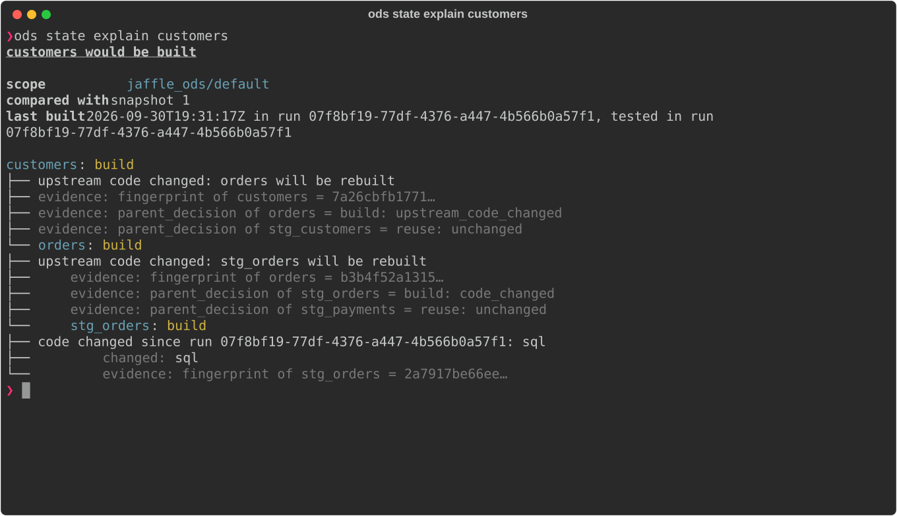

- **`explain NODE`** shows the node's decision, its reasons and evidence (the
  fingerprint, the source data versions, its parents' decisions), and what changed.
  When it builds because a parent builds, the parent is explained in turn, up to the
  root cause:

  ```text
  customers would be built

  customers: build
    upstream code changed: orders will be rebuilt
    orders: build
      upstream code changed: stg_orders will be rebuilt
      stg_orders: build
        code changed since run 51c7…: sql
  ```

  `why-build` and `why-skip` answer the same way, and say so when the node does the
  opposite. `NODE` is a name or a unique id; a name two nodes share is an error that
  lists them.
- **`diff`** compares the project now with the recorded state: nodes added or
  removed, code that changed (by fingerprint component, e.g. `sql`, `config`), and
  source data newer than what the recorded builds read. With `--from` and `--to` it
  compares two snapshots (`ods state history` lists them), and says what changed
  before each node that was rebuilt.
- **`history NODE`** lists the node's builds and tests, newest first, and for each
  build what changed since the one before:
  - its code;
  - the source data it read;
  - a parent that was rebuilt.

  This comes from what the snapshots record, so past decisions stay explainable. A
  rebuild where nothing recorded changed is shown as such. Full refreshes and missing
  relations aren't kept in snapshots, so a rebuild for one of those reasons appears
  this way; a change of dbt target is recorded, and shown. Without `NODE`, `history` lists snapshots as before.
- **`graph`** writes the plan as a graph: each node with its action, and an edge to
  each node that reads it.
  - `--changed` keeps only the nodes that would be built.
  - `--format mermaid` (the default) or `--format dot` picks the format.
  - The text goes to stdout as it is, so `ods state graph --changed > plan.mmd` works.
  - With `--json`, the graph comes as nodes and edges, with the text alongside.

All of them work with `--json`: the explanation is a tree of plan entries (`entry`,
`causes`), history is a list of `built`, `tested` and `dropped` events with typed
`changes` (`code`, `code_unknown`, `data`, `target`, `upstream`), and a diff lists `added`,
`removed` and `changed` nodes.

## Recovering state

The state database (`.ods/state.db` by default) is the only record of what was built.
ODS protects it ([ADR-0018](adr/0018-state-store-migrations-and-recovery.md), #188):

- **Failed runs** change nothing. A run records in one transaction at the end, and
  only its successes; if it fails, is interrupted or loses a race, the last good state
  stays as it was.
- **Upgrades:** a newer ODS migrates the database forward the first time it opens it,
  in one transaction. It first keeps a copy beside it,
  `state.db.v<version>-<time>-<process>.bak`.
  If the migration fails, nothing changes and the error names the copy.
- **Downgrades:** an older ODS refuses a database a newer one wrote (`ODS-E0401`,
  "upgrade ODS"). It never guesses. To go back, restore the copy kept when it was
  migrated.
- **Damage:** if the file can't be read, or a snapshot in it can't be decoded, commands
  that read it stop with `ODS-E0405`, change nothing and point at `ods state doctor`.
  They never reuse a build on the strength of damaged state.

```sh
ods state doctor                 # check; changes nothing; exit 1 (ODS-E0405) if damaged
ods state backup                 # consistent copy: state.db.<time>.bak (or --to PATH)
ods state reset --yes            # set it aside: state.db-<time>-<process>.set-aside; deletes nothing
```

`doctor` reports:
- the database's schema version, and the latest this ODS knows;
- every scope, with its head snapshot and how many snapshots it has;
- every problem: `damaged` (SQLite's integrity check failed, or it isn't a state
  database), `newer schema`, `unreadable snapshot`, `inconsistent snapshot` (what
  `history` lists disagrees with the snapshot itself), `dangling head` or
  `broken chain` (a head or parent that points at a missing snapshot), or `unreadable
  run` (an entry of the run ledger it can't read; the state itself is unaffected);
- any copies it finds beside the database, and what to do.

`backup` works while runs use the database. Take one before anything risky, or on a
schedule in CI.

To recover a damaged database:
1. `ods state doctor` to see what is wrong, and which copies exist.
2. `ods state reset --yes`: the damaged database moves aside, so it can still be
   inspected (and its `-wal`/`-shm` files move with it, so it still opens).
3. Either restore a copy, by copying it over the database (e.g.
   `cp .ods/state.db.v1-1790000000-4242.bak .ods/state.db`) and running `ods state doctor`
   again; or start afresh by doing nothing more. With no state, the next run builds
   every node and records new state.

Don't reset or restore while a run is using the database.

## State: export for dbt deferral

`dbt retry` and other runs with `--defer --favor-state` send every reference to a model
the run doesn't select to the state they defer to (e.g. prod's manifest), even when this
target has just built it. A retry after a failure then builds the failed model on
**prod's** copy of its parents, not the ones this target built. `ods state export`
writes a dbt state directory that fixes this, from what ODS recorded
([ADR-0020](adr/0020-dbt-state-interop-and-favor-state.md), #296):

```sh
ods state build --target dev                     # a builds, b fails; ODS records a
ods state export --dbt-state .ods/dbt-state --upstream prod/ --target dev
dbt retry --defer-state .ods/dbt-state           # b now reads dev's a
# or any later deferred run: selection still compares with prod
dbt build -s b --defer --favor-state --state prod/ --defer-state .ods/dbt-state
```

The directory holds prod's `manifest.json`, in which only the nodes ODS can vouch for
point at this target, and `ods-export.json`, ODS's record of why. Pass it to dbt as
**`--defer-state`**.

!!! warning "Not `--state`"
    `dbt retry --state .ods/dbt-state` does **not** work: the retry then still defers to
    the state the original run was given (prod), whatever the directory holds. Keep
    `--state prod/` for `state:modified` selection, and add `--defer-state`.

Each node of the upstream manifest points at this target only if all of these hold;
otherwise it keeps the upstream pointer, exactly as dbt would have used it. The first
rule that fails is the node's reason:

| Reason | Why the node points upstream (or is left alone) |
|---|---|
| `not_deferrable` | dbt never defers it: a test, an ephemeral model, anything but a model, seed or snapshot. Left unchanged. |
| `not_in_project` | It isn't in this target's current manifest. |
| `target_changed` / `target_unknown` | The latest recorded state is for another target, or doesn't say which (`ods state record`). |
| `not_built_here` | No successful build of it is recorded in this target. |
| `relation_changed` | It now builds into another table or view than the recorded build did. |
| `code_changed_since_build` | Its code (SQL, config, macros, …) differs from the recorded build's, or can't be fingerprinted. |
| `relation_missing` | Its table or view isn't in this target's warehouse any more. |
| `relation_unverified` | Nothing showed that its table or view is still there: the check failed, `--no-check-relations`, or the check found it somewhere other than `manifest.json` says (recompile, then export again). |
| `built_here` | Built here by a recorded run, still there: it points at this target. |

- **Options:** the usual scope (`--target`, `--environment`, `--project-dir`,
  `--target-dir`, `--state-db`) and dbt options (`--dbt`, `--profiles-dir`,
  `--dbt-profile`, `--vars`, `--dbt-output`). `--upstream` is required: ODS doesn't
  guess where prod's state is. `--no-check-relations` skips the warehouse check, so
  every node keeps the upstream pointer.
- **What runs:** one dbt call to identify the target, and one to check, for all the
  nodes that could point here, that their tables and views exist. It doesn't run
  `dbt compile`: that would overwrite `target/run_results.json`, which `dbt retry`
  reads. It reads the artifacts the last dbt command left in the target directory.
- **Refused** (`ODS-E0403`): an upstream manifest of another project (by
  `project_name`, and `project_id` when both have one; a missing id only warns), a
  manifest version other than v12, `--dbt-state` naming the upstream directory or dbt's
  target directory, and dbt's Information Schema instead of `manifest.json`. If dbt
  can't say which target it builds in, the export stops (`ODS-E0404`): it never
  guesses.
- **What is written:** the upstream document with only `database`, `schema`, `alias`
  and `relation_name` replaced, for the `built_here` nodes. Nothing is added, removed or
  reordered, and no ODS key is added. No `run_results.json`: `dbt retry` reads the
  previous run's from the target directory. The upstream directory is never written to.
- **Refreshing it:** each file is written in full to a temporary file in the directory,
  then renamed over the old one: `ods-export.json` first, `manifest.json` last. A dbt
  run that starts meanwhile reads the whole previous export or the whole new one. A
  second export to the same directory waits up to 10 seconds for the lock
  (`.ods-export.lock`), then fails with `ODS-E0406`, as does a failed write, whose
  message names the files already replaced. Run the export again to repair it.
- **Treat it like the upstream state.** The export copies what the upstream manifest
  holds, including its rendered SQL and `metadata.env`, and adds nothing from profiles
  or credentials. `ods-export.json` holds the target's identity only in the form
  `ods state history` shows: never the raw location.
- **After a deferred compile.** If the last dbt command was itself a deferred run, the
  artifacts ODS reads were compiled with refs resolved to prod. A node whose SQL names
  prod's relations then differs from what ODS recorded, and points upstream
  (`code_changed_since_build`). That is conservative: it can send more nodes upstream
  than needed, never fewer. Nodes that only read sources, or whose parents weren't
  deferred, aren't affected. Don't run `dbt compile` just to avoid it before a
  `dbt retry`: it replaces the run results the retry reads.

`--output json` returns every node's choice (`pointer`: `this_target`, `upstream` or
`unchanged`), `reason`, the recorded `run_id` and `built_at` it rests on, the fingerprint
components that changed, and its `evidence`. The same list, with the snapshot and target
it was made from and the SHA-256 of the `manifest.json` it describes, is in
`ods-export.json` (`schema_version` 1.0). Plain output counts the reasons and lists the
nodes that point at this target.

## Entity-relationship diagrams

`ods erd generate` draws the keys and relationships your project already asserts
([ADR-0012](adr/0012-erd-from-tests-and-constraints.md)); `ods serve` draws the same
on the [ERD page](#the-erd-page), interactively:
- a model's `unique_key` config (incremental models, snapshots), including a list of
  columns, is a declared primary key;
- `unique` + `not_null` tests make a primary key (`unique` alone is a nullable unique key);
- `dbt_utils.unique_combination_of_columns` makes a composite key. When nothing else
  identifies the rows, the smallest such combination is the primary key, even without
  `not_null` tests (most composite grains are never tested that way);
- `relationships` tests make references;
- contract constraints are declared keys and references: `primary_key` and `unique`
  (column-level, or model-level over several columns), `not_null`, and `foreign_key`
  in either syntax, `to: ref('orders')` + `to_columns`, or
  `expression: "schema.orders (order_id)"` (matched against the warehouse relation;
  an unknown or ambiguous table is a diagnostic);
- **joins in the project's own SQL** make references too, so projects without
  `relationships` tests still get a diagram. `a.x = b.y and a.z = b.w` becomes one
  composite relationship. Its direction and cardinality come from tested or declared
  keys; when neither side is one, the cardinality is *unknown* (`}o--o{`), never guessed.

dbt 2.0's Parquet Information Schema doesn't record column-level constraints (model-level
ones are there). If your keys are column-level constraints, read dbt 2.0's
`manifest.json` instead (`--artifacts json`).

Tests with a `where` filter say nothing about the whole table, so they are skipped with a
diagnostic. Every key and relationship says whether it is **declared**, **tested**,
**joined** or **inferred**.

```sh
dbt parse && dbt docs generate            # docs generate adds column types
ods erd generate                          # Mermaid erDiagram on stdout
ods erd generate --select orders --depth 2 --output-file erd.mmd
ods erd generate --format dot | dot -Tsvg > erd.svg
ods erd generate --infer --format json    # also guess from naming, labelled inferred
```

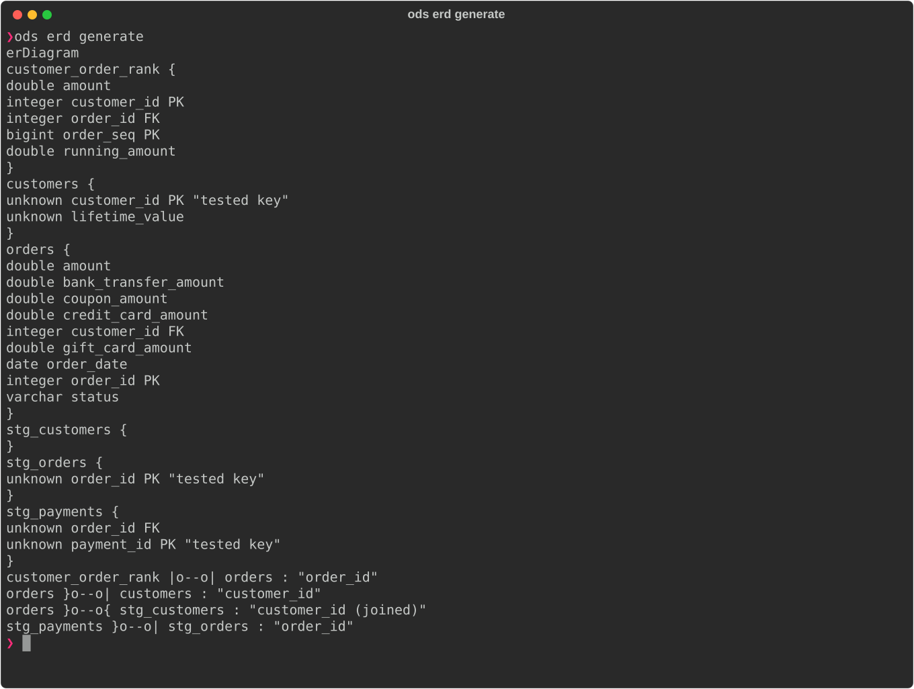

| Flag | Meaning |
|---|---|
| `--format` | `mermaid` (default), `dot` or `json` |
| `--select MODEL` | only this model and entities within `--depth` relationships (default 1); repeatable |
| `--dialect` | SQL dialect used to read joins (default: the project's adapter) |
| `--infer` | also propose keys (`id`, `<entity>_id`) and references (`<x>_id`) from naming; ambiguous names are reported, not guessed |
| `--all` | include entities without relationships (hidden by default) |
| `--output-file PATH` | write the diagram and print a summary instead |

## MCP server for AI agents

`ods mcp` serves the ODS engines to AI agents over the Model Context Protocol, on stdio
([ADR-0010](adr/0010-mcp-server.md)). The server is read-only and local:
- it needs no login, makes no outbound network connections and collects no telemetry;
- no tool writes files, runs dbt or queries a warehouse;
- every tool is annotated read-only; whether to auto-approve it is up to you and your
  client.

```sh
claude mcp add ods -- ods mcp --target-dir target          # Claude Code
```

```json
{ "mcpServers": { "ods": { "command": "ods", "args": ["mcp", "--target-dir", "target"] } } }
```

The JSON form works for Cursor (`.cursor/mcp.json`), VS Code (`.vscode/mcp.json`, under
`servers`) and other MCP clients.

| Tool | Answers |
|---|---|
| `ods_project_summary` | dbt version, counts, lineage coverage, whether dbt State is used |
| `ods_search` | models and columns by name |
| `ods_get_node` | where each column of a model comes from |
| `ods_lineage` | the column-level graph around models or columns (JSON or Mermaid) |
| `ods_impact` | which models must run for column changes or against another build, and which can be skipped |
| `ods_erd` | keys and relationships (Mermaid, JSON or DOT) |
| `ods_test_gaps` | tests worth adding, with evidence and YAML to paste |
| `ods_list_opaque` | models whose lineage is unknown, and why |
| `ods_state_policies` | freshness policies from dbt State configs |
| `ods_compare_observed` | static lineage against Unity Catalog's recorded lineage |
| `ods_explain_failure` | why a model or test failed in an `ods state` run (default: the last), as [`ods state explain-failure`](#ods-state-explain-failure) explains it |
| `ods_find_data` | for data users: tables and columns by meaning (names and descriptions), with each table's grain |
| `ods_describe_entity` | a table explained: what one row is, columns, what it joins to and how |
| `ods_plan_query` | a join path and starting SQL for a question over several tables, with warnings where a join repeats rows |

The last three are for people who use the data but don't know the dbt project. Ask
"which customers spent the most last month?" and the agent finds the tables, explains
their grain, and writes SQL from a join plan built only from known keys and
relationships (all columns of a composite key, never invented columns). Trusted joins
(tests, constraints) are preferred over joins the project merely makes; guessed joins are
used only with `infer: true`.

It also serves:
- resources `ods://project/summary`, `ods://erd`, `ods://lineage/graph` and
  `ods://node/{id}`;
- prompts `assess_change_impact`, `review_breaking_changes`, `add_missing_tests` and
  `answer_data_question`.

Artifacts are re-read on every call, and a cache means only changed models are
re-analyzed. So run `dbt compile` after editing, and the next answer is current. The
server takes `ods lineage`'s options: `--artifacts`, `--dialect`, `--observed`,
`--trust-observed`, and `--state-db` for the runs `ods_explain_failure` reads (by default,
the one `ods state` uses). A tool's result is the same JSON as the matching command's `--json`
output.
