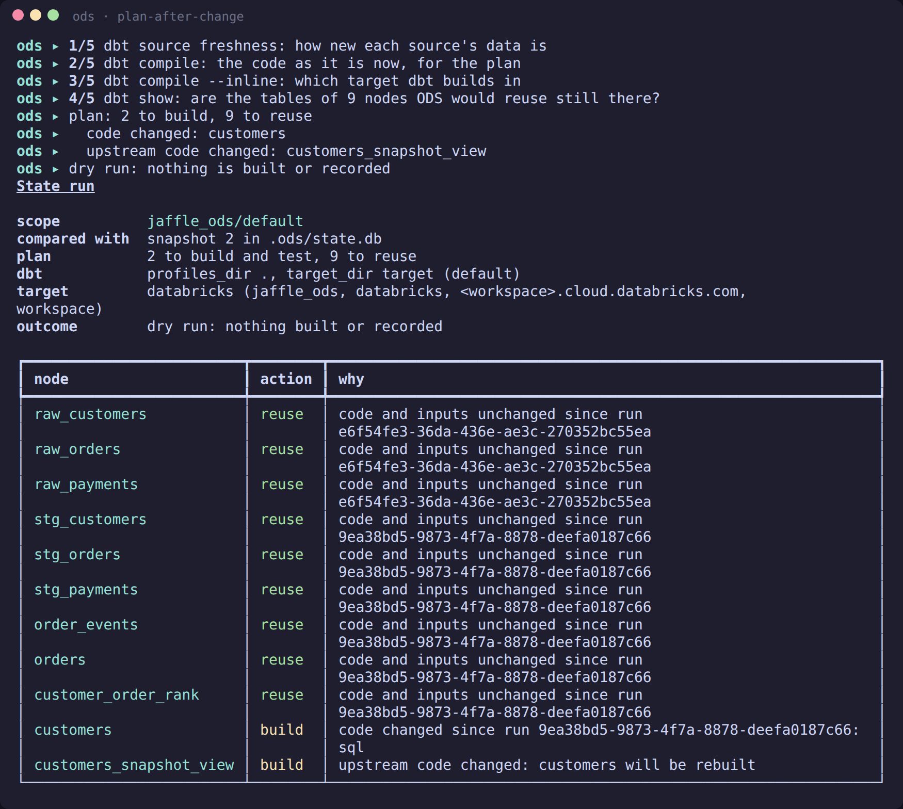
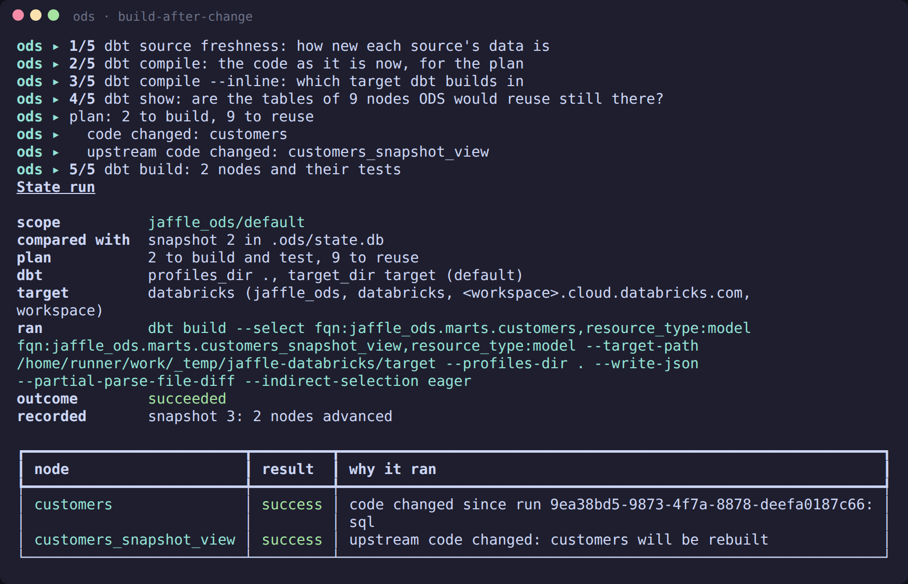
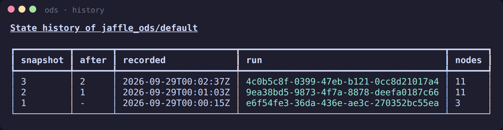

# ODS State on Databricks

`ods state` works with any dbt adapter, because dbt does the building and ODS decides
what needs building. This page shows it on **Databricks**, using the demo project from
the [getting started](getting-started.md) guide. The screenshots come from the nightly
`databricks` CI job, which runs these commands against a real Databricks Free Edition
workspace (#294). The workspace hostname is redacted.

## Setup
Use your usual `profiles.yml` with `type: databricks`. ODS reads nothing from it: it
asks dbt which target it builds in, and keeps state per target
([ADR-0017](adr/0017-state-per-target.md)).

```bash
pip install dbt-databricks        # the dbt adapter; ODS itself needs nothing extra
ods state seed                    # load the seeds
ods state build                   # build everything once, and record it
```

Each run records what it built, from which code and inputs, in `.ods/state.db`.

## A change rebuilds only what it affects
Change one model, `customers`, and ask what a build would do:

```bash
ods state build --dry-run
```



Nine nodes are reused and two are built:
- `customers`, because its code changed;
- `customers_snapshot_view`, because it reads `customers`.

Every decision has a reason. Before reusing anything, ODS checks with `dbt show` that
the tables it would reuse still exist in the workspace (step 4/5).

Then build:

```bash
ods state build
```



ODS ran `dbt build` with exactly those two models selected, then recorded the new
state. Nothing else was touched in the warehouse.

## History
Each run that builds something successfully records a snapshot. A node that fails,
or is skipped, keeps its last successful entry. So after a partial run, the nodes that
succeeded move on, and the rest stay exactly as they were.

```bash
ods state history
```



## Open a model in Catalog Explorer
`ods serve`'s dashboard links each model to its table in Catalog Explorer, the
workspace's UI for Unity Catalog: the model page's header has an **Open in Catalog
Explorer ↗** button, and the lineage explorer's side panel and a run's Nodes table have
the same link (#329). `ods lineage graph --format json` and `ods lineage columns --output
json` carry it as `relation_url`.

The link is built from the workspace URL, which ODS reads from `ods.toml` (or from
`DATABRICKS_HOST`, which is read first, as in
[ADR-0021](adr/0021-databricks-authentication.md)):

```toml
[providers.uc]
kind = "databricks"

[providers.uc.settings]
host = "https://<workspace>.cloud.databricks.com"
```

A model whose relation is `catalog.schema.table` links to
`https://<workspace>/explore/data/catalog/schema/table`, each name percent-encoded. The
host must be `https://` (or a bare host name); a trailing `/` is dropped, and a path, a
query string such as `?o=…` or a user name is refused. The host isn't a secret, and no
token is ever put in a link. Nothing is fetched to build it.

The link is where the manifest says the table is. It isn't proof that the table
exists: it may not have been built yet, or may have been dropped. When there is no link,
the page says why instead of guessing one: no `host` configured, a host that can't be
used, or a relation named with only two parts (the catalog would be a guess).

## Next steps
- **`ods state explain <node>`:** why a node was built or reused. See the [CLI reference](cli.md).
- **`ods state retry --failed`:** after a failure, rebuild only what failed.
- **Coming next:**
  - a dbt state that `dbt retry --defer --favor-state` can trust
    ([ADR-0020](adr/0020-dbt-state-interop-and-favor-state.md));
  - direct Databricks sign-in for Unity Catalog metadata
    ([ADR-0021](adr/0021-databricks-authentication.md)).
- **Contributors:** [Testing against Databricks](contributing-databricks.md) covers how
  the CI job and these screenshots are made.
