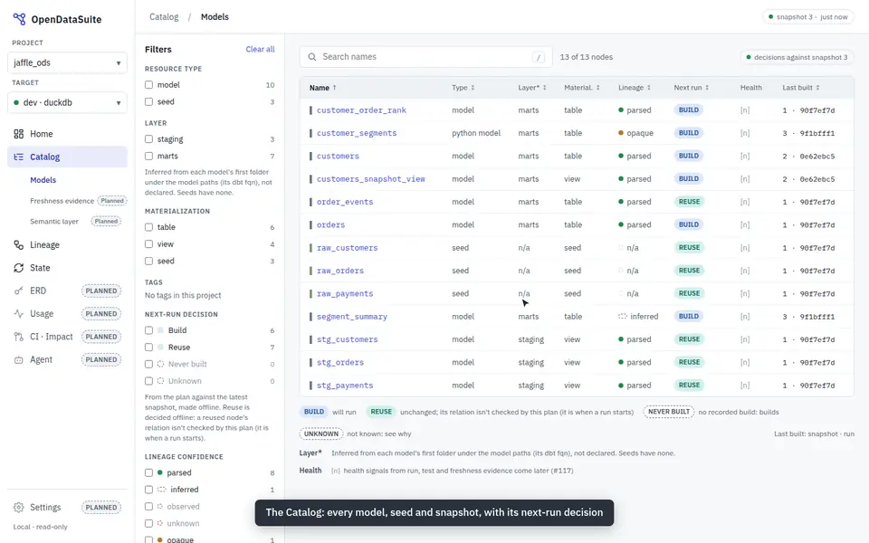
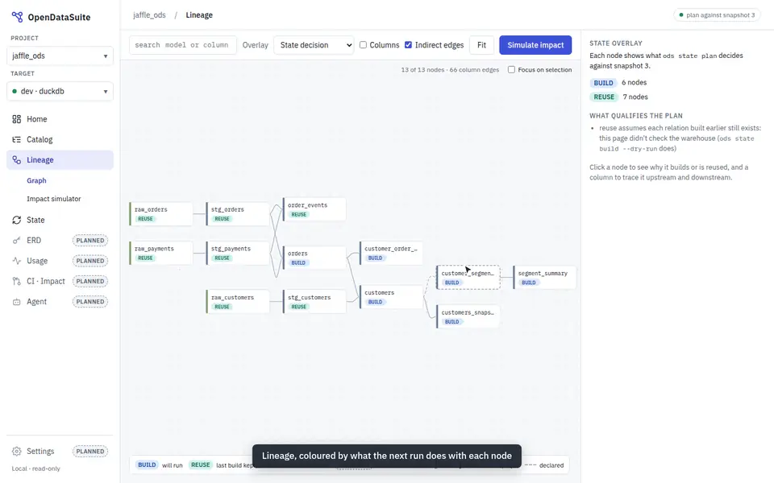
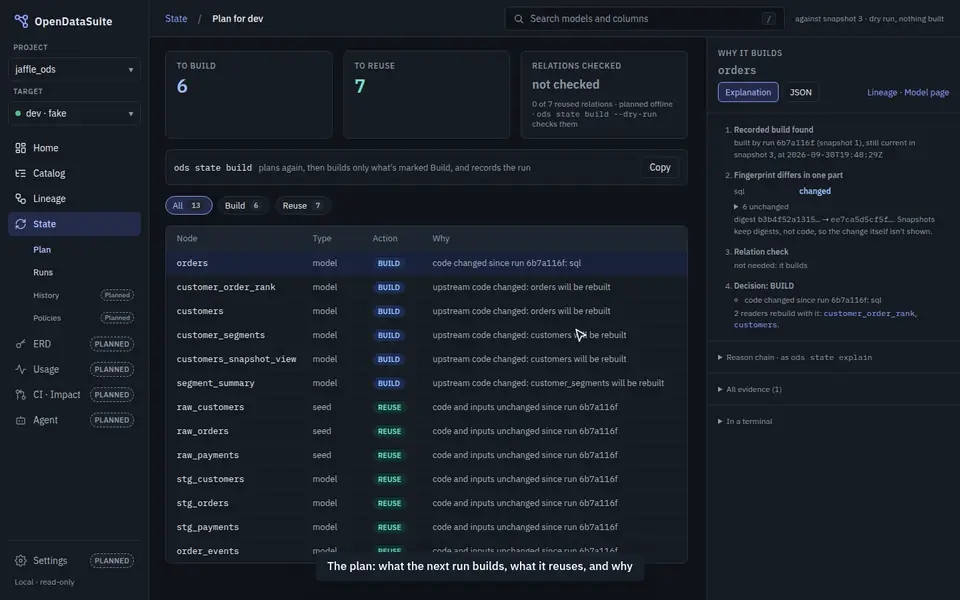

# ODS Dashboard

The dashboard is the central, read-only view of one dbt project and its targets.
`ods serve` hosts it locally: the screens marked **Built** below are in `ods serve`
today, the rest are still designs. This design grows it into the control-plane view of
every ODS module; v0.1.0 ships when every screen is built (#309). It stays a server-rendered page with inlined
assets and no npm build ([ADR-0009](../../adr/0009-hostable-explorer-ods-web.md)).

**Layout.**

- **Left nav:** project and target pickers, then Home, Catalog (Models, Freshness
  evidence, Semantic layer), Lineage, State (Plan, Runs, History, Policies), ERD,
  Usage, CI · Impact, Agent and Settings. A "Local · read-only" badge sits at the
  bottom.
- **Page header:** a breadcrumb, a search box that also accepts selectors
  (`+orders`), and the current snapshot.
- **Look:** IBM Plex Sans and Mono, with an indigo accent (`#3F51D8`). Build is blue
  (`#DCE8FB`/`#1F4FA0`) and Reuse is teal (`#D5F0EC`/`#0B6B60`). Health is green,
  amber, red, and dashed grey for unknown.

Light is the default. Home, Lineage, Model and Plan also have dark versions.

**What is built** (each screen below says so, and what it still lacks):

| Screen | Status |
|---|---|
| Shell and Home | **Built** (#310) |
| Catalog: models, and the Model page | **Built** (#313, merged in #319) |
| Lineage: State overlay | **Built** (#312, merged in #320) |
| State: Plan and Why, Runs, one Run | **Built** (#311, merged in #318); real run outcomes, durations and per-node stats from run journals (#322 steps 1 and 3) |
| Live run on the DAG, with follow mode | Designed; the run events and journals it reads are built (#322 steps 1–3), the live view isn't (#322 step 4) |
| Freshness evidence, Semantic layer, Impact simulator, ERD, Settings | Designed (#309) |
| Dark mode | Built where the page's CSS follows `prefers-color-scheme`; not yet checked against every dark board (#309) |

The recordings on this page are real: `ods serve` on the demo project, played by
`scripts/record-dashboard.py` ([how they're made](../../recordings.md)). The images
under each heading are the design boards.

## Screens

### Home: project health

**Built** (#310). Health and coverage are still `[n]` placeholders, and a run's
outcome on Home reads *recorded* (the Runs page has the journal's outcome).

- **Tiles:** nodes, reused and built in the last run, and snapshots.
- **Recent runs:** built and reused counts per run.
- **Needs attention:** changed, unknown-evidence and opaque nodes.
- **Summary panels:** health, test and doc coverage, and which modules are set up.

**Needs:** State history (`ods state history`) and the plan. Health and coverage are
`[n]` until the health signals exist.

### Catalog: models

**Built** (#313). The health badge is `[n]` until the health signals exist (#117).

- **Facets:** resource type, layer, materialization, tags, next-run decision and
  lineage confidence.
- **Table:** every node, with its next-run pill, health badge and last build.

**Needs:**
- the manifest;
- the plan against the latest snapshot;
- a health badge per node, worked out from the last run outcome, test results and
  freshness evidence (static; no monitoring service).

### Catalog: freshness evidence

Not built yet (#309).

- **Evidence per input:** how ODS knows whether each seed or source changed.
- **Grades:** exact, timestamp, inferred and unknown, and what each grade does to the
  plan. Unknown evidence always means build.

**Needs:** the freshness evidence already recorded in each snapshot.

### Catalog: semantic layer (placeholder)

Not built yet (#309).

- **Contents:** semantic models and metrics, read from the project.
- **Source picker:** "dbt semantic manifest" is the first source; other build tools
  are greyed as planned.

The read goes through a generic semantic-source contract, so another build tool can
plug in the way warehouses do. ODS reads definitions only; it never serves or queries
metrics.

### Lineage: State overlay

**Built** (#312).

- **Graph:** the model graph, coloured by the plan's decision for each node.
- **Side panel:** the reason for the selected node.

**Needs:** `ods lineage` and the plan. Model-to-model edges come from the DAG. They
are not relationships; those belong to the ERD (AGENTS rule 6).

**Built (#312) with these tokens** (light / dark), beside the board's:

| Token | Light | Dark | Used for |
|---|---|---|---|
| `--kind-seed` | `#7C9A6A` | `#9BB88A` | seed stripe (the board's) |
| `--kind-model` | `#6B7B93` | `#8E9DB3` | model stripe (the board's) |
| `--kind-source` | `#A08450` | `#C9AE7C` | source stripe (not on the board) |
| `--kind-snapshot` | `#8570B0` | `#B0A0DA` | snapshot stripe (not on the board) |
| `--edge` | `#A7B0BD` | `#4A5563` | DAG edge; dashed when only declared |
| `--edge-indirect` | `#A98BD0` | `#B59BE0` | row-shaping column edge, dashed |
| `--edge-up` | `#4A5462` | `#C9D1DB` | ↑ upstream of a traced column |
| `--edge-down` | `#D9730D` | `#FFA34D` | ↓ downstream of a traced column |
| `--maybe` | `#8A5A00` | `#E3B341` | past an opaque node: may change (dashed) |
| `--warn-text` | `#8A5A00` | `#E3B341` | warning text (AA on the panel) |

The model graph's selection path uses the accent. NEVER BUILT is an outlined build
pill; UNKNOWN keeps the board's dashed pill. The offline page (`ods lineage view`) has
no font files, so it falls back to the system fonts.

### Lineage: impact simulator

Not built as designed (#309); the Lineage page's *Impact* tab runs impact for one node.

- **Input:** pick a column and a change (rename, type change or drop).
- **Must run:** each node, with its reason and whether its lineage is parsed, inferred
  or opaque.
- **Skipped:** each node left out, with the reason.
- **Side panel:** the column trail, a copyable selector, and the tests that run with
  it.
- **Contracts:** a warning when an enforced contract would break.

**Needs:** column-level impact (`ods lineage impact`). Nothing is run.

### Model page

**Built** (#313): Overview, Code, Columns, Lineage, State and Tests; Relationships and
Usage are greyed as planned.

- **Tabs:** overview, columns, lineage, code, State and tests.
- **Current decision:** the Build or Reuse pill, with its reason.
- **Open in warehouse (#329):** a header button to the relation in the warehouse's
  own UI, labelled by the provider (*Open in Catalog Explorer ↗* on Databricks), in a
  new tab with `rel="noopener noreferrer"`. Beside the relation, *expected location*
  says it is where the manifest puts it, not a check that it exists. Without a link,
  the header says why in italics (no provider for the warehouse, no host, a relation
  that isn't fully qualified); a URL is never guessed. The lineage side panel (head and
  General tab) and each row of a run's Nodes table (a small ↗ after the name, the
  reason once under the table) carry the same link. The dashboard gets it as neutral
  fields from the CLI, never from a provider.

### State: plan and why

**Built** (#311).

- **Decision table:** every node, with its decision and reason code.
- **Why panel:** for the selected node, the reason chain, the fingerprint components
  that changed, and the relation check.

**Needs:** `ods state plan --output json`, which already carries all of this.

### State: runs (local)

**Built** (#311), with outcomes, rows and durations from run journals (#322 step 3).

- **Source:** every run recorded in `.ods/state.db` on this machine, and every run whose
  journal is kept beside it (#322), newest first. ODS doesn't schedule anything; runs
  appear after `ods state build/run` in a terminal or CI job.
- **Each run:** its outcome (succeeded, partial, failed; unknown or "running or stopped
  without finishing" when its journal doesn't say, never success), node counts, rows
  ("at least N" when some nodes didn't report) and duration, from its journal. A run
  without one says so, and its outcome reads *recorded*.
- **Failed run:** shows that the last good snapshot was kept, the failed node with its
  redacted error summary, and the next command (`ods state retry --failed`). A failed
  run that recorded nothing is listed from its journal.
- **Partial run:** some nodes failed and others succeeded. As before #322, its
  snapshot records the successful builds only
  ([ADR-0013](../../adr/0013-state-snapshots-fingerprints-and-store.md): `record()`
  advances only nodes whose status is success); failed and skipped nodes keep their
  last good build (AGENTS rule 5). It is amber, not red or green.
- **CI runs:** a placeholder tab until server mode.

### State: one run

**Built** (#311), with the timeline and per-node stats from its journal (#322 step 3).
A run still going isn't followed live yet (#322 step 4).

- **Timeline:** when each node started and finished, from the run's journal, as bars
  (red when it failed), beside the nodes that kept an earlier build. Without a journal,
  the order comes from lineage and times read `—`.
- **Totals and Nodes:** node counts by status and rows under the tiles; the Nodes tab
  lists each node's status, start, time taken (compile and execute), rows (`—` with the
  reason), thread, tests, why it ran and a failed node's error.
- **Built this run:** why each node was built.
- **Earlier runs:** the runs before it.

**Needs:** the snapshots (`ods state history`) and the run journals
(`<state-db>.runs/`, [ADR-0024](../../adr/0024-run-events-node-stats-and-run-journal.md)).

### ERD

Not built yet (#309); `ods erd generate` draws it from the command line.

- **Diagram:** tables and keys, with each edge drawn by its strongest evidence:
  tested, declared constraint, joined in SQL, or inferred.
- **Cardinality:** only where tests prove it.
- **Missing relationships:** each comes with the YAML test that would make it tested.

**Needs:** `ods erd generate`.

### Settings

Not built yet (#309).

- **Read-only view of `ods.toml`:** project and target, the state store, secret
  references (never values), and providers with their capabilities.
- **Server mode (planned):** Identity & access, Webhooks and Audit log, greyed as
  placeholders. Webhooks and audit are designed as event sinks on the event stream the
  CLI already emits, not a second record.

### Live run on the DAG, with follow mode (#322)

Designed. What it reads is built: run events, per-node stats and run journals
(#322 steps 1–2, [ADR-0024](../../adr/0024-run-events-node-stats-and-run-journal.md)),
shown after a run on the Runs and Run pages (step 3). The live overlay, the event
stream and follow mode are step 4.

The boards are in `docs/design/dashboard/boards/live-run/` in the repository; like every board they are left out of the docs site and open in the Design canvas (see [the design README](../README.md)). `Main.dc.html` there is interactive: it plays a demo run, and the other boards reuse it in fixed states. Screenshots will be added once they are exported from the design canvas.

- **What the page shows:**
  - A **Live** overlay on Lineage while `ods state run` or `build` is running.
  - Each node shows one state: queued, running, built, failed, skipped (upstream failed) or kept (not selected in this run).
  - Nodes show their elapsed time while running, and their time taken and rows once finished.
  - The side panel shows progress, counts, what is running now, rows affected so far and an event log.
- **Follow mode:**
  - It is on by default. The camera frames every running node at once, moves at most about once a second, and never zooms below about 60%.
  - If the running nodes can't all fit at that size, the camera keeps one **focus** node until it finishes. It then moves to the running node blocking the most queued work (the nearest one on a tie).
  - Running nodes outside the view show as **edge chips**. A **minimap** shows the whole run.
  - Any pan, zoom, Fit or node click turns follow off. **Follow run** turns it back on, and so does `F` in the real page.
- **Follow scopes:**
  - The node menu (right-click, the menu key or Shift+F10) and the stats card offer "Follow this node and its downstream", plus upstream or just this node.
  - Nodes outside the scope fade. A toolbar chip clears the scope.
  - The scope is kept in the URL.
- **Node stats:**
  - Status, start and end time, time taken (compile and execute), rows affected, adapter extras, thread, relation, why it ran, and tests.
  - A stat that isn't reported shows as `—` with the reason, never as `0`. Run totals say "at least N".
- **Terminal:** the same per-node lines and summary in `ods state run`.

### Failed node: the error explained (#323)

Board: `boards/live-run/ErrorExplained.dc.html` (in the repository, not on the docs site).

- **What a failed node shows:**
  - a plain-language headline;
  - a category;
  - how sure ODS is: **known pattern + evidence**, **known pattern** or **not recognised**;
  - **why ODS thinks so**, from its own evidence: what changed, column lineage, the manifest, source versions and run history;
  - **where** (source file and line);
  - **what to try**, with copyable commands;
  - the **impact** on downstream nodes.
- **dbt's own message** stays one click away, with literal values and SQL removed.
- **An unrecognised error** never gets a guessed cause. The card shows what ODS knows instead.
- **Built:** the explanations and the terminal and JSON output (`ods state run`, `build`,
  `test` and `history --run`, [ADR-0025](../../adr/0025-error-explanations.md)).
  "Ask the ODS agent to investigate" stays planned (M6).

## Dark versions

| Home | Lineage |
|---|---|
|  |  |
| **Model page** | **Plan** |
|  |  |

## Decisions taken from the dbt platform review

1. **Naming:**
   - Keep `ods state` as the CLI. The dashboard section's name is still open; the
     leading candidate is *Builds*.
   - Rename *Mesh* to *Projects*.
   - Don't use *Catalog* or *Explorer* as product names.
2. **`ods serve` grows into this read-only dashboard.**
3. **No scheduler.** Show runs instead, starting with local runs from the state store.
4. **Lag tolerance and cost savings:** in scope, shown next to the plan.
5. **Health signals:** in scope, as static badges from run, test and freshness
   evidence.
6. **Semantic layer:** read-only, through a generic source so other build tools can
   supply it.
7. **Identity, webhooks and audit:** deferred. They appear as placeholders, designed
   as event sinks.

## Still to design

- Usage, CI · Impact, Agent and History pages.
- Empty and error states for a project with no state store.
- Narrow screens.
- Live run: dark mode, the Home "run in progress" banner, and several runs at once.
