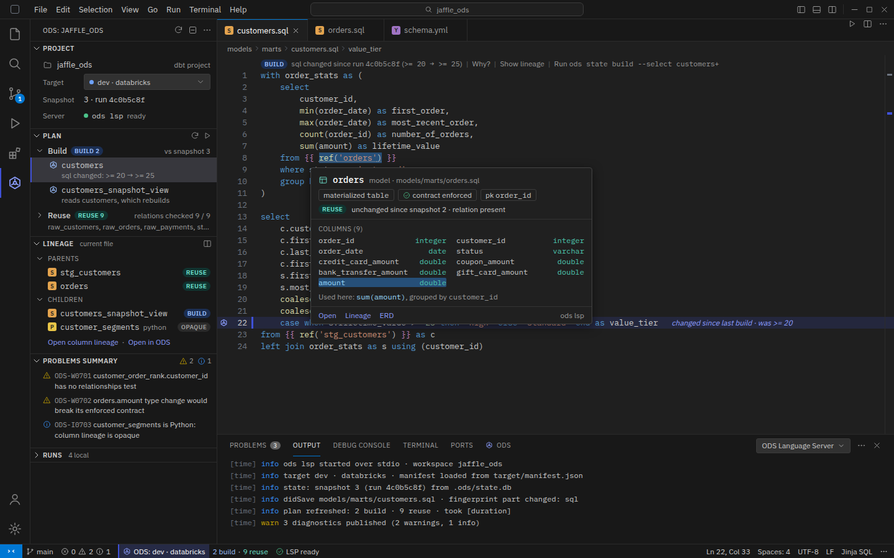
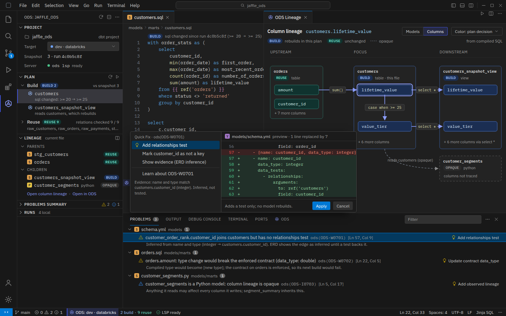
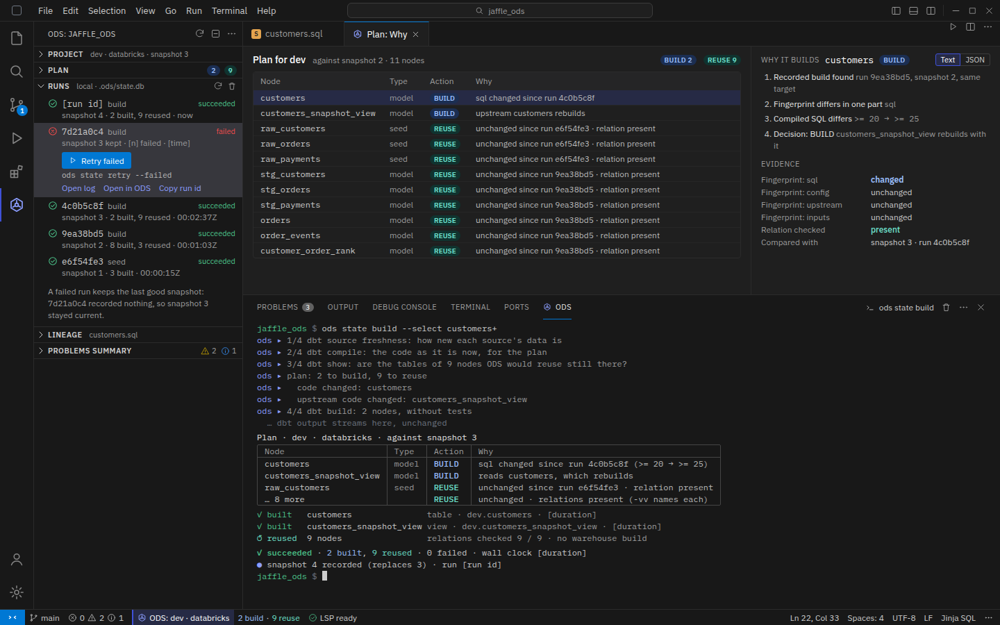

# ODS for VS Code

The extension brings ODS's answers into the editor where the SQL is written. It is a
thin TypeScript client (ADR-0002: other languages are thin consumers only). The logic
stays in Rust:

- **`ods lsp`:** the clean-room language server planned in M5 (#67–#72). It supplies
  code lenses, hovers, diagnostics and quick fixes.
- **The CLI:** runs `ods state …` in the integrated terminal and returns JSON
  (`--output json`) for the views.
- **Views:** reuse the dashboard's page (`ods-web`) in a webview, so lineage and plan
  views have one implementation.

The mock-ups use VS Code's default dark theme and generic window chrome, with a plain
hexagon as the ODS icon in the activity bar. They show no real logos and no other
extensions' names.

## Screens

### Editing a model

- **Side bar:** the project and target, the current plan (Build and Reuse, each with a
  short reason), the current file's parents and children, a problems summary, and
  local runs.
- **Code lens** above the model:
  `BUILD · sql changed since run 4c0b5c8f (>= 20 → >= 25) | Why? | Show lineage | Run …`.
- **Changed line:** the line that caused the decision is marked in the gutter.
- **Hover on a `ref()`:**
  - the model's materialization, contract and key;
  - its current decision;
  - its columns with types, with the ones this file uses highlighted.
- **Status bar:** target, plan counts and language-server state.

### Lineage and diagnostics

- **Split editor:** the SQL next to a column-lineage view coloured by plan decision.
  Opaque (Python) models are drawn dashed.
- **Problems panel:** ODS diagnostics, each with a code and a quick fix. The codes are
  illustrative; ODS has no warning codes yet.
  - A join key with no relationships test. The quick fix previews the YAML test it
    would add, and says it adds a test only, with no model rebuilds.
  - A type change that would break an enforced contract.
  - A Python model whose column lineage is opaque.

### Runs and why

- **ODS output panel:** an `ods state build --select customers+` run as the CLI prints
  it: the plan, per-node results, then "2 built, 9 reused" and the snapshot recorded.
- **Side bar:** local runs from the state store. A failed run offers
  *Retry failed* (`ods state retry --failed`).
- **Plan: Why view:**
  - the reason chain for a node;
  - evidence rows: the fingerprint components that changed, and the relation check.

## What it needs from ODS

| Feature | Source | Exists today? |
|---|---|---|
| Plan, reasons, evidence | `ods state plan --output json` | yes |
| Runs | `ods state history` | yes |
| Column lineage, impact | `ods lineage columns/impact` | yes (preview) |
| Relationship findings | `ods erd generate` | yes |
| Code lenses, hovers, diagnostics, quick fixes | `ods lsp` | no: M5 (#67–#72) |
| The extension itself | #107 | no |

## Still to design

- The first-run experience when no state store or compiled manifest exists.
- A light theme.
- Settings for choosing the `ods` binary and the target.
