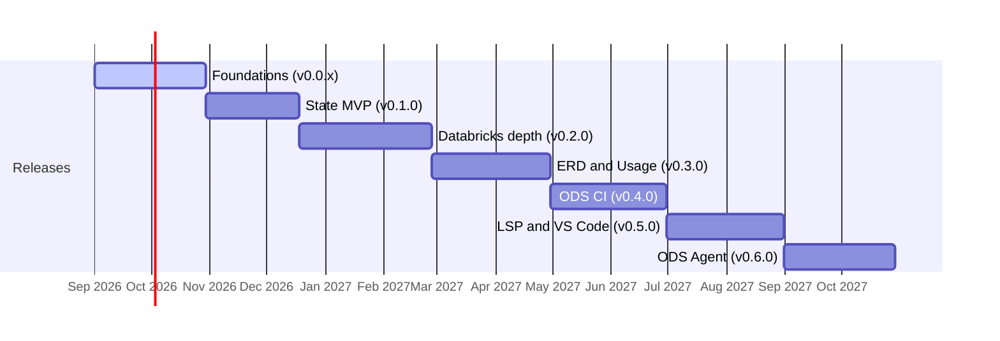

# Roadmap

!!! warning "Plans, not promises"
    Dates are proposals for a small team, and are revisited at the end of each
    milestone. Scope and order will change. Until 1.0, anything may break between
    minor versions.

## Available today, as previews

These work today, on the demo project and on small dbt projects, but are unreleased and still changing:

| Capability | Command |
|---|---|
| Column-level lineage, offline explorer, graph exports, OpenLineage export | `ods lineage …` |
| Change impact: what must run and what can be skipped | `ods lineage impact` |
| Hosted explorer with a read-only JSON API | `ods serve` |
| Observed lineage from a Unity Catalog export | `ods lineage compare`, `--observed` |
| Entity-relationship diagrams | `ods erd generate` |
| MCP server for AI agents | `ods mcp` |
| dbt State configuration reader | `ods state policies` |
| State planning against recorded dbt runs | `ods state plan`, `record`, `history` |

## Release train

| Release | Theme | Target | What it delivers |
|---|---|---|---|
| v0.0.x (internal) | Foundations | 2026-10-30 | Workspace, architecture decisions, plugin SDK, demo dbt project |
| **v0.1.0**, the first public release | **ODS State MVP** | 2026-12-18 | `ods state plan / run / explain / diff / history`: skip models whose code **and upstream data** are unchanged; failed runs never replace state; installable binaries |
| v0.2.0 | Databricks depth | 2027-02-26 | Unity Catalog metadata, Delta change detection, reuse strategies, PostgreSQL state store |
| v0.3.0 | ERD and Usage | 2027-04-30 | `ods erd inspect / validate`, real consumer usage |
| v0.4.0 | ODS CI | 2027-06-30 | Selective CI and pull-request impact reports |
| v0.5.0 | Developer experience | 2027-08-31 | Language server and VS Code extension |
| v0.6.0 | ODS Agent | 2027-10-29 | A policy-controlled agent, bring-your-own model, using the MCP tools |
| later | Platform | — | Mesh, server mode, integrations, synthetic data |

Some preview capabilities, such as lineage, ERDs and MCP, were built ahead of their
milestones, because State and CI depend on them.

The [full plan](ROADMAP.md) maps every GitHub issue to a milestone. Progress is tracked
in [GitHub milestones](https://github.com/buchochelliq-labs/open-data-suite/milestones).
